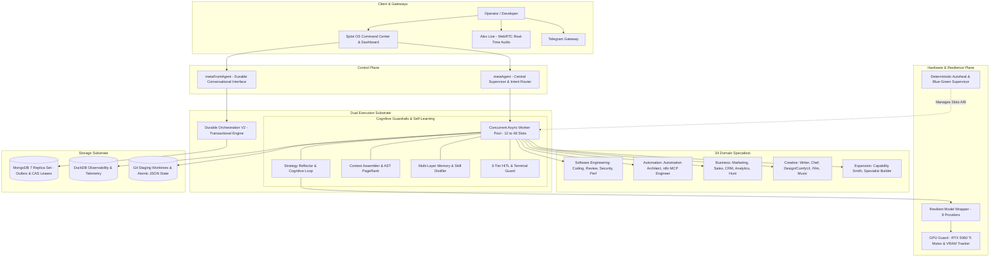

# AI-Agentic-System (Splot OS) — Local-First Agentic Operating System

[](https://www.typescriptlang.org/)
[](https://mastra.ai/)
[](https://github.com/turboMe/AI-Agentic-System)
[](https://www.mongodb.com/)
[](#-agent-fleet--topology)
[](#-capabilities--the-916-skill-registry)
[](#-multi-layer-memory--autonomous-continuous-learning)

[🇵🇱 **Przeczytaj ten dokument po polsku (Polski README)**](README.pl.md) | [🇬🇧 **English Version**](README.md)

---

## 🧭 Executive Summary

**AI-Agentic-System (codename: Splot OS)** is a production-oriented, fault-tolerant, **Local-First Agentic Operating System** engineered for long-horizon autonomous multi-agent workflows. 

The system leverages the elegant, open foundation of the [Mastra](https://mastra.ai/) framework (`@mastra/core`) for primitive agent and tool contracts. Above this core foundation, Splot OS provides an extensive, platform-level operational runtime: distributed ACID transaction durability, OS process tree supervision, in-flight cognitive reflection, deterministic auto-healing, multi-layer memory with nocturnal skill distillation, and local hardware arbitration.

### The System at a Glance (Static Code Audit)
* **Codebase Scale:** Over **407,000 lines of TypeScript/JavaScript** (core `src/mastra` contains 694 files and ~230k LOC).
* **Operational Knowledge:** **916 structured SOP skills** (Markdown/YAML) across software engineering, automation, media, and business strategy (~164k lines).
* **Action Space:** **34 specialized domain agents** coordinated by a central Meta-Orchestrator and armed with **379 type-safe Zod tools**.
* **Verification Suite:** **241 custom TypeScript verification and chaos-engineering test runners** validating transaction idempotency, process supervision, and MongoDB replica set stepdowns.

---

## 🏗️ Built on Mastra Core: The Architectural Foundation

This project owes its genesis to the [Mastra](https://mastra.ai/) framework. Mastra provided the clean, composable primitive contracts for agents, workflows, and tool execution (`Agent`, `Workflow`, `createTool`). 

As the requirements grew from simple conversational flows to an enterprise-grade autonomous operating environment running 24/7 on local infrastructure, Splot OS was engineered as an extended operational layer around Mastra Core:

```
┌────────────────────────────────────────────────────────────────────────┐
│                   Splot OS Operational Platform Layer                  │
│  - 12–48 Slot Concurrent Worker Pool & Durable Orchestration V2        │
│  - Cognitive Loop & In-Flight Strategy Reflector (80k LOC)             │
│  - Deterministic Autoheal & Blue-Green Supervisor (Bash & Git Worktree)│
│  - Multi-Layer Memory & Overnight Autonomous Skill Distillation        │
│  - GPU Guard (RTX 5060 Ti Mutex & VRAM Arbiter)                        │
│  - Context Assembler & AST Tree-Sitter PageRank Code Graph             │
│  - 3-Tier Human-in-the-Loop (HITL) Engine & Terminal Safety Guard      │
│  - 34 Specialized Domain Specialists & 916 Dynamic SOP Skills          │
└───────────────────────────────────┬────────────────────────────────────┘
                                    │
┌───────────────────────────────────▼────────────────────────────────────┐
│                       Mastra Core (@mastra/core)                       │
│    Agent Primitives • Tool Execution Contracts • Standard Workflows     │
└────────────────────────────────────────────────────────────────────────┘
```

Mastra serves as the underlying agent execution harness, while Splot OS manages the operating system, hardware, database durability, self-healing, and learning loops.

---

## 🏛️ High-Level System Architecture



---

## ⚡ Core Architectural Pillars

### 1. Dual Execution Engine (Scalable Worker Pool + Durable V2)
Splot OS provides two distinct execution paths depending on task duration and risk:
* **Scalable Concurrent Worker Pool (12 to 48 Slots):** An async-first worker pool processing independent sub-tasks, multi-variant generations, and domain delegations concurrently without blocking the conversational thread.
  > [!NOTE]
  > The concurrency pool is currently tuned to **12 slots** for optimal smoothness on local workstation hardware (preventing CPU, RAM, and VRAM contention), while the underlying MongoDB Replica Set connection pool and task scheduler are architected to scale up to **48 concurrent execution slots** on dedicated server hardware.
* **Durable Orchestration V2:** A distributed transactional engine built on a **MongoDB Replica Set** (`rs0`). Implements the **Transactional Outbox Pattern**, optimistic **CAS (Compare-And-Swap) Leases**, monotonic completion watermarks, and bounded result drains. If a worker or the host process crashes, unacknowledged leases are reclaimed and safely resumed without double-applying side effects.
* **OS Process Supervision:** Linux PID process tree monitoring with escalated teardown signals (`SIGABRT` → `SIGTERM` → `SIGKILL`) ensuring zero orphaned child processes.

### 2. Cognitive Loop & In-Flight Strategy Reflector
Instead of letting LLMs run unchecked, Splot OS embeds an **80,000 LOC Strategy Reflector** that observes execution in flight via `prepareStep` and `onStepFinish`:
* **Anomaly Detection:** Identifies `high_error_rate`, `tool_loop` (repeated failed tool invocations), `direction_instability`, `progress_stall`, and `scope_creep`.
* **Runtime Levers:**
  * `dropTools`: Dynamically strips problematic tools from the model's action space for subsequent turns.
  * `forceNoTool`: Forces the agent into a pure reasoning/synthesis step without allowing tool distractions.
  * `escalateModel`: Automatically escalates a stalled task from a local/cheap model to a frontier reasoning model (e.g., Claude 4.6 Sonnet or Gemini 2.5 Pro).

### 3. Deterministic Autoheal & Blue-Green Runtime
A core engineering tenet of Splot OS is that **runtime self-modification must never occur inside the active production process**:
* **Slot A / Slot B Isolation:** The system maintains two runtime slots (`slot-a` on port 4111 and `slot-b` on port 4112).
* **Crash Capture:** When runtime errors occur, the `ErrorCollector` computes a deterministic SHA256 signature and registers a ticket in `autoheal_cycles`.
* **Isolated Repair:** A bash supervisor (`scripts/autoheal-supervisor.sh`) checks out an isolated git worktree, allows the coding agent to apply targeted patches, executes strict TypeScript checks, and boots the candidate slot.
* **Atomic Promotion / Rollback:** The supervisor queries `/deploy/health`. If healthy, it atomically repoints the active symlink and state file (`.deploy/autoheal-state.json`). If health checks fail or timeout, it triggers an instant rollback to the known `stableCommit`.

### 4. Context Engineering & AST Code Intelligence
To prevent context rot and prompt bloat:
* **AST Repo Indexer & PageRank:** Parsed with Tree-Sitter (JS/TS) and analyzed via Graphology, code symbols are ranked by PageRank centrality. The `ContextAssembler` allocates a strict token budget: 45% for the architectural code graph, 35% for targeted code snippets, and 20% for session checkpoints.
* **Output Compaction:** Lengthy tool outputs (terminal logs, search results, git diffs) are structurally compressed before entering the LLM context.
* **Transient Tool Shelves:** Capabilities are staged dynamically based on the current pipeline phase, preventing context saturation.
* **Anti-Slop Engine:** Deterministic post-generation linguistic filters that scrub generic AI filler and stylistic fluff.

### 5. Hardware Governance & Multi-Provider Resilience
* **GPU Guard & VRAM Arbiter:** Tracks real-time GPU memory via `nvidia-smi`. Manages a strict hardware mutex (`concurrency = 1`) on local GPU workloads (e.g., ComfyUI image generation vs. VoiceStudio audio rendering) with debounced VRAM cleanup routines to prevent Out-Of-Memory (OOM) crashes.
* **Resilient Multi-Provider Wrapper:** Transparent proxy wrapping all LLM calls. Upon encountering HTTP 429, 500, 502, 503, or 504 errors, it reroutes the prompt across a prioritized fallback chain (e.g., `DeepSeek` → `Groq` → `Gemini` → `Claude` → `OpenRouter`) in milliseconds.

### 6. Fail-Safe Safety Layer & Terminal Protection
* **3-Tier Approval Engine (HITL):**
  * **Category A (Auto-Approved):** Read-only lookups, internal markdown edits, local draft creation.
  * **Category B (Quota-Governed):** Controlled batch actions within rate limits.
  * **Category C (Mandatory Human Approval):** Live git branch merges, destructive database operations, external emails, financial transactions.
* **Terminal Safety Guard:** AST and regex command classifier that unconditionally blocks destructive shell commands (`rm -rf`, disk wipes, fork bombs, credential dumping) before they hit the OS.

---

## 🧠 Multi-Layer Memory & Autonomous Continuous Learning

Splot OS is designed to **grow smarter and faster with every completed task**, evolving through a symmetrical dual-brain learning architecture:

```
               ┌──────────────────────────────────────────────┐
               │         Multi-Layer Memory Hierarchy         │
               └──────────────────────┬───────────────────────┘
                                      │
     ┌──────────────────┬─────────────┴───────────────┬──────────────────┐
     ▼                  ▼                             ▼                  ▼
┌───────────┐     ┌───────────┐                 ┌───────────┐      ┌───────────┐
│  Working  │     │Observat-  │                 │ Semantic  │      │Procedural │
│  Memory   │     │ional Mem  │                 │ Knowledge │      │  Skills   │
│(In-Thread)│     │(Tokens 50k│                 │(bge-m3 DB)│      │(916 SOPs) │
└─────┬─────┘     └─────┬─────┘                 └─────┬─────┘      └─────┬─────┘
      │                 │                             │                  │
      └─────────────────┴──────────────┬──────────────┴──────────────────┘
                                       │
                    ┌──────────────────▼──────────────────┐
                    │ Continuous Self-Improvement Engine  │
                    └──────────────────┬──────────────────┘
                                       │
                 ┌─────────────────────┴─────────────────────┐
                 ▼                                           ▼
      ┌───────────────────────┐                   ┌───────────────────────┐
      │     Failure Brain     │                   │     Success Brain     │
      │   (What to AVOID)     │                   │  (Skill Distiller)    │
      │ - autoheal recipes    │                   │ - ≥5 tool calls       │
      │ - tool contract fixes │                   │ - recovery / lessons  │
      │ - error classification│                   │ - mini-eval validator │
      └───────────────────────┘                   └───────────┬───────────┘
                                                              │
                                                  ┌───────────▼───────────┐
                                                  │ Nocturnal Worker Loop │
                                                  │ (Autonomous SKILL.md  │
                                                  │  distillation)        │
                                                  └───────────────────────┘
```

### 1. 5-Tier Memory Architecture
1. **Working Memory:** Fast, active turn state, current goal contracts, and execution scratchpad.
2. **Observational Memory:** Actor / Observer / Reflector engine that compresses up to 50,000 message tokens into high-signal observational threads with temporal markers.
3. **Event Telemetry (`agent_events`):** Fine-grained event ledger recording every tool call, latency, token spend, and user feedback (30-day TTL).
4. **Semantic Institutional Memory (`system_knowledge`):** Typed knowledge bank (`failure_case`, `coding_pattern`, `autoheal_recipe`, `tool_contract`, `prompt_rule`) indexed with `bge-m3` embeddings, confidence scores, and renewable 90-day TTL.
5. **Procedural Memory (Skill Registry):** 916+ structured Markdown skills (`SKILL.md`) dynamically retrieved via vector search.

### 2. Dual-Brain Learning Loop
* **The Failure Brain (Learning from Mistakes):** When a task fails or triggers retries, the `MemoryExtractor` classifies the breakdown into concrete failure cases and stores `autoheal_recipe` records. Before diagnosing a future bug, agents query the Failure Brain to immediately recall proven fixes.
* **The Success Brain (Skill Distiller):** After a successful task worth remembering (triggered by ≥5 tool calls, successful error recovery, or user correction), a small background model distills the trajectory into a reusable, self-contained `SKILL.md` file.
* **Mini-Eval Quality Gate:** Generated skills are screened by an automated validator (verifying YAML frontmatter, non-trivial instructions, and secret redaction) before being promoted to `src/mastra/_skills/auto/`.
* **Nocturnal Evolution:** During idle periods and overnight maintenance, background workers analyze daily trajectories, consolidate operational lessons, and produce modular skills. Repetitive tasks become progressively faster and cheaper every day.

---

## 🤖 Agent Fleet & Topology

Splot OS organizes **34 specialized agents** in a domain-agnostic hierarchy. The agents do not contain hardcoded single-business logic; domain data, ICPs, and project facts are injected dynamically via RAG and knowledge retrieval tools (`knowledge_lookup`).

```
                              ┌────────────────────┐
                              │     metaAgent      │
                              │ (Intent & Routing) │
                              └─────────┬──────────┘
                                        │
     ┌──────────────────┬───────────────┼───────────────┬──────────────────┐
     ▼                  ▼               ▼               ▼                  ▼
┌─────────┐       ┌───────────┐   ┌───────────┐   ┌───────────┐      ┌───────────┐
│Software │       │Automation │   │Universal  │   │Creative & │      │Knowledge  │
│Engineers│       │Architects │   │Operations │   │Studios    │      │& Research │
└─────────┘       └───────────┘   └───────────┘   └───────────┘      └───────────┘
```

### 1. Orchestration & Control Plane
* **`metaAgent`:** Central orchestrator. Analyzes intent, manages async task delegation across the 12–48 slot worker pool, schedules recurring chains, and synthesizes cross-domain deliverables.
* **`metaFrontAgent`:** Resilient conversational interface operating on top of Durable Orchestration V2 jobs.
* **`laneOrchestratorAgent`:** Manages lane assignments and budget fences for execution attempts.

### 2. Software Engineering & Systems
* **`codingAgent`:** Autonomous developer operating exclusively in isolated git worktrees. Utilizes LSP, Tree-Sitter AST inspection, tracked file writes, and test harnesses.
* **`codeReviewAgent`:** Evaluator providing structured code critiques, assessing type safety, architectural coherence, and regression risks.
* **`securityReviewAgent`:** Threat-modeling specialist applying STRIDE, DREAD, and dependency analysis.
* **`performanceReviewAgent`:** Hot-path profiling, algorithmic complexity, and memory-leak auditor.

### 3. Automation & System Integrations
* **`automationArchitect`:** End-to-end lifecycle engineer for n8n workflows. Understands automation requirements, plans node topologies, builds, validates, and activates workflows from simple webhooks to enterprise multi-branch pipelines with Pattern RAG and risk scoring.
* **`n8nMcpEngineer`:** Deep inspection specialist for n8n node contracts, parameter normalization, and schema verification via MCP.

### 4. Universal Business Operations
* **`deliberationAgent`:** Multi-agent design council executing structured debates to stress-test high-stakes decisions before implementation.
* **`marketingAgent`:** Universal B2B outreach and lead-conversion engine. Dynamically grounds itself into any brand or client brief via RAG, drafting personalized, compliant copy.
* **`salesAgent`:** Deal structuring, pipeline management, client proposal generation, and onboarding workflows.
* **`crmAgent`:** High-speed lead search, CRM aggregation, and pipeline status intelligence.
* **`analyticsAgent`:** KPI reporting, cross-domain performance telemetry, trend analysis, and ROI calculation.
* **`huntAgent`:** Lead prospecting pipeline with automated discovery, enrichment, and verification stages.

### 5. Creative & Media Production Studios
* **`writerAgent`:** Long-form manuscript author with chapter staging, anti-slop enforcement, and narrative continuity checks. **Audio Studio Integration:** Prepares production-ready scripts for novels, multi-character drama, and full audiobooks (with character roles and pause timing), rendering them locally into complete audio productions via VoiceStudio.
* **`chefAgent`:** Culinary formulation engine built upon **15 years of culinary domain expertise** and a proprietary database of **12,000 local recipes**. Integrates FlavorDB for molecular aroma-compound pairing and menu engineering matrices (profitability vs. popularity) to craft complete restaurant menus, recipe cards, food-cost calculations, and culinary books.
* **`designAgent`:** UI/UX designer creating websites, covers, product mockups, and layouts. Operates the local ComfyUI studio (SD/Flux generation with debounced VRAM cleanup) to generate visual assets that can be utilized in deliverables or piped into Remotion video projects.
* **`filmmakerAgent`:** Dual-mode autonomous video director:
  1. *Programmatic Video:* Remotion timeline engine generating code-driven video templates, kinetic typography, and audio-visual synchronization.
  2. *Generative AI Video (Seedance):* Generates videos from text or images, and executes **last-frame continuation** with character consistency across scenes to produce coherent long-form video stories.
* **`musicianAgent`:** Audio composition, lyrics generation, and VoiceStudio multi-track arrangement.

### 6. Meta-Expansion
* **`capabilitySmith`:** Dynamic capability generator that synthesizes, tests, and sandboxes new custom tools in real time.
* **`specialistBuilder`:** 4-pillar agent architect that defines, provisions, and registers new specialized domain agents on demand.

---

## 📚 Capabilities & The 916 Skill Registry

Capabilities are separated into **Atomic Tools** and **Methodological Skills**:
* **379 Type-Safe Tools:** Strongly typed via Zod schemas, covering system primitives, terminal operations, file systems, Git, Google Workspace, n8n, databases, and audio/video generation.
* **916 Structured SOP Skills (`src/mastra/_skills/`):**
  * `music/` (581 skills): Harmony, genre structures, mixing, arrangement.
  * `film/` (119 skills): Cinematography, camera movement, Seedance prompting, Remotion programmatic video.
  * `auto/` & `coding/` (120 skills): Refactoring patterns, AST analysis, TDD, TypeScript architectures, autonomously distilled skills.
  * `design/`, `security/`, `devops/`, `marketing/` (96 skills): GTM plays, threat analysis, Docker, UI patterns.
* **Lazy Semantic Retrieval:** Skills are indexed with `bge-m3` vector embeddings and retrieved dynamically via `skill_search` and `skill_load`, keeping baseline agent prompts lightweight.

---

## 🎛️ Command Center & Observability

Splot OS provides a dedicated control plane rather than relying on external dashboards:
* **Web Command Center (`dashboard/index.html`):** Over 200 KB of custom dashboard UI for real-time fleet telemetry, task dispatching, artifact review, and slot status inspection.
* **Alex Live WebRTC Voice:** Low-latency bidirectional voice interaction bridge connecting real-time audio with the agentic runtime.
* **Telemetry Storage:** Telemetry spans are asynchronously ingested into MongoDB `agent_events` via `MongoTelemetryExporter` and mirrored to DuckDB for high-speed analytical queries (with automated TTL retention policies).
* **Qualitative Scorers:** Built-in automated evaluators (`src/mastra/scorers/`) measuring tool-call appropriateness, deliberation depth, and plan validity.

---

## 🛠️ Technology Stack

* **Core Runtime:** Node.js `>=22.13.0` (ESM), TypeScript 5.x, `@mastra/core` (v1.31+)
* **Databases & State:**
  * **MongoDB 7 (Replica Set `rs0`):** Durable state engine, multi-document transactions, outbox, and CAS leases.
  * **DuckDB (`@mastra/duckdb`):** Local high-performance analytical store for telemetry.
  * **Atomic JSON Files:** Out-of-band runtime state (`autoheal-state.json`).
* **Code Intelligence:** Tree-Sitter (C-bindings for JS/TS), Graphology (graph metrics & PageRank), TypeScript Language Server (LSP).
* **AI & Model Providers:** Google Gemini SDK (`@google/genai`), Anthropic Claude, DeepSeek (`@ai-sdk/deepseek`), Groq, Local Ollama, OpenRouter.
* **Media & Automation:** Remotion (programmatic video), Seedance (generative video), ComfyUI (local SD/Flux generation), VoiceStudio (local TTS/audiobooks), n8n (self-hosted via Docker), Cloudflare Named Tunnels.

---

## 🚀 Quickstart & Setup

### Prerequisites
* **Node.js:** `>=22.13.0`
* **Docker & Docker Compose:** Required for MongoDB Replica Set, n8n, and Cloudflare tunnel.
* **NVIDIA GPU (Optional but recommended):** For local Ollama, ComfyUI, and VoiceStudio execution.

### Installation

```bash
# 1. Clone repository
git clone git@github.com:turboMe/AI-Agentic-System.git
cd AI-Agentic-System

# 2. Set up environment and Node
nvm use
npm run node:check
npm install

# 3. Configure environment variables
cp .env.example .env
# Fill in your API keys (Gemini, Claude, DeepSeek, etc.) and feature flags.

# 4. Launch backing services (MongoDB Replica Set, n8n, tunnel)
npm run mongo:up
npm run init-db
npm run n8n:up
npm run tunnel:up

# 5. Start development runtime
npm run dev
```

* Open [http://localhost:4111](http://localhost:4111) for the **Splot OS Dashboard & Mastra Studio**.

---

## 🧪 Verification & Chaos Engineering Suite

The repository includes **241 verification scripts** in `src/mastra/scripts/`:

```bash
# Verify TypeScript integrity
npm run typecheck

# Validate MongoDB Replica Set & Durable Orchestration V2 contracts
npm run check:replica-set
npm run check:orchestration-contracts
npm run check:orchestration-store

# Run MongoDB Chaos Engineering & Stepdown tests
npm run f8:no-duplicate-effect
npm run f8:no-split-brain
npm run f8:stepdown-lease-renewal
npm run f8:partition-claim-heartbeat

# Execute Autoheal Supervisor & Blue-Green health checks
npm run autoheal:supervisor
npm run deploy:blue-green
```

---

## 📄 License & Attribution

This project is licensed under the **PolyForm Noncommercial License 1.0.0**. See [LICENSE](LICENSE) for complete terms.

**Intellectual Property & Portfolio Review Notice:**
Source code is made publicly available for technical evaluation, code review by hiring managers/recruiters, personal experimentation, and noncommercial educational research. Commercial deployment, SaaS re-hosting, or proprietary exploitation without a commercial license is strictly prohibited. For commercial licensing inquiries, contact **Patryk Karczewski** (GitHub: [@turboMe](https://github.com/turboMe)).  
Built upon the rock-solid foundations of the open-source **Mastra Core** agent framework, extended into a full local-first autonomous agent operating system.
