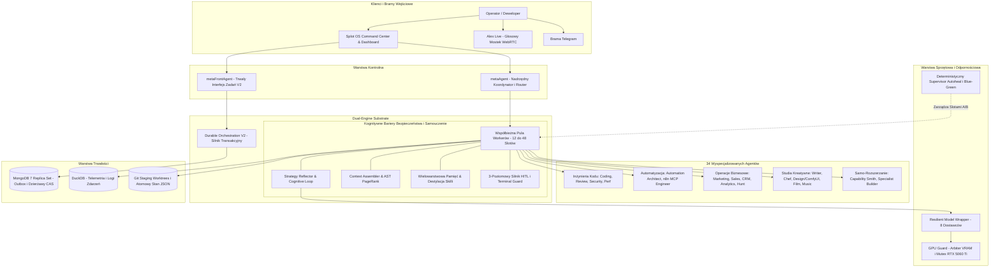

# AI-Agentic-System (Splot OS) — Lokalny System Operacyjny dla Agentów AI

[](https://www.typescriptlang.org/)
[](https://mastra.ai/)
[](https://github.com/turboMe/AI-Agentic-System)
[](https://www.mongodb.com/)
[](#-ekosystem-i-topologia-34-agent%C3%B3w)
[](#-rejestr-zdolno%C5%9Bci-i-916-skilli-sop)
[](#-wielowarstwowa-pami%C4%99%C4%87-i-autonomiczne-samouczenie)

[🇬🇧 **Read this document in English (English README)**](README.md) | [🇵🇱 **Wersja Polska**](README.pl.md)

---

## 🧭 Podsumowanie Wykonawcze

**AI-Agentic-System (kryptonim: Splot OS)** to odporny na awarie, zorientowany produkcyjnie **Lokalny System Operacyjny dla Agentów AI (Local-First Agentic OS)**, zaprojektowany do długotrwałego, autonomicznego wykonywania złożonych procesów inżynieryjnych, biznesowych i kreatywnych.

Projekt opiera się na eleganckich, modularnych fundamentach frameworka [Mastra](https://mastra.ai/) (`@mastra/core`), który dostarcza bazowe abstrakcje dla agentów i narzędzi. W oparciu o ten solidny rdzeń, Splot OS realizuje kompleksową, platformową warstwę operacyjną: rozproszoną trwałość transakcyjną w MongoDB Replica Set, ścisły nadzór nad drzewem procesów Linuksa, kognitywną pętlę refleksji w locie, deterministyczną samonaprawę, arbitraż zasobów sprzętowych (GPU VRAM) oraz wielowarstwową pamięć z nocną destylacją nowych umiejętności.

### Skala Projektu w Liczbach (Audyt Kodu)
* **Objętość kodu źródłowego:** Ponad **407 000 linii kodu TypeScript/JavaScript** (sam rdzeń `src/mastra` liczy 694 pliki i ok. 230 tys. LOC).
* **Zasoby wiedzy operacyjnej:** **916 ustrukturyzowanych procedur i skilli SOP** (Markdown/YAML) z zakresu inżynierii oprogramowania, automatyzacji, mediów i strategii biznesowej (~164 tys. linii).
* **Przestrzeń akcji:** **34 wyspecjalizowanych agentów domenowych** koordynowanych przez nadrzędnego orkiestratora Meta, operujących na **379 silnie typowanych narzędziach Zod**.
* **Odporność i testy:** **241 dedykowanych skryptów weryfikacyjnych i testów chaos engineeringu** w TypeScript (weryfikacja transakcji, dzierżaw CAS, partycji sieciowych i stepdownów Replica Set w MongoDB).

---

## 🏗️ Zbudowany na Fundamencie Mastra Core

Punktem wyjścia dla tego projektu był otwartoźródłowy framework [Mastra](https://mastra.ai/). To właśnie Mastra dostarczyła czyste, spójne kontrakty dla agentów, definicji narzędzi oraz przepływów (`Agent`, `Workflow`, `createTool`).

Gdy wymagania ewoluowały od prostych konwersacji w stronę niezawodnego, działającego lokalnie w trybie ciągłym (24/7) środowiska operacyjnego, Splot OS rozwinął się jako zaawansowana warstwa platformowa nadbudowana wokół Mastra Core:

```
┌────────────────────────────────────────────────────────────────────────┐
│                   Warstwa Operacyjna Platformy Splot OS                │
│  - Współbieżna pula workerów (12–48 slotów) & Durable Orchestration V2 │
│  - Pętla Kognitywna & Strategy Reflector w locie (80k LOC)             │
│  - Deterministyczny Supervisor Autoheal & Blue-Green (Bash + Worktree) │
│  - Wielowarstwowa Pamięć & Nocna Autonomiczna Destylacja Skilli        │
│  - GPU Guard (Sprzętowy Mutex RTX 5060 Ti & Arbiter VRAM)              │
│  - Context Assembler & Graf Kodu AST Tree-Sitter z PageRank            │
│  - 3-Poziomowy Silnik Zatwierdzeń (HITL) & Terminal Safety Guard       │
│  - 34 Wyspecjalizowanych Agentów Domenowych & 916 Skilli SOP           │
└───────────────────────────────────┬────────────────────────────────────┘
                                    │
┌───────────────────────────────────▼────────────────────────────────────┐
│                       Mastra Core (@mastra/core)                       │
│    Prymitywy Agentów • Kontrakty Narzędzi • Standardowe Przepływy      │
└────────────────────────────────────────────────────────────────────────┘
```

Mastra stanowi rdzeń wykonawczy agentów, podczas gdy Splot OS zarządza systemem operacyjnym, sprzętem, transakcyjną bazą danych, samonaprawą i pętlami uczenia się.

---

## 🏛️ Diagram Architektury Systemu



---

## ⚡ Kluczowe Filary Architektury

### 1. Dwuwarstwowy Silnik Wykonawczy (Skalowalna Pula Workerów + Durable V2)
Splot OS realizuje zadania dwiema niezależnymi ścieżkami w zależności od ich czasu trwania i ryzyka:
* **Skalowalna Współbieżna Pula Asynchroniczna (12 do 48 Slotów):** Umożliwia równoległe przetwarzanie niezależnych podzadań, generowanie wariantów i delegacje domenowe bez blokowania głównego wątku konwersacji.
  > [!NOTE]
  > Na stacji roboczej pula jest precyzyjnie dostrojona do **12 slotów**, aby zagwarantować pełną płynność pracy przy lokalnych ograniczeniach CPU/RAM/VRAM. Jednocześnie architektura bazy MongoDB Replica Set, kolejki zadań i pula połączeń są zaprojektowane do obsługi **do 48 slotów współbieżnych** na infrastrukturze serwerowej.
* **Durable Orchestration V2:** Rozproszony silnik transakcyjny oparty na **MongoDB Replica Set** (`rs0`). Implementuje **Transactional Outbox Pattern**, optymistyczne **Dzierżawy CAS (Compare-And-Swap)**, monotoniczne znaki wodne ukończenia i buforowane zrzuty wyników. Awaria procesu lub serwera nie powoduje utraty stanu — nieodnowione dzierżawy są bezpiecznie przejmowane przez inne procesy bez duplikowania efektów ubocznych.
* **Nadzór nad Procesami OS:** Śledzenie drzewa procesów PID w Linuksie ze stopniowaną eskalacją sygnałów zakończenia (`SIGABRT` → `SIGTERM` → `SIGKILL`), co eliminuje procesy osierocone.

### 2. Pętla Kognitywna & Strategy Reflector
Zamiast pozwalać modelom na niekontrolowane zapętlanie się, Splot OS wdraża **Strategy Reflector (80 tys. LOC)**, który analizuje wykonanie w locie poprzez `prepareStep` i `onStepFinish`:
* **Wykrywanie anomalii:** Monitoruje wskaźniki `high_error_rate`, `tool_loop` (wielokrotne wywoływanie tego samego błędnego narzędzia), `direction_instability`, `progress_stall` i `scope_creep`.
* **Dźwignie korygujące w locie:**
  * `dropTools`: Dynamicznie odbiera agentowi problematyczne narzędzia w kolejnych krokach.
  * `forceNoTool`: Wymusza krok czystej dedukcji i syntezy bez prawa używania narzędzi.
  * `escalateModel`: Automatycznie eskaluje zablokowane zadanie z modelu taniego/lokalnego do modelu frontier (np. Claude 4.6 Sonnet lub Gemini 2.5 Pro).

### 3. Deterministyczna Samonaprawa (Autoheal) i Slot Blue-Green
Żadna modyfikacja kodu produkcyjnego nie odbywa się bezpośrednio w działającym procesie:
* **Architektura Slot A / Slot B:** Dwa niezależne sloty środowiska (`slot-a` na porcie 4111 i `slot-b` na porcie 4112).
* **Rejestracja awarii:** W razie wystąpienia błędu `ErrorCollector` wylicza unikalną sygnaturę błędu SHA256 i rejestruje cykl w `autoheal_cycles`.
* **Izolowana naprawa:** Zewnętrzny supervisor bash (`scripts/autoheal-supervisor.sh`) tworzy izolowany `git worktree`, pozwala agentowi programistycznemu zaaplikować precyzyjną poprawkę, uruchamia weryfikację typów i testy, po czym uruchamia kandydata w wolnym slocie.
* **Atomowa podmiana / Rollback:** Supervisor odpytuje endpoint `/deploy/health`. W razie sukcesu atomowo przełącza dowiązanie stanu (`.deploy/autoheal-state.json`). W razie niepowodzenia natychmiast przywraca ruch do stabilnego commitu (`stableCommit`).

### 4. Inżynieria Kontekstu i Analiza Kodu AST
Ochrona przed zapychaniem okna kontekstowego (context bloat) i degradacją uwagi modelu:
* **AST Repo Indexer & PageRank:** Kod JS/TS parsowany jest przez Tree-Sitter, a graf zależności symboli analizowany przez bibliotekę Graphology. `ContextAssembler` sztywno dzieli budżet tokenów: 45% na architektoniczny graf symboli z najwyższym PageRank, 35% na precyzyjne snippety kodu i 20% na punkty kontrolne sesji.
* **Output Compaction:** Długie wyjścia narzędzi (logi z terminala, wyniki wyszukiwania, diffy gita) są automatycznie kompresowane do zwięzłych struktur przed trafieniem do LLM.
* **Transient Tool Shelves:** Narzędzia są udostępniane dynamicznie w zależności od bieżącej fazy zadania, redukując wielkość definicji JSON Schema.
* **Filtr Anti-Slop:** Deterministyczne filtry językowe usuwające żargon i watę słowną generowaną przez LLM.

### 5. Zarządzanie Sprzętem i Odporność Wielomodelowa
* **GPU Guard & Arbiter VRAM:** Monitorowanie w czasie rzeczywistym pamięci VRAM GPU NVIDIA via `nvidia-smi`. Wymusza ścisły semafor sprzętowy (`concurrency = 1`) dla lokalnego GPU (RTX 5060 Ti) dzielonego między generatory obrazu (ComfyUI) a audio (VoiceStudio), wraz z procedurą czyszczenia VRAM.
* **Resilient Multi-Provider Wrapper:** Przezroczyste proxy dla wszystkich wywołań modeli. W przypadku wystąpienia błędów HTTP 429, 500, 502, 503 lub 504 żądanie jest w ciągu milisekund przekierowywane na alternatywnego dostawcę wzdłuż łańcucha fallbacków (np. `DeepSeek` → `Groq` → `Gemini` → `Claude` → `OpenRouter`).

### 6. Warstwa Bezpieczeństwa i Człowiek w Pętli (HITL)
* **3-Poziomowy Silnik Zatwierdzeń:**
  * **Kategoria A (Pełna automatyzacja):** Odczyty danych, modyfikacje notatek markdown, lokalne wersje robocze.
  * **Kategoria B (W ramach limitów):** Masowe operacje kontrolowane dziennymi limitami (np. przygotowywanie szkiców).
  * **Kategoria C (Bezwzględny wymóg zgody człowieka):** Scalanie gałęzi gita na produkcji, niszczące komendy bazodanowe, wysyłka e-maili, płatności.
* **Terminal Safety Guard:** Klasyfikator komend powłoki (AST/regex), który bezwzględnie blokuje destrukcyjne polecenia Linuksa (`rm -rf`, formatowanie dysków, fork-bomby) przed przekazaniem ich do systemu operacyjnego.

---

## 🧠 Wielowarstwowa Pamięć i Autonomiczne Samouczenie

Splot OS został zaprojektowany tak, aby **stawać się mądrzejszy i szybszy z każdym zrealizowanym zadaniem**, wykorzystując symetryczny mechanizm dwu-mózgowy:

```
               ┌──────────────────────────────────────────────┐
               │         Hierarchia Pamięci Wielowarstwowej   │
               └──────────────────────┬───────────────────────┘
                                      │
     ┌──────────────────┬─────────────┴───────────────┬──────────────────┐
     ▼                  ▼                             ▼                  ▼
┌───────────┐     ┌───────────┐                 ┌───────────┐      ┌───────────┐
│  Pamięć   │     │  Pamięć   │                 │  Wiedza   │      │Procedural-│
│  Robocza  │     │Obserwacyj-│                 │Semantyczna│      │ne Skille  │
│ (Wątek)   │     │na (Tokens)│                 │(bge-m3 DB)│      │(916 SOP)  │
└─────┬─────┘     └─────┬─────┘                 └─────┬─────┘      └─────┬─────┘
      │                 │                             │                  │
      └─────────────────┴──────────────┬──────────────┴──────────────────┘
                                       │
                    ┌──────────────────▼──────────────────┐
                    │  Silnik Ciągłego Samodoskonalenia   │
                    └──────────────────┬──────────────────┘
                                       │
                 ┌─────────────────────┴─────────────────────┐
                 ▼                                           ▼
      ┌───────────────────────┐                   ┌───────────────────────┐
      │     Failure Brain     │                   │     Success Brain     │
      │   (Czego UNIKAĆ)      │                   │ (Destylator Skilli)   │
      │ - recepty autohealu   │                   │ - zadania ≥5 tools    │
      │ - błędy kontraktów    │                   │ - recovery i lekcje   │
      │ - klasyfikacja awarii │                   │ - bramka mini-eval    │
      └───────────────────────┘                   └───────────┬───────────┘
                                                              │
                                                  ┌───────────▼───────────┐
                                                  │ Nocny Worker w Tle    │
                                                  │ (Autonomiczne pisanie │
                                                  │  plików SKILL.md)     │
                                                  └───────────────────────┘
```

### 1. 5 Warstw Pamięci
1. **Pamięć Robocza (Working Memory):** Aktywny stan tury, kontrakt bieżącego celu i lokalny brudnopis rozumowania.
2. **Pamięć Obserwacyjna (Observational Memory):** Silnik typu Actor / Observer / Reflector kompresujący do 50 000 tokenów konwersacji w wysokopoziomowe obserwacje z sygnaturami czasowymi.
3. **Telemetria Zdarzeń (`agent_events`):** Drobiazgowy dziennik rejestrujący każde wywołanie narzędzia, czas odpowiedzi, zużycie tokenów i interwencje użytkownika (retencja TTL 30 dni).
4. **Semantyczna Baza Wiedzy Instytucjonalnej (`system_knowledge`):** Typowana wiedza (`failure_case`, `coding_pattern`, `autoheal_recipe`, `tool_contract`, `prompt_rule`) indeksowana wektorowo (`bge-m3`) z wagami pewności i odnawialnym czasem życia 90 dni.
5. **Pamięć Proceduralna (Rejestr Skilli):** Baza 916+ ustrukturyzowanych procedur w formacie Markdown (`SKILL.md`), wyszukiwana semantycznie.

### 2. Dwu-mózgowa Pętla Samouczenia
* **Failure Brain (Uczenie się na błędach):** Gdy zadanie napotyka trudności lub wymaga restartu, `MemoryExtractor` klasyfikuje błąd i zapisuje wzorzec w `autoheal_recipe`. Przy kolejnych problemach agenci odpytują Failure Brain, natychmiast aplikując sprawdzone rozwiązania zamiast powtarzać pomyłki.
* **Success Brain (Destylacja Skilli z Sukcesów):** Po pomyślnym ukończeniu wymagającego zadania (wyzwalanym przez ≥5 wywołań narzędzi, udane wyjście z błędu lub korektę od operatora), lekki model w tle analizuje ścieżkę wykonania i destyluje ją do reużywalnego pliku `SKILL.md`.
* **Bramka Jakości Mini-Eval:** Każdy nowo wygenerowany skill przechodzi automatyczną walidację (sprawdzenie frontmattera YAML, treści merytorycznej oraz upewnienie się, że nie zawiera żadnych wrażliwych kluczy API czy sekretów), zanim trafi do katalogu `src/mastra/_skills/auto/`.
* **Nocna Ewolucja Systemu:** W nocy i w okresach bezczynności procesy w tle konsolidują doświadczenia zebrane w ciągu dnia, tworząc nowe procedury operacyjne. W efekcie powtarzalne zadania stają się z dnia na dzień coraz szybsze, tańsze i bardziej precyzyjne.

---

## 🤖 Ekosystem i Topologia 34 Agentów

Wszystkie domeny zostały zaprojektowane w sposób **uniwersalny i agnostyczny biznesowo**. Wiedza o konkretnych projektach, markach czy profilach klientów jest dynamicznie wstrzykiwana przez RAG i narzędzia wiedzy (`knowledge_lookup`), a nie zaszyta na stałe w promptach.

```
                              ┌────────────────────┐
                              │     metaAgent      │
                              │ (Intencje i Plan)  │
                              └─────────┬──────────┘
                                        │
     ┌──────────────────┬───────────────┼───────────────┬──────────────────┐
     ▼                  ▼               ▼               ▼                  ▼
┌─────────┐       ┌───────────┐   ┌───────────┐   ┌───────────┐      ┌───────────┐
│Inżynieria│      │Automaty-  │   │Operacje   │   │Studia     │      │Wiedza i   │
│Kodu     │       │zacja n8n  │   │Biznesowe  │   │Kreatywne  │      │Badania    │
└─────────┘       └───────────┘   └───────────┘   └───────────┘      └───────────┘
```

### 1. Warstwa Kontrolna i Orkiestracja
* **`metaAgent`:** Główny orkiestrator. Dekoduje intencje, asynchronicznie deleguje zadania do puli 12–48 workerów, planuje łańcuchy zadań i dokonuje syntezy wyników.
* **`metaFrontAgent`:** Niezawodny interfejs konwersacyjny operujący bezpośrednio nad zadaniami trwałymi Durable V2.
* **`laneOrchestratorAgent`:** Przydział ścieżek wykonania i zarządzanie budżetami prób.

### 2. Inżynieria Oprogramowania
* **`codingAgent`:** Autonomiczny programista pracujący wyłącznie w bezpiecznych gałęziach `git worktree`. Korzysta z LSP, inspekcji AST Tree-Sitter i testów automatycznych.
* **`codeReviewAgent`:** Ewaluator kodu oceniający spójność architektury, bezpieczeństwo typów i ryzyko regresji.
* **`securityReviewAgent`:** Analiza zagrożeń z wykorzystaniem metodyk STRIDE, DREAD i audytu podatności zależności.
* **`performanceReviewAgent`:** Profilowanie ścieżek krytycznych, złożoności obliczeniowej i wycieków pamięci.

### 3. Automatyzacja i Integracje
* **`automationArchitect`:** Inżynier pełnego cyklu życia automatyzacji n8n. Odpowiada za zrozumienie zapotrzebowania biznesowego, zaplanowanie topologii węzłów, budowę, walidację i uruchomienie gotowego workflow — od prostych integracji webhookowych po zaawansowane, wielogałęziowe potoki enterprise, z wykorzystaniem wzorców Pattern RAG i scoringu ryzyka.
* **`n8nMcpEngineer`:** Inspekcja schematów węzłów n8n, normalizacja parametrów i integracja via MCP.

### 4. Uniwersalne Operacje Biznesowe
* **`deliberationAgent`:** Rada doradcza prowadząca wieloperspektywiczną debatę nad kluczowymi decyzjami architektonicznymi i biznesowymi przed ich realizacją.
* **`marketingAgent`:** Uniwersalny silnik generowania komunikacji B2B i konwersji leadów. Dynamicznie dopasowuje się do dowolnej marki na podstawie briefu lub bazy wiedzy.
* **`salesAgent`:** Ofertowanie, strukturyzacja umów, prowadzenie procesów onboardingu i planowanie spotkań.
* **`crmAgent`:** Szybkie przeszukiwanie baz leadów, agregacja danych i statusy rurociągów sprzedażowych.
* **`analyticsAgent`:** Raportowanie wskaźników KPI, analityka telemetryczna, trendy rynkowe i kalkulacje ROI.
* **`huntAgent`:** Zautomatyzowany potok poszukiwania, wzbogacania i weryfikacji kontaktów biznesowych.

### 5. Studia Produkcji Kreatywnej i Multimedialnej
* **`writerAgent`:** Tworzenie długich form literackich, powieści, esejów i dokumentacji z kontrolą ciągłości fabularnej i filtrem anti-slop. **Integracja Audio:** Przygotowuje skrypty pod generację audio (audiobooki, powieści, słuchowiska wielogłosowe z podziałem na role i pauzami) i renderuje je bezpośrednio w lokalnym VoiceStudio.
* **`chefAgent`:** Inżynieria kulinarna oparta na **15-letniej wiedzy domenowej** i ustrukturyzowanej bazie **12 000 lokalnych przepisów**. Łączy bazę receptur z grafem smaków FlavorDB (dopasowanie cząsteczek molekularnych) oraz inżynierią menu (matryca rentowności i popularności), tworząc kompletne karty menu restauracyjnego, karty technologiczne potraw, kalkulacje food cost i Menu Booki.
* **`designAgent`:** Projektant stron internetowych, okładek, makiet UI oraz grafik produktowych. Obsługuje lokalne studio ComfyUI (generowanie obrazów SD/Flux z czyszczeniem VRAM), tworząc zasoby wizualne bezpośrednio na potrzeby publikacji lub przekazując je do animacji w Remotion.
* **`filmmakerAgent`:** Autonomiczny reżyser wideo operujący w dwóch trybach:
  1. *Wideo Programistyczne:* Silnik Remotion generujący animacje kodu, kinetyczną typografię i precyzyjną synchronizację audio-wideo.
  2. *Generatywne Wideo AI (Seedance):* Generowanie wideo z tekstu lub obrazu oraz **kontynuacja wideo na bazie ostatniej klatki** z zachowaniem spójności postaci i stylu w wieloujęciowych narracjach.
* **`musicianAgent`:** Kompozycja muzyczna, pisanie tekstów i wielościeżkowa aranżacja w VoiceStudio.

### 6. Meta-Rozszerzanie Systemu
* **`capabilitySmith`:** Dynamiczna synteza, testowanie i dołączanie nowych narzędzi w piaskownicy w czasie rzeczywistym.
* **`specialistBuilder`:** Kreator tworzący nowe, trwałe definicje agentów specjalistycznych na żądanie.

---

## 📚 Rejestr Zdolności i 916 Skilli SOP

Zdolności systemu zostały rozdzielone na **Narzędzia Atomowe** i **Procedury Metodyczne (Skille)**:
* **379 Narzędzi Zod:** Ścisła walidacja parametrów wejścia/wyjścia (systemowe, terminalowe, git, Google Workspace, n8n, bazy danych, multimedia).
* **916 Skilli Proceduralnych (`src/mastra/_skills/`):**
  * `music/` (581 skilli): Teoria harmonii, aranżacja, miks, struktury gatunkowe.
  * `film/` (119 skilli): Reżyseria, ruch kamery, kompozycja, promptowanie Seedance, wideo Remotion.
  * `auto/` & `coding/` (120 skilli): Wzorce refaktoryzacji, AST, TDD, architektury TypeScript, autonomicznie wydestylowane skille.
  * `design/`, `security/`, `devops/`, `marketing/` (96 skilli): Strategie GTM, modelowanie zagrożeń, konteneryzacja, wzorce UI.
* **Leniwe Ładowanie Semantyczne:** Skille są indeksowane wektorowo (`bge-m3`) i doładowywane dynamicznie (`skill_search`, `skill_load`), dzięki czemu prompty systemowe agentów nie są obciążone niepotrzebnym tekstem.

---

## 🎛️ Command Center i Obserwowalność

Splot OS wyposażony jest we własne centrum operacyjne:
* **Pulpit Operatorski Web (`dashboard/index.html`):** Ponad 200 KB dedykowanego kodu interfejsu do podglądu stanu floty, zlecania zadań, przeglądu artefaktów i monitorowania slotów blue-green.
* **Alex Live WebRTC Voice:** Niskopoziomowy mostek głosowy łączący audio czasu rzeczywistego bezpośrednio ze środowiskiem agentów.
* **Retencja Danych i Telemetria:** Zdarzenia agentów są asynchronicznie zapisywane w MongoDB (`agent_events`) i replikowane do bazy analitycznej DuckDB z automatycznym czyszczeniem starych wpisów.
* **Ewaluatory Jakościowe (Scorers):** Zestaw automatycznych ewaluatorów (`src/mastra/scorers/`) sprawdzających jakość wywołań narzędzi, poprawność debat i kompletność planów.

---

## 🛠️ Stos Technologiczny

* **Środowisko bazowe:** Node.js `>=22.13.0` (ESM), TypeScript 5.x, `@mastra/core` (v1.31+)
* **Bazy danych i trwałość stanu:**
  * **MongoDB 7 (Replica Set `rs0`):** Transakcje wielodokumentowe, outbox, dzierżawy CAS.
  * **DuckDB (`@mastra/duckdb`):** Szybki lokalny silnik analityczny dla telemetrii.
  * **Atomowe pliki JSON:** Odporny na awarie stan procesu (`autoheal-state.json`).
* **Analiza kodu:** Tree-Sitter (analiza składniowa JS/TS), Graphology (grafy zależności i PageRank), TypeScript Language Server (LSP).
* **Modele i integracje AI:** Google Gemini SDK (`@google/genai`), Anthropic Claude, DeepSeek (`@ai-sdk/deepseek`), Groq, Local Ollama, OpenRouter.
* **Media i automatyzacja:** Remotion (programistyczne wideo), Seedance (generatywne wideo AI), ComfyUI (generacja obrazów SD/Flux), VoiceStudio (lokalne TTS/audiobooki), n8n (konteneryzowany silnik integracji), tunel Cloudflare.

---

## 🚀 Uruchomienie Środowiska

### Wymagania wstępne
* **Node.js:** `>=22.13.0`
* **Docker & Docker Compose:** Niezbędny dla MongoDB w trybie Replica Set, n8n i tunelu Cloudflare.
* **Karta graficzna NVIDIA (opcjonalnie):** Wymagana dla lokalnych modeli Ollama, ComfyUI i VoiceStudio.

### Krok po kroku

```bash
# 1. Klonowanie repozytorium
git clone git@github.com:turboMe/AI-Agentic-System.git
cd AI-Agentic-System

# 2. Konfiguracja Node i instalacja zależności
nvm use
npm run node:check
npm install

# 3. Zmienne środowiskowe
cp .env.example .env
# Uzupełnij klucze API (Gemini, Claude, DeepSeek itp.) oraz flagi funkcji.

# 4. Start usług pomocniczych (MongoDB Replica Set, n8n, tunel)
npm run mongo:up
npm run init-db
npm run n8n:up
npm run tunnel:up

# 5. Uruchomienie serwera operacyjnego
npm run dev
```

* Otwórz [http://localhost:4111](http://localhost:4111), aby uzyskać dostęp do **Splot OS Dashboard & Mastra Studio**.

---

## 🧪 Zestaw Testów Odpornościowych i Chaos Engineeringu

Projekt zawiera **241 skryptów testowych** w `src/mastra/scripts/`:

```bash
# Weryfikacja spójności typów TypeScript
npm run typecheck

# Sprawdzenie kontraktów Durable Orchestration V2 i konfiguracji Replica Set
npm run check:replica-set
npm run check:orchestration-contracts
npm run check:orchestration-store

# Testy odpornościowe (Chaos Engineering) transakcji i stepdownów MongoDB
npm run f8:no-duplicate-effect
npm run f8:no-split-brain
npm run f8:stepdown-lease-renewal
npm run f8:partition-claim-heartbeat

# Uruchomienie supervisora samonaprawy i weryfikacja wdrożenia blue-green
npm run autoheal:supervisor
npm run deploy:blue-green
```

---

## 📄 Licencja i Podziękowania

Projekt objęty jest licencją **ISC**.  
Zbudowany w oparciu o solidny fundament otwartoźródłowego frameworka **Mastra Core**, rozwinięty w pełnoprawny, lokalny system operacyjny dla autonomicznych agentów AI.
