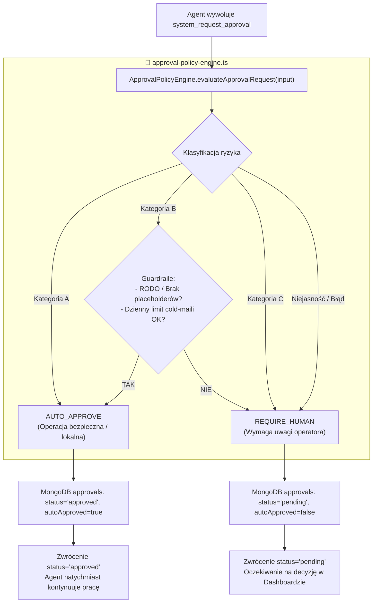

# Auto-Approval Policy Engine & Human-in-the-Loop (HITL)

> **Status:** ✅ Wdrożone i Przetestowane  
> **Data aktualizacji:** 2026-08-27  
> **Moduł główny:** `src/mastra/services/approval-policy-engine.ts`  
> **Narzędzie integrujące:** `src/mastra/tools/system/request-approval.ts`  
> **Zarządzanie limitami:** `src/mastra/services/approval-quotas.ts`  
> **Testy integracyjne:** `src/mastra/scripts/check-approval-policy-engine.ts`

---

## 1. Wprowadzenie i Cel Architektury

W środowisku wieloagentowym Mastra agenci wykonują różnorodne akcje – od generowania raportów i tworzenia szkiców, po wysyłkę e-maili i modyfikacje plików repozytorium.

Dotychczas każde wywołanie narzędzia `system_request_approval` bezwarunkowo blokowało agenta i tworzyło oczekujący rekord (`status: 'pending'`), czekający na manualne kliknięcie operatora w Dashboardzie. Prowadziło to do:
1. **Zatorów i „zombie lanes”** przy operacjach rutynowych (np. wysłanie PDF do samego siebie, zapis szkicu posta).
2. **Sztucznego szumu decyzyjnego** w interfejsie operatora (dziesiątki oczekujących zgód o zerowym ryzyku).

**Silnik Auto-Approval Policy Engine** stanowi **Single Source of Truth** decydujący w sposób deterministyczny i bezpieczny, które operacje mogą zostać zatwierdzone natychmiast (`AUTO_APPROVE`), a które bezwzględnie wymagają interwencji człowieka (`REQUIRE_HUMAN`).

---

## 2. Architektura Decyzyjna (Kategorie A, B, C)



---

## 3. Szczegółowy Katalog Reguł

### Kategoria A: Pełne Auto-Approve (Operacje bezpieczne i lokalne)

| Reguła | Narzędzia / Akcje | Kryteria autoryzacji | Uzasadnienie biznesowe |
|---|---|---|---|
| `RULE_A1_SELF_RECIPIENT_EMAIL` | `gmail_manage_draft`, `gmail.send_draft` | Odbiorca `to` jest zweryfikowanym adresem właściciela (`admin@example.com`, `OWNER_EMAIL`). | Wysyłka raportów, analiz lub Ksiąg Menu bezpośrednio do właściciela jest w pełni bezpieczna. |
| `RULE_A2_DRAFT_OR_SCHEDULE_ONLY` | `contentSaveDraft`, `hunt_set_run_status` (status!=ship) | Zapis draftu do bazy / kalendarza bez fizycznej publikacji na zewnątrz. | Szkic nie wywołuje skutków zewnętrznych do momentu zatwierdzenia publikacji. |
| `RULE_A3_DOCS_OR_MARKDOWN_PATCH` | `coding_apply_patch`, `write_file` | Modyfikacje dotyczą wyłącznie katalogu `docs/**` lub plików `*.md`. | Zmiany w dokumentacji nie wpływają na stabilność runtime kodu produkcyjnego. |
| `RULE_A4_MEMORY_AND_CONTEXT_CLEANUP` | `addContextTool` (status=COMPLETE) | Czyszczenie tymczasowych notatek z testów / zamknięcie fazy zadania w pamięci. | Rutynowa higiena pamięci roboczej agentów. |
| `RULE_A5_SAFE_ANALYTIC_AUTOMATION` | `architect_activate_automation`, `deployAutomationTool` | Aktywacja read-only / testowych przepływów n8n (np. pobranie kursów NBP i zapis do `fx_alerts`). | Izolowany zapis do tabel analitycznych bez webhooków zewnętrznych. |

---

### Kategoria B: Warunkowe Auto-Approve (Guardraile i limity)

| Reguła | Narzędzia / Akcje | Warunki (Wszystkie muszą być spełnione) | Zachowanie przy niespełnieniu |
|---|---|---|---|
| `RULE_B1_COLD_EMAIL_GUARDRAILED` | `gmail.send_draft`, `hunt_approve_ship` | 1. Poprawny format adresu e-mail.<br>2. Pełna zgodność z walidatorem `validateDraft` (obecna kanoniczna stopka RODO, brak placeholderów typu `[nazwa firmy]`, brak zakazanych nazw).<br>3. Nieprzekroczony dzienny limit (`<= 10 maili/dzień`). | Cofa się do `REQUIRE_HUMAN` ze szczegółowym opisem powodu błędu walidacji lub wyczerpania limitu. |
| `RULE_B2_ISOLATED_TOOL_PATCH` | `coding_apply_patch`, `write_file` | Modyfikacja wyłącznie w obrębie `src/mastra/tools/**` lub `src/mastra/scripts/**` (zakaz modyfikacji `index.ts`, `meta-agent.ts`, `orchestrator`, `lib/mongo.ts`). | Cofa się do `REQUIRE_HUMAN`. |

---

### Kategoria C: Bezwzględny Human-In-The-Loop (Wymaga zgody człowieka)

| Reguła | Narzędzia / Akcje | Dlaczego zawsze wymaga człowieka? |
|---|---|---|
| `RULE_C1_PAID_MEDIA_GENERATION` | `film_generate`, `music_generate` | Płatne zewnętrzne API generowania wideo/audio (Luma, Runway, Suno) zużywające kredyty finansowe. |
| `RULE_C2_CORE_SYSTEM_MERGE` | `capability-build`, `live-merge-permission` (rdzeń repozytorium) | Modyfikacje jądra orkiestracji, slotów Blue-Green lub pliku głównego serwera (`index.ts`). |
| `RULE_C_DEFAULT_FALLBACK` | Dowolne nierozpoznane narzędzie lub niepoprawny payload | Podstawowa zasada bezpieczeństwa: **Fail-Safe** – brak dopasowania reguły zawsze oznacza wymóg zgody operatora. |

---

## 4. Zarządzanie Limitami Dziennymi (`approval-quotas.ts`)

Serwis limitów operuje na kolekcji `approval_quotas` w MongoDB:

* **Format klucza:** `{ key: "cold_email_daily", date: "YYYY-MM-DD" }`
* **Domyślny limit:** `10` e-maili na dobę (konfigurowalny przez zmienną `AUTO_APPROVE_MAX_DAILY_EMAILS`).
* **Operacje atomowe:** Wykorzystuje `findOneAndUpdate` z operatorem `$inc`, co zapobiega race conditions przy współbieżnych zapytaniach agentów.
* **Fail-Safe:** Błąd bazy danych przy sprawdzaniu limitu automatycznie blokuje auto-akceptację i kieruje prośbę do człowieka.

---

## 5. Integracja z Narzędziem `system_request_approval`

Gdy agent wywołuje `system_request_approval`:
1. Sprawdzana jest idempotencja dla projektów multimedialnych (`args.projectId`, `args.clipId`, `args.trackId`).
2. Żądanie trafia do `evaluateApprovalPolicy(input)`.
3. Jeśli wynik to `AUTO_APPROVE`:
   - W MongoDB `approvals` tworzony jest rekord:
     ```json
     {
       "id": "uuid-...",
       "status": "approved",
       "autoApproved": true,
       "autoApprovedCategory": "CATEGORY_A",
       "autoApprovedRule": "RULE_A1_SELF_RECIPIENT_EMAIL",
       "autoApprovedReason": "Wysyłka e-maila / materiałów na zweryfikowany adres właściciela systemu.",
       "createdAt": "2026-08-27T...",
       "updatedAt": "2026-08-27T..."
     }
     ```
   - Narzędzie zwraca agentowi:
     ```json
     {
       "success": true,
       "approvalId": "uuid-...",
       "status": "approved",
       "autoApproved": true,
       "message": "Auto-approved by policy [RULE_A1_SELF_RECIPIENT_EMAIL]: ... You may proceed."
     }
     ```
   - Downstream tools (np. `consumeOneTimePermit`, `live-merge-permission`) konsumują ten token bez żadnych zmian w ich kodzie.

---

## 6. Dashboard & Monitorowanie API

Endpoint `/dashboard/approvals` w `src/mastra/index.ts` obsługuje zapytania:
* `GET /dashboard/approvals?status=pending` (domyślny) — lista zadań oczekujących na decyzję operatora.
* `GET /dashboard/approvals?status=approved` — lista zadań zatwierdzonych (zarówno manualnie, jak i przez Auto-Approval).
* `GET /dashboard/approvals?status=all` — pełny audyt wszystkich zgód.

W każdym rekordzie zwracane są pola audytowe: `autoApproved`, `autoApprovedRule`, `autoApprovedReason`.

---

## 7. Jak Rozszerzać Reguły w Przyszłości?

Wszystkie zasady biznesowe znajdują się w jednym pliku: [src/mastra/services/approval-policy-engine.ts](file:///projekty/mastra-agentic-environment/agentic-agents/src/mastra/services/approval-policy-engine.ts).

### Przykłady modyfikacji:
1. **Dodanie nowego zaufanego adresu e-mail:**
   Edytuj tablicę `DEFAULT_OWNER_EMAILS` lub ustaw zmienną środowiskową `OWNER_EMAIL="admin@example.com,inny@domena.pl"`.
2. **Zmiana dziennego limitu cold-maili:**
   Ustaw zmienną środowiskową `AUTO_APPROVE_MAX_DAILY_EMAILS=20`.
3. **Dodanie nowego bezpiecznego narzędzia do Kategorii A:**
   Dodaj funkcję sprawdzającą (np. `isMyCustomSafeTool(...)`) w `approval-policy-engine.ts` i dodaj warunek w sekcji `CATEGORY A`.

---

## 8. Testy i Walidacja

Uruchomienie dedykowanego zestawu testów:
```bash
npx tsx src/mastra/scripts/check-approval-policy-engine.ts
```

Sprawdzenie poprawności typów w całym projekcie:
```bash
npx tsc --noEmit
```
