# Durable Orchestration V2 — experimental walking skeleton

Additive, isolated implementation of the durable-orchestration substrate from
[`ideas/meta-front-durable-orchestration-and-execution-plan.md`](../ideas/meta-front-durable-orchestration-and-execution-plan.md).
It provides a **non-blocking Meta Front over durable, autonomous, crash-recoverable
jobs**. The current slice is proven end to end from HTTP command acceptance through
worker execution, walking-skeleton A/B/C boundaries, and an ordered conversation
read model. Same-job child fan-out/fan-in and a registered-agent worker seam also
exist. Flat planning now runs through the first fenced BUSINESS lane activation.
Validated `ok/partial/failed` results for its single root SERIAL task now cross
the durable `A → sequenced orch_job_inbox → bounded RESULT_DRAIN (B)` slice,
including contiguous completion watermarks, durable unsupported quarantine and
binary-gated operator redrive with transactional wake handoff. Bounded transient
A-reference failures additionally use exact store-time retry timers, automatic
redrive and a durable exhaustion quarantine. Eligible expired
BUSINESS/RESULT_DRAIN activation owners may now cross a narrow, typed
`CONTROL_RECOVERY` R0/R1 boundary that can restore ordinary demand without
performing business work. PR-37 (`f04271f`) added the durable
`PROCESS_STOP_V1` boundary, and PR-38 (`542f756`) supplies its real Linux
`PROCESS_SUPERVISOR_V1` consumer: an inert release handshake, exact process-tree
identity, cooperative abort/TERM/KILL escalation, restart recovery and normal or
late tree-empty receipts. Cancel remains pending while a registered attempt
process lacks trusted evidence, and its bounded grace path fails closed without
dispatching overlapping retry work.
PR-39 (`72a4f84`) added the fail-closed `FLAT_STOP_V1` terminal barrier.
PR-40 (`e1b34b1`) makes that reducer owned: one typed
`STOP_CONTROL_RECOVERY_V1` activation reserves protected per-job control
capacity, claims and starts under lease/fence authority, then atomically commits
the reducer together with activation and exact elapsed-time budget settlement.
Lost owners recover at most three times; malformed or exhausted authority is
durably quarantined and alerted rather than retried without bound.

> **Status:** experimental walking skeleton (plan §15.7.1 /
> `GAP-SKELETON-01`). It is mounted in the Mastra runtime only when
> `FEATURE_ORCHESTRATION_V2=true` and is **OFF by default**. V2 defaults to its
> own `orchestration_v2` database, always uses `orch_*` collections, and requires
> a MongoDB **replica set**.
> The default project Mongo setup is standalone, so ordinary `npm run mongo:up`
> does not make V2 deployable. Use the coverage manifest and plan §33 for
> authoritative progress.
>
> **Cutover status (F6, complete 2026-08-10).** Two *background mechanisms* now
> execute as durable jobs instead of `void …(…)`: **async delegation** and the
> **Automation Golden Path**, each behind its own flag, each **OFF by default**,
> each with the legacy lane as a fail-open fallback. **Capability BUILD** is
> fenced (renewed lease, one-time promote permit) and the **Task Ledger** is a
> projection of durable state rather than a second scheduler. No *agent* has
> completed formal migration — that is F7, and it has not started. Legacy is
> still present and still serving; `npm run audit:cutover` reports how much
> traffic remains on it.
> Pełna, imienna macierz przygotowania wszystkich agentów i workerów oraz parity
> tools/skills: [`STATUS-AGENTOW-SILNIK-V2.md`](./STATUS-AGENTOW-SILNIK-V2.md).

## Flow

```mermaid
flowchart LR
  C[client] -->|POST /v2/.../commands| H[HTTP handlers]
  H -->|acceptStartCommand| CB[(command boundary)]
  CB -->|job ACCEPTED + wake| OB[(orch_outbox)]
  OB -->|current-generation WakeHandle| L[lane orchestrator]
  L -->|materialize exact BUSINESS activation| LA[(orch_lane_activations)]
  LA -->|PENDING → LEASED → RUNNING| PM[bounded planning proposal marker]
  PM -->|exact-hash atomic reducer| T[(orch_job_tasks)]
  T -->|optional fan-out| E[(orch_dispatch_edges)]
  E -->|child tasks| T
  L -->|dispatchAttempt| A[(orch_job_attempts)]
  A -->|claim: LEASED + fence| W[worker]
  W -->|operation-start CAS: RUNNING| A
  W -->|registry/model worker before business cutoff| MW[bounded model call]
  MW -->|producer envelope| M[payload-ready marker]
  W -->|deterministic fixture envelope| M
  M -->|generation + immutable hash| AB[submitAttemptResult / A boundary]
  AB -->|finalize attempt| A
  AB -->|validated result| RES[(orch_execution_results)]
  AB -->|sequenced RECEIVED item + high watermark| IN[(orch_job_inbox)]
  AB -->|blocked| Q[(orch_control_requests)]
  Q -->|JobAwaitingInput| OB
  AB -->|result wake| OB
  OB -->|materialize exact RESULT_DRAIN activation| LA
  LA -->|bounded supported batch apply| IN
  LA -->|unsupported: quarantine + alert intent| IN
  LA -->|transient: FAILED_RETRYABLE + scoped timer| RT[(orch_timers)]
  RT -->|exact due CAS: PENDING_REDRIVE + one wake| OB
  LA -->|retry exhausted: legacy quarantine bucket + typed alert| IN
  IN -->|operator/upgrade redrive wake| OB
  IN -->|task + job + activation atomic B| J[(orch_jobs)]
  J -->|JobTerminal| OB
  J -->|STOP_REQUESTED| SCR[STOP_CONTROL_RECOVERY_V1]
  SCR -->|reserve / claim / start| BR[(orch_budget_reservations)]
  SCR -->|fused FLAT_STOP_V1 + settlement| J
  R -->|eligible expiry: atomic R0 slot handoff| CR[typed CONTROL_RECOVERY]
  CR -->|ControlRecoveryRequested| OB
  OB -->|claim distinct control wake: fenced R1| CR
  CR -->|eligible demand: adopt/create at most one ordinary wake| OB
  OB -->|C boundary| P[(conversation projections)]
  P -->|GET .../projections?after=| C
  C -->|answer_job_request| Q
  R[reconciler + timers] -.->|queue expiry, reap, request expiry, re-wake, project| OB
```



Lifecycle: `accept → current-generation wake claim → planning activation
(PENDING→LEASED→RUNNING) → proposal marker before businessOperationCutoffAt →
exact-hash planning reducer before workDeadlineAt → dispatch → attempt claim
(LEASED/fence) → operation-start CAS (RUNNING) → model call before its business
cutoff → payload-ready generation/hash → A before its work deadline → result wake
→ bounded `RESULT_DRAIN` batch (at most one current result apply plus supported
stale/quarantine/transient decisions) → contiguous completion, `RECONCILING`,
store-time retry, operator redrive or deterministic successor handoff
→ C → conversation projection`.
An eligible expired activation may instead cross atomic R0
(`old owner → ABANDONED`, unique slot → `CONTROL_RECOVERY`, distinct control
outbox) and fenced R1 (`PENDING→LEASED→RUNNING→COMMITTED`) before ordinary
demand may be restored; R1 may also commit `NO_DEMAND`. R1 does not apply a
result or mutate task/inbox/terminal state. R1 must commit before
`workDeadlineAt`; the gap to `hardDeadlineAt` is only a local deadline margin,
not protected control capacity or accounting. In contrast, a pending flat STOP
is materialized as `STOP_CONTROL_RECOVERY_V1` with a durable job-local
reservation. Its reducer, owner settlement, exact elapsed charge/refund and slot
release share one transaction.
Durable state boundaries are transactional; the model call itself deliberately
runs outside a database transaction. Outbox wakes drive the lane, while the
periodic reconciler expires unclaimed queue admissions, fires durable timers,
reaps expired attempt and activation authority, expires requests, restores lost
wakes, and drains projectable events.

## Module map (`src/mastra/orchestration/`)

| Area | File | Role |
|---|---|---|
| **contracts** | `contracts/ids.ts` | branded id hierarchy (§5.1), server-minted UUIDs |
| | `contracts/state.ts` | job/task/attempt/… state enums + stop-cause unions (§7) |
| | `contracts/result-envelope.ts` | strict producer envelope; no false success (§9.1, RES-001) |
| | `contracts/execution-budget.ts` | three deadlines + reserves, child clamp, step invariant (§10.1) |
| **store** | `store/txn.ts` | `runTxn` (retry+jitter+count), `canonicalHash` |
| | `store/collections.ts` | `orch_*` docs + unique indexes |
| | `store/connect.ts` | injectable replica-set client |
| | `store/command-boundary.ts` | `acceptStartCommand` — Durable-before-ACK (§8.1) |
| | `store/control-boundary.ts` | cancel/pause/resume authority races, pause barrier, append/fork and contained pre-plan steer |
| | `store/request-boundary.ts` | answer/expire durable user, approval, external and dependency requests |
| | `store/attempts.ts` | dispatch/claim/operation authority, three deadlines, payload-ready + flat A, queue expiry and reaper |
| | `store/attempt-stop.ts` | narrow PROCESS_STOP_V1 first-stop CAS, exact supervised-owner receipt and bounded grace reducer |
| | `store/process-supervision.ts` | immutable normal process-exit receipt and monotonic stop-signal evidence |
| | `store/activations.ts` | flat BUSINESS planning activation: lifecycle, fence, proposal marker, exact-hash reducer and reaper |
| | `store/result-drain.ts` | bounded root-SERIAL `RESULT_DRAIN`: fenced batch, watermarks, quarantine/operator redrive and transient retry classifier + typed due reducer |
| | `store/control-recovery.ts` | narrow lost-activation `CONTROL_RECOVERY`: atomic R0 authority transfer + fenced, control-only R1 |
| | `store/flat-terminal-barrier.ts` | fail-closed `FLAT_STOP_V1` scope proof and fused owned terminal mutation |
| | `store/stop-control-recovery.ts` | typed STOP owner, protected control reservation, exact settlement and bounded recovery |
| | `store/job-advance.ts` | `planJob`, `advanceJobFromTasks` (B / terminal barrier, §7.1) |
| | `store/child-tasks.ts` | same-job REQUIRED/OPTIONAL dispatch edges and fan-out/fan-in |
| | `store/conversation-writer.ts` | C boundary: idempotent projection + delivery |
| | `store/timers.ts` | control-first attempt-stop grace, generic store-time wakeups and bounded inbox-retry dispatch |
| | `store/lane-orchestrator.ts` | `laneStep`/`drainLane` — wake-driven, idempotent (§4.2) |
| | `store/worker.ts` | worker loop, deterministic fixture, `runToQuiescence` (§4.3) |
| | `store/reconcile.ts` | queue/timer/lease/request recovery + lost wakes + C drain |
| | `store/queries.ts` | `getJobStatus`/`listJobs` — read-only, owner-scoped (§8.2) |
| **execution** | `execution/linux-process-tree.ts` | exact host-boot/PID-namespace/process-group inspection, signalling and tree-empty proof |
| | `execution/process-supervisor.ts` | inert wrapper, release handshake, Abort→TERM→KILL and startup/tick recovery |
| | `execution/process-worker.ts` | opt-in serializable `PROCESS_GROUP` queue consumer and atomic A+exit proof |
| | `store/lane.ts` | earlier minimal wake→reduce (superseded by lane-orchestrator) |
| **execution** | `execution/gateway.ts` | business-cutoff-bounded model call (abort, §11.1/§10.3), `createModelWorker` |
| | `execution/ollama-caller.ts` | live model path (AI-SDK, validated by GAP-MODEL-ABORT-01) |
| | `execution/mastra-agent-caller.ts` | structural adapter for `agent.generate(..., { abortSignal })` |
| | `execution/registry-worker.ts` | registered-agent lookup and skeleton capability routing |
| **http** | `http/handlers.ts` | framework-agnostic v2 handlers; identity from auth only (§5.2) |
| | `http/server.ts` | minimal node:http router + header auth **stub** |
| | `http/mastra-routes.ts` | lazy, flag-gated Hono/Mastra runtime mount |
| **service** | `service/run-service.ts` | standalone HTTP + lane/worker/reconciler loops |
| **coverage** | `coverage/manifest-data.ts` | executable contract/GAP/finding and migration status |
| | `coverage/tool-surfaces.json` | imported 309-tool baseline |

## Collections (17 `orch_*`, separate DB by default)

- Core: `orch_conversation_commands`, `orch_jobs`, `orch_job_events`,
  `orch_outbox`.
- Execution: `orch_job_tasks`, `orch_job_attempts`,
  `orch_lane_activations`, `orch_execution_results`, `orch_job_inbox`,
  `orch_dispatch_edges`, `orch_budget_reservations`.
- Waiting/recovery: `orch_timers`, `orch_control_requests`.
- Conversation C boundary: `orch_conversation_mailbox`,
  `orch_conversation_projections`, `orch_deliveries`,
  `orch_conversation_cursor`.

The command log is unique by `(resourceId, commandId)` and events by
`(jobId, sequence)`. Projection identity is deterministic per conversation,
logical event and target; the conversation cursor assigns ordered sequences.
At most one active lane activation exists per job. Every lane wake carries the
job's activation-dispatch generation; stale or malformed wakes settle without
creating authority, and the claimed immutable handle is checked again by each
planning/result-drain/dispatch/fan-in/terminal write. For the current one-root
SERIAL consumer, A allocates a unique 1-based inbox sequence and advances the
job's high watermark in the same transaction. B freezes a bounded batch
(default 8, maximum 32), applies at most one authenticated current result, may
resolve supported `stale_plan` / `stale_task_result` records, advances diagnostic
applied and contiguous resolved watermarks, and terminalizes only when
`resolved == high` and no quarantine/retry/redrive obligation remains. Unsupported
kind/version rows atomically become `QUARANTINED_UNSUPPORTED` with bounded
evidence, `RECONCILING`, a deterministic durable operator-alert intent and a
resolved watermark update. A supported record with a bounded transient A-side
reference failure becomes `FAILED_RETRYABLE` together with an exact scoped timer
and `nextEligibleAt` derived from the store-stamped B commit. Its due reducer
atomically fires the timer, promotes only the matching epoch to
`PENDING_REDRIVE`, increments `retryAttempt + redriveAttempt`, and writes/adopts
one wake. Three automatic promotions are allowed; the next failed observation
writes the compatible legacy `QUARANTINED_UNSUPPORTED` bucket with
`resolutionCode=transient_retry_exhausted`, a distinct typed alert and no next
timer. The state name alone must never be rendered as “unsupported”:
`resolutionCode`/`alertType` is authoritative. `retryAttempt` is
lifetime-monotonic and explicit operator redrive does not replenish it.
An owner-scoped idempotent operator/upgrade boundary
can promote an unchanged envelope to `PENDING_REDRIVE` only when the current
binary can resolve it; that row remains eligible even behind the resolved
watermark and creates/adopts exactly one transactional wake. Quarantine and
`FAILED_RETRYABLE` gaps do not make the reconciler hot-loop. An external alert
sink, broader immutable-authority classification, multiple real result applies,
multi-task/child/speculative apply,
budgets/effects/artifacts and concurrent multi-reconciler fault proof remain
deferred.

Lost-activation recovery is a separate control-only path. R0 repeats the exact
store-time expiry predicate in its final CAS, verifies the current plan,
job-stop and activation-dispatch generations plus the unique job slot, abandons
the lost owner and installs one `CONTROL_RECOVERY` activation with a distinct
`ControlRecoveryRequested` record. R1 has its own fenced lease/work/hard window,
rechecks durable BUSINESS or RESULT_DRAIN demand and either adopts an eligible
current-generation pending wake or creates a deterministic one; competing
pending duplicates are settled, so at most one remains. A bounded fallback
recovers the crash window where the control outbox was already published while
the activation stayed pending. R1 never mutates task, inbox, result or terminal
state. BUSINESS can be restored automatically only from `PENDING`/`LEASED`
without operation evidence; `RUNNING`/`FAILED` or operation evidence is treated
as ambiguous and produces a durable `FAILED` activation plus an
`OperatorAlertRequested` intent. Recovery lineage is durable and capped at
three across recovery-of-recovery and ordinary successor loss; it resets only
after a successful ordinary BUSINESS/RESULT_DRAIN commit or an intentional
generation-changing control action. Exhaustion writes the same durable
failure/alert-intent shape without a hot loop.

### STOP_CONTROL_RECOVERY_V1 + protected control reservation (PR-40)

Every supported pending `STOP_REQUESTED` job receives at most one current
STOP-terminal owner. Materialization atomically installs a typed immutable
payload, a `CONTROL_RECOVERY` activation, a distinct control wake, the job slot
and a `RESERVED` job-local reservation. Policy V1 protects 90 seconds per job:
three recovery attempts with a 30-second allotment each, a 10-second lease and a
2-second commit reserve. This slice is control-only and cannot authorize model,
provider or other business work.

Claim and start re-check the exact job/plan/stop/dispatch generations, owner
fence, payload hash and owner↔reservation binding using Mongo store time. The
only terminal mutation boundary requires an active transaction and fuses
`FLAT_STOP_V1` task/job/event/outbox writes with activation `COMMITTED`,
reservation settlement and job-slot release. Charge is exactly
`min(allotment, settledAt - activatedAt)` for activated owners; the remainder is
refunded. Startup and replay verify that split, the 30-second reservation
window, 2-second commit reserve, lifecycle matrix and historical
owner↔reservation bijection.

An expired owner is fenced and replaced at most twice after the first attempt.
Exhaustion, malformed payload/authority/policy/reservation or unsafe orphan
accounting produces a retained `FAILED` owner and deterministic
`OperatorAlertRequested` intent without hot-looping. Current scope remains
zero/one flat SERIAL root. Child/effect/attached/speculative settlement and
`FINAL_DECISION` are not inferred from this owner and remain fail closed.

### PROCESS_STOP_V1 + real PROCESS_SUPERVISOR_V1 (PR-37/38)

The slice applies only to one flat attempt and its directly owned supervised
process. Operation start can persist a process identity containing
`processExecutionId`, `runtimeRunId`, worker/owner generation, attempt fence,
host boot identity, PID/PGID and process-start token. The first
`RUNNING → STOP_REQUESTED` CAS preserves that owner and lease fence, increments
the attempt `stopGeneration` once, freezes the primary cause and grace deadline,
and transactionally writes an exact-generation timer plus
`AttemptStopRequested`.

`cancel_job` now has two intentionally different outcomes:

- with no open process lineage, pre-start work is safely settled and cancel may
  take the existing fast path to `TERMINAL/CANCELLED`;
- with a RUNNING/STOP_REQUESTED owner, or a FINISHED process lineage lacking
  trusted termination evidence, the job remains `RECONCILING` with
  `controlState=STOP_REQUESTED`, `terminalOutcome=null` and a visible
  `pendingTerminalOutcome`. No `JobTerminal` record is emitted.

A stop acknowledgement is a separate control boundary, not an ordinary result.
It accepts only the exact registered process owner, original attempt fence and
current `stopGeneration`, and only when a trusted supervisor reports both
`terminationConfirmed=true` and `processTreeEmpty=true`. The immutable embedded
receipt makes an identical replay idempotent, a stale owner/fence/generation a
no-op, and a conflicting payload for the same authority an error. Task/job
projection is additionally fenced by the current plan and job/task stop
generations; stale process truth may be recorded without reopening a newer
aggregate.

Attempt-stop grace timers run before generic and business-retry timers and every
timer class is bounded per reconciler tick. If no exact receipt wins before
grace, the attempt is fenced to `FINISHED/UNKNOWN_OUTCOME` with
`terminationConfirmed=false`, its current aggregate remains `RECONCILING`, and
an `OperatorAlertRequested` intent is durable. The lease reaper applies the same
fail-closed/no-retry rule to an unconfirmed registered process, including stale
plan lineage; it never dispatches an overlapping retry.

PR-38 realizes the OS half for trusted Linux subprocess work. A detached wrapper
is inert until operation-start persists the exact owner
`(execution/run/worker/generation/fence, host+boot+pidns,
pid=pgid=sid, start-token)` and a second transactional release CAS wins against
cancel/pause/replan. Target specs are serializable, use `shell:false`, and bound
captured output. The worker renews its lease and observes durable stop/cutoff
state; before every IPC abort or process-group signal the supervisor re-reads
the exact stop authority. `/proc` inspection has no bare-PID fallback, continues
to authenticate group descendants after their leader exits, and treats an
execution-token descendant outside the group as non-empty/unverifiable.
Wrapper-local hard TTL can report a failure but cannot signal business work.

Normal completion can join A and `AttemptProcessExited` atomically. If business
A wins first, a later exact tree-empty observation is stored as a separate
immutable process fact and never rewrites the result. Startup and periodic
recovery scan PROCESS_GROUP attempts before generic lease reaping; an expired
live owner first receives a durable `lease_lost` stop epoch so its original
signal fence is not discarded.

This process-group work is separate from pipeline cancellation. `CAN-002` was
since closed on the legacy delegation path and is now `verified` (see "Pipeline
cancellation" below) — this section is about subprocess containment, not the
in-process pipeline profile. The default production mount still routes through the registered
in-process agent worker unless an explicit serializable `processWorker` route is
configured; no registered capability has migrated to that route. A writable
cgroup is still required before claiming containment of hostile
daemonization/environment-scrubbing. The flat pending-stop/UNKNOWN reducer and
its job-local protected STOP reserve now exist, but child/effect/attached
terminal settlement, `FINAL_DECISION`, production partition/stepdown proof and
the mixed N/N-1 rollout protocol remain deferred.

The offline, single-version schema-3 bootstrap upgrades durable PR≤36
jobs/inbox/activations, can resume an active B and preserves committed replay,
including historical retry/quarantine replay after a later redrive. It rejects
every legacy `FAILED_RETRYABLE`, because PR≤34 never legally emitted one and a
row-local shape cannot prove its matching timer authority.
Unknown legacy wakes are stamped generation zero without promotion. Mixed
N/N-1 rolling/rollback remains a release gate.
The `MONGODB_DB_V2` setting is configurable, so database separation is a rollout
default rather than an enforced boundary; the `orch_*` namespace is enforced.

## HTTP API (§17)

| Method + path | Meaning | Codes |
|---|---|---|
| `POST /v2/conversations/{cid}/commands` | durable start | 202 / 400 / 409 / 401 |
| `GET /v2/conversations/{cid}/jobs` | list (owner-scoped) | 200 / 401 |
| `GET /v2/conversations/{cid}/projections?after={seq}` | ordered C-boundary read model | 200 / 401 |
| `GET /v2/jobs/{jid}` | status | 200 / 404 / 401 |
| `POST /v2/jobs/{jid}/commands` | control (`cancel_job` / `pause_job` / `resume_job` / `steer_job` / `append_instruction` / `fork_job` / `answer_job_request`) | 202 / 404 / 409 / 400 / 401 |

Identity comes **only** from the `AuthContext` a middleware supplies, never from
the body. The included `x-resource-id` header auth is a **stub** — production must
replace it with real token → resource resolution; handlers are unchanged. Job
reads hide owner mismatches as `404`; projection reads fail closed with an empty
message list. The flag-mounted routes return `503 orchestration_v2_unavailable`
when the V2 store cannot connect.

Safety containment from PR-28: `append_instruction` remains available during
execution, but `steer_job` is currently accepted only before the first task is
materialized. Post-plan steer returns `409 steer_requires_plan_authority`;
`finish_as_evidence` returns `409 active_attempt_policy_not_implemented`. These
paths stay closed until plan-aware activation authority and the separate
`A_evidence` boundary exist.

`resume_job` returns `409 pause_in_progress` while a current-plan RUNNING attempt
is still inside the flat pause barrier. The rejected command is rolled back, so
the same `commandId` can be retried after A or recovery settles the attempt.

## Invariants proven (and where)

| Invariant | Test |
|---|---|
| Durable before ACK; command idempotency; race → one job | `e2e:orchestration-command-boundary` |
| Lease/fence/heartbeat; stale worker cannot commit; RES-001 in A boundary | `e2e:orchestration-attempt-lifecycle` |
| Full loop accept→…→terminal; terminal barrier | `e2e:orchestration-full-loop` |
| Autonomous wake-driven progression; parallel jobs; owner isolation | `e2e:orchestration-autonomous` |
| Non-blocking 202 + status/list/cancel over HTTP | `e2e:orchestration-http` |
| Worker-loss recovery + bounded retry (no infinite retry) | `e2e:orchestration-recovery` |
| Store-time durable timers and retry backoff | `e2e:orchestration-timers` |
| Pause/resume/cancel ordering | `e2e:orchestration-control` |
| Tested crash-window matrix → resume → one terminal outcome | `e2e:orchestration-durability` |
| Runnable background service drives jobs without manual drains | `e2e:orchestration-service` |
| Flag-mount route semantics and conversation polling | `e2e:orchestration-mastra-routes` |
| Registered-agent routing and fail-closed route errors | `e2e:orchestration-registry-worker` |
| Safe pre-plan steer; stale-plan and evidence paths fail closed | `e2e:orchestration-steer` |
| Detached fork identity and snapshot isolation | `e2e:orchestration-fork` |
| `AWAITING_USER` request, answer and expiry lifecycle | `e2e:orchestration-await` |
| REQUIRED/OPTIONAL child fan-out/fan-in | `e2e:orchestration-children` |
| Exactly-once logical C projection, cursor and internal delivery transition | `e2e:orchestration-conversation` |
| Three deadlines, payload-ready hash/generation, SERIAL/pause/cancel/recovery races | `e2e:orchestration-result-ready` |
| BUSINESS planning activation lifecycle/fence, exact marker+reducer, stale wake/handle, control races, bootstrap and crash recovery | `e2e:orchestration-activation` |
| Typed one-root A→inbox→B ownership, pause/cancel/reaper and committed replay | `e2e:orchestration-result-drain` |
| Atomic inbox sequence/high, bounded stale-tail batches, contiguous watermarks, successor/reconcile/reaper recovery and PR-32 migration | `e2e:orchestration-watermark-handoff` |
| Store-time inbox retry, bounded exhaustion/replay, manual/cancel races, fairness and typed/generic isolation | `e2e:orchestration-inbox-retry` |
| Atomic lost-owner R0, fenced control R1, wake adoption/crash fallback, ambiguity alerts and bounded recovery-of-recovery | `e2e:orchestration-control-recovery` |
| Pending active cancel, exact process receipt/replay, grace UNKNOWN and no-retry lease recovery | `e2e:orchestration-attempt-stop` |
| Exact Linux process-tree stop, release handshake and restart recovery | `e2e:orchestration-process-supervisor` |
| Flat pending-stop barrier, UNKNOWN override and exactly-one terminal projection | `e2e:orchestration-terminal-stop` |
| Typed STOP owner, protected reserve, fused settlement, poison/replay and bounded recovery | `e2e:orchestration-stop-control-recovery` |
| Owned throwaway Mongo DB, foreign-resource refusal, signed manifest-bound metadata and strict clean-source parent gate | `check:orchestration-test-runtime` + `gate:orchestration-test-runtime` |
| Parent-owned workspace/port/process-group/outbound resources, precompiled suites (no child loader), egress guard and lease lifecycle | `check:orchestration-test-runtime` + `gate:orchestration-test-runtime` |
| Budget+abort, fail-before-work, no hang on non-cooperative caller; harness hard-cap/idle errors map to `deadline` | `check:orchestration-gateway` |
| Post-abort tool-execute fence on real Mastra dispatch, with a negative control that executes the same call when the fence is absent | `check:v2-harness-worker` |
| Writer milestone trust boundary: only a DB snapshot with a content hash, no audit/worker/no-op replay | `check:writer-progress` |
| Durable Writer earned-time CAS: frozen policy, store-time owner/fence/lease/cutoff/control, hash dedupe and absolute cap | `e2e:orchestration-progress-lease` (PASS against the replica set, 2026-08-10) |
| Writer review provenance: canonical whole-snapshot taskSpec, contract revision, verified request ownership, transactional one-use output receipt, newer red overrides older green | `check:writer-review-receipts` + `check:writer-domain` |
| Monotonic Writer review/audit revisions, transactional dependent mutations, sequence-based latest selection, stale-result rejection, unauthorized-green/red-current reopen, and final three-way CAS | `check:writer-review-receipts` + `check:writer-domain` |
| Writer revision decision activates the selected before/after snapshot, persists the selected score, requires the current manuscript, cannot skip a full-project audit, and unresolved latest decisions block `done` | `check:writer-domain` |
| Writer completion queries the latest revision independently of the normal top-100 audit window | `check:writer-review-receipts` |
| Full-project quality policy is fixed to project `deliverableLanguage` and `minSlopScore >= 80` | `check:writer-domain` |
| Writer snapshot authority: save/activate/invalidate atomically changes current flags + target + project pointer/status; failed activation preserves the prior current | `check:writer-review-receipts` |
| Writer snapshot allocation: version is reserved transactionally before `vNNNN`; an additional compatible full ascending unique index coexists with the legacy descending non-unique index | `check:writer-review-receipts` |
| Writer record ownership: section/source/claim ids cannot be moved across projects; rejected writes roll back review invalidation | `check:writer-review-receipts` |
| Atomic Writer project patch stores user values through `$literal`, not aggregation expression evaluation | `check:writer-review-receipts` |
| Exact process identity and fail-closed group signalling | `check:orchestration-process-tree` |
| Contract/GAP/tool inventory integrity | `check:orchestration-coverage` |
| Real model call → validated → autonomous terminal | `e2e:orchestration-live-model` (opt-in) |
| **Real booted server over real HTTP sockets**, kill/restart against the same DB without losing the job or the cursor, restarted process settles new work, per-conversation isolation, **and a real job run under the harness profile** | `live-verify:f5-mastra-routes` (opt-in, needs `npm run build` + the production replica set) |
| Harness profile actually engages for a V2 attempt (reflector/step-governance/memory on the real option bag), full output not truncated to `outputPreview`, hanging model still bounded | `check:v2-harness-worker` |
| Agent-facing durable jobs: start/read/list/cancel, idempotency incl. same-key-different-goal conflict, and ownership that cannot be spoofed through tool input | `check:durable-job-tools` |
| Operator read view: flag-off reports disabled (not empty), counts survive paging, list truncates while detail carries the full goal/result, and rendering mutates nothing | `check:dashboard-orchestration` |
| Meta Front carries the job commands and nothing else — no long/mutating capability is reachable, and `metaAgent` keeps its own toolset | `check:meta-front-agent` |
| Lane decision contract: authority fields rejected by absence, total validation, fan-out refused, behaviour-preserving default | `check:lane-decision` |
| Model-backed decider: adversarial responses, prose wrapping, window bound, fail-before-work | `check:lane-decider-model` |
| Lane question: ask → wait → answer → plan, expiry, one-at-a-time, task-bound path untouched | `check:lane-request-user` |
| FINAL_DECISION: replan bound, outcome from task state not the model, every unsafe path finishes, default untouched | `check:final-decision` |
| Groq model ids survive gateway reconstruction (namespaced ids stay namespaced) | `check:groq-model-ids` |
| **Real in-flight cancel** of the legacy pipeline/harness path against a real local model, incl. the `finishReason: 'tripwire'` silent-success trap | `live-verify:f3-can002` (opt-in, needs local Ollama) |

## Resolved feasibility spikes (see `docs/adr/0005-*` + evidence)

| Spike | Verdict |
|---|---|
| `GAP-MODEL-ABORT-01` | `ABORT_WORKS` — in-flight abort stops generation (~2 ms) |
| `GAP-WORKER-ISO-01` | `ISOLATE_SYNC_KEEP_ASYNC` — sync work freezes the loop; isolate it |
| `GAP-CLOCK-01` | `STORE_TIME_IN_CAS_WORKS` — `$$NOW` guard inside the CAS |
| `GAP-TXN-01` | `TXN_BOUNDARY_VIABLE` — per-task authority cuts contention ~23× |

## How to run

### The replica set, and why a skip is not a pass

About twenty checks open a durability section against a replica set. Which one
they use is resolved in `scripts/lib/replica-set.ts`, in this order:

1. `MONGODB_URI_SPIKE_RS`, if set — an explicit choice is the *only* candidate.
2. the ephemeral spike on `:27018` (`npm run spike:mongo-rs:up`),
3. `MONGODB_URI_V2`, then `mongodb://localhost:27017/?replicaSet=rs0` — the real
   single-node `rs0`, so a machine without Docker still has one.

Without a replica set those sections print `⚠ SKIP` and the script still exits
0 — fine for a developer running one check, fatal for a gate. So **`REQUIRE_RS=1`
turns every such skip into a failure**, and `npm run check:all` sets it. The
gate also starts the ephemeral replica set itself and stops it again afterwards
(`scripts/check-all.sh`), because isolation matters as much as availability: the
application's mongod runs near its 1024 open-file soft limit, and a run of
durability sections against it panics WiredTiger ("Too many open files") and
takes the database down mid-run.

Check what this machine offers: `npm run check:replica-set`.

```bash
# unit checks (no DB) — part of check:all
npm run check:orchestration-contracts
npm run check:orchestration-store
npm run check:orchestration-gateway
npm run check:orchestration-process-tree
npm run check:orchestration-test-runtime
npm run check:orchestration-coverage

# deterministic e2e suites need a replica set:
npm run spike:mongo-rs:up   # isolated ephemeral mongo:7 --replSet on :27018
for suite in \
  command-boundary attempt-lifecycle full-loop autonomous http recovery \
  timers control durability service mastra-routes registry-worker steer \
  fork await children conversation result-ready activation result-drain \
  watermark-handoff poison-redrive inbox-retry control-recovery attempt-stop \
  process-supervisor terminal-stop stop-control-recovery
do
  npm run "e2e:orchestration-${suite}"
done

# opt-in real-model probes (keep the RS up)
# live-model + mastra-agent need Ollama; weather-pilot needs GROQ_API_KEY
npm run e2e:orchestration-live-model
npm run e2e:orchestration-mastra-agent
npm run e2e:orchestration-weather-pilot

# clean up when finished
npm run spike:mongo-rs:down
```

Standalone development service (uses a deterministic fixture by default):

```bash
npm run spike:mongo-rs:up
MONGODB_URI_V2='mongodb://localhost:27018/?replicaSet=rs0' \
  npm run orchestration:v2:serve
# After Ctrl-C:
npm run spike:mongo-rs:down
```

Feasibility spikes:

```bash
npm run spike:gap-model-abort
npm run spike:gap-worker-iso
npm run spike:gap-clock
npm run spike:mongo-rs:up
npm run spike:gap-txn
npm run spike:mongo-rs:down
```

The first owned-runtime consumers (`autonomous`, `http`, `service`) can also be
run through the strict parent gate:

```bash
# Run from the exact clean commit being qualified, with the ephemeral RS up.
npm run gate:orchestration-test-runtime
```

The gate verifies a per-run Ed25519-signed V2 bundle containing the actual
bounded bytes of the normalized summary, stdout, stderr, contiguous trace log
and pre-cleanup Mongo snapshot. The snapshot is cursor-streamed and
HMAC-pseudonymizes user values, field names and collection names. A parent-owned
bounded FD3 pipe prevents path handoff and disk-fill attacks; the parent compares
stdout/stderr byte-for-byte, atomically materializes the fixed artifact profile
in a private root, reads back hash/inode/size and verifies the whole set again
before cleanup. It independently pins the fixed suite entrypoint to the
parent-observed clean source, topology, sanitized config and a fresh challenge.
Timeout and overflow use bounded `TERM → KILL` escalation and every suite still
runs after a sibling failure.

The parent also owns each suite's runtime resources: a private workspace root, a
Linux process-group claim, port leases handed over through IPC and a Node-level
egress guard, all captured in per-run signed runtime-resource evidence with a
verified workspace cleanup. Suites are **precompiled by the parent** with `tsc`
(settings inherited from the project `tsconfig`) rather than transformed in the
child — a TypeScript loader would need child-process authority (esbuild spawns
its own service), which the child is never granted, so it runs plain JavaScript
under `--permission` with no loader at all. The compiled bytes are
content-attested: the parent hashes every emitted file into one deterministic
root hash and re-verifies it immediately before each spawn, so a tamper of the
build directory fails the suite with `BUILD_ATTESTATION_MISMATCH` before any
resource is set up (the `node_modules` symlink is not followed — it resolves
into the already source-attested project root). It also derives a §19.4
side-effect ledger from the authenticated guard audit as an independent
containment cross-check: every ALLOWED effect must be provably loopback to an
allowlisted port (operation-agnostically — `net.connect`, `fetch`,
`http.request` and `dns.lookup` all funnel through the same check), so a
non-loopback host, a non-allowlisted port or an allowed capability with no
loopback proof is classified `ESCAPED` and fails resource validation even when
the guard reported zero denials. On a clean commit the gate reports
`gateStatus=PASSED` with all three suites green (foundation, signature, trust
anchor, artifact cleanup, resource, egress, side-effect containment and cleanup
all PASS, zero denials, no leaked processes/workspaces/databases).

This remains a partial G0 gate and deliberately reports
`qualificationStatus=NOT_QUALIFIED` — the schema does not permit a `QUALIFIED`
state. Its ephemeral parent attestation protects the integrity of this trusted
invocation; it is not an external PKI identity. A fake child/grandchild
process, fault ownership/injection, a crash-persistent cleanup journal,
provider stubs and migrating the remaining 28 deterministic suites are still
open, so G0 stays open.

The ephemeral RS runs on port **27018** and is torn down explicitly. It never
touches the default `mastra-mongo` on 27017 or the `agentforge` database. The
three migrated suites receive a cryptographically random, exactly owned
`orch_g0_v1_*` database and fail closed on foreign ownership or unverifiable
cleanup. Other deterministic suites still use their earlier throwaway-database
helpers and must not be treated as G0-qualified.

## Mastra runtime mount (flag-gated)

`src/mastra/index.ts` spreads `createV2ApiRoutes()` into its `apiRoutes` **only**
when `FEATURE_ORCHESTRATION_V2 === 'true'` — off by default, so nothing changes
otherwise. Enable with a replica-set store:

```bash
FEATURE_ORCHESTRATION_V2=true \
FEATURE_ORCHESTRATION_V2_HARNESS_WORKER=true \
MONGODB_URI_V2=mongodb://<replica-set>/?replicaSet=rs0 \
MONGODB_DB_V2=orchestration_v2 \
ORCHESTRATION_V2_DEFAULT_AGENT=weatherAgent \
  npm run start   # or dev
```

The mount connects lazily and starts background lane/worker/reconciler loops. In
the Mastra runtime it uses `createRegistryWorker`, resolves the configured agent
through `mastra.getAgent`, and currently routes every V2 job to that one default
agent. This is a pilot seam, not completed capability routing. The deterministic
fixture is the default only for the standalone service/API test harness. With the
flag off, no V2 routes, store connection, or background loops are created.

### Worker governance profile — `FEATURE_ORCHESTRATION_V2_HARNESS_WORKER`

**Turn this on before routing any real capability through V2.** It selects how the
routed agent is invoked, and the difference is not cosmetic:

| | default (OFF) | ON |
|---|---|---|
| caller | `createMastraAgentCaller` — bare `agent.generate` | `createHarnessAgentCaller` → `generateWithHarness` |
| bounded by | gateway deadline + abort race only | that, **plus** the harness profile |
| depth profile / model tier | ✗ | ✓ |
| Strategy Reflector (`prepareStep`) | ✗ | ✓ |
| step governance (`stopWhen`) | ✗ | ✓ |
| liveness budget | ✗ | ✓ |
| pending user-message consumption | ✗ | ✓ |
| tool envelopes, capability-gap detection | ✗ | ✓ |

The bare caller is deliberately minimal — it is what the deterministic fixtures
want — but it means a capability migrated onto V2 would be **less** governed than
the same agent reached through legacy delegation, i.e. a regression against
`CAN-002`/`HRN-002`. Measured, not theoretical: with the same prompt the bare
mount terminalizes `failed / empty_output` ("agent returned no text" — with no
step governance the agent's tool call never reaches a final answer) while the
harness mount reaches `COMPLETED` (`live-verify:f5-mastra-routes`, Proof E).

Budget nesting follows the same rule as sync delegation: the gateway owns the
outer bound at `businessOperationCutoffAt`, and the harness receives
`remaining - reserve` (`ORCHESTRATION_V2_HARNESS_RESERVE_MS`, default 2000) so its
own timer sits strictly inside the parent window with room to finish its
bookkeeping. V2 memory uses the shared `orch-v2` resource with a per-job thread.
This lets an inner delegated specialist read the same conversation while keeping
V2 canaries separate from every legacy agent memory resource.

The mount logs which profile is active (`[orch-v2] worker profile: …`), and
`audit:harness` scans `orchestration/` so this path cannot regress to an
unguarded bare call silently.

### Agent-facing durable jobs — `FEATURE_ORCHESTRATION_V2_AGENT_TOOLS`

The first real **consumer** of this surface. With the flag on (and
`FEATURE_ORCHESTRATION_V2` on), `metaAgent` gains four discoverable tools:

| tool | does |
|---|---|
| `orchestration_start_job` | hand a goal to the durable substrate, get a `jobId` back immediately |
| `orchestration_get_job` | status, and the **result payload** once terminal |
| `orchestration_list_jobs` | this conversation's jobs, newest first |
| `orchestration_cancel_job` | request cancellation across the durable stop barrier |
| `orchestration_pause_job` | pause at the barrier (in-flight work settles first) |
| `orchestration_resume_job` | resume a paused job |
| `orchestration_append_instruction` | add context **without** changing the plan |
| `orchestration_steer_job` | change the plan — pre-plan only, see below |
| `orchestration_fork_job` | detached copy as a NEW job; parent untouched |
| `orchestration_answer_job_request` | answer the question in `awaitingAnswer` |

They live in the discoverable pool rather than the always-on set — durable jobs
are for work that must survive a restart, not for every turn.

**Idempotency on control commands is a trap worth knowing.** `applyControl`
hashes only `{type, jobId}`, so a fixed per-job `commandId` makes a *second*
pause dedupe to the first and return `changed: false` — a pause→resume→pause
cycle would silently leave the job running. Every control tool therefore mints a
fresh `commandId`; pass `idempotencyKey` only when you want a retry of *that one
command* to be safe.

**Two things are deliberately not offered.** `activeAttemptPolicy:
finish_as_evidence` is fail-closed until `ORC-TXN-A-EVIDENCE-01` exists, so
exposing it would be a switch that always errors. Post-plan `steer` is refused by
the store by design — an old-plan result could otherwise terminalize the new plan
— and the tool returns guidance (append, or cancel and start fresh) rather than a
raw 409 the model would simply retry. Resume during an unsettled pause barrier
comes back `retryable: true` for the same reason.

**They are in-process, not HTTP.** An agent calling its own server would inherit
the invisible 180s `@mastra/deployer` request wall for no benefit, so the tools
call the store directly through `getV2Store()` — the same singleton the mount
uses, so there is one connection and one set of background loops.

**Ownership is derived, never passed.** `resourceId` (`agent:<agentId>`) and
`conversationId` come from the harness execution context — the identity of the
run making the call. A model-supplied `resourceId` would let any agent read or
cancel another owner's jobs just by asking, so it is not part of any input
schema. Unowned jobs answer exactly like missing ones (no existence oracle).

Note `getJobStatus` deliberately carries no payload; reading the deliverable uses
the owner-scoped `getJobResult` (surfaced by `orchestration_get_job`).

**Idempotency:** pass `idempotencyKey` to make a retry return the same job. The
goal is part of the dedupe hash, so reusing a key with a *different* goal is an
explicit conflict rather than a silent hand-back of the first job.

Still scoped to the pilot: routing remains `singleAgentRoute`, so every job goes
to `ORCHESTRATION_V2_DEFAULT_AGENT` — one capability, not general routing
(Fala 6-8).

### Lane Orchestrator — the agentic decision inside the deterministic boundary

`FEATURE_ORCHESTRATION_V2_LANE_ORCHESTRATOR` (default **OFF**)

§4.2 splits orchestration in two, and the split is the whole point. The
**Orchestration Service** stays deterministic and owns authority: claim,
lease/fence, event reduction, timers, terminalization. The **Lane Orchestrator**
is "an agentic decision component *inside* that boundary" — it may decide what to
do, and nothing else.

Every lane activation ends with exactly one typed decision
(`contracts/lane-decision.ts`):

| decision | meaning | state today |
|---|---|---|
| `dispatch` | create work (`attemptMode: SERIAL`) | ✅ executable |
| `request_user` | block on a human answer | ✅ executable |
| `wait` | nothing to do this activation | validated, not wired |
| `synthesize` | assemble the answer from finished work | accepted, treated as finish (no synthesis text yet) |
| `terminalize` | finish the job | ✅ executable via `FINAL_DECISION` |

**The model proposes; the Service disposes.** Three properties carry the safety
argument, and each is enforced rather than requested:

- **Authority has nowhere to live.** §4.2 forbids trusting a model-supplied
  `taskId`, status or fence, so `assertLaneDecision` rejects a decision that
  merely *contains* `jobId`/`taskId`/`attemptId`/`planVersion`/`fence`/
  `activationId`. Presence is the error. Every identifier is inserted by the
  Service afterwards.
- **Bounded by the activation itself.** The call runs through the same
  `runBoundedModelCall` the worker uses, with the activation's own
  `businessOperationCutoffAt` as deadline — so "each activation is short" is
  structural, not hoped for. An already-expired window never starts a call.
- **Fail-closed and never silent.** A timeout, unparseable text or invalid shape
  degrades to the deterministic decision **and** writes an
  `OperatorAlertRequested` outbox entry. A lane quietly running without the
  coordinator it was given looks exactly like one working correctly.

Parsing is lenient about *framing* (models wrap JSON in prose and fences whatever
the prompt says, so the first balanced object is extracted) and strict about
*content* — the object still faces the validator unchanged.

`laneOrchestratorAgent` is tool-less and memory-less **by construction**: §4.2
forbids it executing domain tools or keeping correctness in LLM working memory,
so it is given neither. The decider is injected
(`configureV2Mount` → `drainLane` → `laneStep` → `planJob` →
`runPlanningActivation`), so the durable store keeps no dependency on agents or
models — the same reason `ModelCaller` is injected into the gateway.

**A lane question has no task.** `request_user` is decided while *planning*,
before any task or attempt exists, so `ControlRequestDoc.taskId`/`attemptId` are
nullable and the request binds to the job alone. At most one question is open per
job, it emits a projectable `JobAwaitingInput` and deliberately no lane wake, and
the asking activation settles so the job's active slot is released — without that
last part the job could not plan even after the user answered. The Meta Front
already surfaces it as `awaitingAnswer` and answers via
`orchestration_answer_job_request`, so the human-in-the-loop closes with no new
surface.

### FINAL_DECISION — judging finished work

With a judge configured, the result-drain reducer **defers** the terminal call:
it applies the result, leaves the job non-terminal and writes its own wake. A
`FINAL_DECISION` pass then judges and either finishes the job or orders another
attempt.

Two deliberate invariants forced this shape, and both are worth knowing before
touching it:

- the drain commits terminalization inside its own transaction and terminal is
  **monotonic**, so a hook there always arrives too late — and the plan forbids a
  model in the drain at all ("RESULT_DRAIN nie uruchamia modelu/toola");
- `advanceJobFromTasks` **refuses** to terminalize a typed-drain job in
  `AWAITING_RESULTS` by design ("RESULT_DRAIN owns every AWAITING_RESULTS
  terminal transition"), so delegating the finish to it silently does nothing.

FINAL_DECISION therefore writes the terminal under **its own boundary** — exactly
what the plan means by "FINAL_DECISION ma własny typed decision boundary".

| property | how it is enforced |
|---|---|
| the outcome comes from **task state**, not the model | a judge answering `terminalize: COMPLETED` over a failed task cannot whitewash it — it chooses *whether* to finish, tasks decide *how* |
| replans are bounded | task count is the counter (`ORCHESTRATION_V2_MAX_LANE_TASKS`, default 3); exhaustion terminalizes **with an operator alert**, since running out of retries otherwise looks identical to succeeding |
| every unsafe path finishes | a throwing judge, invalid decision, lost admission race or paused job all resolve toward terminal — treating an unusable judgement as "retry" would turn one broken model into an endless job |
| a replan actually runs | it returns the job to `READY` and wakes the lane; otherwise the drain branch short-circuits before dispatch and the new task never executes |

**`request_user` at evaluate time.** The judge has a third answer: the work came
back ASKING rather than delivering. Retrying would ask again and terminalizing
hands the user a `COMPLETED` job whose result is a question — the canary failure
where `chefAgent` asked "which cuisine? any dietary limits?" and the job closed
as a success. So the job goes to the user instead:

| property | how it is enforced |
|---|---|
| the job is not finished | it goes `AWAITING_USER` with a durable question; `advanceJobFromTasks` now refuses to terminalize that phase, which it previously would have on the next tick since every task is `SUCCEEDED` |
| answering actually helps | `answerJobRequest` pushes the answer into `instructions` and returns the job to `READY`; the retry's worker receives it — asserted end to end, because an answer that only satisfies the judge would be theatre |
| the judge cannot re-ask what it already knows | the evaluate context carries `instructions` (including every answer) and `questionsAsked`; without them a second look sees the same unchanged result and asks again |
| questions are bounded | `ORCHESTRATION_V2_MAX_LANE_QUESTIONS` (default 2), then finish with a `lane_questions_exhausted` alert. This ceiling matters MORE than the replan one: each lap costs the user a round trip, not just tokens |

**Scope:** the flat slice. The protected terminal-decision reserve §11 requires
does not exist (no budget pools beyond the STOP one), so this bounds itself with
an explicit window (`ORCHESTRATION_V2_FINAL_DECISION_MS`, default 15s) rather
than claiming the reserve. Escalation and manual-recovery decisions are not
built.

**Live caveat, worth knowing before relying on this:** the path only fires if the
specialist *asks* instead of inventing. On the canary `chefAgent` asked on one run
and silently invented a theme on the next, for near-identical requests. That is
the case for the per-specialist output contract below — `request_user` is the
machinery; the specialist deciding to use it is the other half.

### Capability routing — the lane picks the specialist

Before this, `singleAgentRoute` sent every job to one fixed agent: the lane could
decide *whether* to work, never *who* works. Now a `dispatch` decision may carry
a `capability`, and the specialist is resolved from a code-owned registry
(`config/capability-routing.ts`).

```
lane decision   {"kind":"dispatch","attemptMode":"SERIAL","capability":"chefAgent"}
      ↓ validated against the menu that was offered
frozen plan     PlanningProposalV1.capability  →  TaskDoc.capability
      ↓ re-resolved at dispatch time
worker          capabilityRoute → mastra.getAgent('chefAgent')
```

| property | how it is enforced |
|---|---|
| one roster, not two | the vocabulary IS the Agent Board — the existing source of truth for "who can do what", already drift-checked against `index.ts`. A parallel capability list would be the first thing to silently rot |
| offered = accepted | the registry is built once at the mount; the SAME object renders the prompt menu and validates the answer, so a lane can never be offered a specialist the worker cannot run |
| a name outside the menu is **rejected**, not dropped | quietly running such a job on the default hides the one signal worth having; the existing fallback then routes to the default *with* an operator alert |
| the choice is durable | it is frozen into the hashed proposal under the same fence as the task, so a retry, a crash between freeze and commit, or a restarted process all reach the same specialist |
| a stale capability **fails** | if it no longer resolves (narrower allowlist, agent unregistered) the attempt fails `no_route` rather than substituting a plausible answer from the wrong expert |
| a wrong guess is cheap by default | `ORCHESTRATION_V2_CAPABILITIES` defaults to agents whose worst case is a wasted run; the ones that spend money (`musicianAgent`, `filmmakerAgent`, `designAgent`), write to the outside world (`marketingAgent`, `salesAgent`, `huntAgent`) or change the system (`automationArchitect`, `codingAgent`, `capabilitySmith`) are opt-in. Set `*` for the whole board |

A task with no capability is not an error — it means "no preference" and routes
to `ORCHESTRATION_V2_DEFAULT_AGENT`, which is exactly the behaviour before this
existed. With the lane orchestrator off, nothing is ever frozen, so the whole
path degrades to the previous single-target worker.

`dispatch.taskGoal` is wired in the same place: it was defined in the contract
but read by nothing, so a lane could refine what a task should achieve and the
refinement was silently discarded.

### Tool and skill parity is inherited, not synthesized

The V2 worker resolves the registered object through `mastra.getAgent(id)`; it
does not construct a reduced copy of the specialist. Harness runs use the
generic `chat` phase. That phase is intentionally absent from the pipeline phase
maps, and `resolvePhaseTools` fails open for an unknown phase, so V2 does not
silently remove any tool already declared by that agent.

Skills follow the same rule. They are not ambient capabilities added by the
orchestrator. An agent that declares `skill_search`/`skill_load`, such as
Researcher, can use them directly under V2 exactly as under legacy. Writer, Chef
and Content keep their declared `run_worker` and delegation paths, but V2 does
not invent direct skill tools for them. Therefore equal tool visibility is a
structural property; equal end-to-end behaviour still needs a domain gate and a
canary. In particular, Analytics remains intentionally read-only until the
persistence/signal decision is discussed with the user. Writer's fresh canary
has now proved earned-time and fail-closed behavior. Its abort, review,
revision and hard-brief follow-up fixes pass targeted deterministic checks but
have no second live proof, so this is not a full parity pass. Deliberation still
requires a fresh post-change live canary.

The default V2 allowlist is also deliberately narrower than the Agent Board:
Researcher, Chef, Content, Writer, Analytics, Deliberation and CRM are enabled by
default. Agents that spend money, write outside the system, modify code or change
infrastructure remain explicit operator opt-ins even though the router can
resolve them.

**Live canary (2026-07-30):** "design a 5-course tasting menu" → `chefAgent`,
"write a short story" → `writerAgent`; both frozen onto the task, both COMPLETED,
zero operator alerts. Earlier jobs in the same database carry `capability: null`,
which is the additive path holding.

**What the canary exposed downstream** — routing worked, the specialists are not
ready:

- `chefAgent` replied with clarifying questions ("which cuisine? any dietary
  limits?") instead of a menu, and the judge accepted it as COMPLETED. Agents
  built for a dialogue ask questions; run headless in a lane, the question
  becomes the deliverable. FINAL_DECISION can today only finish or retry — a
  retry would just ask again — so `request_user` needs to become a possible
  answer at evaluate time.
- `writerAgent` returned the reflector's commentary *about* the story rather than
  the story.

Neither is a routing defect, and neither is visible in `check:all`: both are the
migration work (each specialist needs a headless output contract), and both were
found by running one real job of each kind.

### Headless output contract — telling a specialist it has nobody to talk to

Every specialist in this system was written for a conversation: someone reads the
reply, answers the question, asks for the next thing. As a V2 worker none of that
is true — the run's FINAL text is committed as the result and is all the user
sees. The routing canary showed exactly what that mismatch produces:

| what happened | why it is not a substrate bug |
|---|---|
| `chefAgent` answered "which cuisine? any dietary limits?" and the job closed `COMPLETED` with a question as its deliverable | a perfectly good conversational move, made in a mode nobody told it about |
| asked again in almost the same words, it invented a theme and delivered confidently | **worse than asking** — a sure-footed answer to a question nobody asked is indistinguishable from a good one |
| `writerAgent` returned the reflector's commentary *about* the story | thinking out loud instead of delivering |

`orchestration/execution/headless-contract.ts` is appended to every routed
prompt. It is a property of the RUN, not of each agent, so it lives in one place
and covers all 18 capabilities; the expected artifact comes from the Agent Board
card (`outputArtifacts`), not from a second description that could drift.

It rules out **both** failure directions at once, which is the point — "ask when
unsure" produces the first, "never ask" produces the second:

- end with the finished work, not a plan, a summary, or a reflection;
- missing detail is not a reason to stop: choose defaults, **do the work**, and
  state the assumptions in one line;
- only when the goal is impossible without something the user alone has, reply
  with exactly `NEEDS_INPUT: <one question>`.

That marker is **recognized deterministically** in `FINAL_DECISION`, before any
model is consulted — asking a model "is this a deliverable or a question?" is
precisely what failed the first time. A delivered result that merely mentions the
marker is not mistaken for a blocker.

**Two defects this surfaced**, neither visible to the suite before:

- `renderResultText` stringified the whole result envelope, so the judge had been
  reading escaped JSON rather than the answer — and `{"text":"` sat in front of
  anything trying to read the result structurally;
- the V2 memory resource was **per agent** (`orch-v2:<agentId>`). A specialist may
  delegate inside its own run — chef's recon reaches the researcher — and the
  inner agent's memory processor then rejected the outer agent's messages
  outright (`wrong resourceId. Input orch-v2:chefAgent, expected
  orch-v2:researcherAgent`): three empty attempts and a `FAILED` job. A job is one
  conversation, so it is one resource; the per-job thread is what separates jobs.

**Canary result (2026-08-08), split:**

| agent | outcome | verdict |
|---|---|---|
| `writerAgent` | `COMPLETED`, one task, result is **the story itself** | ✅ the reflector-commentary leak is closed |
| `chefAgent` | `FAILED`: first task empty → replan → second `SUCCEEDED`, but its result is **the scorer's report** | ❌ still broken, for a different reason |

What chef actually committed as its deliverable:

```
#### Completion Check Results
Overall: ✅ COMPLETE …  **Goal Completion Scorer** (goal-completion) Score: 1 ✅
```

That text was not written by the agent — it is a HARNESS subsystem's report that
happened to be the run's last message, and `fullResponseText` takes
`response.text` and commits it. **The contract cannot fix this class:** it tells
an agent what its own final message must be, and here the final message has no
agent behind it. Writer recovered because its leak came from the model; chef did
not because its leak comes from the harness.

**Fixed since (`657f596`):** `extractFullOutputText` delegates to
`services/harness-output-text.ts`, which skips framework-authored text and falls
back to the last real deliverable step; the V2 caller goes through the same
selector rather than reading `response.text`. The matcher is deliberately narrow
— missing a new framework artifact only restores the old behaviour, while
discarding a genuine deliverable destroys work silently. When every candidate is
framework output the result is empty, because an empty result fails visibly while
"✅ The task is complete" looks like success.

**Attempt budget per capability** (`ATTEMPT_CAP_BY_LATENCY`): the window now
follows the Agent Board's `latencyClass` — `seconds` 120 s, `minutes` 300 s,
`long` 900 s — and is **frozen onto the task** with the capability, so a retry
after a restart runs under the window the plan chose. Verified live: a chef task
carries `attemptCapMs: 900000` and its attempt window measured **896 s** instead
of 296 s. The same change fixed a routing bug the canary exposed: a replan
created its task with no capability, so the retry of a chef job would have been
routed to the DEFAULT agent — replans now inherit both specialist and budget.

### The step ceiling — why chef worked on legacy and died on V2

The last and actual cause. The two paths disagreed about a limit neither of them
announced:

| path | how the agent is called | effective ceiling |
|---|---|---|
| legacy delegation | `agent.generate(prompt, { memory })` — **no `maxSteps`** | the agent's own `defaultOptions`: **150** |
| harness / V2 | depth profile `deep` | **40**, overriding the agent |

`chefAgent` declares 150 because recon → profile → menu → recipes → book does not
fit in fewer. Given 40 it ran its entire 894 s window and returned **no text at
all** — and because that looks exactly like a timeout, three earlier
investigations (memory scoping, deliverable selection, attempt budget) each found
a real bug that was not this one.

**The rule now: the harness may RAISE a step ceiling to what the agent declares,
never lower it below.** Raising cannot make a short turn longer — the model stops
when it is done — while lowering below a pipeline's structural need converts a
finished run into a total loss plus a retry. An agent that declares nothing keeps
the profile exactly, and the raise is logged, since a silently different ceiling
is how this hid for four canaries.

**Verified live:** `[Harness] step ceiling raised to the agent's own 150 (profile:
40)`, and the chef job then finished `COMPLETED` with one task — the pipeline
visible in the result (assumptions → profile → research → menu → critic → v3 →
technical cards). It also confirms the headless contract working as designed: the
run **stated its assumptions** ("kuchnia polska z nowoczesnym twistem, sezon
jesienny, fine dining") instead of asking or silently inventing.

One more thing that run exposed: the `isTaskComplete` report is not always the
whole text — here it was appended to the END of the agent's own narration, so the
deliverable selector now also cuts a trailing framework block.

**Environment trap worth knowing:** a built server that "does not start" — process
alive, boot reaching `SkillRegistry`, port never listening, zero errors logged —
is the Node version. The build's native modules need the `.nvmrc` v22; a shell
defaulting to v20 produces exactly this silent non-binding. Start it through
`scripts/with-node.sh`.

### Limits audit (`npm run audit:agent-limits`)

Three independent budgets decide whether a run can finish, and each is
configured somewhere else:

| dimension | where |
|---|---|
| **steps** | the agent's `defaultOptions.maxSteps` |
| **attempt window** | capability → `latencyClass` (`config/capability-routing`) |
| **time / liveness** | the depth profile (`services/depth-controller`) |

Nothing reconciled them; the audit derives the matrix from the code and flags
collisions. Its headline finding: **seven of eighteen agents declare more steps
than the deepest profile** (chef, content, design, filmmaker, hunt, musician,
writer at 150; researcher at 50), so chef's failure was latent for six more —
hidden only because legacy delegates them through the direct-generate path that
passes no `maxSteps` at all. Four declare nothing (the profile silently owns
them); two declare less than the profile, making their own limit decorative.

The audit's own first run also lied — `filmmakerAgent` lives in `film-agent.ts`,
and the unreadable path was reported as "declares no maxSteps": a defect that was
not there, in the same shape as six that were. An unreadable source is now a hard
error rather than a finding.

### The tool inventory — when the agent cannot do the task at all

The design canary produced the same symptom four times: a job `COMPLETED` whose
result was a sentence of narration where a prototype should be. Three rounds of
work went into deliverable *selection* — strip the framework report, cut a
trailing block, prefer a stored artifact over prose. Each found a real bug. None
of them was this one.

`designAgent` **had no tool that wrote anything**:

- `run_worker` is by construction text-in/text-out with **no tools**, so a design
  worker's HTML comes back as a string and dies in the tool result;
- every design tool that emits a file — `design_render_video`,
  `design_export_pdf`, `design_export_pptx`, `design_gen_thumbs` — takes an
  `htmlPath`/`slidesDir` that must **already exist**;
- so the pipeline was severed at step one, and `pipeline.md`'s instruction that
  deliverables "must be written into the active project directory" named an
  operation the agent could not perform.

Every other domain agent owns such a writer — `chef_document_write_section`,
`hunt_doc_write_section`, `deliberation_write_artifact`, `music_write_lyrics`.
Design was ported without one.

**This is why artifact-based selection could not help.** Its precondition is an
artifact the run *stored*, and the agent had no way to store one. The path to a
deliverable was unreachable, not mispicked — and an unreachable path and a
mispicked one look identical from the outside: 316 chars of commentary over
2316 chars of real output.

**The rule this leaves:** when the third fix for one symptom does not take, stop
improving the fix and check whether the agent has the tools to perform the task
at all. `audit:agent-limits` answers "how much may it do"; nothing answers "can
it do this", so the agent's tool list is the first thing to read, not the last.

`design_write_deliverable` writes the file **and** registers the artifact in one
call — two readers, one action, because splitting them lets a model do half the
job. The file feeds the render/export tools; the artifact is what the
orchestrator reads as the product. `ARTIFACT_WRITE_TOOL` became a set, with
membership still earned by *writing*: a test keeps readers out, because adding
one would resurrect the run that committed an unrelated bakery document.

`check:deliverable-capability` generalises the lesson: **an agent whose Agent
Board card declares `media_ref` — a pointer to a file — must register a tool that
writes one.** Prose agents are exempt on purpose; for `researcherAgent` the
response text is the product. That gate would have caught this without a canary.

### id ≠ the name the runtime reports

Fixing the writer exposed a second defect stacked directly behind it, and the
pair is worth studying together: **two independent bugs produced one symptom, so
neither was visible until the other was gone.**

With the writer in place the design canary wrote a real 34 KB `<!DOCTYPE html>`
prototype, ran visual QA at 1440×900 and 375×812, and registered the document in
the Artifact Store — and the job still committed 313 chars of narration.

`findArtifactIds` had never matched anything, for any agent, since the day it was
written. `config/pipeline-phase-tools.ts` already documents the boundary it walked
into: prompts, docs and `createTool({ id })` use the snake_case ID, while
**Mastra's step history reports the agent's tool-object KEY**. Captured live:

```json
payload: { toolName: "designWriteDeliverableTool",
           result: { ref: { id: "art-572ecd38-…" } } }
```

`toolName === 'artifact_put'` could not ever be true. Artifact-based deliverable
selection was dead from birth.

**What this says about the tests.** They were green the entire time. They were
written from an *assumption* about the response shape — `toolName: 'artifact_put'`
— rather than from a captured response, so they confirmed the assumption instead
of the code. The regression test is now a verbatim capture from
`agent.generate()`, and a second test requires every writer to be listed under
*both* spellings: an id without its runtime key is a writer that never matches.
When a value crosses into Mastra's step history, `activeTools`, or the model's
tool registry, it must be in KEY form — the helpers in `pipeline-phase-tools.ts`
exist for exactly this translation.

### A retried failure is not the job's outcome

The rule was "any FAILED task → job FAILED". Right for work that failed, right
for nothing else.

On the design canary the lane did exactly what it is built to do: the first
attempt timed out at 894s, the replan finished in about a minute and committed a
16 KB HTML prototype. The job was reported **FAILED**. The result payload was
correct — `getJobResult` returns the newest committed result — so only the label
lied, which is the kind of mismatch nobody goes looking for. Telling users their
finished deliverable failed is worse than a plain failure: the work exists and
the label hides it.

A replan now records what it retries (`TaskDoc.supersedesTaskId`, written in the
same transaction that creates the task), and both paths that can close a job
exclude superseded tasks from the outcome.

**By the link, not by position.** "The last task wins" gives the same answer
today, while the slice is strictly serial, and becomes quietly wrong when fan-out
lands (Fala 6-7) — a genuinely failed sibling would stop counting. `job-advance`
already excluded children for the same reason (a child rolls up into its parent,
it is not an independent piece of the result), so the two rules are kept
identical rather than left to drift. The exclusion is narrow, and the test pins
both directions: a retried failure reads COMPLETED, a failure with no retry still
reads FAILED.

### Which limit actually binds

Three budgets bound a run and it is worth knowing which one is doing the work,
because raising the wrong one is free of effect and not free of cost.

Measured across the design canaries:

| budget | ceiling | observed |
|---|---|---|
| steps | 150 (agent's own, raised from the profile) | **3, 5, 7, 7** |
| attempt window | 900 s (`latencyClass: long`) | **894 s — hit** |

Steps were never close. The window was the constraint, and the cause was the
shape of the work rather than the size of the clock: `domain.md` opens with
exploration — Advisor mode, three parallel directions, brand assets, 40 style
presets — which is right when a person is watching and can choose. Headless,
nobody can choose, and a first attempt spent its entire window reading references
and produced nothing committable.

So the adapter tells a headless run to pick one direction, **write a complete
deliverable, and only then refine**. Raising the window is deliberately *not* the
first move: a wall clock cannot tell "working hard" from "stuck", so a bigger cap
makes stuck runs more expensive without making working ones more likely to
finish. That distinction is what the liveness work exists for, and liveness is
still flag-off. If first attempts keep hitting the cap while doing real work, the
answer is an `extended` class **with liveness on**, not a longer blind timer.

### Earlier finding: liveness was built but unreachable from V2

At the time of the canary, `generate-with-harness` enabled liveness only when
`input.timeoutMs` was undefined, while `harness-agent-caller.ts` always supplied
that timeout. V2 therefore could not reach the liveness branch. The caller now
passes a hard-cap envelope and may opt V2 into liveness with
`FEATURE_ORCHESTRATION_V2_LIVENESS`; the outer gateway remains the attempt cutoff
authority whether that flag is on or off.

This is the third instance in one session of a single class: built, tested,
green — and not wired. The others were `findArtifactIds` matching tool ids the
runtime never emits, and `designAgent` owning no tool that could write a file.
Each was invisible to `check:all`, because a test can only prove the code does
what it does; whether anything reaches it is a different question. **"Built and
green" is not "wired".**

It matters concretely: the design canary was cut at 894 s of wall clock *while
working* — calling tools, taking screenshots. A wall clock cannot tell "working"
from "stuck", which is exactly the distinction liveness encodes.

**The trap, and why measurement precedes the switch.** `touchRunLiveness` fires
on step boundaries and tool returns — **not per token**. An agent emitting a
16 KB HTML file as one tool argument is "idle" for the whole generation. An idle
window chosen by intuition would cut working runs: the precise failure liveness
exists to prevent. So activity is now observed in *every* mode, by the same call
site that will enforce it, and the longest gap is logged when a run ends
(`[Harness] activity gaps: agent=… maxGap=…s events=… mode=…`), including on the
path where the run was cut — that sample is the most informative one.

The window gets set from those numbers, not from a guess.

**And the measurement immediately earned itself.** Two design runs:
`maxGap=48.3s`, then `maxGap=99.7s` — the second more than double the first, on a
run that delivered a 30 KB prototype. One sample was an anecdote, not evidence.

99.7 s exceeds **every** depth profile's idle window (fast 45 s, standard 60 s,
deep 90 s). Enabling `FEATURE_LIVENESS_BUDGET` as it stood would have killed that
successful job mid-generation — liveness causing the exact failure it exists to
prevent, and looking like a hang while doing it.

So the caller may **raise** the idle window and never lower it, the same rule the
step ceiling follows, with the floor derived per capability from the same
`latencyClass` that sets the attempt window (`seconds` 60 s, `minutes` 120 s,
`long` 240 s). The numbers are provisional and say so in the code: too generous
only delays noticing a hang, too tight destroys work in progress.

### Writer earns time from durable content, not generic activity

Writer is intentionally still one durable task. Its plan freezes an initial
15-minute window, a 5-minute extension, a lead window of 8 minutes, at most six
extensions and an immutable 45-minute ceiling. A snapshot submitted earlier than
the lead window earns nothing, so the model cannot bank the entire allowance at
startup.

The initial contract accepts one evidence class only: a successful Writer snapshot
persisted to Mongo with the SHA-256 hash of the complete manuscript. The snapshot
must differ from the previous DB version by at least 256 characters and contain
at least 1,000 characters. Its receipt is the content hash; fresh audit, snapshot,
project or manuscript identifiers cannot turn identical text into new progress.
Receipts are stored on both the attempt and task, so an attempt retry does not
reset deduplication. Generic calls, worker prose, quality-gate invocations and
filesystem-only writes are activity but not earned time.

Mongo owns the decision. The transaction checks RUNNING lifecycle, owner, fence,
live lease, store-time business cutoff, job/task control and the frozen policy;
then it records the hash and shifts business/work/hard deadlines without crossing
the absolute cap. It also restores only a normal heartbeat TTL when the former
hard cap had clipped the lease. A duplicate after an ambiguous response returns
the already-earned deadlines and resynchronizes local watchdogs. A finish-current
pause freezes new extensions without converting a valid running attempt into an
abort. The supervised `processWorker` path rejects progressive policy until it
has an equivalent serialized milestone protocol.

The full immutable job brief now travels in `jobGoal`, while the historical
per-task meaning of `WorkerContext.goal` remains compatible. Depth and
GoalContract classify that clean semantic brief before operational headless text
is appended. Writer output also fails closed on U+2014 at document write,
snapshot, export, audit and final-result boundaries.

The post-canary abort fence now sits in the actual Mastra tool dispatch path.
`generateWithHarness` installs an input-step processor that wraps every converted
tool's `execute` and checks the composed abort signal immediately before the
side effect. This covers agent, workspace, memory, skill, browser and
request-supplied tools. The harness preserves every processor configured on the
real agent, including dynamic processors resolved with `requestContext`, before
appending the fence. A real Mastra `Agent` regression has an explicit negative
control: the late sentinel tool call performs its write without the fence, while
the identical dispatch is blocked after the fence authority signal is aborted.

`run_worker` applies the same authority boundary at its own layer: it receives
and forwards the parent `abortSignal`, explicitly resolves workspace to
`undefined` instead of inheriting the global Workspace, and rethrows
cancellation before post-run skill-result or completion/failure worker-event
telemetry. Harness hard-cap and idle-timeout errors carry explicit codes and the
orchestration gateway maps both to `deadline`, rather than misclassifying them
as provider failures.

Writer independent reviews now have durable provenance. A
`writer_prepare_worker_review` call issues a trusted, expiring request bound to
the exact normalized taskSpec and current manuscript snapshot. Completion-authoritative
critic, reader and polisher requests always contain the complete manuscript and
reject free-form focus/section/retry modifiers; `run_worker` also rejects outer
`skills`, `allowedTools` and `previousAttempt` prompt additions. `run_worker`
claims the request once, verifies the claimed request before recording a receipt,
and binds that receipt to the project, snapshot, role, preset, worker run and
exact output hash. Both request and receipt carry the project's
`contractRevision`, which is the captured monotonic `reviewRevision`; work from
an older brief/style/ledger contract cannot authorize a current audit. Receipt
consumption, audit insertion, the current project/manuscript/review fence, and
the `auditRevision` increment share one Mongo transaction, so a failed insert
does not destroy a paid review. Red worker output is persisted as red worker
provenance, and the newest red/manual result blocks an older green result. Each
persisted `WriterAudit` receives the project's next monotonic `auditRevision` in
that transaction. Latest-audit selection uses this sequence before falling back
to timestamps, so two audits created in the same clock tick still have a
deterministic order. A red or otherwise unauthorized-green audit for the current
manuscript atomically reopens `done` as `revision`. Manual green self-attestation
cannot satisfy completion.

`reviewRevision` increases monotonically whenever brief, style, sections,
continuity, sources or claims change. Deterministic audit producers capture
`expectedReviewRevision` before computing and cannot save against a different
revision afterward. This makes both model reviews and deterministic checks
subject to the same stale-result rule. For section, continuity, source and claim
mutations, the revision bump and dependent write share one Mongo transaction.
There is no intermediate visible state with a new revision and old dependency;
a dependent-write failure rolls the bump back.

Revision state is equally concrete. `writer_revision_decision` requires persisted
`beforeManuscriptId` and `afterManuscriptId`, activates the accepted snapshot or
restores the previous one, and writes a deterministic audit of the applied
selection. Every final gate must then be rerun for that selected manuscript ID;
older audits do not transfer. An unchanged snapshot reuses its current identity,
while a content edit clears current snapshot authority and atomically reopens a
`done` project at `revision`. Document mutations are serialized per project and
both `saveManuscriptSnapshot` and `markCurrentManuscript` transact the manuscript
`isCurrent` flags, target insert/activation, and project
`currentManuscriptId`/status as one authority change. A missing target or failed
project/target `matchedCount` rolls the transaction back and leaves the previous
current manuscript intact. Invalidation likewise clears both the project pointer
and every current manuscript flag in one transaction.

Snapshot version allocation occurs inside the Mongo insert transaction before
the filesystem `vNNNN` path is derived. The new compatible full, non-partial unique index
`{ projectId: 1, version: 1 }` is an additional index; it coexists with the
legacy descending non-unique `{ projectId: 1, version: -1 }` index. It is the
cross-instance arbiter, so two writers cannot claim the same project version or
archive filename. No index creation or migration was run against the live
database in this work. The final `done` update uses one CAS over current
manuscript, `reviewRevision` and `auditRevision`. Any concurrent manuscript,
contract or audit change defeats finalization. For a full project,
`writer_revision_decision` cannot opt out with
`saveAudit=false`, and its audit score is calculated from the selected snapshot:
the before score when restoring the previous version, otherwise the after score.
The resulting full-project revision audit must name the current manuscript id;
an unscoped or stale revision audit is rejected. The latest unresolved revision
decision blocks `done`.

Snapshot selection and its required deterministic revision audit are also one
Mongo transaction. The target `isCurrent` flags, project pointer, `revision`
status, audit sequence and audit insert commit together before the selected
content is synchronized to the working file. An audit insert failure therefore
rolls selection back to the prior current snapshot. Completion queries the
latest revision audit separately from its ordinary 100-audit window, so later
unrelated audits cannot hide an unresolved decision.

The post-commit file phase uses `writerDocumentSyncSelectedSnapshot`. It only
copies the already-selected content to `manuscript.md`; it does not call
`markCurrentManuscript` or perform another DB authority write. A filesystem
failure therefore leaves the project at `revision` with a file/current mismatch,
which the completion check rejects fail-closed.

The full-project composite gate also fixes its own policy. It must run in the
project's `deliverableLanguage`, rejects `minSlopScore < 80`, and records both
values for completion-time verification. Writer prompts
also define **Hard Brief Invariants**: explicit user constraints remain superior
to reviewer advice, including constraints that forbid revealing an object or
fact before a named chapter.

Dependent record ids are project-owned authority, not movable labels. An
existing section, source or claim id cannot be upserted under another project;
the owning transaction rejects the operation without leaving a review-revision
bump behind. Atomic `updateProject` pipelines also wrap every patch value in
`$literal`, so user strings beginning with `$` remain data instead of being
interpreted as Mongo aggregation expressions.

Targeted integration evidence in `check:writer-review-receipts` exercises all
three boundaries: an unresolved revision remains blocking behind 100 newer
audits, a forced audit-insert failure rolls snapshot selection back, and two
concurrent snapshots receive distinct project versions. It also asserts that
file-only synchronization leaves `auditRevision` unchanged after the atomic
selection+audit commit. These are deterministic post-canary proofs; no second
Writer live canary was run and no live index was created.

**Verification status, 2026-08-10.** Typecheck, a clean Mastra build and the
deterministic gateway, liveness, Writer, depth, harness, routing and domain
regression checks passed. The final post-canary snapshot was rechecked with
typecheck, build, gateway, harness-worker, Writer-domain and transactional
Writer-receipt checks. The replica-set
`e2e:orchestration-progress-lease` also passed, covering the real
owner/fence/lease/cutoff/control transaction, cross-attempt hash deduplication
and the absolute cap.

The Writer canary then ran on isolated port `4114` and isolated database
`writer_canary_earned_20260810_040826`. It did not change production routing or
flags and was not a rollout. Job
`job_e41e3729-4dc2-4af6-a828-3a8b97473059` ended `FAILED` fail-closed after
1494 seconds. The engine accepted exactly two durable 5-minute extensions for
snapshots v2 and v4; duplicate-content v3 and v5 earned nothing. The business
window therefore moved from 15 to 25 minutes while the immutable ceiling stayed
at 45 minutes. This is a pass for earned-time accounting, not for complete
Writer parity.

The resulting export contains five chapters and 4,760 words, with no U+2014 or
HTML equivalent in the checked document, snapshots or result. The domain still
failed the hard brief: the blue-thread key was revealed in chapter 3 instead of
only in chapter 4. The latest independent critic remained `72/false`, the
attempt to set the project to `done` was rejected, and the project correctly
remained in `render`.

The same run exposed a post-terminal orphan/abort gap: late tool calls started
after terminalization. The material tool-start path is now closed by the
input-step execute fence and the positive/negative real-dispatch regression described above.
Targeted gateway, harness-worker, Writer-domain and Writer-review-receipt checks
pass. No second live canary was run, so these post-canary fixes have
deterministic evidence but no fresh live evidence. Do not repeat the paid canary
without a new question that deterministic tests cannot answer. Full Writer
parity and production rollout are still not declared.

A non-cooperative provider promise can still resolve after cancellation; it can
no longer execute a fenced tool, but forcibly terminating the remaining model
computation would require process isolation. That is a separate future
authority boundary, not a reason to weaken the tool fence.

Writer file synchronization currently assumes one Writer process. The
per-project mutex is process-local; a future horizontal or multi-process Writer
deployment needs a durable cross-process project fence around the selected
snapshot check and file replacement. Until then, the DB completion boundary is
fail-closed, but concurrent processes could still overwrite a newer file edit.

### The writer records the write

`findArtifactIds` failed a second time, for a second unrelated reason, and that
retires the method rather than patching it.

A design run wrote a 10 KB prototype, the Artifact Store held it, and the job
committed the reflector's prose — "Depth re-examination complete. The original
deliverable holds up well…". The returned response was `steps=1, toolCalls=0,
toolResults=0`: **the harness makes several `generate` calls and returns the
last**, and the write lived in an earlier one already discarded.

Same mistake as matching `artifact_put` against a runtime that reports
`artifactPutTool`, wearing different clothes: recovering a fact about the run by
inspecting an object the framework is free to reshape.

So `putArtifact` records the id against the current run at write time
(`services/run-artifacts.ts`), using the harness execution context — the same
AsyncLocalStorage that already carries the abort signal into tools, because
"tools execute deep inside the model loop and never receive harness arguments".
The V2 caller reads that first; the response scan remains as a fallback for
writes made outside a run. A write with no run attaches to nothing, so a stray
call from a script can never become some job's deliverable.

Verified live: `OUTCOME=COMPLETED`, `RESULT ok len=30843 DOCTYPE=true`.

### The last pass is not always the one that produced the answer

The empty-deliverable diagnostic earned itself on its first real failure — a chef
run, after **45 activity events**:

```
[orch-v2] run produced no deliverable — response.text=269ch/framework
  steps=1 stepTexts=[269ch/framework] toolResults=0
```

`response` is reassigned by up to three follow-up passes — reflection repair,
depth upgrade, auto-deliberation — each a fresh `generate` whose result replaces
the previous one wholesale. When the last returns only the framework's completion
report, everything the earlier passes produced is discarded. Same shape as the
design run that committed "Depth re-examination complete…" over its own 10 KB
prototype.

The harness now remembers the best deliverable seen across the whole run and
exposes it as `deliverableText`, in full — `outputPreview` is truncated to 1000
chars and cannot serve. The final response still wins whenever it has a
deliverable of its own.

**This closes canary #2's unexplained empty output.** It was not the memory
scope, not the attempt budget, not the step ceiling — three earlier
investigations, three real bugs, none of them this one. Worth noting how it was
finally caught: not by reasoning, but by making the failure path state its own
evidence.

### Some agents have no prose to fall back on

A general property worth stating, because two agents hit it from different
directions.

The deliverable selector has two sources: the run's text, and the artifacts the
run stored. For most agents the text IS the product. For a tool-driven agent
there is no text at all — measured on chef:

```
steps=11 stepTexts=[empty ×10, 269ch/framework] toolResults=17
```

Ten steps, every one with empty text, seventeen tool results, then the framework's
report. For such an agent the artifact is not a preferred source, it is the
**only** source, and a run that ends before it stores one delivers nothing —
whatever work it did. Chef produced 107 tool events and a finished Menu Book on
disk while committing an empty result.

Two consequences, and both matter when migrating any further capability:

1. **The domain writer must register the artifact**, not merely write the file.
   `chef_export_menu_book` and `design_write_deliverable` both do; the writes are
   recorded automatically against the run.
2. **A deep pipeline must produce a complete deliverable EARLY**, then improve it.
   Chef's eleven-state machine and design's exploration-first workflow are both
   correct for a supervised session and both wrong for a bounded attempt, which
   can end at any point. Re-registering is safe and cheap: the newest artifact is
   what the job delivers, so compiling again can only improve the result.

The reverse failure is worth naming too. When chef *did* reach its export, the
job committed 581 chars of "Projekt utworzony. Uzupełniam profil…" — a progress
report that passed as finished work. **That is more dangerous than a failure**,
because it looks like success, and it is the same shape as the judge that once
accepted a clarifying question as a deliverable.

### A checkpoint with nobody to answer it

Domain pipelines are written for a supervised session, and there "present this
and end the turn awaiting go-ahead" is exactly right. Run in the background the
same sentence means **stop forever** — after the thinking, before the work the
domain exists to do.

Nothing in `check:all` could see this, because it is not a code defect. It cost
two agents before anyone read a document instead of a status:

- `contentAgent` delivered a Content Pack with **two of eight sections filled**,
  stranded at `checkpoint_strategy`;
- `chefAgent` committed *"Projekt utworzony. Uzupełniam profil…"* as COMPLETED,
  stranded at `checkpoint_profile`.

**Not every checkpoint should be removed, and that is the whole design.** What
matters is what each one guards:

| checkpoint | guards | headless |
|---|---|---|
| `content/checkpoint_strategy` | drafting copy | proceed, record assumptions |
| `chef/checkpoint_profile` | the menu draft | proceed |
| `chef/checkpoint_menu` | recipe work | proceed |
| `content/checkpoint_review` | `ship` — drafts + calendar reminders | **still stops** |
| `hunt/checkpoint_review` | sending to real prospects | **still stops** |

Only the last two guard effects outside the document, and those keep stopping —
delivering what they have and saying approval is pending. Everything else
produces documents, not consequences, and asking permission to write something
nobody can read until it exists costs everything and protects nothing.

`check:headless-checkpoints` enforces the question rather than the answer: any
pipeline that can stop for a human must state what a background run does instead.
It earned itself immediately by failing on `huntAgent`, which had been left
untouched because it "is not a V2 capability yet" — precisely how a latent trap
survives until someone enables it.

The related gates: `check:content-domain` (the content domain had none) pins the
section-marker stripper and the checkpoint rules; `check:deliverable-capability`
pins that an agent promising a file owns a tool that writes one.

### A progress report is not a deliverable

`chefAgent` finished COMPLETED holding 581 chars of *"Projekt utworzony.
Uzupełniam profil — pracuję autonomicznie…"* and no menu. Worse than a failure:
it looks like success, so nobody goes looking.

The rule is settled **before any model is consulted**, because asking a model "is
this a deliverable or a status update?" is the question that already failed once,
when the judge accepted "which cuisine?" as a menu:

> A capability whose declared deliverable is a `*_ref` — a pointer to a FILE —
> cannot deliver a result that is not the stored document.

For those capabilities prose is not a weak deliverable, it is the wrong *kind* of
thing. `fromArtifact` travels from the caller (which knows) through the bounded
call and the producer envelope to `FINAL_DECISION` (which decides), so the
boundary distinguishes "text it stored" from "text it said" without re-reading
the run.

**Deliberately narrow, in both directions.** A result that IS the stored artifact
passes untouched and is not retried. A prose capability never trips the rule —
`crmAgent`'s legitimate 69-character "no such lead" answer would be rejected by
any length or phrasing heuristic, which is exactly why the rule asks only what
the capability *declared* it produces. The capability itself stays opaque to the
substrate: `expectsArtifact` is injected from the composition root, like
`attemptCapFor`.

**The design point worth keeping.** The first attempt expressed this as
`{ kind: 'terminalize', outcome: 'FAILED' }`, and the job still closed
COMPLETED — because the outcome comes from TASK STATE, never from the decision,
so that a judge claiming COMPLETED cannot whitewash a failed task. That invariant
is right and stays. `commitFinalTerminal` therefore takes a *boundary-established*
outcome that nothing model-supplied can reach. The distinction matters: here every
task genuinely SUCCEEDED and the job still has nothing to hand over, which is a
fact task phases cannot express and a model must not be trusted to assert.

### Idle floors, set from measurement

One job per enabled capability. Longest silence while *working*:

| agent | class | measured | floor |
|---|---|---|---|
| `chefAgent` | long | **230.0 s** | 480 s |
| `contentAgent` | long | 147.2 s | 480 s |
| `deliberationAgent` | long | 144.5 s | 480 s |
| `designAgent` | long | 99.7 s | 480 s |
| `writerAgent` | long | 28.1 s | 480 s |
| `crmAgent` | seconds | 12.2 s | 60 s |
| `researcherAgent` | minutes | 2.2 s | 120 s |
| `analyticsAgent` | minutes | 2.1 s | 120 s |

The first draft put `long` at 240 s and chef came within **4%** of it. The floor
is now twice the worst observed case, and the test requires that ratio, because
the two errors do not cost the same: too generous only delays noticing a stall,
too tight destroys work in progress *and looks exactly like a stall while doing
it*.

### Meta Front — the non-blocking conversational layer

```
POST /v2/front/messages     { conversationId, message }   (x-resource-id header)
```

**The reply is audited before it is delivered.** The front is the only thing the
user sees and it reports on work it does not do; on the routing canary it did
both of the things that makes dangerous:

- reported *"started it, ID `job_coffee_article`"* having never called the tool.
  Nothing existed, and the user would wait forever — the failure mode that looks
  exactly like success;
- returned an **empty string**, twice in a row, for one particular phrasing.

Both are model properties (`gemini-3.1-flash-lite`, chosen for latency) and will
recur under load, so `services/meta-front-reply.ts` checks facts rather than
hoping: this turn knows which job ids its own tool calls returned, and any other
`job_…` token in the text was invented. A failed audit is corrected once (the
front keeps authorship, so it keeps the user's language) and replaced with a
fixed message only if the correction fails too. It checks claims about JOBS,
which are checkable — not claims in general.

`metaFrontAgent` (§4.1 `front_only`) is the agent the user talks to. It turns long
work into a durable job, acknowledges it in seconds with a `jobId`, and reports on
it in later turns — it never holds a connection open until a job finishes.

**Its non-blocking property is structural.** Its entire toolset is the ten
durable-job commands; it has no shell, git, n8n, browser, media, delegation or raw
database tools to reach for. `check:meta-front-agent` enforces that by category, so
adding one more tool has to fail there first.

**Why a dedicated endpoint rather than `/api/agents/metaFrontAgent/generate`:** the
job tools derive identity from the *run*, and Mastra's ordinary agent endpoint
opens no such run — it injects `threadId` only for sub-agent tools, not regular
ones. A front reached that way can chat but can never queue work: `start_job` fails
with "no run identity" and the model tends to apologise and answer inline instead.
This endpoint binds `conversationId` and the caller's resource around the generate
call, which is the "authorize and bind resourceId to conversationId" duty §4.1
assigns to the front. The agent is registered under the same flags, so it stays
visible in the agent list — but job commands need this route.

**It is a separate agent from `metaAgent`, on purpose.** The plan's migration table
has `metaAgent` itself becoming `front_only`; that is the destination, not the
first step. `metaAgent` carries ~90 tools today and production still runs entirely
on legacy delegation, so narrowing it now would break the working system.
Collapsing the two is Wave 5 cutover work.

### Operator read view (dashboard)

```
GET /dashboard/orchestration/jobs?resourceId=&conversationId=&phase=&limit=
GET /dashboard/orchestration/jobs/:jobId
```

⚠️ **Not** `/dashboard/v2/*` — those are the **analytics** dashboard v2 and share
nothing with orchestration v2 but the digit.

Read-only by construction: a status read must never wake or mutate a job (§8.2),
and `check:dashboard-orchestration` asserts that rendering the board leaves every
job document and the event count untouched.

Three behaviours worth knowing:

- With `FEATURE_ORCHESTRATION_V2` **off** the reader returns `enabled: false`,
  not an empty board — "the substrate is not running" and "it is running with no
  work" would otherwise look identical, and today production is the former.
- A configured-but-unreachable store returns `enabled: true` plus `unavailable`,
  so a Mongo problem cannot masquerade as an idle system.
- `counts` are computed over the whole filtered board, not the returned page, so
  a `limit` never understates how much work exists.

**Scope:** this is an operator console for a single-tenant system, so it reads
**across owners** — unlike the agent tools and the `/v2` handlers, which bind one
`resourceId` from the caller's identity. That difference is deliberate, and it is
why this must stay behind the dashboard's existing local, unauthenticated
posture. Goals are truncated in the list view; the full goal and the result
payload are returned only for an explicitly requested job.

### Background loops start at boot, not on first request

`getStore()` sits *after* the auth check in `withApi`, so with pure lazy
initialization the lane/worker/reconciler loops only spun up once an
**authenticated** HTTP request arrived. That is the wrong default for a durable
substrate in two ways: a restarted server left already-accepted jobs sitting in
`ACCEPTED`, and a non-HTTP producer (the tools above, another process, a
scheduler) got no execution at all. `startV2Mount()` now runs at boot when the
flag is on. A failure there is logged rather than thrown — an unavailable Mongo
must not block server boot, and the lazy path still retries.

Do not expose this surface publicly with the header-auth stub. A deployable
environment still needs a real token-to-resource resolver, a production replica
set, and the remaining Tier-1 safety gates.

### F6 cutover — async delegation runs on durable jobs (`FEATURE_ORCHESTRATION_V2_DELEGATION`)

The first mechanism whose **execution** moves off the legacy lane. Until this,
every V2 capability was reachable *in parallel* with legacy; production traffic
still ended in `void executeDelegation(...)` — a floating promise with three
properties nobody chose, they were just what a bare `void` gives you: the work is
lost on restart, there is no handle to cancel it, and the `async_delegations` row
says `running` forever once the process dies.

**The seam is the service, not the call sites.** `delegate_task` calls
`startAsyncDelegation` from four places with the same shape. Cutting over inside
the service moves all four at once and keeps the rollback to one flag. The
exported signature and the `{ delegationId }` return are unchanged; the tool was
not touched.

**Fail-open, deliberately.** `dispatchDurableDelegation` returns `null` for
anything it cannot serve — flag off, no composition root, unroutable target,
store unreachable — and the delegation takes exactly the path it took before. A
durable substrate that swallowed delegations it could not route would be strictly
worse than the fire-and-forget it replaces. The row records which lane ran it
(`dispatch: 'legacy' | 'durable'`).

**Who may be routed** is decided by the same capability registry that feeds the
lane menu, consulted **before** the accept. That ordering is the point: the
dispatch router's own fallback is "use the default agent", so a check made there
would turn `delegate_task(targetAgent: 'codingAgent')` into an answer from
`researcherAgent` with nothing saying so.

**The producer names the specialist, and the model may not overrule it.**
`StartJobInput.capability` freezes a `requestedCapability` onto the job at the
command boundary; a pinned job skips the lane decider entirely. Legacy delegation
already knows its target, so re-deriving it with a planning model would be both a
wasted call and a chance to disagree. The pin is validated for shape at the
accept (a malformed name frozen into a job would fail every attempt forever, and
the accept is the last moment the caller still holds the error), it is opaque to
the substrate exactly like `TaskDoc.capability`, and a replan inherits it through
the existing `previous?.capability` path. An **unpinned** job's document is
byte-identical to the pre-pin shape — the field is omitted, not null.

**The result still comes back the old way.** Legacy's contract was never "a
jobId"; it is a pending message landing in the caller's thread and a row reaching
a terminal status. `runDelegationCompletionBridge` keeps that contract while
execution moves, so meta-agent pending updates, the Task Ledger and GoalContract
need not know a cutover happened. The two stores are different databases, so no
transaction can span them: the bridge is a polled projection on the reconcile
tick (`afterReconcile`), with an idempotency key.

Ordering inside the bridge is deliberate — the message is queued **before** the
row leaves `running`, because the two failures are not symmetric. A duplicate
message is visible noise; a lost one means the caller never learns its work
finished. `queuePendingMessage` now takes an optional `messageId`, so the
duplicate is *collapsed* rather than merely tolerated (`$setOnInsert` keeps the
first version — a re-run must not rewrite content the agent may already hold).

A job **`AWAITING_USER` is surfaced as a question, never as a result** (once, not
once per tick). Reporting a job parked on a human as a finished delegation would
be a lie the caller acts on — the same "mechanism under human supervision,
started where there is no human" class this plan keeps meeting. The caller is an
agent holding `orchestration_answer_job_request`, so the message says how to
unblock it.

`durableJobOwner(agentId)` is now the **single** definition of the owner key,
shared with `tools/system/orchestration-job-tools.ts`. Two matching string
templates would have been enough to work today and to fail silently later: owner
scoping deliberately makes "not yours" and "does not exist" the same answer, so a
delegated job keyed differently from what `orchestration_get_job` derives is not
an error anywhere — it is simply a job the caller can never see or answer.

**Live evidence (2026-08-10, `MONGODB_DB_V2=orchestration_v2_f6_delegation`).**

1. *Cutover.* `metaAgent` called `delegate_task(targetAgent:'researcherAgent',
   async:true)`; the log shows `[AsyncDelegation] → durable job job_a1a0cf16…`.
   The job carried `requestedCapability: researcherAgent`, its single task froze
   `capability: researcherAgent`, it reached `TERMINAL/COMPLETED`, and the bridge
   wrote the row to `completed` (745-char result) plus one pending message
   `delegation-result:<delegationId>` addressed to `meta-agent`.
2. *Restart survival — the whole point.* A second delegation was `SIGKILL`ed
   mid-flight (job `DISPATCHING`, task `DISPATCHED`, row still `running`, no
   message). After restart the substrate recorded **attempt 1 →
   `WORKER_LOST`**, ran **attempt 2 → `OK`**, terminalized `COMPLETED`, and the
   bridge delivered the 2154-char result into the caller's thread. Under legacy
   that work is unrecoverable and the row stays `running` until its TTL.

**Known limits, unchanged by this slice (both pre-existing and lane-agnostic):**

- `callerThreadId` is a **model-supplied argument** of `delegate_task`. When the
  model omits it, `delegate_task` invents `meta-<uuid>` and the result is
  delivered to a thread nobody reads — observed in canary 1, identical on both
  lanes.
- On `POST /api/agents/:id/generate` the `PendingUpdatesProcessor` logs
  `pending_scope_missing` and **skips the queue lookup entirely** (the same
  missing-thread trap that forced the Meta Front onto its own endpoint), so a
  queued result is not consumed on the next turn there. Lane-agnostic: the
  processor never reaches the queue, so it cannot matter which lane wrote the row.

Gate: `npm run check:durable-delegation` (needs the replica set for its
durability and bridge sections; the bridge section additionally uses the main
application database and cleans up after itself).

### F6 work item 2 — the Automation Golden Path on durable jobs (`FEATURE_ORCHESTRATION_V2_AUTOMATION_JOBS`)

The same `void …(…)` shape as delegation, but with the widest blast radius in the
system, because this pipeline **deploys to n8n**. Three concrete defects, all now
fixed, and the first two were fixed on **both** lanes because the flag defaults
off and production is still on legacy:

1. **The input existed only in a closure.** `automation_jobs` rows survived a
   restart; the work they described could not be re-run by anybody, so the row
   was a receipt for something that no longer existed. `goldenPathInput` is now
   persisted — nothing can have durable attempts without that. (`inputPreview`
   stays redacted and remains what humans read; the only sensitive-looking member
   of the machine copy is `approvalToken`, an id into the revocable `approvals`
   collection checked at deploy time, not a bearer secret.)
2. **Cancel did not cancel.** `liveJobs` was a process-local `Map` read at three
   points, none of them inside the pipeline. A cancel during a build set the row
   to `cancelled` and let deploy/test/repair carry on — the operator's stop
   suppressed the *report*, not the work. `executeAutomationGoldenPath` now takes
   `{ signal, onStep }`, checked at every step boundary, and the heartbeat that
   already ran every 5s now also **reads the row back**, so a stop issued in
   another process reaches the running pipeline. No second timer.
3. **No progress.** `lastHeartbeatAt` proves a process is alive and says nothing
   about whether a run is at `risk_score` or three repairs deep.

**A capability may now name a FUNCTION** (`orchestration/execution/native-worker.ts`).
The Golden Path is a pipeline, and giving it durable attempts, a lease, a fence
and a real stop barrier should not require pretending it is a conversation. The
substrate is unchanged: it still freezes the capability into the plan, still
leases the attempt, still passes the same `WorkerContext` — only what runs
differs. It composes with the agent worker rather than replacing it (one queue,
one claim path), and the executor map is code-owned at the composition root, so
a name a model produced can only ever *select* from it, never extend it.
`Object.hasOwn`, not `in`: a capability named `toString` must not resolve to
something off the prototype chain and get invoked.

**The input is not copied into the orchestration store.** The executor reads it
back from the `automation_jobs` row via `v2JobId`. Duplicating a workflow spec
into a second database would create two copies that can disagree about what is
being built, and the row is already what every existing tool reads.

**A blocked build is a COMPLETED job.** Two questions that must not collapse into
one: did the *attempt* finish, and did the *build* succeed. A policy violation or
a risk verdict is the system working — reporting it as a failed job would make
every correct block look like an outage, and the lane would retry a refusal that
will refuse again. The pending message says `success: false` and is marked urgent;
the row says `completed`.

**Budget:** the Golden Path keeps its own 20-minute window
(`AUTOMATION_GOLDEN_PATH_ATTEMPT_CAP_MS`), the same one the legacy async
automation lane always had. The store default is 300s — a third of that — and
inheriting it silently would cut builds mid-repair and look like the pipeline got
worse rather than like the budget changed.

**Two defects the live run caught that the tests could not:**

- **`undefined` is not JSON.** `summarizeForResult` set absent fields to
  `undefined`; the producer-envelope validator rejects any value whose identity
  JSON cannot round-trip. One `failureClass: undefined` made the attempt
  `invalid_result`, the job `FAILED`, and nothing was committed — a Golden Path
  that ran correctly for five steps reported as a crash. Every unit test passed
  because they validated the bridge against a **fake** `readResult`. The fix is
  `compact()`; the real fix is the new assertion that feeds the executor's output
  to `validateProducerResult`, the only validator whose opinion counts.
- **Concurrent `$push` does not preserve order.** The first checkpoint writer
  fired each update independently and the trail came back scrambled
  (`coverage_check` before `resolve_workflow`), which answers "which steps ran"
  but not "where did it get to" — the only question a progress trail is asked.
  `createProgressRecorder` serializes the chain and stamps a contiguous `seq`;
  both lanes use it, so the trail means the same thing whichever ran the build.

**Live evidence (2026-08-10, `npm run live:f6-automation`).** Real dispatch, real
command boundary, real lane, real native worker, real Golden Path, real bridge:
`dispatch=durable`, job pinned to `automation_golden_path`, task `SUCCEEDED`,
job `COMPLETED` in 1 attempt, trail
`resolve_workflow → forbidden_node_policy → coverage_check → node_validation →
runtime_check:blocked`, row `completed`, one pending message. Boot banner on the
built server confirms the composition: `automation: DURABLE (native capability)`.

**Deliberately NOT verified, and it must not be claimed:** a cancel arriving in
the middle of a build that has already deployed. Proving that requires a run that
writes to the user's live n8n. The live script uses a workflow that stops at
`runtime_check` — five steps in, and `deploy_inactive` is the sixth — so nothing
reaches n8n, and the cancellation path is proven at the unit level against a real
Golden Path run instead.

Gate: `npm run check:durable-automation` (24 assertions; nothing in it deploys).

### F6 work item 3 — capability BUILD: renewed lease, fence, one-time permit

Unlike work items 1 and 2, the plan does not ask for this one to move onto durable
jobs. It asks for the two dangerous moments to be impossible to reach without
still holding the right to reach them: `git merge` into the live repo, and
`promote`, which switches what serves :4111. Four defects, all found by reading
the existing code rather than by a failing run — and all silent, which is why
they survived.

**1. The lease was never renewed.** The build takes `repo:src/mastra/**` once,
with a 20-minute TTL, and `cleanupExpired` **deletes** an expired lock. A build is
a delegation plus `npx tsc --noEmit` plus `npm run check:all` inside a worktree —
routinely longer than 20 minutes. So the lock quietly disappeared mid-build while
this code carried on believing it held the repo, and a second build could acquire
the same claim and merge into the same repository at the same time. Nothing about
that raises an error; you would find out from the git history.

`renewClaims` extends the lease and reports whether the lane still holds it, in
one round trip. Ownership is in the **filter**, never in the update, so it can
extend a lock it holds and can never create or steal one — a lane that lost its
lock cannot renew its way back into ownership.

**2. There was no fence at the point of use.** Renewal narrows the window; it does
not close it. Merge and promote now ask the *database* whether this lane still
holds the claim, rather than trusting a variable set twenty minutes earlier. A
build that lost the lock refuses to merge and says so in its report.

**3. The promote permit was read, not spent.** `checkApproval` asked whether a
token said `approved` and nothing ever marked it used, so one human approval could
promote any number of times, for any number of commits, forever. A permit that
survives its use is not a permit, it is a standing grant nobody agreed to.
`consumeApproval` is a single atomic CAS that stamps `promoteConsumedBy` /
`promoteConsumedCommit`; two builds racing on one token means exactly one
promotes, and a spent token reports `already_used`, which reads differently from
`pending` on purpose. It is spent **before** the switch, so a promote that dies
half way cannot leave a permit that still looks unused.

**4. A killed build looked like a working one.** `void runCapabilityBuild(...)`
left rows `running` for a process that no longer existed, with nothing to sweep
them. The renewal tick now doubles as a heartbeat, and
`markStaleCapabilityBuilds` closes rows that stopped reporting — saying explicitly
that no merge or promote happened. Registered as a **periodic worker**, not as an
agent tool: a sweep that only runs when somebody asks for it does not sweep, and
nobody thinks to ask about a build they have forgotten. (This is exactly the
shape `markStaleAutomationJobs` still has — tool-only — and is worth revisiting.)

**Plus process-group isolation.** `execFile`'s `timeout` signals the direct child,
which here is `bash`. The command is `npm run check:all`: npm spawns node, node
spawns tsx, tsx spawns dozens of scripts. Killing bash left that tree running —
holding the worktree, CPU and Mongo connections, invisible to the build that gave
up on it — so the next build competed with the ghost of the last one. Commands
now run `detached: true` at the head of their own group and are signalled by
`-pgid`, TERM then KILL. Deliberately *not* the `linux-process-tree` supervisor
from the orchestration layer: that exists to prove a tree is empty via `/proc`
scanning for fenced durable attempts, and this only needs "stop the tree you
started".

**Evidence.** `npm run check:capability-build-lease` — 13 assertions against the
REAL claim store and the REAL `approvals` collection, because the bug lives in the
interaction between renewal, expiry and cleanup, and a fake lock would only
re-test an idea of it. Including: an unrenewed lease expiring and the fence
noticing; a renewed one surviving past its original expiry; a build whose lock is
stolen mid-delegation refusing to merge; one token failing to promote twice; and
a real process tree with a real grandchild, timed out and observed to be gone.

**The same fake-shaped mistake happened again, and was caught here.** The first
version of the permit tests stubbed `consumeApproval` to return `'approved'` —
so they asserted that a fake returns what the fake returns, and the one-time logic
they were named after never executed. Both promote tests now leave it unstubbed.
That is three work items in a row where the bug was hiding behind a test double:
`findArtifactIds`, `readResult`, `consumeApproval`.

### F6 work item 4 — the Task Ledger is a projection, not a second scheduler

Work items 1 and 2 moved delegation and automation onto durable jobs. That
created two authorities answering the same two questions, and both answers are
silent when wrong.

**Who decides whether work is alive?** `reconcileStaleLanes` judges a lane by its
heartbeat and marks it `failed`. A durable job survives restarts, is retried after
`WORKER_LOST` and can wait on a human — all of which look exactly like silence to
a stopwatch. And the damage was *permanent*: terminal lane states are absorbing
and `ledgerTransitionBySource` returns early on a terminal lane, so the real
`done` arriving afterwards was dropped without a word. The read model would have
reported a failure that never happened, forever, with nothing to contradict it.

A lane now carries `owner: 'durable'` and the job it projects. The stale
reconciler excludes those **at the query**, not in the loop: liveness for that
work is a fact the substrate already establishes with leases, attempts and
`WORKER_LOST`, and two authorities answering one question is exactly how a running
job ends up recorded as failed. `ledgerProjectDurableState` mirrors non-terminal
states (running / awaiting_approval) and is deliberately narrower than an ordinary
transition — it refuses to move a lane the substrate does not own, so a projection
can never overrule the thing it projects, and it cannot resurrect a closed lane.

The visible payoff is small and real: a durable job blocked on a human now shows
`awaiting_approval` in the digest instead of `running`, so "waiting for you" stops
looking like "working".

**Who decides whether new work starts?** The Ledger kill switch means "background
lanes are paused", and every legacy loop honours it. The durable lane orchestrator
dispatches straight from the store and had never heard of it — so the operator's
stop stopped *less* the more work got migrated, while still reading as "stopped".
A safety control that quietly narrows as you adopt the new substrate is worse than
none.

The mount now takes `pauseDispatch`, consulted before every drain. Semantics match
§8.4 pause: no NEW dispatch, in-flight attempts settle. Killing running work is
`cancel` — destructive, and a per-job decision. It **fails open**: a switch that
throws is a broken read, not an operator asking to halt every background job in
the system, and wedging the loop on a Mongo hiccup would be its own outage.

**Evidence.** `npm run check:ledger-projection` — 11 assertions. The lane half runs
against the real ledger collection (the bug lives in the interaction between the
reconciler, absorbing terminal states, and a job that outlives its heartbeat, so a
fake lane would only re-test the idea). The kill-switch half boots the **real
mount** with real timers against a replica set and asserts on behaviour: with the
stop on, an accepted job plans nothing and stays `ACCEPTED` (paused, not failed);
released, the same lane plans; and a throwing switch still lets work through.

An earlier draft of that section asserted on the *source text* of the loop —
`indexOf('pauseDispatch') < indexOf('drainLane')`. That is the mistake this
project already paid for once (an assertion that broke on reformatting while the
property it defended was intact), so it was replaced with a mount that actually
runs.

### F6 work item 5 — GAP-CUTOVER-01: the live-data cutover

The last F6 item, and the only one whose definition of done is about **data that
already exists** rather than about code: every legacy row classified, and no
autonomous trigger firing zero times or twice.

**Why autonomous triggers are the hard part.** Every other failure in this system
announces itself — a job fails, a lane goes red, an agent reports an error. A
trigger that fires zero times leaves *no trace at all*: a thing that did not
happen writes nothing. And one that fires twice looks like the schedule working
harder. Two real defects, both of that shape:

1. **Fires twice.** `markScheduledTaskCompleted` is lease-scoped and returns null
   when this runner's lease had already expired and another runner took the
   occurrence over. The runner **discarded that value** and created the next
   occurrence anyway. One fire produced two future rows, and from then on the
   schedule ran twice, forever. Fixed by gating the advance on having won the
   completion — there is exactly one authoritative executor per occurrence, and
   that is where it is decided — plus `succeedsTaskId` + `succession` under a
   unique partial index, so even a race converges on one successor.
2. **Fires zero times.** Completion and successor-creation are two writes; a
   process that dies between them leaves the recurrence simply stopped.
   `findStoppedRecurrences` reports those; `repairStoppedRecurrence` restarts one.

**The near-miss worth recording.** The first version of the reconciler treated
"has no successor row" as "stopped". Occurrences created before this work carry no
`succeedsTaskId`, so a historical chain A→B→C reads as three successorless
completions — that rule would have resurrected **every recurring schedule this
system has ever run, several times over**, and each restart *fires*, possibly
running an agent or an n8n workflow. The rule that replaced it asks the honest
question, per chain: a recurrence is alive while any occurrence of its chain is
still scheduled, leased or running. Cancelled and expired chains are excluded too
— restarting what an operator cancelled would be worse than leaving it stopped.

**Repair is reported, not automatic.** Creating a scheduled task is not a
bookkeeping fix: the row fires. A sweeper that quietly restarted every schedule it
believed had stopped would be making that call in bulk, on live data, on the
operator's behalf. `npm run audit:cutover` is read-only and names the decisions;
a human makes them.

**Live evidence (2026-08-10, real collections).**

```
async_delegations   imported-to-v2 2 | drained-in-v1 1 | terminal-legacy 10
automation_jobs     imported-to-v2 1 | drained-in-v1 0 | terminal-legacy 0
scheduled_tasks     duplicate successors 0 | stopped recurrences 0 | live 0
```

The one `drained-in-v1` delegation is the honest number to watch: it is a legacy
row still on the old lane, and it must reach zero before `void executeDelegation`
can be deleted. That is what "drain" means here — not a fault, a countdown.

**And the honest limit of that green line:** `scheduled_tasks` is currently
**empty**, so "no trigger fired zero or twice" is vacuously true on this machine.
It is evidence that nothing is broken *right now*, not evidence that the fix
works. The fix is proven separately, on constructed data, against the real store
and the real unique index: `npm run check:scheduled-succession` (11 assertions).

**Not tested, and not claimed:** the runner acting on a lost completion.
Triggering it behaviourally needs a second runner to steal the lease *between*
this runner's lease and its completion, and `processOneDueScheduledTask` has no
seam to interleave at — every version of that test is either racy or reaches out
and leases one of the operator's real schedules to make its point. The mechanism
it depends on is proven; the three-line guard consuming it is reviewed. An earlier
draft asserted on the runner's source text instead, which is the mistake this
project already paid for once.

### F6B — a job can carry a sequence of specialists

Before this a job ran exactly one agent end to end. A request spanning three
specialists became delegation *inside* one agent's run, which the substrate could
not see and could not resume — a restart repeated everything instead of
continuing from step 2. The fan-out machinery already existed and the lane
already drove it; **nothing created the children**, and four things were missing
behind that.

**Ordered siblings, not nesting — and the code decided that, not taste.** In
`spawnChildTasks` the parent is an aggregation node that never executes: children
run, then it settles. A chain "root parks on A, A parks on B" would therefore
leave the LAST link as the only real work, in reverse order. So a step names a
predecessor (`awaitsTaskId`), comes up `WAITING_DEPENDENCY` instead of `READY`,
and `promoteSequencedSteps` releases it once that predecessor SUCCEEDED.
`WAITING_DEPENDENCY` is reused rather than invented because the control boundary,
request boundary, attempt mapping and stop reducer already know it.

A **PARTIAL** predecessor does not release the next step — a step consumes its
predecessor's output, and continuing on an incomplete one produces a plausible
answer from wrong input. A failed step blocks the **whole remaining tail** in one
pass, each recording which predecessor stopped it.

**Steps carry their own specialist and budget.** A child used to carry `goal`
alone, so every step would have routed to the default agent — the defect already
fixed once for replans.

**A step sees what the previous one produced**, as references plus a bounded 2 KB
excerpt, never the payload: a finished step may hold a 30 KB document, and pasting
it forward would spend the budget the next step needs. Rendered in `promptFor`,
deliberately **not** in `semanticPromptFor` — `classificationPrompt` feeds depth
classification, so folding it in would classify a step as harder work purely
because its predecessor was verbose.

**Cancelling a plan closes the job.** Measured first: cancel already reached every
task (no orphans) but the job then sat in RECONCILING forever behind
`BLOCKED_UNSUPPORTED` / `dispatch_edge_present`. The flat shape is defended at four
points and the decisive one is the FIRST — `cancelJob` classifies at cancel time,
when a live plan cannot possibly qualify, and the recovery scan only ever looks at
`FLAT_STOP_V1` jobs. The fix is one distinction: `pending` (shape understood, work
still settling) versus `!supported` (shape unknown). Edges are then settled in the
same transaction as the terminal. A **dangling** edge — one naming a child that
does not exist — still blocks, because it can never settle; two existing stop e2e
cases construct exactly that and caught the first version.

**A model can produce the plan** via a `plan_steps` decision (2–8 steps, validated
like any other: a step may not carry a taskId, a budget, or anything else the
Service owns). A separate kind rather than repeated `dispatch`, because a sequence
is one decision about the shape of the whole job, frozen once. It commits in two
idempotent moves that leave the authority path untouched: the proposal freezes the
step LIST onto a parent written as `WAITING_DEPENDENCY` (not dispatchable, so a
plan never runs as ordinary single-agent work), and a separate lane move
materializes it through `spawnChildTasks`. The list lives on the parent, so the
recovery information outlives the activation that produced it. Budgets are
computed by code from the capability each step named.

Gate: `npm run check:multi-step-plan` (17 assertions against a real replica set).

**Deliberately not done:** parallel siblings (needs more than one worker loop and
the G8 gate), speculation, ATTACHED nested jobs, and passing results deeper than
one link — a step sees its direct predecessor, not the whole chain.

### F6B — nobody ever asked for a sequence (`GAP-PLAN-STEPS-01`)

Everything above was true and none of it could happen. `plan_steps` had a
contract, a strict validator, a store path that committed it and computed each
step's budget, `materializePlannedSteps` and `promoteSequencedSteps` called from
the **live** lane, and a 17-assertion gate. The one thing missing was the only
thing a model needs: **no prompt anywhere told it the decision existed.**

- `prompts/lane-orchestrator/base.md` was headed "The five decisions" and listed
  `dispatch`, `wait`, `request_user`, `synthesize`, `terminalize`;
- the decider's PLAN branch listed no decisions at all — a goal, the capability
  menu, and "Reply with one JSON decision object";
- `grep -rn plan_steps src/` returned the contract, the store and the test.
  **No producer.**

So every job since F6B ran as a single task, and a request spanning two
specialists was either squeezed into one agent's run or routed to whichever
specialist matched best.

**Why the gate did not catch it.** `check:multi-step-plan` builds the decision
object by hand and feeds it to the store. That proves the store executes a
sequence; it cannot prove anything ever asks for one. Same shape as the artifact
handoff above, and the third time in this project: **a test written from an idea
of the data rather than from the data.**

**The fix is the link, not the machinery.** `plan_steps` is now listed in the
orchestrator's own instructions and offered in the plan branch of
`buildDecisionPrompt`, with the boundary stated where it matters: 2–8 steps,
a step carries `goal` and `capability` and nothing else, two stages that would go
to the same specialist are one stage, and a single `dispatch` stays the preferred
answer because a plan costs a durable task per step.

**Offered at plan time ONLY, and that is enforced by where it can run.** Planning
fires from `laneStep` exclusively while `tasks.length === 0`, so a sequence
cannot be proposed for a job that already has work. At evaluate time
`FINAL_DECISION` has no branch for it and falls through to terminalize — which
would end a job on a decision meaning "there is more to do". That path now emits
an `final_decision_unexecutable_kind` operator alert instead of finishing
silently; the evaluate prompt continues to offer only its three kinds.

Gate: four assertions in `check:lane-decider-model`. Two of them fail against the
previous prompts (verified by reverting them), which is the point — the other two
pin the contract and passed all along, exactly like the machinery did.

**Live proof — the first sequence this system has ever planned** (2026-08-12,
fresh DB, "research butter prices, then write 300 words for restaurateurs"):

```
task_5b3a98c9  WAITING_DEPENDENCY  plannedSteps=[…→researcherAgent, …→writerAgent]
task_9abe1cd1  SUCCEEDED   cap=researcherAgent  capMs=300_000    → 2 793 chars + 1 artifact
task_85762ab1  DISPATCHED  cap=writerAgent      capMs=2_700_000  awaits=task_9abe1cd1
edges: 2, both REQUIRED       no operator alerts (so the decision came from the model,
                              not from the deterministic fallback)
```

Both halves of the design held: the MODEL chose the shape and the specialists,
and CODE computed each step's window from the capability — 300 s for the
researcher's `minutes` class, 2 700 s for writer's earned-time `maxCapMs`. Step
one's `maxGap` was 5.6 s.

**Not proven, and stopped deliberately:** step two never delivered. `writerAgent`
hit an unsatisfied GoalContract and delegated to `deliberationAgent` asking it to
*"Diagnose why a GoalContract … is stuck"*; the Design Council then spent two
rounds grepping the repository. Nothing left the process (verified: no writes, no
approvals, no background tasks, every call a read), but the run had stopped
working on its brief, so it was killed rather than left to burn its 45-minute
window. **Two findings fall out of that and belong to no gate yet:**

1. the council's role workers are declared text-only and are not — they hold the
   inherited Workspace read tools (`grep`, `read_file`, `list_dir`). Known and
   marked 🔴 in `docs/STATUS-AGENTOW-SILNIK-V2.md`; this is the first live
   observation of it;
2. an agent can leave its brief for **self-diagnosis of the engine it runs on**.
   The headless contract says "end with the finished work"; it does not say "do
   not debug the orchestrator". Harmless for a writer, which can only read — the
   same reflex in `codingAgent`, which can write and merge, is not.

### F7 — what a step STORED reaches the next step (`GAP-ART-HANDOFF-01`)

A successor receives its predecessor's payload as a **bounded** preview (2 000
chars). For anything larger the handoff is by reference, and the prompt already
said so: *"Artefakty (pełna treść pod tymi id)"*.

That offer was empty for every run ever made. Two independent breaks, either
sufficient on its own:

1. **Nothing filled it.** `ModelCaller` returned `{ text, fromArtifact }` — no
   channel for references at all. `harness-agent-caller` computed the run's
   artifact ids (to decide whether the deliverable was a stored document) and
   then dropped them.
2. **The reader used the wrong key.** `readUpstreamResults` mapped `a.id`, while
   `artifactRefSchema` has always called it `artifactId` — it would have
   discarded every reference even once they were sent.

Found by the `designAgent` canary, not by tests: the run stored an 18 KB document
and its successor would have received a 2 KB excerpt with no way to reach the
rest. It affected **every agent that produces files**, not just design.

Why no test saw it: `check:multi-step-plan` hand-fed `upstream: [{ artifacts:
['art-1'] }]` and asserted the prompt rendered it — proving the renderer, not that
any producer ever fills the field. A container that is always empty is
indistinguishable from a container nobody reads.

Now: `ProducerArtifactRef` is exported from the contract so both ends take the
shape from one place; the caller returns `{artifactId, type, summary, hash}` on
**both** paths (a run may store a file *and* narrate it); the envelope omits the
field when empty, because the producer validator rejects values that do not
survive a JSON round trip.

Gate: `npm run check:artifact-handoff` — six assertions from the producer
envelope, through the **real** validator and a real replica set, to the context
the next worker is handed. One assertion pins the contract: a reference keyed
`id` must be **rejected**, not silently dropped.

Live proof: design canary, fresh DB → `artifacts: [{artifactId: "art-52d71c2c…",
type: "document", hash: sha256}]`, `fromArtifact: true`, job `COMPLETED`.

## Not done yet (honest scope)

The implemented skeleton is not the full execution model. Important open work:

- **Tier-1 authority:** the flat-SERIAL attempt path and the deterministic
  single-task BUSINESS planning path now have fenced lifecycle/current-generation
  authority plus central pre-cutoff payload-ready markers and exact-hash commits.
  One root SERIAL task now crosses a bounded fenced `RESULT_DRAIN` reducer with
  sequenced ingress, high/applied/contiguous-resolved watermarks and successor
  handoff. Unsupported quarantine, its durable alert intent and idempotent
  binary-gated operator redrive, bounded transient retry timers and exhaustion
  quarantine are implemented for that slice. A narrow lost-owner
  `CONTROL_RECOVERY` path now performs atomic R0 authority transfer and a fenced,
  control-only R1; it automatically restores BUSINESS only before operation
  evidence and routes ambiguous/exhausted cases to a durable `FAILED` activation
  plus `OperatorAlertRequested` intent.
  A separate flat STOP owner now owns `FLAT_STOP_V1` and a protected
  per-job control reservation with exact elapsed settlement.
  The *full*
  activation/result-ready contracts are still open: an external operator-alert
  sink, broader immutable-authority classification, multiple real result
  applies, multi-task/child/speculative classification, `FINAL_DECISION`, full
  process/effect/child/attached ACK variants of `CONTROL_RECOVERY`, general
  model/dispatch activations, task-due eligibility,
  bounded ancestor-chain touch, per-operation permits, artifact/effect
  publication, the remaining worker/orchestration/final/global budget pools and
  the separate `A_evidence` boundary. Post-plan steer and
  `finish_as_evidence` remain fail closed.
- **Control/terminal barrier:** pause blocks resume while current RUNNING work is
  unsettled, and cancel fences all flat attempts. Narrow PROCESS_STOP_V1 now
  keeps a registered active-process cancel nonterminal, accepts only an exact
  trusted tree-empty receipt, and fails unconfirmed grace to UNKNOWN without
  retry. Its real Linux supervisor and result-first late exit fact now exist.
  `FLAT_STOP_V1` is now invoked only under a typed fenced STOP control owner and
  atomically settles its protected reservation.
  The complete suspension `PAUSE_REQUESTED→PAUSED` model,
  effect/child/attached acknowledgements and `FINAL_DECISION` barrier do not.
- **Tier-2 completion / multi-step plans:** same-job REQUIRED/OPTIONAL dispatch
  edges exist **and the lane already drives them** — `spawnChildTasks` is a
  complete transactional fan-out and `laneStep` calls `resolveParentTask` every
  tick. What is missing is that **nothing creates the children**: the only caller
  in the repo is `e2e-orchestration-children.ts`. Consequently a job carries
  exactly one agent from end to end, and a request spanning three specialists
  becomes delegation *inside* one run, which the substrate cannot see and cannot
  resume — a restart repeats the whole thing instead of continuing from step 2.
  Four further gaps sit behind that one: a child task carries `goal` only (no
  `capability`, no budget, so every step would route to the default agent);
  `WorkerContext` has no channel for an upstream step's result and
  `resolveParentTask` reads child *phases*, never their results; edges model
  parent→child rather than step→step, so siblings have no ordering; and
  `FLAT_STOP_V1` still refuses every edge with `BLOCKED_UNSUPPORTED`, so cancel
  does not yet reach children. Scoped as plan stage **F6B**, ahead of agent
  migration. Complete ancestor authority, ATTACHED lifecycle and speculation
  remain deferred beyond it.
- **Execution economics:** full budget reservations/pools, effect ledger,
  broader retry policies and admission/supervision remain.
- **Worker isolation:** trusted Linux subprocess work now has an opt-in,
  restartable PROCESS_GROUP queue consumer with cooperative abort, TERM/KILL and
  exact tree-empty proof. The default registered-agent route has not migrated
  to it, CPU-bound worker-thread isolation is still only an architectural
  decision, and hostile process escape needs writable cgroup containment.
  Gateway deadline races still cannot terminate arbitrary in-process work that
  *ignores* its abort signal — that limit is real and unchanged.
- **Pipeline cancellation (`CAN-002`, `HRN-002`) — now `verified`:** both were
  closed on the **legacy delegation path** (not this V2 substrate) and proven
  against a real local model, not a mock. The pipeline gateway accepts and
  forwards an `AbortSignal`, `withDelegationTimeout` aborts instead of
  abandoning the wait, and the profile is **liveness**-bounded (silence + hard
  cap) rather than wall-clock. `HRN-002` extends the same reflector/liveness
  profile to pipeline agents routed through the **async** lane, which previously
  fell into a bare `agent.generate`. Evidence: `npm run live-verify:f3-can002`
  (opt-in, real Ollama) + `check:async-pipeline-routing` + `e2e:delegation-abort`.
  **Key finding worth knowing before touching any abort path:** Mastra's
  `agent.generate` does **not** reject when its `abortSignal` fires — it
  *resolves* with `finishReason: 'tripwire'` and empty text, so a naive caller
  reads a cancelled run as an empty **success**. Both the pipeline gateway and
  `generateWithHarness` now detect `finishReason === 'tripwire' && signal.aborted`
  together and throw the original abort reason. Still open: no external cancel
  for an already in-flight **async** delegation (fire-and-forget, no stored
  controller) — that is Wave 5 durable dispatch.
- **Conversation delivery (`ORC-TXN-C-01`) — now `verified`:** terminal and
  `AWAITING_*` polling projections exist and are proven over a **real booted
  server across a kill/restart** (`live-verify:f5-mastra-routes`), not only via
  in-process handler calls against a mock context. The terminal projection
  contains status/outcome, **not** the agent's result payload or artifacts —
  reading the deliverable goes through owner-scoped `getJobResult` instead.
  Natural synthesis/result delivery, general progress, SSE/public delivery ACK
  and multi-channel expiry do not exist yet — polling is the only transport.
- **Consumers:** `metaAgent` can start/read/list/cancel durable jobs behind
  `FEATURE_ORCHESTRATION_V2_AGENT_TOOLS`, the Meta Front is a dedicated
  non-blocking front over the same commands, and the dashboard has a read view
  (all above) — the surface is no longer built-but-unused. Routing is a real
  capability registry, not `singleAgentRoute`, and since F6 two *background
  mechanisms* produce durable jobs without an agent asking: async delegation and
  the Automation Golden Path. Still missing: the dashboard as a *command* client
  (it only reads), SSE instead of polling, and any UI beyond the JSON endpoints —
  so an operator can watch a durable job but cannot stop one except through an
  agent.
- **Canary is LIVE since 2026-07-30.** The real `.env` now carries the four V2
  flags with `ORCHESTRATION_V2_DEFAULT_AGENT=researcherAgent` and database
  `orchestration_v2`. Legacy is untouched and nothing is taken over
  automatically; rollback is commenting out the four `FEATURE_*` lines.
  Verified end to end on real traffic: a Polish request through the Meta Front
  was accepted in ~2s with a jobId, executed under the harness profile, judged
  by `FINAL_DECISION`, and reported back in a later turn — while a second job
  ran alongside it. Two jobs, two tasks, zero operator alerts.
- **What the canary caught that tests could not** (both fixed, both pinned):
  the judge received the SAME prompt for "how should this start" and "is this
  good enough" and never saw the output, so it retried every job until the
  replan bound stopped it — the bound was masking a broken judge rather than
  catching a rare case; and the Meta Front promised notifications it has no way
  to send. This is the argument for canarying each new layer rather than
  trusting a green gate.
- **Test-owned runtime:** PR-42/43/44/45 own and verify the Mongo database
  lifecycle for `autonomous`, `http` and `service`, retain a signed,
  manifest-bound five-artifact bundle that a clean-source parent gate
  independently captures, materializes, reads back and cleans, own each suite's
  workspace root, port leases, Linux process-group and Node-level outbound guard,
  content-attest the precompiled suite bytes (re-verified before every spawn,
  tamper → `BUILD_ATTESTATION_MISMATCH`) so the sandboxed child runs only
  parent-produced, attested JavaScript with no loader, and derive a §19.4
  side-effect ledger from the guard audit that fails resource validation on any
  allowed effect not provably contained to loopback authority. The strict gate
  reports `gateStatus=PASSED` (3/3) on a clean commit with zero resource leaks.
  A fake child/grandchild process, fault ownership/injection, a crash-persistent
  cleanup journal, provider stubs and migration of the remaining 28 suites are
  open. Consequently this foundation remains `NOT_QUALIFIED` and does
  not close G0.
- **Migration:** the 29/5/21/12/7/309 baselines are imported. **Background
  mechanisms are migrated** (F6): async delegation and the Automation Golden Path
  run as durable jobs behind their own flags, capability BUILD is fenced, and the
  Task Ledger is a projection rather than a second scheduler. **Agents are not.**
  Formal agent, workflow, profile and tool migration counts remain zero — that is
  F7, wave by wave, each with its own profile, flag and canary.
- **Production/ops:** what remains, in the order it gates a rollout:
  1. **Fault suite (G8)** — partition worker↔Mongo during claim/heartbeat, primary
     stepdown during lease renewal, an old primary returning after its fence
     expired, `TransientTransactionError` / `UnknownTransactionCommitResult`. This
     is about **data loss**, not test confidence, and it is the only formal
     rollout blocker in ADR 0006. It needs a **≥3-node topology**: the single-node
     replica set is enough for transactions and not enough for stepdown or
     partition, so this is the one remaining item that needs new infrastructure.
  2. **Legacy removal** — cohorts, SLOs, alerts, an N/N-1 rollback rehearsal, then
     zero legacy traffic for a fixed period before `void executeDelegation` and
     the flags are deleted. The entry condition is already measurable:
     `npm run audit:cutover` must report `drained-in-v1 = 0`.
  3. **Real auth** (the header stub is not deployable) and a retention policy.

  The schema bootstrap is a one-way, offline N-only compatibility pass for durable
  records, including additive PR-37 stop fields; a mixed N/N-1 rolling/rollback
  protocol and rehearsal remain a release gate.

Do not infer percentages from this page. The executable coverage manifest
(`npm run check:orchestration-coverage`) and §33 of the plan are the sources of
truth; no whole implementation wave is marked complete yet.

## Extending

- New job behavior → extend the reducers (`laneStep`, `advanceJobFromTasks`).
- New control command → add to `control-boundary.ts` + a handler.
- Registered runtime agent → extend `createRegistryWorker` routing and keep
  execution inside the running Mastra registry.
- Isolated bounded model/agent adapter → use `createModelWorker` or
  `createMastraAgentCaller`; never bypass the result-envelope A boundary.
- Always add an e2e against the ephemeral RS and keep a pure-unit check in
  `check:all` for DB-free logic.
