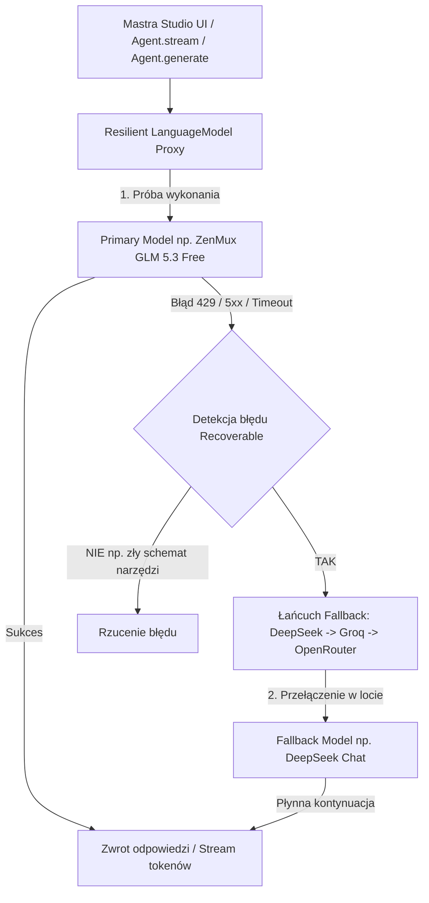

# 🛡️ Resilient Model Fallback Architecture

Dokumentacja techniczna i podręcznik implementacji mechanizmu **odpornego fallbacku modeli AI** w środowisku Mastra Agentic Environment.

---

## 1. Problem i kontekst architektoniczny

### Dlaczego tradycyjne podejście zawodziło?
W ekosystemie `@mastra/core` agenci mogą być odpytywani na dwa sposoby:
1. **`agent.generate()`** – wywołania wsadowe/blokujące (używane w zadaniach w tle, pętli orkiestratora i `delegate_task`).
2. **`agent.stream()`** – wywołania strumieniowe z parametrem `stream: true` (używane przez **Mastra Studio UI**, czat na żywo oraz Web SSE endpoints).

Gdy darmowy lub obciążony model (np. darmowy tier ZenMux, OpenRouter Free, limitowany klucz API) napotka limit **HTTP 429 Too Many Requests / Rate Limit**:
- Silnik `@mastra/core` w metodzie `stream()` **nie posiada wbudowanej pętli ponowień ani przełączania modeli**.
- Błąd `429` przerywał natychmiast strumień i rzucał wyjątek `AGENT_STREAM_FAILED`, niszcząc sesję czatu użytkownika w Studio.

---

## 2. Architektura rozwiązania: Resilient Model Proxy

Rozwiązanie działa na poziomie **AI SDK LanguageModel Layer** (poniżej Mastry i agentów). 

Każdy model zwrócony przez bramkę (Gateway) lub fabrykę modeli zostaje opakowany w lekki proxy wrapper: [`src/mastra/lib/resilient-model-wrapper.ts`](file:///projekty/mastra-agentic-environment/agentic-agents/src/mastra/lib/resilient-model-wrapper.ts).



### Kluczowe zalety:
- ✅ **100% przezroczystość dla Mastry**: Mastra widzi pojedynczy poprawny model `LanguageModelV3`, więc nie trzeba modyfikować kodu core'owego frameworka.
- ✅ **Wsparcie dla strumieniowania (`streamText` / `doStream`)**: Użytkownik w Mastra Studio nie zauważa błędu — jeśli model darmowy uderzy w limit, strumień natychmiast zaczyna płynąć z modelu zapasowego.
- ✅ **Wsparcie dla generowania (`generateText` / `doGenerate`)**: Działa identycznie dla wywołań w tle i orkiestracji.

---

## 3. Jak podpiąć Resilient Fallback do dowolnego nowego providera lub modelu?

### Krok 1: Import wrappera
W pliku swojej bramki (np. `src/mastra/lib/moj-nowy-gateway.ts`):

```typescript
import { wrapWithResilientFallback } from './resilient-model-wrapper.js';
```

### Krok 2: Opakowanie zwracanego modelu w metodzie `resolveLanguageModel`

Standardowa implementacja bramki Mastra zwraca model z dostawcy (np. OpenAI, Anthropic, Google, `@ai-sdk/openai-compatible`):

```typescript
export class MyCustomGateway extends MastraModelGateway {
  // ...
  async resolveLanguageModel({ modelId, providerId }: { modelId: string; providerId: string }): Promise<GatewayLanguageModel> {
    const apiKey = process.env.MY_PROVIDER_API_KEY;
    
    const providerConfig = createOpenAICompatible({
      name: `my-provider-${providerId}`,
      baseURL: 'https://api.myprovider.com/v1',
      headers: { Authorization: `Bearer ${apiKey}` },
    });

    // 1. Tworzymy bazowy model
    const baseModel = providerConfig.chatModel(`${providerId}/${modelId}`);

    // 2. Opakowujemy go w Resilient Fallback przed zwróceniem do Mastry
    return wrapWithResilientFallback(baseModel, {
      modelName: `${providerId}/${modelId}`,
      providerName: 'MyProvider',
    }) as unknown as GatewayLanguageModel;
  }
}
```

---

## 4. Jak dodać własny, niestandardowy łańcuch fallbacków?

Plik [`src/mastra/lib/resilient-model-wrapper.ts`](file:///projekty/mastra-agentic-environment/agentic-agents/src/mastra/lib/resilient-model-wrapper.ts) zawiera funkcję `getAvailableFallbackModels()`. 

Domyślna kolejność ratunkowa w systemie:
1. **DeepSeek Chat (V4 Pro)** – wysoka jakość, obsługa myślenia/rozumowania, niski koszt (`DEEPSEEK_API_KEY`).
2. **Groq Cloud (GPT-OSS 120B)** – produkcyjny model na szybkim LPU (`GROQ_API_KEY`).
3. **OpenRouter (Gemini 2.5 Flash)** – wysoka stabilność Google (`OPENROUTER_API_KEY`).

### Rozszerzenie listy o nowego providera zapasowego:
Jeśli chcesz dodać np. lokalną Ollamę lub Cerebras jako kolejny poziom fallbacku, dodaj go do `getAvailableFallbackModels()`:

```typescript
// Przykład dodania lokalnej Ollamy jako ostatecznego koła ratunkowego:
try {
  const ollamaProvider = createOpenAICompatible({
    name: 'ollama-local',
    baseURL: 'http://localhost:11434/v1',
  });
  fallbacks.push({
    name: 'Local Ollama Qwen 2.5',
    model: ollamaProvider.chatModel('qwen2.5:14b'),
  });
} catch (e) {
  // ignore
}
```

---

## 5. Jak użyć Resilient Model bezpośrednio w agencie bez Gatewaya?

Jeśli tworzysz agenta Mastra ręcznie i chcesz mu przypisać pojedynczy odporny model:

```typescript
import { Agent } from '@mastra/core/agent';
import { createOpenAICompatible } from '@ai-sdk/openai-compatible';
import { wrapWithResilientFallback } from '../lib/resilient-model-wrapper.js';

const rawModel = createOpenAICompatible({
  name: 'free-provider',
  baseURL: 'https://api.free-llm.com/v1',
  headers: { Authorization: `Bearer ${process.env.FREE_API_KEY}` },
}).chatModel('super-free-model');

// Opakowujemy model:
const safeModel = wrapWithResilientFallback(rawModel, {
  modelName: 'super-free-model',
  providerName: 'FreeLLM',
});

export const myAgent = new Agent({
  id: 'my-agent',
  name: 'My Agent',
  model: safeModel as any, // Bezpieczny dla stream() i generate()!
  instructions: '...',
});
```

---

## 6. Co kwalifikuje się jako błąd do fallbacku (`isRecoverableModelError`)?

Wrapper automatycznie odróżnia błędy tymczasowe providera od błędów aplikacji:

| Typ błędu | Kod / Komunikat | Czy uruchamia Fallback? | Uzasadnienie |
| :--- | :--- | :---: | :--- |
| **Rate Limit / Quota** | `429`, `usage limit`, `quota exceeded` | **TAK** | Model darmowy wyczerpał limit tokenów/minutę |
| **Przeciążenie serwera** | `500`, `502`, `503`, `504` | **TAK** | Serwer providera chwilowo nie odpowiada |
| **Timeout / Sieć** | `408`, `ETIMEDOUT`, `fetch failed` | **TAK** | Połączenie zostało zerwane |
| **Błąd autoryzacji** | `401 Unauthorized` | **NIE** | Zły klucz API wymaga poprawy w `.env` |
| **Zły schemat narzędzia**| `Invalid JSON schema`, `validation` | **NIE** | Błąd w kodzie narzędzia, inny model też by poległ |

---

## 7. Weryfikacja i testowanie działania

Aby przetestować, czy fallback działa prawidłowo przy uderzeniu w limit:

```bash
# Uruchomienie skryptu testującego zapytanie generate oraz stream:
npx tsx -e "
import 'dotenv/config';
import { ZenMuxGateway } from './src/mastra/lib/zenmux-gateway.js';
import { streamText } from 'ai';

async function run() {
  const gw = new ZenMuxGateway();
  const model = await gw.resolveLanguageModel({ modelId: 'glm-5.3-free', providerId: 'z-ai', apiKey: process.env.ZENMUX_API_KEY });
  const result = streamText({ model: model as any, prompt: 'Napisz jedno zdanie testowe.' });
  for await (const chunk of result.textStream) process.stdout.write(chunk);
}
run();
"
```

W logach pojawi się informacja o przełączeniu:
```text
[ResilientGateway] ⚠️ Primary model "z-ai/glm-5.3-free" stream failed (...). Activating fallback chain for doStream...
[ResilientGateway] 🔄 Trying stream fallback: DeepSeek Chat (V4 Pro)...
[ResilientGateway] ✅ Fallback DeepSeek Chat (V4 Pro) successfully opened stream.
```
