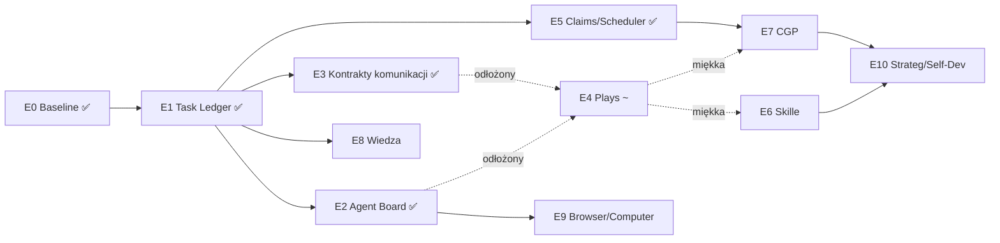

# MASTER PLAN — od obecnego stanu do Systemu Idealnego

> Plan wykonawczy dla blueprintu z `ideas/IDEALSYSTEMBLUEPRINT.md`.
> Zawiera: projekt komunikacji agentów, Tablicę Agentów (Agent Board), szablon idealnego promptu meta,
> silnik sekwencyjnych orkiestracji (Plays) oraz 10 etapów implementacji rozbitych do poziomu plików.
>
> Zasada nadrzędna: **nie przepisujemy — dokańczamy.** Każdy element planu wskazuje istniejący kod, na którym budujemy.

---

## Spis treści

## Postęp wykonania

> Odznaczamy po spełnieniu exit criteria etapu (branch + testy + wpis w `docs/BASELINE.md`).

- [x] **Etap 0 — Baseline i rusztowanie** — ✅ 2026-07-20, branch `feat/ideal-system-etap-0-baseline`; `npm run baseline:metrics` → `reports/baseline/`, przegląd checków w `docs/BASELINE.md`
- [x] **Etap 1 — Task Ledger + protokół tury Meta-Front** — ✅ 2026-07-20, branch `feat/ideal-system-etap-1-task-ledger`; `services/task-ledger.ts` + adaptery 4 pisarzy + toole `ledger_status`/`ledger_control` + Turn protocol w prompcie meta + push n8n→Telegram (zweryfikowany); testy `check:ledger-lifecycle`, `e2e:ledger-three-lanes`, brama `check:all`; docs: `docs/TASK-LEDGER.md`. Świadomie odroczone do E5: scheduler claims, twarda pauza/preempcja, egzekwowanie kill switch
- [x] **Etap 2 — Agent Board** — ✅ 2026-07-20, branch `feat/ideal-system-etap-2-agent-board`; `config/agent-board.ts` (17 kart) + generator (`build:agent-board`: Mongo `agent_board` + `_generated/roster.md` + enum `AGENT_BOARD_IDS`) + toole `agent_board_list`/`agent_board_get` u meta i 7 orkiestratorów + include w prompt-loaderze + cron refresh pn 07:30; statyczny balast promptu **−28,8%** (41,5k → 29,5k zn.); strażnicy: `check:agent-board-sync`, `check:meta-prompt-size`; docs: `docs/AGENT-BOARD.md`. Metryka live tokeny/turę do potwierdzenia po ruchu
- [x] **Etap 3 — Kontrakty komunikacji (TaskBrief v2 + Artifact Store)** — ✅ 2026-07-20, branch `feat/ideal-system-etap-3-communication-contracts`; `config/artifact-types.ts` + `services/artifact-store.ts` (mongo/file split, TTL 90d) + toole `artifact_put/get/list` u meta+orkiestratorów+ekspertów; TaskBrief v2 (`inputs[].artifactId`, `outputContract.artifactType`, `laneId`, `claims[]`, budżet/deadline) + `renderWorkerBriefWithArtifacts`; `services/result-envelope.ts` (fenced/bare/fallback) wpięty w delegate-task (status degraduje success); snippet `prompts/shared/result-envelope.md`; `plan-task.out: ArtifactType`; flaga `FEATURE_COMM_CONTRACTS`. Handoff **−99,2%** payloadu; testy `check:result-envelope-parse`, `e2e:artifact-handoff`; docs `docs/COMMUNICATION-CONTRACTS.md`. `claims[]` schedulowane w E5
- [~] **Etap 4 — Plays + play-runner — ODŁOŻONY** (decyzja 2026-07-20). Powód: meta już dobrze sekwencjonuje zadania (zweryfikowane w testach użytkownika), a fundamenty E1–E3 (Ledger + Agent Board + TaskBrief v2/artefakty/envelope) wystarczają do ręcznego komponowania sekwencji. Realna strata = brak **bramek jakości** między krokami (scorer-musi-przejść) i powtarzalnych nazwanych jednostek. Zależność E4→E7 jest **miękka**: build-pipeline CGP stoi na istniejącym autohealu (promote/rollback) + coding-harness + `check:*`, nie wymaga generycznego play-runnera. Wracamy do E4 **tylko jeśli track record (Agent Board) pokaże, że improwizowane sekwencje meta się psują** — decyzja sterowana danymi, nie na zapas. Nic w E1–E3 nie odwołuje się do Plays (zweryfikowane grepem).
- [x] **Etap 5 — Claims, scheduler, idempotencja** — ✅ 2026-07-20, branch `feat/ideal-system-etap-5-claims-scheduler`; `services/task-ledger-scheduler.ts` (lease/lock w `claim_locks`, `claimsOverlap` exact+glob, `acquireClaims`/`waitAndAcquireClaims`/`releaseClaims`, TTL + zwolnienie przy terminalu/stale); egzekwowanie REALNE na bramce `queued→running` w automation-job (claim `n8n:workflow:<id>` auto-derywowany) + kill switch wstrzymuje start; `services/idempotency.ts` (`withIdempotency`, content-hash/jawny klucz, cache tylko sukcesu) wpięty w n8n_trigger, gmail create+send, crm add_interaction; `ledger_status` pokazuje ACTIVE CLAIMS; flagi `FEATURE_LEDGER_SCHEDULER`/`FEATURE_IDEMPOTENCY`. Testy `check:ledger-claims-conflict`, `check:idempotency-replay`; docs `docs/CLAIMS-SCHEDULER.md`. Preempcja fire-and-forget (async-delegation/background-task) → dalszy rework egzekutora
- [x] **Etap 6 — Skill Distillation + Kurator + cykl nocny** — ✅ 2026-07-20, branch `feat/ideal-system-etap-6-skill-distillation`; `services/skill-distiller.ts` (trigger ≥5 tool calli/recovery/korekta → `distillation_candidates`, destylacja przez wstrzykiwalny `SkillWriter`, mini-eval bramka jakości+sekrety, aktywacja→`_skills/auto` / kwarantanna→`_skills/quarantine`); `services/skill-stats.ts` (Mongo liczniki view/use/success + Kurator: stale 30d→archive 90d→repair); `scripts/skill-nightly-cycle.ts` + cron (03:00 destylacja na lokalnym modelu, ndz 04:00 curator, raport do Ledgera); trigger na `envelope.lessons` w delegate-task; loader pomija `quarantine`/`archive` (jedyna zmiana). Flaga `FEATURE_SKILL_DISTILLATION`. Testy `check:skill-distill-roundtrip`, `check:curator-lifecycle`; docs `docs/SKILL-DISTILLATION.md`. Metryki live (≥25% taniej, ≥10 skilli) po ruchu
- [x] **Etap 7 — Capability Gap Protocol v1 + capabilitySmith** — ✅ 2026-07-22, branch `fix/delegation-depth-hardening` (wspólny dla planu); `services/capability-registry.ts` (Mongo `capabilities` + maszyna stanów + `capability_gaps`), `tools/system/mcp-discover.ts` (oficjalny MCP Registry REST, federuje Smithery), `services/capability-sandbox.ts` (**`env -i` + mocki sekretów** + smoke test), `services/capability-attach.ts` (bramka approval, dedykowane klienty, reattach na starcie), 5 tooli CGP, agent `capabilitySmith` + `prompts/capability/base.md` + karta w Agent Board, hook `detectCapabilityGap` w harnessie. Testy: `check:cgp-sandbox-isolation` (9 asercji — sekrety NIE wyciekają), `e2e:cgp-discover-attach` (7 asercji, **prawdziwy serwer MCP**: gap→sandbox→approval→attach→invoke). Docs `docs/CAPABILITY-GAP-PROTOCOL.md`. Testy wykryły i naprawiły 2 realne błędy (PATH sandboxa na nvm, kształt argumentów MCP). Ścieżka npx zweryfikowana na żywo na prawdziwym pakiecie (`@modelcontextprotocol/server-everything` → 14 tooli w sandboxie). **⚠️ NIEDOKOŃCZONE ze specyfikacji E7 (~85%): (a) BRAK allowlisty domen/proxy w sandboxie — plan wymienia ją wprost; dziś izolacja to env-scrub+mocki+timeout, nieznany serwer MOŻE wyjść do sieci (widzi tylko mocki); (b) ścieżka BUILD (spec→codingAgent→check:*→canary→promote) jest tylko OPISANA w prompcie capabilitySmitha, brak kodu spinającego i testu; (c) e2e używa lokalnego fixture'a zamiast pełnego discover→sandbox z sieci (świadome dla offline CI)**
- [ ] Etap 8 — Wiedza: Serena + snapshot + Graphiti
- [ ] Etap 9 — browserAgent + computerAgent
- [ ] Etap 10 — Strateg + Self-Dev + poziomy autonomii

---

## CO ZOSTAŁO DO ZROBIENIA (stan 2026-07-22)

> Skonsolidowana lista wszystkich zaległości. Kolejność = moja rekomendacja.

### A. Domknięcie E7 (CGP) — ~85% zrobione

1. ~~**Ścieżka BUILD**~~ — ✅ ZROBIONE 2026-07-22 (`bc33bae`). `services/capability-build.ts`
   + toole `capability_build` / `capability_build_status` + `check:capability-build-gates`
   (15 asercji na ODMOWACH, wszystkie wykonawcze wstrzykiwane). **Zweryfikowane na żywo**:
   zielona bramka → realny merge → `built`/`shadow` + luka `resolved`; celowy błąd typu →
   bramka czerwona, HEAD nietknięty; finalny przebieg poprowadził sam capabilitySmith
   przez serwer. Live wykrył blocker niewidoczny dla testu jednostkowego: świeży worktree
   nie ma `node_modules`, więc `npx tsc` tam padał — psuło to także istniejący
   `coding_run_test` (fix: symlink w `initWorktreeTool`).
   **Świadome ograniczenia:** delegacja do codingAgenta zostaje POZA pipeline'em (smith
   deleguje sam i podaje gałąź), promote nieprzetestowany e2e.
2. **Allowlist domen / proxy w sandboxie** — plan wymienia wprost; dziś izolacja to
   env-scrub + mocki + timeout. Nieznany serwer MCP **może wyjść do sieci** (widzi tylko
   mocki, więc ryzyko ograniczone). Wymaga jaila sieciowego (netns/`unshare` albo
   wymuszony HTTP proxy z whitelistą) — osobny, świadomy kawałek pracy.
3. **e2e z prawdziwym `discover`** — dziś e2e używa lokalnego fixture'a (offline CI).
   Ścieżka npx zweryfikowana ręcznie (`@modelcontextprotocol/server-everything` → 14
   narzędzi w sandboxie), ale nie ma tego w bramie. Opcjonalne: test „live" za flagą.

### B. Domknięcie E8 (Wiedza/Graphify) — ~90% zrobione

4. **`check:coding-token-budget`** — metryka wyjścia E8: zadanie kodowe wzorcowe musi
   zamknąć się w <50% tokenów wejściowych vs baseline. Dziś zmierzone tylko `affected`
   w izolacji (−97% na jednym zapytaniu), brak dowodu na całym zadaniu.
5. (opcjonalnie) Serena / Graphiti — **świadomie odroczone**; wracają tylko jeśli dane
   pokażą lukę (precyzja edycji symboli / fakty temporalne).

### C. Znane luki z wcześniejszych etapów (drobne, zanotowane)

6. **`sheets_append_rows` bez idempotencji** (E5) — retry dubluje wiersze; wpięcie ~5 min
   wzorcem `withIdempotency` jak w `crm_add_interaction`.
7. **Claims egzekwowane tylko na bramce automation-job** (E5) — lane'y fire-and-forget
   (hunt/content/chef) mają claims zapisane i widoczne, ale nie wstrzymują pracy;
   idempotencja i tak chroni sam zapis. Pełne wstrzymanie = rework egzekutora.
8. **E6.1: `skill_manage(patch/edit)`** — Hermes pozwala agentowi poprawiać własny skill
   w locie; my mamy tylko background-create. Świadomie odłożone do czasu, aż dane
   (skill_stats) pokażą, że auto-skille wymagają poprawek.

### D. Pozostałe etapy planu

9. **E9 — browserAgent + computerAgent**. Nietknięte w kodzie. ⚠️ **Rozeznanie
   2026-07-22 unieważnia połowę doboru narzędzi: `bytebot-ai/bytebot` jest
   ZARCHIWIZOWANY** (read-only od ~marca 2026, ostatni commit 2025-09-12), więc
   computerAgent nie ma dziś podstawy. Stagehand żyje (TS, MIT, 23,6k ⭐, push codziennie),
   browser-use też (Python, 106k ⭐). Rekomendacja: **browserAgent na Stagehandzie**
   (ten sam stack co Mastra, wpina się jako biblioteka zamiast sidecara) **+ P6
   `image_extract`** w tym samym kawałku pracy. Dla computerAgenta decyzja przed nami:
   fork Bytebota na ostatnim tagu / `trycua/cua` (20,5k ⭐, MIT, aktywny) / odłożenie —
   exit criteria E9 dla huntu dotyczy wyłącznie przeglądarki.
10. **E10 — Strateg + Self-Dev + poziomy autonomii** (finał; odblokowany przez E7).
    Uwaga: tier `shadow` już zapisujemy przy każdej nowej zdolności — E10 dokłada
    automatyczną promocję `shadow→propose→auto` wg track recordu.
11. **E4 — Plays** — odłożony warunkowo; wraca tylko, gdy track record pokaże, że
    improwizowane sekwencje meta wymagają bramek.

### E. Operacyjne (nie kod) — ✅ WYCZYSZCZONE 2026-07-22

12. ~~**Restart serwera Mastra**~~ — ✅ zrobiony; proces na :4111 biega na aktualnym
    kodzie (potwierdzone: `capability-smith` na liście 29 agentów).
13. ~~**Instalacja Graphify u operatora**~~ — ✅ zweryfikowane: `~/.venvs/graphify`
    istnieje, `GRAPHIFY_BIN` jest w `.env`, `graphify-out/manifest.json` zbudowany.
14. ~~**3 pre-existing błędy `tsc`**~~ — ✅ naprawione (commit `b3b9e3d`). Przyczyny:
    `$unset` typowany `Record<string, string>` zamiast `true | '' | 1`; schemat
    rekurencyjny `nextStep` z adnotacją `z.ZodTypeAny` (pod zod 4 wnioskuje `unknown`);
    sygnatura `execute` rozjechana z `z.infer`, bo Mastra wyprowadza typ wejścia
    z kształtu JSON-schema. **`npm run typecheck` = 0 błędów**, `check:all` zielone.
    Przy okazji: `nextStep` jest teraz parsowany schematem zamiast przekazywany bez
    walidacji, a `check:filmmaker-domain` przepięty na pliki, do których refaktor
    attachmentów przeniósł niezmienniki.

### F. Stan repozytorium (2026-07-22)

Cała praca E0–E8 + P1–P5 + attachments jest w `master` i na GitHubie
(`turboMe/AI-Agentic-System`). Wcześniej master stał na commicie z 23 czerwca, a etapy
leżały na osobnych gałęziach. Zdalnie została **tylko `origin/master`**; zmergowane
gałęzie skasowane, tag powrotny `backup/pre-sync-2026-07-22`. Nowe etapy odgałęziać
od `master`.

### G. Zidentyfikowane poza planem (osobne prace)

- **Audyt limitów czasu** (`ideas/timeouts-audit.md`) — `@mastra/deployer` narzuca 180 s
  twardego 504 na każdy request HTTP do :4111, przez co budżety 300/600/1200 s są
  nieosiągalne po nie-streamingowym HTTP. Dotyka E7-BUILD wprost (build trwa dłużej).
  Decyzja: osobny wątek pracy nad ustrukturyzowaniem limitów, nie w ramach etapu.
- **P6 `image_extract`** (VLM dla stron oddających treść tylko w obrazkach) — ten sam
  problem klasy co E9, więc do zrobienia **razem z browserAgentem**, nie osobno.
- **P7 odzysk researchu Finnssona** — czynność operacyjna, niezależna od etapów.

---

## E7-BUILD — specyfikacja ścieżki BUILD (oparta na kodzie, 2026-07-22)

> Do implementacji. Rozpoznanie wykonane: wszystkie klocki ISTNIEJĄ, brakuje **kleju**.
> Plan mówi „CGP tylko skleja te klocki" — poniżej dokładnie które i jak.

### Klocki, które już mamy (zweryfikowane w kodzie)

| Klocek | Gdzie | Fakt z kodu |
|---|---|---|
| Worktree per zadanie | `tools/dev/code-worktree.ts` → `initWorktreeTool` | tworzy `<parent>/agentic-agents-worktrees/<taskId>`, `git worktree add … -b <branch>`, **kopiuje `.env`** do worktree |
| Izolacja zapisu | `workspaces/code-workspace.ts` → `getWorkspacePathForWrite(taskId)` | **rzuca**, gdy brak worktree → agent nigdy nie pisze do live repo |
| Uruchamianie testów | `tools/dev/code-task-artifacts.ts` → `coding_run_test` | `cwd = getWorkspacePath(taskId)` → **testy lecą w worktree**, nie w root (opis toola mówi inaczej — nieaktualny) |
| ⚠️ Allowlist komend | tamże, `ALLOWED_PREFIXES` | `npx tsc`, `npm test`, `npm run test/lint/build`, … — **NIE zawiera `npm run check:*`** → nasza brama jakości jest dziś nieosiągalna dla agenta |
| Delegacja async | `tools/system/delegate-task.ts` (`async:true`) → `services/async-delegation.ts` → `generateCoding` | lane w Ledgerze (E1), wynik przez pending updates |
| Budowa kandydata | `scripts/autoheal/build-candidate.sh <ref> <slot>` | `git archive` do slotu, zachowuje `node_modules` + `.env` |
| Weryfikacja health | `scripts/autoheal/verify-candidate.sh <port> [timeout]` | czeka na health kandydata |
| Przełączenie | `scripts/autoheal/promote-candidate.sh <slot-a\|slot-b>` | zatrzymuje live, startuje kandydata na LIVE_PORT |
| Canary | `scripts/autoheal/canary-watch.sh <port> [s]` | okno obserwacji po przełączeniu |
| Rollback | `scripts/autoheal/rollback-to-stable.sh` | z katalogu backupu, idempotentne |
| Zapis stanu | `scripts/autoheal/mark-promoted.sh <commit> [slot]` → `services/autoheal-state.ts` | `stableCommit`, `activeSlot`, `lastPromotedAt` |
| Sloty | `deploy.config.json` | A = live (`agentic-agents`, :4111), B = staging (`agentic-agents-staging`, :4222) |
| Blocker bundla | — | **ROZWIĄZANY 2026-06-08** (FREE `require()` + TLA); promote/canary odblokowane |

### Projekt: `services/capability-build.ts` → `runCapabilityBuild()`

```ts
runCapabilityBuild(input: {
  gapId?: string;                 // luka z capability_gaps
  specArtifactId: string;         // artefakt action_plan od capabilitySmitha
  buildId?: string;               // = taskId dla worktree (domyślnie `build-<uuid>`)
  autoPromote?: boolean;          // domyślnie FALSE — promote wymaga approvala
}): Promise<BuildReport>
```

**Kroki (każdy = milestone w lane Ledgera):**

1. **SPEC GATE** — pobierz artefakt (`artifact_get`), zwaliduj minimum: cel, kontrakt
   we/wy, punkt integracji (który agent dostaje narzędzie), plan testu (jaki `check:*`
   powstanie). Brak któregoś → `blocked_needs_approval` z pytaniem do człowieka.
2. **LANE + CLAIMS** — `openLane({ source:'manual', goal:'capability build …',
   claims:['repo:src/mastra/**'] })` (E1+E5) → dwa buildy nie wchodzą sobie w kod;
   `waitAndAcquireClaims` przed startem.
3. **DELEGACJA** — `delegate_task(codingAgent, async:true, taskSpec:{ inputs:[{artifactId:
   specArtifactId}], outputContract:{ artifactType:'diff_patch' }, laneId })` (TaskBrief v2
   z E3 → spec idzie referencją, nie wklejką). codingAgent robi `initWorktreeTool` i pisze
   WYŁĄCZNIE w worktree.
4. **BRAMKA JAKOŚCI (w worktree)** — po zakończeniu delegacji uruchom w katalogu worktree:
   `npx tsc --noEmit` **oraz** `npm run check:all`. **Wymagana zmiana:** dopisać
   `'npm run check'` do `ALLOWED_PREFIXES` w `code-task-artifacts.ts`, inaczej agent nie
   ma jak odpalić naszej bramy. Fail → lane `failed`, artefakt `review_report` z logiem,
   BEZ promote.
5. **MERGE** — dopiero po zielonej bramce: `git merge --no-ff <branch worktree>` do gałęzi
   roboczej; konflikt → `blocked_needs_approval`.
6. **PROMOTE (opcjonalny, za approvalem)** — sekwencja istniejących skryptów:
   `build-candidate.sh <commit> slot-b` → `verify-candidate.sh 4222` →
   `promote-candidate.sh slot-b` → `canary-watch.sh 4111 <okno>` →
   sukces: `mark-promoted.sh <commit> slot-b`; porażka canary: `rollback-to-stable.sh`.
   **Zawsze przez `system_request_approval`** — promote zmienia to, co biegnie na :4111.
7. **ZAPIS** — wpis w Capability Registry (`source:'manual'`, tier `shadow`), zamknięcie
   `capability_gaps` (`resolved`), `recordDistillationCandidate` (E6) → z udanego buildu
   powstanie auto-skill „jak używać tej zdolności".

### Testy do napisania

- `check:capability-build-gates` (deterministyczny, bez LLM): spec bez planu testu →
  odrzucony; czerwona brama → brak merge i brak promote; konflikt merge → `blocked`;
  promote bez approvala → odmowa. Wstrzykiwalne wykonawcze (jak `SkillWriter` w E6),
  żeby nie odpalać realnego codingAgenta ani slotów.
- `e2e:capability-build-happy-path` (opcjonalnie, ciężki): trywialna zdolność (np. tool
  zwracający stałą) → worktree → zielona brama → merge → **bez** promote.

### Ryzyka / decyzje do podjęcia

- **Allowlist testów** (punkt 4) — bez `npm run check` cała bramka jest fikcją. To
  pierwsza zmiana do zrobienia.
- **Promote domyślnie WYŁĄCZONY** (`autoPromote:false`) — E7 kończy się na „zbudowane,
  zweryfikowane, zmergowane"; przełączanie live zostawiamy człowiekowi/E10.
- **Kto woła `runCapabilityBuild`** — v1: capabilitySmith przez nowy tool
  `capability_build(specArtifactId)`; nie automat z `capability_gap` (za wcześnie na
  pełną autonomię, tier `shadow`).

---

- [Część A — Projekty fundamentów](#część-a--projekty-fundamentów)
  - [A1. Tablica Agentów (Agent Board)](#a1-tablica-agentów-agent-board)
  - [A2. System komunikacji agentów (4 warstwy)](#a2-system-komunikacji-agentów)
  - [A3. Prompt idealny dla meta (v4)](#a3-prompt-idealny-dla-meta-v4)
  - [A4. Plays — sekwencyjne orkiestracje](#a4-plays--silnik-sekwencyjnych-orkiestracji)
- [Część B — Etapy implementacji (0–10)](#część-b--etapy-implementacji)
- [Część C — Zasady wykonania, zależności, metryki](#część-c--zasady-wykonania)

---

# CZĘŚĆ A — PROJEKTY FUNDAMENTÓW

## A1. Tablica Agentów (Agent Board)

### Problem dzisiaj
Roster agentów żyje w **dwóch ręcznie utrzymywanych kopiach**: ~2 strony tekstu w opisie `delegate-task.ts` (linie 100–130) i sekcje w `prompts/meta/base.md`. Skutki: (1) każda tura meta płaci tokenami za pełny opis 17 agentów, (2) kopie się rozjeżdżają, (3) hardkodowany `z.enum([...])` w delegate-task trzeba ręcznie synchronizować, (4) inni agenci (chef, hunt…) nie widzą, kogo mają do pomocy.

### Projekt docelowy
Tablica = **dane, nie proza**. Trzy elementy:

**1. Karta agenta (AgentCard)** — `src/mastra/config/agent-board.ts`:

```ts
export type AgentCard = {
  id: AgentId;                      // z config/agent-ids.ts (już istnieje)
  oneLiner: string;                 // 1 zdanie — do kompaktowego rosteru
  whenToUse: string[];              // wyzwalacze ("napisz post…" → contentAgent)
  whenNotToUse: string[];           // anty-wzorce (marketingAgent NIE robi social contentu)
  inputContract: string;            // jak formułować brief (co MUSI być w taskSpec)
  outputArtifacts: ArtifactType[];  // co zwraca (research_report | action_plan | diff_patch…)
  delegation: 'sync' | 'async' | 'both';
  costClass: 'local' | 'cheap' | 'standard' | 'premium';
  latencyClass: 'seconds' | 'minutes' | 'long';
  examples: { brief: string; note: string }[];  // 1–2 few-shoty na agenta
};
```

**2. Wzbogacenie runtime (Mongo `agent_board`)** — do karty doklejane automatycznie:
- `model` — z `model-manifest.ts` (nie duplikujemy),
- `trackRecord` — success rate, śr. koszt, śr. czas z `agent-performance-report` (już liczycie te dane, Faza 7.6),
- `recentFailures` — top 3 z error-collectora.

**3. Generator + narzędzia:**
- `scripts/build-agent-board.ts` — składa karty + manifest + performance → zapis do Mongo **oraz** generuje:
  - `prompts/meta/_generated/roster.md` — kompaktowy roster (1 linia/agenta) wstrzykiwany do promptu meta,
  - enum `AgentId[]` dla delegate-task (koniec ręcznej synchronizacji).
- Nowe toole: `agent_board_list` (kompakt) i `agent_board_get(agentId)` (pełna karta + track record + przykładowe briefy).
- **Dostają je: meta ORAZ wszyscy agenci-orkiestratorzy** (chef, hunt, content, writer, filmmaker, musician, automationArchitect) — dzięki temu agenci mogą **używać siebie nawzajem**: zanim agent powie "nie umiem", sprawdza tablicę, czy nie ma kolegi od tego.
- Odświeżanie: cron tygodniowy + przy `mastra build`.

### Efekt
Prompt meta chudnie o ~1,5 strony na turę; roster nigdy nie odstaje od kodu; delegacja wybierana po **danych + track recordzie**, nie po pamięci modelu; agenci widzą się nawzajem.

---

## A2. System komunikacji agentów

Cztery warstwy, od najtwardszej do najluźniejszej. Zasada: **im ważniejszy przekaz, tym bardziej strukturalny nośnik.**

### Warstwa 1 — TaskBrief v2 (koperta delegacji)
Rozszerzenie **istniejącego** `workerTaskSpecSchema` (delegate-task już preferuje `taskSpec` nad wolny tekst — dokańczamy, nie wymyślamy):

```ts
taskSpec: {
  goal: string;                 // jest
  scope: string;                // jest
  outputContract: {             // jest → doprecyzowanie:
    artifactType: ArtifactType; //   typ artefaktu zamiast prozy
    schemaHint?: string;
  };
  successCriteria: string[];    // jest
  inputs: ArtifactRef[];        // NOWE — referencje do artefaktów, nie wklejki
  constraints: { language?; budgetUsd?; deadline? };  // NOWE
  laneId: string;               // NOWE — korelacja z Task Ledger
  claims?: string[];            // NOWE — zasoby, których zadanie dotknie (→ Etap 5)
}
```

### Warstwa 2 — Artefakty (wzorzec SOP z MetaGPT)
Agenci wymieniają **dokumenty, nie transkrypty czatu**. `services/artifact-store.ts`:
- typy: `research_report`, `action_plan`, `decision_memo`, `diff_patch`, `review_report`, `content_pack`, `lead_batch`, `menu_book_ref`, `media_ref`…
- zapis: plik w workspace (duże) lub Mongo (małe) + rekord indeksu `{ id, type, laneId, producedBy, schemaVersion, uri, summary(≤300 znaków) }`,
- toole `artifact_put` / `artifact_get` / `artifact_list(laneId)`,
- do promptu następnego agenta idzie **summary + id**, pełna treść dopiero na żądanie — to główny mechanizm oszczędzania tokenów w sekwencjach.

### Warstwa 3 — Koperta wyniku (ResultEnvelope)
Każda delegacja zwraca strukturę (dziś wynik to w większości proza):

```ts
{ status: 'ok'|'partial'|'failed'|'blocked_needs_approval',
  artifacts: ArtifactRef[],
  metrics: { costUsd, durationS, toolCalls },
  lessons: string[],        // → karma dla destylacji skilli (Etap 6)
  followup?: string }       // co agent sugeruje dalej
```

`Delegation Result Accounting` z obecnego promptu meta (sekcja ~294) mapuje się na to 1:1 — tylko że maszynowo.

### Warstwa 4 — Zdarzenia i sygnały
Istniejące `pushSignal` + `harness-events.ts` → tematy: `lane.*` (progress, milestone, blocked), `approval.*`, `agent.*`. Konsumenci: digest Meta-Front (rozszerzenie `checkPendingUpdates`), dashboard, push Telegram. Później: A2A na zewnątrz (Mastra natywnie).

### Reguły twarde
1. Handoff między agentami **zawsze** nazywa oczekiwany typ artefaktu.
2. Duże treści **nigdy** nie podróżują w briefie — tylko `ArtifactRef`.
3. Iteracja z tym samym agentem → ten sam `threadId` (mechanizm już jest w delegate-task).
4. `lessons` wypełniane obowiązkowo — to paliwo samouczenia.

---

## A3. Prompt idealny dla meta (v4)

Obecny `prompts/meta/base.md` (383 linie) ma świetne sekcje, które **zostają bez zmian**: Retry & learning loop, Strategy Reflector, Checkpoint/approval (never self-approve), Anti-hallucination, Output Self-Check, Parallel execution. Zmiany: roster → generowany, delegacja → artefaktowa, dochodzi protokół tury, kontrakt wyniku i Plays. Docelowa struktura (S = statyczne, G = generowane):

```
prompts/meta/
  base.md          (v4, sekcje S)
  _generated/
    roster.md      (G — z Agent Board)
    plays.md       (G — z config/plays.ts)
```

### Szablon v4 — sekcje nowe/zmienione (gotowe do wklejenia)

```markdown
# Jarvis Meta — Orchestrator (v4)

## Misja i kontrakt wyniku
Jesteś dyrygentem systemu, nie wykonawcą. Użytkownik podaje CELE — Ty dostarczasz WYNIKI.
Każde wejście klasyfikujesz: QUESTION (odpowiedz od razu z pamięci/wiedzy — zero delegacji),
TASK (wykonaj/deleguj, wynik w tej turze lub async), GOAL (kontrakt + praca w tle).
Wzorzec odpowiedzi przy GOAL — dokładnie trzy elementy, nigdy poradnik:
  1. "Zrozumiałem: <cel + definition of done>"
  2. "Robię: <plan / play> (lane #N, budżet X)"
  3. "Dam znać: <kiedy i przy jakim zdarzeniu>"
Gdy brakuje zdolności, NIE tłumacz użytkownikowi jak on ma to zrobić — zaproponuj, że system
sam sobie dobuduje moduł (ścieżka Capability Gap), z wyceną i pytaniem o zgodę.

## Protokół tury (w tej kolejności, zawsze)
1. `checkPendingUpdates` → digest lane'ów: co skończone / zablokowane / czeka na approval.
2. Jeśli są wyniki dla użytkownika → zreferuj je PRZED odpowiedzią na nowe pytanie.
3. Klasyfikuj nowe wejście (QUESTION/TASK/GOAL) i działaj.
4. Komendy operatora obsługuj natychmiast: status, status #N, pauza #N, anuluj #N, priorytet #N.

## Roster agentów
{{include: _generated/roster.md}}
Zanim delegujesz w nietypowym zadaniu: `agent_board_get(agentId)` → pełna karta z kontraktem
wejścia, przykładowymi briefami i track recordem. Wybieraj po danych, nie z pamięci.

## Protokół delegacji
- ZAWSZE `taskSpec` (goal, scope, outputContract.artifactType, successCriteria, inputs[]).
- Duże treści przekazuj jako ArtifactRef — nigdy wklejką.
- Wynik czytasz z ResultEnvelope: status + artifacts + lessons. `partial`/`failed` → pętla retry
  (sekcja Retry & learning loop). `blocked_needs_approval` → przekaż pytanie użytkownikowi
  (nigdy nie zatwierdzaj sam).
- Zadania niezależne → deleguj RÓWNOLEGLE w jednej turze. Zależne → Play albo sekwencja ręczna.
- Iteracja z tym samym agentem → utrzymuj threadId.

## Plays — sekwencje wieloagentowe
{{include: _generated/plays.md}}
Gdy cel pasuje do Play — użyj go (`play_run`), zamiast improwizować sekwencję.
Możesz adaptować: pominąć krok (zapisz powód) lub dodać krok. Gdy żaden Play nie pasuje,
komponujesz sekwencję sam wg wzorca: ZBADAJ (researcher/knowledge) → ZAPLANUJ (plan_task)
→ SKONFRONTUJ (deliberation, gdy decyzja architektoniczna/ryzykowna) → WYKONAJ (ekspert
domenowy) → ZWERYFIKUJ (review/scorer) → RAPORTUJ. Między krokami przekazuj artefakty po ID.
```

### Przykładowa linia generowanego rosteru (format)

```
- researcherAgent · research_report · async · cheap · deep web research (PSEV): pełne strony,
  triangulacja źródeł | użyj: recon menu/reputacji, fakty z realnych stron | nie używaj: proste
  lookupy (searchWeb sam) | track: 92% ok, ~$0.11, ~4 min
```

---

## A4. Plays — silnik sekwencyjnych orkiestracji

Odpowiedź na: *"najpierw researcher, na podstawie tego plan, potem deliberation, na koniec coding"*. Play = nazwana, typowana sekwencja kroków z bramkami jakości, wykonywana jako lane na Task Ledgerze. Pozycja w stacku: **workflow Mastra** (sztywne rails, deterministyczne) < **Play** (sekwencja adaptowalna przez LLM, z bramkami) < **wolna orkiestracja** (meta improwizuje).

`src/mastra/config/plays.ts`:

```ts
export const plays: Record<string, Play> = {
  BUILD_MODULE: {                       // dokładnie sekwencja z Twojego pytania
    description: 'Research → plan → deliberacja → implementacja → review → werdykt',
    steps: [
      { id: 'research',  agent: 'researcherAgent',   out: 'research_report',
        gate: { scorer: 'sources-triangulated' } },
      { id: 'plan',      tool: 'system_plan_task',    in: ['research'], out: 'action_plan' },
      { id: 'challenge', agent: 'deliberationAgent',  in: ['research','plan'], out: 'decision_memo',
        gate: { scorer: 'decision-quality' },
        skipWhen: 'plan trywialny i odwracalny' },
      { id: 'build',     agent: 'codingAgent',        in: ['plan','challenge'], out: 'diff_patch',
        async: true },
      { id: 'review',    agent: 'codeReviewAgent',    in: ['build'], out: 'review_report',
        gate: { mustPass: true } },
      { id: 'verify',    tool: 'run_checks',          in: ['build'], out: 'review_report' },
    ],
    onFail: { retriesPerStep: 2, then: 'replan', escalateAfter: 2 },
  },
  RESEARCH_BRIEF:  { /* researcher ∥ knowledge → synteza → decision_memo */ },
  HUNT_CAMPAIGN:   { /* hunt → (approval) → CRM/Gmail draft — formalizacja obecnego huntAgent */ },
  CONTENT_WEEK:    { /* RSS+strategy → content → (approval) → publikacja */ },
};
```

`services/play-runner.ts` — wykonawca: iteruje kroki na lane, dla każdego składa TaskBrief v2 z artefaktów poprzednich kroków (summary+ref), uruchamia bramki (scorery — **macie już goal-completion scorer i infrastrukturę scorerów**), decyduje retry/replan/escalate wg `onFail`, pisze heartbeat i milestones do Ledgera. Meta dostaje tool `play_run(playId, contract)` + `play_status(laneId)`.

Bramki między krokami to nowość kulturowa: **artefakt przechodzi dalej tylko, gdy scorer/check go przepuści** — to zamienia "sekwencję nadziei" w linię produkcyjną.

---

# CZĘŚĆ B — ETAPY IMPLEMENTACJI

Konwencja każdego etapu: **Cel → Prace (pliki) → Testy → Exit criteria → Ryzyka.** Czasy przy założeniu obecnego tempa (Ty + Claude Code / codingAgent). Od Etapu 6 system zaczyna budować sam siebie (dogfooding CGP).

### Etap 0 — Baseline i rusztowanie *(2–3 dni)*
**Cel:** zamrozić obecne zachowanie, żeby każda zmiana była mierzalna.
**Prace:** skrypt `scripts/baseline-metrics.ts` (tokeny/turę meta, koszt/zadanie z budget-trackera, czasy delegacji z performance-report → JSON do `reports/baseline/`); przegląd i uruchomienie wszystkich `check:*` + `e2e:*` — lista zielonych do `docs/BASELINE.md`.
**Exit:** baseline commitnięty; wszystkie obecne checki zielone albo opisane jako known-failing.
**Ryzyko:** żadne — etap czysto odczytowy.

### Etap 1 — Task Ledger + protokół tury Meta-Front *(tydz. 1–2)*
**Cel:** jedno źródło prawdy o pracy systemu; czat responsywny przy wielu orkiestracjach.
**Prace:**
- NOWY `services/task-ledger.ts` — kolekcja `task_ledger` (schemat z blueprintu §3.2: state machine `queued→running→blocked/awaiting_approval→done/failed`, budżet, heartbeat, milestones, plans[]).
- Wpięcie zapisu: `async-delegation.ts`, `background-task-manager.ts`, `automation-job-manager.ts`, cron-runner — każdy start/koniec/heartbeat pisze do Ledgera (adapter, bez zmiany ich logiki).
- `pendingUpdatesProcessor` + `checkPendingUpdates` → czytają digest z Ledgera (dziś: rozproszone źródła).
- NOWE toole `tools/system/ledger-tools.ts`: `ledger_status(laneId?)`, `ledger_control(action: pause|resume|cancel|priority)`.
- Prompt meta: sekcja "Protokół tury" (szablon w A3).
- Push: n8n webhook → Telegram na `blocked|awaiting_approval|done` (macie n8n + cloudflared).
**Testy:** `check:ledger-lifecycle` (przejścia stanów), `e2e:ledger-three-lanes` (3 async delegacje + rozmowa w trakcie + poprawny digest).
**Exit:** 3 lane'y w tle, czat płynny, `status` pokazuje prawdę, push przychodzi na telefon.
**Ryzyka:** podwójne źródła statusu w okresie przejściowym → feature flag `LEDGER_V1` w `config/harness-flags.ts` (macie mechanizm flag).

### Etap 2 — Agent Board *(tydz. 2–3)*
**Cel:** tablica agentów wg A1; prompt meta chudnie; agenci widzą się nawzajem.
**Prace:**
- NOWY `config/agent-board.ts` — 17 kart (treść przenosimy z opisu delegate-task — ona już jest dobra, tylko żyje w złym miejscu).
- NOWY `scripts/build-agent-board.ts` (generator: Mongo + `_generated/roster.md` + enum).
- NOWE toole `agent_board_list` / `agent_board_get` + rejestracja u meta i orkiestratorów domenowych.
- `delegate-task.ts`: enum z generatora; opis chudnie do 10 linii (roster wynosi się do tablicy).
- `prompts/meta/base.md`: sekcja Roster → `{{include}}` generowanego pliku (rozbudowa `prompt-loader.js` o include, jeśli brak).
- Cron refresh (tygodniowy) w cron-runner.
**Testy:** `check:agent-board-sync` (karta ↔ zarejestrowani agenci w index.ts — fail przy dryfie), `check:meta-prompt-size` (limit tokenów promptu — pilnuje, żeby nigdy nie spuchł z powrotem).
**Exit:** tokeny/turę meta spadają ≥25% vs baseline; `agent_board_get('researcherAgent')` zwraca kartę z track recordem.
**Ryzyka:** utrata jakości doboru agenta po skróceniu rosteru → few-shoty w kartach + `agent_board_get` na żądanie.

### Etap 3 — Kontrakty komunikacji (TaskBrief v2 + Artifact Store) *(tydz. 3–4)*
**Cel:** komunikacja wg A2 — artefakty zamiast wklejek, koperta wyniku.
**Prace:**
- NOWY `services/artifact-store.ts` + toole `artifact_put/get/list`; typy artefaktów w `config/artifact-types.ts`.
- `delegate-task.ts`: taskSpec + `inputs: ArtifactRef[]`, `laneId`; render briefu = summary artefaktów + ref.
- ResultEnvelope: wynik delegacji parsowany do koperty (`services/result-envelope.ts`); fallback dla prozy (starzy agenci) — envelope z `status: ok, artifacts: [], raw: text`, żeby migracja była stopniowa.
- Prompty agentów-ekspertów: instrukcja "wynik zapisz przez artifact_put, zwróć envelope" (wspólny snippet w `prompts/shared/`).
- `plan-task.ts`: krok planu wskazuje `out: ArtifactType`.
**Testy:** `e2e:artifact-handoff` (researcher → artifact → writer czyta po ref, bez wklejki), `check:result-envelope-parse`.
**Exit:** delegacja researcher→writer przekazuje 40-stronicowy research jako ref + 300-znakowe summary; koszt sekwencji spada mierzalnie vs baseline.
**Ryzyka:** agenci ignorują envelope → egzekwowanie w harnessach (`generate-with-harness.ts` już wstrzykuje reguły — dopisać walidację wyjścia).

### Etap 4 — Plays + play-runner *(tydz. 4–6)* — 🟡 ODŁOŻONY (2026-07-20)
> **Status:** świadomie pominięty na tym etapie. Meta sekwencjonuje zadania wystarczająco dobrze (zweryfikowane w testach), a fundamenty E1–E3 wystarczają do ręcznego komponowania. Wartość Plays = **bramki jakości między krokami** + powtarzalne nazwane jednostki, nie sama inteligencja sekwencjonowania. Wraca warunkowo, gdy track record pokaże potrzebę bramek. Szczegóły decyzji: sekcja „Postęp wykonania" powyżej.

**Cel:** sekwencje wieloagentowe wg A4; Twój scenariusz researcher→plan→deliberation→coding działa jako jedna komenda.
**Prace:**
- NOWE `config/plays.ts` (BUILD_MODULE, RESEARCH_BRIEF, HUNT_CAMPAIGN, CONTENT_WEEK) + `services/play-runner.ts` + toole `play_run`, `play_status`.
- Bramki: adapter na istniejące scorery (`scorers/`) + `run_checks` na istniejące `check:*`.
- Generator `_generated/plays.md` do promptu meta (rozszerzenie build-agent-board → `build-prompt-includes.ts`).
- Prompt meta v4: sekcja Plays (szablon w A3).
**Testy:** `e2e:play-build-module` — pełna sekwencja na zadaniu wzorcowym ("dodaj tool X do agenta Y"): research → plan → deliberacja → coding (worktree) → review → verify; asercje: artefakty każdego kroku w store, bramka review blokuje zły diff.
**Exit:** jedna komenda w czacie uruchamia pełną sekwencję; każdy krok widoczny w `status`; bramki działają.
**Ryzyka:** sekwencje długie → limity per krok z budżetu lane; deliberation jako wąskie gardło → `skipWhen` + tani model w debacie.

### Etap 5 — Claims, scheduler, idempotencja *(tydz. 6–7)*
**Cel:** równoległe orkiestracje bez kolizji; kolejkowanie konfliktów (Twoje pytanie o nakładające się orkiestracje).
**Prace:**
- `plan-task.ts` + play-runner: krok deklaruje `claims[]` (`repo:path-glob`, `n8n:workflow:<id>`, `crm:write`, `gmail:send`, `gpu:local`).
- `task-ledger.ts`: scheduler — lease/lock na claims; rozłączne → równolegle, konflikt → `queued` z priorytetem; TTL locka + odzyskiwanie po crashu.
- Idempotency keys w toolach z efektami: `n8nTriggerWebhook`, CRM write'y, `gmailManageDraft` (klucz = laneId+step, dedup w Mongo).
- `gpu-guard.ts` → wystawia claim `gpu:local` (spójny mechanizm zamiast osobnego).
**Testy:** `e2e:ledger-claims-conflict` (2 lane'y na ten sam workflow n8n → drugi czeka; rozłączne → równolegle), `check:idempotency-replay` (retry nie dubluje draftu maila).
**Exit:** test kolizji zielony; podwójne wykonanie niemożliwe przy retry.
**Ryzyka:** zbyt szerokie claims duszą równoległość → konwencja glob od wąskiego do szerokiego + raport "czas w kolejce" w dashboardzie.

### Etap 6 — Skill Distillation + Kurator + cykl nocny *(tydz. 7–9)*
**Cel:** system uczy się po każdym sukcesie (wzorzec Hermes; success brain do istniejącego failure brain).
**Prace:**
- NOWY `services/skill-distiller.ts`: trigger po `done` (≥5 tool calli / recovery / korekta usera — dane są w Ledgerze i envelope.lessons) → tani model (manifest: lokalny/DeepSeek) pisze `SKILL.md` (format zgodny z `.agents/skills` + `skillSearchTool` — zero zmian w loaderze).
- Mini-eval przed aktywacją (wzorce z Waszych evali); rejestr liczników `skill_stats` w Mongo.
- NOWY cron `curator` (tygodniowy): stale 30 dni → archive 90 dni; niski success → zadanie naprawy dla reflectora.
- Cykl nocny: cron 03:00 na lokalnych modelach (`gpu-guard`) — destylacja zaległych, pruning, raport poranny do Ledgera.
**Testy:** `e2e:skill-distill-roundtrip` (zadanie → skill → powtórka zadania używa skilla → mniej kroków/tokenów), `check:curator-lifecycle`.
**Exit:** powtórzone zadanie wzorcowe ≥25% tańsze/szybsze; ≥10 auto-skilli po 2 tygodniach działania.
**Ryzyka:** skille śmieciowe → bramka mini-eval + Kurator; wyciek sekretów do skilli → redakcja w distillerze (regexy + lista wzorców z SAFETY-LAYER).

### Etap 7 — Capability Gap Protocol v1 + capabilitySmith *(tydz. 9–11)*
**Cel:** system sam przebija mury: znajduje/podpina MCP albo buduje tool (blueprint §4).
**Prace:**
- NOWY tool `mcp_discover` (`tools/system/mcp-discover.ts`): zapytania do oficjalnego MCP Registry (REST) + Smithery; ranking wg dopasowania do luki.
- NOWY `services/capability-sandbox.ts`: trial serwera MCP w osobnym procesie (allowlist domen z proxy, mock sekretów, timeout) + smoke test toolów.
- Dynamiczne podpięcie: konfiguracja MCPClient w `mcp.ts` rozszerzona o rejestr dynamiczny (Mongo `capabilities`), load na starcie + hot-attach.
- NOWY agent `capability-smith.ts` (model standard, toole: mcp_discover, sandbox, artifact, delegate→codingAgent) + karta w Agent Board.
- Ścieżka BUILD: spec → codingAgent (worktree, **istniejący** coding-harness) → `check:*` → canary → promote/rollback (**istniejący** autoheal-state) — CGP tylko skleja te klocki.
- Emisja `capability_gap` z harnessów agentów (hook w `generate-with-harness.ts` na wzorce "nie mam narzędzia").
- **Approval gate:** nowe sekrety/uprawnienia ZAWSZE przez `requestApprovalTool` → Twoja zgoda w czacie/push.
**Testy:** `e2e:cgp-discover-attach` (zadanie wymagające MCP, którego nie ma → discover → sandbox → mock approval → attach → zadanie kończy się), `check:cgp-sandbox-isolation` (sandbox nie widzi realnych sekretów).
**Exit:** scenariusz "wczoraj nie umiał, dziś sam się nauczył" działa end-to-end z jednym Twoim "ok".
**Ryzyka:** złośliwe/niskiej jakości serwery MCP → sandbox + allowlist + kwarantanna (nowa zdolność w tier `shadow` przez pierwsze N użyć — patrz Etap 10).

### Etap 8 — Wiedza: Serena + snapshot + Graphiti *(tydz. 11–12)*
**Cel:** koniec palenia tokenów na czytanie kodu; pamięć globalna faktów.
**Prace:**
- Serena MCP → podpięcie do codingAgent (przez `mcp.ts`); reguła w coding-harness: outline→symbol→fragment, całe pliki za uzasadnieniem.
- NOWY skrypt `scripts/build-architecture-snapshot.ts` (mapa modułów z repo-map + delta-indexer) → `docs/ARCHITECTURE-SNAPSHOT.md`, odpalany w `repo-maintenance` po merge.
- Graphiti self-host (FalkorDB w docker-compose) + MCP server; pilot: zapis decyzji z `decision_memo` i preferencji usera; `memory-recall` dostaje źródło graphiti obok obecnych.
**Testy:** `check:coding-token-budget` (zadanie wzorcowe kodowe <50% tokenów wejściowych vs baseline), `e2e:graphiti-fact-recall`.
**Exit:** metryka tokenów zbita o połowę na zadaniu wzorcowym; fakt zapisany w poniedziałek odnajdywany w piątek innym wątkiem.
**Ryzyka:** Graphiti = nowy stan do utrzymania → pilot ograniczony do 2 typów faktów; wyłączalny flagą.

### Etap 9 — browserAgent + computerAgent *(tydz. 12–14)*
**Cel:** nowa fizyka — realna przeglądarka i desktop (blueprint §7).
**Prace:**
- `agents/browser-agent.ts` na Stagehand (act/extract/observe) lub browser-use; sesje w kontenerze; karta w Board; researcher/hunt delegują przez tablicę zamiast własnych half-measures.
- `agents/computer-agent.ts` na Bytebot (docker-compose: kontener desktopu); polityka: akcje nieodwracalne → approval; host NIGDY.
- Claims: `browser:session:*`, `desktop:vm1`.
**Testy:** `e2e:browser-login-extract` (portal z logowaniem → ekstrakcja → artifact), `e2e:computer-sandbox-task` + asercja zero procesów na hoście.
**Exit:** hunt kończy pełny cykl z portalem wymagającym logowania; zadanie desktopowe wykonane w kontenerze.
**Ryzyka:** flaky UI → retry z self-healing selektorami (Stagehand) + nagrania sesji do debugowania.

### Etap 10 — Strateg + Self-Dev + poziomy autonomii *(tydz. 14–16)*
**Cel:** system planuje własny rozwój; autonomia rośnie wg track recordu.
**Prace:**
- NOWY `agents/strateg-agent.ts` (cron niedzielny): czyta performance-report, scorery, Ledger, budżety, listę capability_gaps → `decision_memo` z backlogiem self-dev → Twoje "ok" → zadania BUILD_MODULE w Ledgerze.
- Autonomy tiers per zdolność w Capability Registry: `shadow` (wykonuje na niby, loguje) → `propose` (robi, czeka na zgodę przed efektem) → `auto` (robi, rollback dostępny); promocja/degradacja automatyczna wg success rate (progi w configu).
- Dashboard: metryki systemu idealnego (blueprint §13) — outcome rate, koszt/wynik, skill reuse, eskalacje/tydz.
**Testy:** `e2e:selfdev-cycle` (strateg proponuje → BUILD_MODULE → promote → wpis w snapshot architektury), `check:autonomy-tier-transitions`.
**Exit:** jedno ulepszenie zaproponowane, zbudowane, przetestowane i wypromowane przez system; Twój udział: jedno "ok".
**Ryzyka:** pełzająca autonomia → tiery TYLKO per zdolność, progi w konfigu, kill switch z Etapu 1.

---

# CZĘŚĆ C — ZASADY WYKONANIA

## C1. Zależności etapów



Ścieżka krytyczna (pierwotna): **E0→E1→E3→E4→E7→E10**. **Po odłożeniu E4** (2026-07-20) ścieżka biegnie **E0→E1→E3→E7→E10**: zależności E4→E6 i E4→E7 są miękkie — E6 działa na `envelope.lessons` z dowolnego zakończonego zadania, a build-pipeline E7 stoi na istniejącym autohealu, nie na play-runnerze. E2, E5, E6, E8, E9 zrównoleglają się obok niej (E8 w dowolnym momencie po E1). E4 wraca do gry warunkowo — gdy dane z Agent Board pokażą, że improwizowane sekwencje wymagają bramek.

## C2. Jak budujemy (proces)

1. Każdy etap = osobny branch + PR; implementacja przez Claude Code / codingAgent na worktree.
2. Feature flags w `config/harness-flags.ts` dla każdej zmiany zachowania — rollback = wyłączenie flagi.
3. Nowe `check:*`/`e2e:*` wchodzą do `npm run check:all`; etap bez zielonych testów nie jest skończony.
4. Po każdym etapie: pomiar vs baseline (Etap 0) + wpis do `docs/BASELINE.md` — **żaden etap nie broni się opinią, tylko liczbą**.
5. Od Etapu 7: nowe zdolności wchodzą przez własny CGP systemu (dogfooding) — system buduje kolejne kawałki samego siebie.

## C3. Metryki sukcesu całości (kontrola co 2 tygodnie)

| Metryka | Baseline (E0) | Cel po E10 |
|---|---|---|
| Tokeny / tura meta | zmierzyć | −40% |
| Koszt / wynik (zadanie wzorcowe) | zmierzyć | −50% |
| Cele domknięte bez interwencji | zmierzyć | ≥70% |
| Czas powtórki zadania (skill reuse) | zmierzyć | −25% |
| Eskalacje / tydzień | zmierzyć | trend ↓ |
| Równoległe lane'y bez kolizji | 0 (brak mechanizmu) | ≥3 stabilnie |

## C4. Czego świadomie NIE robimy teraz

- Multi-instancja meta ponad podział Front/Lanes — Lanes dają równoległość bez drugiego mózgu; wrócimy, gdy Ledger pokaże realną kolejkę na Meta-Front.
- Własny framework przeglądarkowy / graf / rejestr MCP — bierzemy gotowce (blueprint §11).
- A2A/AP2 na zewnątrz — projektujemy karty tak, by były gotowe (cennik w karcie), włączamy po E10.
- Wymiana modeli "na hype" — tylko przez canary + scorery (procedura K3 z wcześniejszej analizy).

---

*Dokument towarzyszący: `ideas/IDEALSYSTEMBLUEPRINT.md` (architektura i uzasadnienia). Ten plan jest wykonawczy: kolejność, pliki, testy, kryteria.*
