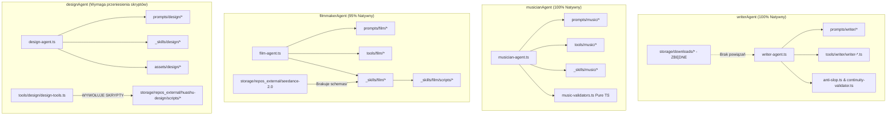

# Audyt Zależności Zewnętrznych, Repozytoriów i Ścieżek Działania Agentów (External Repo Cleanup)

Data audytu: **2026-08-30**  
Wersja systemu: **Mastra Agentic Environment / Splot OS**  
Cel audytu: **Identyfikacja zapożyczonych/zewnętrznych repozytoriów, weryfikacja stopnia integracji agentów (`writerAgent`, `designAgent`, `filmmakerAgent`, `musicianAgent`), zmapowanie ścieżek kodu, skilli, promptów i pipeline'ów oraz przygotowanie planu usunięcia nadmiarowych repozytoriów bez zakłócenia działania systemu.**

---

## 1. Podsumowanie Wykonawcze (Executive Summary)

W toku rozwoju systemu zbadano i zaadoptowano kilka zaawansowanych repozytoriów zewnętrznych (open-source / reference codebases). Część z nich została **w 100% zmigrowana do natywnego kodu TypeScript**, część została **zduplikowana w kilku katalogach na dysku**, a część nadal **wywołuje zewnętrzne skrypty narzędziowe** lub posiada referencje w kodzie narzędzi.

### Bilans Gotowości i Stanu Agentów:

| Agent | Repozytoria Źródłowe (Pochodzenie) | Status Wbudowania w Mastra | Czy istnieje referencja runtime do zewn. repo? | Nadmiarowe katalogi na dysku | Co trzeba przenieść / zmienić przed usunięciem? |
| :--- | :--- | :--- | :--- | :--- | :--- |
| **`writerAgent`** | `better-writing`, `story-skills`, `creative-writing-skills`, `autonovel`, `authorclaw`, `claude-scientific-writer`, `inkos` | **100% Wbudowany (Natywny TS + Prompty)** | ❌ **BRAK** (0 referencji w `src/`) | 6 folderów w `agentic-agents/` + 7 folderów w `storage/downloads/` (~132 MB) | **Nic w kodzie.** Wystarczy usunąć zdublowane repozytoria z dysku. |
| **`designAgent`** | `huashu-design` | **Częściowo Wbudowany** (Prompty 100%, Assety 100%, Skille 100%, Skrypty 0%) | ⚠️ **TAK** (`design-tools.ts` odpala `storage/repos_external/huashu-design/scripts/*`) | `storage/repos_external/huashu-design` (250 MB) | Skopiować folder `scripts/` do `src/mastra/tools/design/scripts/` i zaktualizować resolver w `design-tools.ts`. |
| **`filmmakerAgent`** | `seedance-2.0` | **95% Wbudowany** (Prompty 100%, Narzędzia 100%, Skille 100%, Skrypty 100%, Schemas 0%) | ⚠️ **Śladowa (Fallback)** (`film-validators.ts` ma ścieżkę jako fallback, brak folderu `schemas/`) | `storage/repos_external/seedance-2.0` (42 MB) | Skopiować 5 plików z `schemas/` do `src/mastra/_skills/film/schemas/` i usunąć fallbacki w `film-validators.ts`. |
| **`musicianAgent`** | `bitwize-music-studio/claude-ai-music-skills` | **100% Wbudowany (Natywny TS + Skille)** | ❌ **BRAK** (Wszystko w `src/mastra/_skills/music` i natywnym TS) | ❌ **Brak** (repo nigdy nie zaśmieciło `storage/`) | **Nic.** Jest to wzorcowa implementacja pełnej niezależności. |

Łączna objętość do odzyskania / oczyszczenia: **~424 MB** (oraz eliminacja ryzyka ścieżek względnych).

---

## 2. Szczegółowy Audyt Agenta po Agencie

---

### 2.1. `writerAgent` (Pisarz & Długie Formy Tekstowe)

#### A. Ścieżki Działania i Architektura w Systemie
- **Definicja agenta:** [`agentic-agents/src/mastra/agents/writer-agent.ts`](file:///projekty/mastra-agentic-environment/agentic-agents/src/mastra/agents/writer-agent.ts)
- **Instrukcje i Prompty:**
  - `src/mastra/prompts/writer/domain.md` (główna domena pisarska, voice dials, anti-slop)
  - `src/mastra/prompts/writer/pipeline.md` (deterministyczny pipeline manuskryptu, fazy, quality gates)
  - `src/mastra/prompts/shared/skill-shelf.md` (integracja transient skill shelf)
  - Subagenci roboczy (Workers): `src/mastra/prompts/writer/workers/` (`chronicler.md`, `critic.md`, `muse.md`, `polisher.md`, `reader-sim.md`)
- **Narzędzia (Tools):**
  - Projekt & Stan: [`src/mastra/tools/writer/writer-tools.ts`](file:///projekty/mastra-agentic-environment/agentic-agents/src/mastra/tools/writer/writer-tools.ts) (`writerStartProject`, `writerGetProject`, `writerUpdateStyleProfile`, `writerUpsertSection`, `writerUpdateContinuity`, `writerAddSources`, `writerUpsertClaims`, `writerVerifyClaims`, `writerAuditSlop`, itp.)
  - Pliki Manuskryptu: [`src/mastra/tools/writer/writer-document-tools.ts`](file:///projekty/mastra-agentic-environment/agentic-agents/src/mastra/tools/writer/writer-document-tools.ts) (`writerDocumentInit`, `writerDocumentWriteSection`, `writerDocumentRead`, `writerDocumentSnapshot`, `writerDocumentExport`)
  - Workflow & Bramki Jakości: [`src/mastra/tools/writer/writer-workflow-tools.ts`](file:///projekty/mastra-agentic-environment/agentic-agents/src/mastra/tools/writer/writer-workflow-tools.ts) (`writerPrepareResearchDelegation`, `writerIngestResearchResult`, `writerPrepareWorkerReview`, `writerQualityGate`, `writerRevisionDecision`)
  - Silniki Walidacji: [`src/mastra/tools/writer/anti-slop.ts`](file:///projekty/mastra-agentic-environment/agentic-agents/src/mastra/tools/writer/anti-slop.ts), [`src/mastra/tools/writer/continuity-validator.ts`](file:///projekty/mastra-agentic-environment/agentic-agents/src/mastra/tools/writer/continuity-validator.ts)
  - Serwis Bazodanowy: [`src/mastra/tools/writer/writer-service.ts`](file:///projekty/mastra-agentic-environment/agentic-agents/src/mastra/tools/writer/writer-service.ts), [`src/mastra/tools/writer/db.ts`](file:///projekty/mastra-agentic-environment/agentic-agents/src/mastra/tools/writer/db.ts)
- **Skille:**
  - `writerAgent` nie posiada katalogu `_skills/writer`, ponieważ wszystkie procedury i wzorce zostały przekształcone w natywne narzędzia TypeScript (`writer_*`) oraz dedykowane prompty workerów.
- **Baza Wiedzy i Pamięć:**
  - Tabele / kolekcje DuckDB & MongoDB: `writer_projects`, `writer_style_profiles`, `writer_continuity`, `writer_claims`, `writer_sources`, `writer_audits`, `writer_notes`, `writer_documents`.
  - Pamięć obserwacyjna: `observationalMemory` z modelem infrastruktury.

#### B. Repozytoria Źródłowe i Ich Zapożyczenia
Agent powstał na bazie destylacji wzorców z 7 repozytoriów (udokumentowane w [`agentic-agents/docs/WRITER-AGENT-SOURCE-PATTERNS.md`](file:///projekty/mastra-agentic-environment/agentic-agents/docs/WRITER-AGENT-SOURCE-PATTERNS.md)):
1. **`better-writing`** (MIT) → zaadoptowano algorytm `anti-slop.ts` (filtry polskie i angielskie) oraz pokrętła głosu `WriterStyleProfile`.
2. **`story-skills`** (MIT) → zaadoptowano strukturę biblii opowieści i `continuity-validator.ts`.
3. **`creative-writing-skills`** (Apache 2.0) → zaadoptowano role workerów: `critic`, `reader-sim`, `muse`, `chronicler`, `polisher`.
4. **`autonovel`** → zaadoptowano 2-warstwowy układ odpornościowy jakości oraz pętlę generate-evaluate-revise.
5. **`authorclaw`** (MIT) → zaadoptowano analizę markerów stylu i sygnatury autorskiej.
6. **`claude-scientific-writer`** (MIT) → zaadoptowano rejestr źródeł (`writer_sources`), tezy i fakty (`writer_claims`).
7. **`inkos`** (AGPL-3.0) → zaadoptowano jedynie koncepcję hierarchii autorytetu prawdy (żaden kod AGPL nie został skopiowany).

#### C. Stan Obecny i Zdublowane Pliki na Dysku
- **Runtime:** Kod w `agentic-agents/src/` **NIE importuje ani nie czyta** żadnego pliku z pobranych repozytoriów.
- **Nadmiarowe pliki na dysku (DUPLIKATY):**
  1. W katalogu głównym `agentic-agents/`:
     - `agentic-agents/authorclaw/` (3.2 MB)
     - `agentic-agents/autonovel/` (876 KB)
     - `agentic-agents/better-writing/` (480 KB)
     - `agentic-agents/claude-scientific-writer/` (31 MB)
     - `agentic-agents/inkos/` (28 MB)
     - `agentic-agents/story-skills/` (1.6 MB)
  2. W katalogu `agentic-agents/storage/downloads/`:
     - `storage/downloads/authorclaw/` (3.2 MB)
     - `storage/downloads/autonovel/` (876 KB)
     - `storage/downloads/better-writing/` (480 KB)
     - `storage/downloads/claude-scientific-writer/` (31 MB)
     - `storage/downloads/creative-writing-skills/` (1.9 MB)
     - `storage/downloads/inkos/` (28 MB)
     - `storage/downloads/story-skills/` (1.6 MB)
     - `storage/downloads/deep-research-report.md` (36 KB)

#### D. Plan Działania dla `writerAgent`
1. Wszystkie powyższe foldery zarówno w `agentic-agents/` jak i w `agentic-agents/storage/downloads/` są w 100% zbędne w runtime.
2. Zgodnie z warunkiem w `docs/WRITER-AGENT-SOURCE-PATTERNS.md` ("Removal Readiness"), wzorce są w pełni opisane w kodzie i dokumentacji.
3. **Wymagana akcja:** Usunięcie obu zestawów pobranych folderów. Brak konieczności jakichkolwiek zmian w kodzie TypeScript.

---

### 2.2. `designAgent` (Projektowanie Wizualne, Slajdy, Wideo, Prototypy)

#### A. Ścieżki Działania i Architektura w Systemie
- **Definicja agenta:** [`agentic-agents/src/mastra/agents/design-agent.ts`](file:///projekty/mastra-agentic-environment/agentic-agents/src/mastra/agents/design-agent.ts)
- **Instrukcje i Prompty:**
  - `src/mastra/prompts/design/domain.md` (76 KB, pełen mózg projektowy Huashu Design, 40 stylów, zasady antyslopa, advisor)
  - `src/mastra/prompts/design/pipeline.md` (adapter runtime do Mastra: tryby FAST/STANDARD/DEEP, headless execution)
  - `src/mastra/prompts/shared/skill-shelf.md`
- **Narzędzia (Tools):**
  - [`src/mastra/tools/design/design-tools.ts`](file:///projekty/mastra-agentic-environment/agentic-agents/src/mastra/tools/design/design-tools.ts):
    - `designWriteDeliverableTool`
    - `designFetchImagesTool`
    - `designFetchBrandAssetsTool`
    - `designGenerateImageTool` (Google Imagen / Gemini / OpenAI DALL-E)
    - `designVerifyTool` (Playwright screenshot & DOM errors)
    - `designRenderVideoTool` (HTML animation -> MP4)
    - `designRenderVideoSeekTool` (Stage-clock native frame render)
    - `designConvertFormatsTool` (MP4 -> 60fps & GIF)
    - `designAddMusicTool` (BGM mix z podkładami audio)
    - `designExportPptxTool` (HTML slide deck -> PPTX)
    - `designExportPdfTool` (HTML slide deck -> PDF)
    - `designGenThumbsTool` (Generowanie miniatur slajdów)
    - `designTtsTool` & `designNarratePipelineTool` (ElevenLabs TTS + timeline.json)
  - [`src/mastra/tools/design/design-document-tools.ts`](file:///projekty/mastra-agentic-environment/agentic-agents/src/mastra/tools/design/design-document-tools.ts)
- **Skille i Referencje:**
  - [`src/mastra/_skills/design/`](file:///projekty/mastra-agentic-environment/agentic-agents/src/mastra/_skills/design/) — zawiera 25 skilli/referencji (`design-styles.md`, `slide-decks.md`, `animation-best-practices.md`, `brand-asset-protocol.md`, `editable-pptx.md`, itp.).
- **Assety:**
  - [`src/mastra/assets/design/`](file:///projekty/mastra-agentic-environment/agentic-agents/src/mastra/assets/design/) — zawiera ramki okien/urządzeń (`android_frame.jsx`, `ios_frame.jsx`, `macos_window.jsx`), podkłady muzyczne (`bgm-tech.mp3`, `bgm-ad.mp3`, `bgm-tutorial.mp3` itp.), efekty dźwiękowe (`sfx/`), szablony decków (`deck_index.html`, `deck_stage.js`).

#### B. Repozytorium Źródłowe: `huashu-design`
- Sklonowane pod: `agentic-agents/storage/repos_external/huashu-design` (250 MB).

#### C. Co Zostało Wmontowane, a Co Nadal Zależy od Zewnętrznego Repo?
- **Wmontowane w 100%:**
  - Wszystkie prompty i baza wiedzy (`src/mastra/prompts/design/domain.md`).
  - Wszystkie 25 plików dokumentacji referencyjnej w `src/mastra/_skills/design/`.
  - Wszystkie pliki graficzne, dźwiękowe BGM i komponenty JSX w `src/mastra/assets/design/`.
- **Nadal zależne od zewnętrznego repozytorium (`storage/repos_external/huashu-design`):**
  W pliku `src/mastra/tools/design/design-tools.ts` funkcja `resolveDesignSkillRoot()` (linie 46–66) wyszukuje ścieżkę do `storage/repos_external/huashu-design` i uruchamia z niej procesy potomne:
  1. `fetch_images.py` (wywoływane przez `designFetchImagesTool`)
  2. `render-video.js` (wywoływane przez `designRenderVideoTool`)
  3. `render-video-seek.js` (wywoływane przez `designRenderVideoSeekTool`)
  4. `convert-formats.sh` (wywoływane przez `designConvertFormatsTool`)
  5. `add-music.sh` (wywoływane przez `designAddMusicTool`)
  6. `export_deck_pptx.mjs` i `html2pptx.js` (wywoływane przez `designExportPptxTool`)
  7. `export_deck_pdf.mjs` i `export_deck_stage_pdf.mjs` (wywoływane przez `designExportPdfTool`)
  8. `gen_deck_thumbs.mjs` (wywoływane przez `designGenThumbsTool`)
  9. `verify.py` (wywoływane przez `designVerifyTool`)

#### D. Plan Działania dla `designAgent` (Pełne Uniezależnienie)
1. **Przeniesienie skryptów:** Skopiować katalog skryptów `storage/repos_external/huashu-design/scripts/` (15 plików) do dedykowanego miejsca w kodzie: `agentic-agents/src/mastra/tools/design/scripts/` lub `agentic-agents/src/mastra/scripts/design/`.
2. **Aktualizacja ścieżek w narzędziu:** W `src/mastra/tools/design/design-tools.ts` zmienić `resolveDesignSkillRoot()` tak, aby wskazywał na lokalny katalog skryptów oraz `src/mastra/assets/design`.
3. **Aktualizacja skryptu `add-music.sh`:** Upewnić się, że ścieżka do podkładów BGM wskazuje na `src/mastra/assets/design/bgm-*.mp3`.
4. **Aktualizacja promptu:** Zaktualizować `src/mastra/prompts/design/pipeline.md` (sekcja *Local Paths*).
5. **Usunięcie repozytorium zewnętrznego:** Po przetestowaniu usunąć cały katalog `storage/repos_external/huashu-design/` (oszczędność 250 MB).

---

### 2.3. `filmmakerAgent` / `filmAgent` (Generowanie i Reżyseria Wideo AI)

#### A. Ścieżki Działania i Architektura w Systemie
- **Definicja agenta:** [`agentic-agents/src/mastra/agents/film-agent.ts`](file:///projekty/mastra-agentic-environment/agentic-agents/src/mastra/agents/film-agent.ts)
- **Instrukcje i Prompty:**
  - `src/mastra/prompts/film/domain.md` (Seedance 2.0 / Kling / Runway / Luma / Sora prompt engineering)
  - `src/mastra/prompts/film/pipeline.md` (pipeline sekwencji wideo, ledger ujęć, limity budżetowe)
  - `src/mastra/prompts/shared/skill-shelf.md`
- **Narzędzia (Tools):**
  - Zarządzanie Projektem i Promptami: [`src/mastra/tools/film/film-project-tools.ts`](file:///projekty/mastra-agentic-environment/agentic-agents/src/mastra/tools/film/film-project-tools.ts) (`filmStartProject`, `filmGetProject`, `filmListProjects`, `filmSetProjectStatus`, `filmUpsertClip`, `filmRecordTake`, `filmGetCanon`, `filmCompilePromptSpec`)
  - Ładowanie Referencji i Skilli: [`src/mastra/tools/film/film-reference-tools.ts`](file:///projekty/mastra-agentic-environment/agentic-agents/src/mastra/tools/film/film-reference-tools.ts) (`filmLoadReferenceTool`, `filmSearchReferenceTool`) — **ładuje wyłącznie z `src/mastra/_skills/film`**
  - Walidatory i Lintery: [`src/mastra/tools/film/film-validators.ts`](file:///projekty/mastra-agentic-environment/agentic-agents/src/mastra/tools/film/film-validators.ts) (`filmLintPromptTool`, `filmCheckProjectStateTool`, `filmCheckContinuityTool`, `filmCheckSourcesTool`, `filmCheckGenerationRunTool`, `filmCheckSequenceEvalTool`)
  - Księga Generacji (Ledger): [`src/mastra/tools/film/film-ledger.ts`](file:///projekty/mastra-agentic-environment/agentic-agents/src/mastra/tools/film/film-ledger.ts)
  - Generacja Wideo: [`src/mastra/tools/film/film-generate.ts`](file:///projekty/mastra-agentic-environment/agentic-agents/src/mastra/tools/film/film-generate.ts) (fal.ai / luma / runway / kling integration)
  - Serwis: [`src/mastra/tools/film/film-service.ts`](file:///projekty/mastra-agentic-environment/agentic-agents/src/mastra/tools/film/film-service.ts)
- **Skille, Referencje i Skrypty Walidacji:**
  - [`src/mastra/_skills/film/`](file:///projekty/mastra-agentic-environment/agentic-agents/src/mastra/_skills/film/):
    - `skills/` (dedykowane skille reżyserskie, np. `seedance-antislop`, `seedance-camera`, `seedance-lighting`)
    - `references/` (baza wiedzy filmowej, vocabularies zh/ja/es/ko/ru, gramatyka ujęć)
    - `data/`
    - `examples/`
    - `evals/`
    - `scripts/` (wszystkie skrypty Pythona: `prompt_lint.py`, `project_state_check.py`, `continuity_chain_check.py`, `source_registry_check.py`, `generation_run_check.py`, `sequence_eval_check.py`, `validate_skills.py`)

#### B. Repozytorium Źródłowe: `seedance-2.0`
- Sklonowane pod: `agentic-agents/storage/repos_external/seedance-2.0` (42 MB).

#### C. Co Zostało Wmontowane, a Co Nadal Zależy od Zewnętrznego Repo?
- **Wmontowane w 95%:**
  - `film-reference-tools.ts` korzysta w 100% z wewnętrznego katalogu `src/mastra/_skills/film`.
  - Wszystkie skrypty lintera/walidatora (`prompt_lint.py`, itp.) znajdują się już w `src/mastra/_skills/film/scripts/`.
- **Drobne brakujące elementy i ścieżki fallback:**
  1. W `src/mastra/tools/film/film-validators.ts` funkcja `resolveFilmSkillRoot()` ma ustawioną kolejność:
     - 1. `src/mastra/_skills/film` (używane priorytetowo)
     - 2. Fallbacki do `storage/repos_external/seedance-2.0`
  2. W `src/mastra/_skills/film` brakuje katalogu `schemas/` zawierającego 5 schematów JSON (`project-state.schema.json`, `clip-contract.schema.json`, `take-review.schema.json`, `prompt-spec.schema.json`, `generation-run.schema.json`), z których korzystają `project_state_check.py` oraz `validate_skills.py`.
  3. W `src/mastra/prompts/film/pipeline.md` (linia 9) znajduje się wzmianka o `storage/repos_external/seedance-2.0`.

#### D. Plan Działania dla `filmmakerAgent` (Pełne Uniezależnienie)
1. **Przeniesienie schematów:** Skopiować katalog `storage/repos_external/seedance-2.0/schemas/` (5 plików) do `agentic-agents/src/mastra/_skills/film/schemas/`.
2. **Czyszczenie fallbacków:** W `src/mastra/tools/film/film-validators.ts` usunąć ze zmiennej `candidates` odwołania do `storage/repos_external/seedance-2.0`.
3. **Aktualizacja promptu:** Poprawić wzmiankę w `src/mastra/prompts/film/pipeline.md`.
4. **Usunięcie repozytorium zewnętrznego:** Usunąć cały katalog `storage/repos_external/seedance-2.0/` (oszczędność 42 MB).

---

### 2.4. `musicianAgent` (Kompozycja, Teksty, Styl Muzyczny i Generacja Audio)

#### A. Ścieżki Działania i Architektura w Systemie
- **Definicja agenta:** [`agentic-agents/src/mastra/agents/musician-agent.ts`](file:///projekty/mastra-agentic-environment/agentic-agents/src/mastra/agents/musician-agent.ts)
- **Instrukcje i Prompty:**
  - `src/mastra/prompts/music/domain.md` (zasady kompozycji, prompter muzyczny, metryka, stylistyka)
  - `src/mastra/prompts/music/pipeline.md` (cykl produkcyjny utworu, brief, lyrics, prompt-spec, takes, mastering)
  - `src/mastra/prompts/shared/skill-shelf.md`
- **Narzędzia (Tools):**
  - Projekt, Brief i Teksty: [`src/mastra/tools/music/music-project-tools.ts`](file:///projekty/mastra-agentic-environment/agentic-agents/src/mastra/tools/music/music-project-tools.ts) (`musicStartProject`, `musicGetProject`, `musicListProjects`, `musicSetProjectStatus`, `musicSetBrief`, `musicWriteLyrics`, `musicUpsertTrack`, `musicCompilePromptSpec`, `musicRecordTake`)
  - Ładowanie Referencji: [`src/mastra/tools/music/music-reference-tools.ts`](file:///projekty/mastra-agentic-environment/agentic-agents/src/mastra/tools/music/music-reference-tools.ts) (`musicLoadReference`, `musicSearchReference`) — **ładuje ściśle z `src/mastra/_skills/music`**
  - Walidatory i Bezpieczeństwo: [`src/mastra/tools/music/music-validators.ts`](file:///projekty/mastra-agentic-environment/agentic-agents/src/mastra/tools/music/music-validators.ts) (100% natywny TypeScript, Zod, regexy antyslopowe, blokada impersonacji artystów, brak zależności od Pythona)
  - Księga Generacji (Ledger): [`src/mastra/tools/music/music-ledger.ts`](file:///projekty/mastra-agentic-environment/agentic-agents/src/mastra/tools/music/music-ledger.ts)
  - Silnik Generacji Audio: [`src/mastra/tools/music/music-generate.ts`](file:///projekty/mastra-agentic-environment/agentic-agents/src/mastra/tools/music/music-generate.ts) (ElevenLabs Music / fal.ai / Suno adapter)
  - Serwis: [`src/mastra/tools/music/music-service.ts`](file:///projekty/mastra-agentic-environment/agentic-agents/src/mastra/tools/music/music-service.ts)
- **Skille i Referencje:**
  - [`src/mastra/_skills/music/`](file:///projekty/mastra-agentic-environment/agentic-agents/src/mastra/_skills/music/):
    - `skills/` (18 dedykowanych skilli: `lyric-writer`, `lyric-refiner`, `style-prompt-engineer`, `mastering-engineer`, `mix-engineer`, `album-art-director`, itp.)
    - `references/` (kompletny korpus wiedzy: mastering, dystrybucja, platformy, gramatyka tagów muzycznych)
    - `data/` (`genre-list.json`, `artist-blocklist.md`)
    - `examples/`

#### B. Repozytorium Źródłowe: `bitwize-music-studio/claude-ai-music-skills`
- Port został przeprowadzony bez pozostawiania pobranego repozytorium w katalogach roboczych.

#### C. Stan Obecny
- **100% WBUDOWANY I AUTONOMICZNY.**
- Brak jakichkolwiek zewnętrznych zależności dyskowych.
- Pełna implementacja walidacji w czystym TypeScript bez skryptów shell/Python.
- **Wzorzec architektoniczny dla pozostałych domen kreatywnych.**

---

## 3. Pozostałe Zewnętrzne Repozytoria i Katalogi w Obszarze Roboczym

Poza 4 badanymi agentami, w przestrzeni roboczej zidentyfikowano dodatkowe repozytoria i archiwa:

### 3.1. `agentic-agents/_external/` (24 MB)
- **Zawartość:**
  - `_external/anthropic-skills/` (oficjalne repozytorium skilli Anthropic Claude)
  - `_external/openai-skills/` (oficjalne repozytorium skilli OpenAI)
- **Użycie w kodzie:** Żaden moduł w `src/` nie importuje plików z `_external/`. Występuje jedynie w `workspace-service.ts` na liście katalogów ignorowanych (`SKIP_DIRS`).
- **Rekomendacja:** Można przenieść do archiwum zewnętrznego lub pozostawić jako czysto referencyjny katalog poza `src/`.

### 3.2. `staging-skills/` (Katalog główny workspace)
- **Zawartość:** 33 skille wyekstrahowane z promptów wiodących providerów AI, podzielone na 6 domen (`meta`, `research`, `coding`, `design`, `marketing`, `automation`) oraz podkatalog `_ready/` ze skillami przygotowanymi do wdrożenia.
- **Status:** Jest to etap przejściowy (staging pool) zarządzany zgodnie z dokumentacją `ideas/audyt-staging-skills-2026-08-26.md` i `ideas/plan-wdrozenia-skilli-2026-08-26.md`.
- **Rekomendacja:** Zachować do czasu zakończenia wdrożenia poszczególnych fal skilli do `src/mastra/_skills/`.

### 3.3. `prompty-providerów/` (Katalog główny workspace, ~5 MB)
- **Zawartość:** `system_prompts_leaks-main/` oraz plik `.zip`.
- **Status:** Zbiór referencyjny promptów systemowych (Anthropic, Cursor, DeepSeek, Google, OpenAI, xAI).
- **Rekomendacja:** Archiwum czysto analityczne, bezpieczne do przeniesienia do zewnętrznego archiwum wiedzy.

### 3.4. `agentic-agents/src/mastra/_jarvis-reference/`
- **Zawartość:** 11 plików TypeScript (`marketing-steps/*.ts` — copy-en, copy-pl, drafting, outreach, research itp.).
- **Status:** Pozostałości referencyjne po wczesnym systemie Jarvis. Żaden plik w `src/` ich nie importuje.
- **Rekomendacja:** Usunąć lub przenieść do dokumentacji referencyjnej.

### 3.5. Dodatkowe Instancje / Worktree
- `agentic-agents-repair/` — aktywne git worktree gałęzi `autoheal/repair`.
- `agentic-agents-staging/` — katalog zapasowy/stagingowy (~2 GB).
- `agentic-agents-worktrees/` — pusty katalog nadrzędny.

---

## 4. Macierz Integracji: Co Gdzie Się Znajduje



---

## 5. Kompletny, Bezpieczny Plan Czyszczenia (Actionable Cleanup Plan)

Aby doprowadzić system do stanu idealnej spójności bez zepsucia jakiejkolwiek funkcjonalności, należy zrealizować poniższe kroki w 3 fazach:

### Faza 1: Uniezależnienie `designAgent` i `filmmakerAgent` (Kopiowanie brakujących zasobów do właściwych ścieżek)

1. **Dla `designAgent`:**
   - [ ] Skopiować `storage/repos_external/huashu-design/scripts/` do `agentic-agents/src/mastra/tools/design/scripts/`.
   - [ ] W `agentic-agents/src/mastra/tools/design/design-tools.ts`:
     - Zaktualizować funkcję `resolveDesignSkillRoot()` tak, aby zwracała ścieżkę do `src/mastra/tools/design/scripts` oraz assetów w `src/mastra/assets/design`.
     - Zweryfikować działanie narzędzi `design_fetch_images`, `design_render_video`, `design_export_pptx`, `design_verify`.
   - [ ] Zaktualizować `src/mastra/prompts/design/pipeline.md` (sekcja *Local Paths*).

2. **Dla `filmmakerAgent`:**
   - [ ] Skopiować `storage/repos_external/seedance-2.0/schemas/` do `agentic-agents/src/mastra/_skills/film/schemas/`.
   - [ ] W `agentic-agents/src/mastra/tools/film/film-validators.ts` usunąć ze zmiennej `candidates` odwołania do `storage/repos_external/seedance-2.0`.
   - [ ] Zaktualizować `src/mastra/prompts/film/pipeline.md`.

---

### Faza 2: Usunięcie Pobranych i Zewnętrznych Repozytoriów

Po wykonaniu Fazy 1 można bezpiecznie i bezstratnie usunąć:

1. **Katalogi zduplikowane w `agentic-agents/`:**
   ```bash
   rm -rf agentic-agents/authorclaw
   rm -rf agentic-agents/autonovel
   rm -rf agentic-agents/better-writing
   rm -rf agentic-agents/claude-scientific-writer
   rm -rf agentic-agents/inkos
   rm -rf agentic-agents/story-skills
   ```
2. **Katalogi pobrane w `agentic-agents/storage/downloads/`:**
   ```bash
   rm -rf agentic-agents/storage/downloads/authorclaw
   rm -rf agentic-agents/storage/downloads/autonovel
   rm -rf agentic-agents/storage/downloads/better-writing
   rm -rf agentic-agents/storage/downloads/claude-scientific-writer
   rm -rf agentic-agents/storage/downloads/creative-writing-skills
   rm -rf agentic-agents/storage/downloads/inkos
   rm -rf agentic-agents/storage/downloads/story-skills
   ```
3. **Katalogi z `storage/repos_external/`:**
   ```bash
   rm -rf agentic-agents/storage/repos_external/huashu-design
   rm -rf agentic-agents/storage/repos_external/seedance-2.0
   ```
4. **Pozostałości w `src/mastra/`:**
   ```bash
   rm -rf agentic-agents/src/mastra/_jarvis-reference
   ```

---

### Faza 3: Weryfikacja Poprawności (Regression Verification)

- [ ] Uruchomienie lintera TypeScript: `npx tsc --noEmit` w `agentic-agents`.
- [ ] Testy domenowe pisarza: `npm run test -- src/mastra/tools/writer` / `check:writer-domain`.
- [ ] Testy domenowe designu: `check:design-domain` / test renderu i weryfikacji.
- [ ] Testy domenowe filmu: `check:film-domain` / test linterów Pythona z `_skills/film/scripts/`.
- [ ] Testy domenowe muzyka: `check:musician-domain`.
