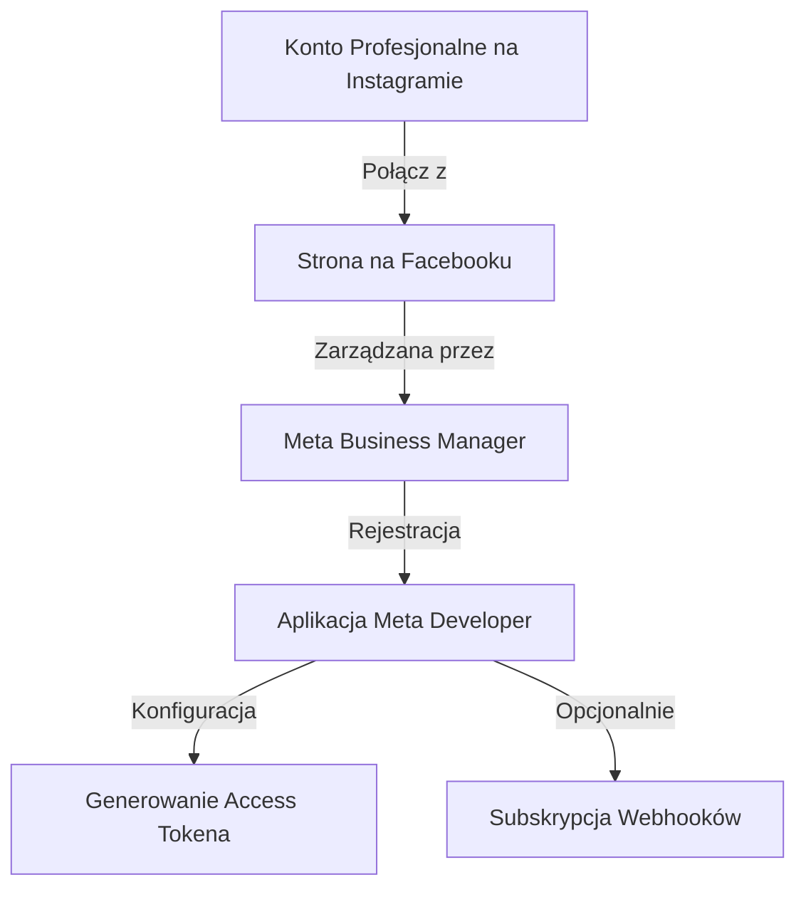

# Integracja Instagram API z Agentem Mastra

Ten dokument przedstawia techniczną analizę wykonalności, wymagania oraz architekturę integracji oficjalnego **Instagram Graph API** z agentem w środowisku Mastra.

---

## 1. Wykonalność i Możliwości API

Tak, **jesteś w stanie zrealizować wszystkie wymagane funkcje** za pomocą oficjalnego API udostępnianego przez Meta dla profesjonalnych kont (Business / Creator). 

Poniższa tabela przedstawia szczegóły techniczne poszczególnych operacji:

| Funkcjonalność | Metoda API / Endpoint | Wymagane Uprawnienia (Scope) | Uwagi / Limity |
| :--- | :--- | :--- | :--- |
| **Publikacja zdjęcia z opisem** | `POST /{ig-user-id}/media`<br>`POST /{ig-user-id}/media_publish` | `instagram_content_publish` | Zdjęcie musi być tymczasowo hostowane pod publicznym adresem URL. Limit: 100 postów / 24h. |
| **Czytanie komentarzy** | `GET /{ig-media-id}/comments` | `instagram_manage_comments` | Zwraca ID komentarza, treść, datę i dane autora. |
| **Odpowiadanie na komentarze** | `POST /{ig-comment-id}/replies` | `instagram_manage_comments` | Możliwość odpowiadania bezpośrednio w wątku. |
| **Odbieranie wiadomości (DM)** | Webhook `messages`<br>`GET /{conversation-id}/messages` | `instagram_manage_messages` | Webhook jest niezbędny do reakcji w czasie rzeczywistym. |
| **Wysyłanie wiadomości (DM)** | `POST /me/messages` (Messenger Platform) | `instagram_manage_messages` | Odpowiedź do użytkownika na jego IGSID (Instagram-scoped ID). |

---

## 2. Wymagania Wstępne i Konfiguracja Meta

Aby agent mógł wchodzić w interakcję z Twoim kontem na Instagramie, musisz przejść przez następujące kroki konfiguracyjne:



### Krok 1: Połączenie Konta z Facebookiem
1. Upewnij się, że Twoje konto na Instagramie jest skonfigurowane jako **Profesjonalne (Business lub Creator)**.
2. Stwórz **Stronę na Facebooku** (Facebook Page) i połącz ją w ustawieniach konta Instagram.
3. Dodaj oba konta do tego samego **Meta Business Suite / Business Manager**.

### Krok 2: Konfiguracja Aplikacji Meta Developer
1. Zaloguj się na [developers.facebook.com](https://developers.facebook.com) i utwórz aplikację typu **Business**.
2. Dodaj produkt **Instagram Graph API** oraz **Messenger** (do obsługi DM).
3. W ustawieniach aplikacji na Instagramie przejdź do: **Ustawienia -> Prywatność -> Wiadomości** i zaznacz opcję **Zezwalaj na dostęp do wiadomości** (Allow Access to Messages) – bez tego API nie odczyta DM.

### Krok 3: Generowanie Tokenów Dostępowych
1. **Podczas developmentu:** Możesz wygenerować tymczasowy Page Access Token za pomocą narzędzia **Graph API Explorer**.
2. **Produkcyjnie (bez wygasania):** Stwórz **System User** w swoim Meta Business Managerze, przypisz mu prawa do zarządzania Stroną i kontem Instagram, a następnie wygeneruj token bezterminowy (Never-Expiring Access Token).

---

## 3. Architektura Integracji w Środowisku Mastra

Masz dwie główne drogi wdrożenia integracji z agentem Mastra:

### Opcja A: Własne Narzędzia Mastra (Rekomendowana)
Zamiast uruchamiać zewnętrzny serwer MCP przez standardowe wejście/wyjście (stdio) lub sieć, implementujemy narzędzia (Tools) bezpośrednio w projekcie Mastra.
* **Zalety:** Brak narzutu na dodatkowe procesy, pełna integracja z TypeScriptem, łatwy dostęp do zmiennych środowiskowych `.env`, bezpośrednie logowanie.
* **Miejsce w kodzie:** Tworzymy folder `src/mastra/tools/instagram/` i eksportujemy narzędzia bezpośrednio w `src/mastra/agents/content-agent.ts` (lub nowym agencie).

### Opcja B: Dedykowany Serwer MCP
Tworzymy lub forkujemy serwer MCP (np. na bazie `jlbadano/ig-mcp`), który uruchamiamy w tle lub jako proces sidecar i rejestrujemy w `src/mastra/mcp.ts`.
* **Zalety:** Modułowość, możliwość ponownego wykorzystania w innych klientach MCP (np. Claude Desktop).
* **Wady:** Wymaga dodatkowej konfiguracji procesu i przekazywania zmiennych środowiskowych do klienta MCP.

---

## 4. Przykład Implementacji (Mastra Tools)

Poniżej znajduje się wzorcowy kod dla narzędzi publikacji postu oraz obsługi komentarzy przy użyciu biblioteki Axios lub Fetch w Node.js/TypeScript.

### 4.1. Publikowanie Postu (Zdjęcie + Opis)

```typescript
import { createTool } from '@mastra/core/tools';
import { z } from 'zod';
import axios from 'axios';

export const instagramPublishPhotoTool = createTool({
  id: 'instagram_publish_photo',
  description: 'Publikuje pojedyncze zdjęcie wraz z opisem na powiązanym koncie Instagram Business.',
  inputSchema: z.object({
    imageUrl: z.string().url().describe('Publicznie dostępny URL obrazu (JPEG/PNG)'),
    caption: z.string().describe('Opis posta (w tym hashtagi)'),
  }),
  outputSchema: z.object({
    success: z.boolean(),
    mediaId: z.string().optional(),
    error: z.string().optional(),
  }),
  execute: async ({ input }) => {
    const accessToken = process.env.INSTAGRAM_PAGE_ACCESS_TOKEN;
    const igAccountId = process.env.INSTAGRAM_ACCOUNT_ID;

    if (!accessToken || !igAccountId) {
      return { success: false, error: 'Brak konfiguracji zmiennych środowiskowych INSTAGRAM.' };
    }

    try {
      // Krok 1: Utworzenie kontenera dla zdjęcia
      const containerRes = await axios.post(
        `https://graph.facebook.com/v20.0/${igAccountId}/media`,
        {
          image_url: input.imageUrl,
          caption: input.caption,
          access_token: accessToken,
        }
      );

      const creationId = containerRes.data.id;

      // Krok 2: Oczekiwanie na przetworzenie kontenera (Polling statusu)
      let status = 'IN_PROGRESS';
      let attempts = 0;
      while (status !== 'FINISHED' && attempts < 10) {
        await new Promise((resolve) => setTimeout(resolve, 3000));
        const statusRes = await axios.get(
          `https://graph.facebook.com/v20.0/${creationId}?fields=status_code&access_token=${accessToken}`
        );
        status = statusRes.data.status_code;
        if (status === 'ERROR') {
          throw new Error('Przetwarzanie kontenera zakończyło się błędem.');
        }
        attempts++;
      }

      if (status !== 'FINISHED') {
        throw new Error('Timeout podczas przetwarzania kontenera przez Meta API.');
      }

      // Krok 3: Opublikowanie posta
      const publishRes = await axios.post(
        `https://graph.facebook.com/v20.0/${igAccountId}/media_publish`,
        {
          creation_id: creationId,
          access_token: accessToken,
        }
      );

      return { success: true, mediaId: publishRes.data.id };
    } catch (error: any) {
      return {
        success: false,
        error: error.response?.data?.error?.message || error.message || 'Nieznany błąd',
      };
    }
  },
});
```

### 4.2. Czytanie i Odpowiadanie na Komentarze

```typescript
import { createTool } from '@mastra/core/tools';
import { z } from 'zod';
import axios from 'axios';

// Odpowiedź na komentarz
export const instagramReplyToCommentTool = createTool({
  id: 'instagram_reply_to_comment',
  description: 'Odpowiada na komentarz o podanym ID na Instagramie.',
  inputSchema: z.object({
    commentId: z.string().describe('ID komentarza, na który chcemy odpowiedzieć'),
    message: z.string().describe('Treść odpowiedzi'),
  }),
  outputSchema: z.object({
    success: z.boolean(),
    replyId: z.string().optional(),
    error: z.string().optional(),
  }),
  execute: async ({ input }) => {
    const accessToken = process.env.INSTAGRAM_PAGE_ACCESS_TOKEN;
    try {
      const res = await axios.post(
        `https://graph.facebook.com/v20.0/${input.commentId}/replies`,
        {
          message: input.message,
          access_token: accessToken,
        }
      );
      return { success: true, replyId: res.data.id };
    } catch (error: any) {
      return {
        success: false,
        error: error.response?.data?.error?.message || error.message,
      };
    }
  },
});
```

### 4.3. Odpowiadanie na Wiadomości DM

Wiadomości DM są wysyłane przez platformę Messenger (obsługującą wątki z Instagrama) przy użyciu identyfikatora użytkownika (IGSID).

```typescript
export const instagramSendDMTool = createTool({
  id: 'instagram_send_dm',
  description: 'Wysyła bezpośrednią wiadomość (DM) do użytkownika na Instagramie.',
  inputSchema: z.object({
    recipientId: z.string().describe('Instagram-Scoped ID (IGSID) odbiorcy'),
    messageText: z.string().describe('Treść wiadomości tekstowej'),
  }),
  outputSchema: z.object({
    success: z.boolean(),
    messageId: z.string().optional(),
    error: z.string().optional(),
  }),
  execute: async ({ input }) => {
    const accessToken = process.env.INSTAGRAM_PAGE_ACCESS_TOKEN;
    try {
      const res = await axios.post(
        `https://graph.facebook.com/v20.0/me/messages`,
        {
          recipient: { id: input.recipientId },
          message: { text: input.messageText },
          access_token: accessToken,
        }
      );
      return { success: true, messageId: res.data.message_id };
    } catch (error: any) {
      return {
        success: false,
        error: error.response?.data?.error?.message || error.message,
      };
    }
  },
});
```

---

## 5. Kluczowe wyzwanie: Odbiór Wiadomości i Komentarzy w czasie rzeczywistym

Podczas gdy publikacja posta to akcja wychodząca (pull/push ze strony agenta), **czytanie i odpowiadanie na DM oraz komentarze wymaga reagowania na zdarzenia (reaktywne działanie agenta)**. 

Do tego celu niezbędne jest wdrożenie **Webhooka**:
1. Twój serwer Mastra (lub mikrousługa obok) musi nasłuchiwać na publicznym punkcie końcowym HTTPS (np. `/api/webhooks/instagram`).
2. Meta wysyła na ten endpoint powiadomienia typu `POST` za każdym razem, gdy ktoś wyśle DM lub doda komentarz.
3. Po odebraniu webhooka aplikacja powinna:
   - Zapisać zdarzenie w bazie danych.
   - Wywołać agenta Mastra (np. poprzez Mastra Workflows lub bezpośrednio wywołując agenta z odpowiednim kontekstem i wątkiem pamięci), przekazując treść nowej wiadomości i prosząc o odpowiedź przy użyciu narzędzia `instagram_send_dm` or `instagram_reply_to_comment`.

---

## Podsumowanie i Rekomendacja

Jesteś w stanie w pełni zautomatyzować ten proces przez oficjalne API. Zamiast męczyć się z nieoficjalnymi, gotowymi serwerami MCP, które szybko stają się nieaktualne i mogą skutkować zablokowaniem konta:

1. **Użyj konta profesjonalnego** zintegrowanego z Meta App w trybie Development (dla celów testowych nie potrzebujesz App Review).
2. **Zaimplementuj bezpośrednie narzędzia Mastra (Mastra Tools)** korzystające z oficjalnych endpointów Meta Graph API.
3. **Uruchom webhook** do odbierania zdarzeń DM / komentarzy, który wyzwala agenta.
