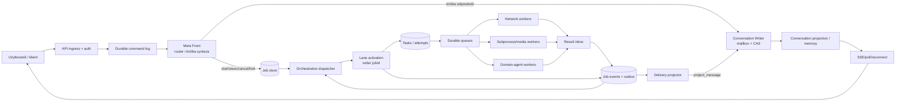

# Plan nadrzędny: responsywny Meta Front, trwała orkiestracja i kontrolowane wykonanie agentów

Status: **plan nadrzędny po audycie spójności; na branchu `refactor/meta-front-durable-orchestration` działa przekrojowy walking skeleton substratu Fal 3–4 oraz piloty późniejszych fal. Żadna z Fal 0–10 nie spełniła jeszcze pełnej bramki zamknięcia; aktualny postęp atomowych inkrementów odznaczany jest w §33 „Dziennik postępu implementacji”.**

Zakres: architektura, kontrakty, migracja, testy i rollout. Ten dokument **nie wprowadza zmian w kodzie**.

> ## ⏸️ PRACA NAD TYM PLANEM ZAMROŻONA (2026-07-29)
>
> **Nie porzucona — zamrożona.** Dorobek (PR-1..51, wszystkie owned komponenty §19.1,
> `gateStatus=PASSED` na czystym `4073249`) jest nienaruszony na branchu
> `refactor/meta-front-durable-orchestration` @ `517673a`.
>
> **Powód:** domknięcie G0 wymaga ~17–30 sesji (26 crash-window §20.3, migracja 28 z 31
> suite'ów, G8 partition/stepdown), a ta praca nie daje widocznej wartości, dopóki agenci
> nie zostaną przełączeni na nowy substrat — co jest jeszcze osobnym etapem.
>
> - **Jak wznowić + 5 pułapek, które już kosztowały czas:** [`docs/ORCHESTRATION-PAUSED-HANDOFF.md`](../docs/ORCHESTRATION-PAUSED-HANDOFF.md)
> - **Co robimy zamiast tego:** [`plan-dziecko-po-odlozeniu-g0.md`](./plan-dziecko-po-odlozeniu-g0.md) — plan-dziecko dla warstwy legacy
> - **Warunki powrotu tutaj:** §10 planu-dziecka (skala delegacji, wymóg trwałości, wiele instancji, dryf brancha)
>
> ⚠️ **Uwaga terminologiczna:** „Meta Front" w tym dokumencie (§4.1) to **nowa warstwa V2**
> z 10 komendami `start_job`/`get_job_status`/…, a **nie** dzisiejszy `metaAgent`
> (zweryfikowane: `metaAgent` używa tych komend zero razy). Plan-dziecko dotyczy `metaAgenta`.

Wersja bazowa kodu użyta przez raporty: `eff419ee54280fb4f517d56833ab8b772fbf485b`

Baseline: `67e6eed4-f256-47d2-8017-899eaf9e5edf`

Stan sprawdzony podczas końcowego review dokumentu (2026-07-23):

- bieżący commit repozytorium: `be701c12bfe00ed4ace462782503d15a5637de6d`;
- committed delta od baseline'u dodaje paczkę wyników i koryguje plan testów, bez zmian źródeł runtime;
- równolegle istnieją niecommitowane zmiany runtime/config w `src/mastra/config/model-capabilities.ts`, `src/mastra/config/model-manifest.ts` i `src/mastra/index.ts`, nowy `src/mastra/lib/groq-gateway.ts` oraz niezależny `docs/MODEL_OPTIMIZATION_GUIDE.md`; poza niniejszym planem nie zostały przez ten review zmienione;
- drift Groq jest materialny dla wcześniejszych wyników agent/model: capability availability sprawdza `OPENROUTER_API_KEY`, podczas gdy rejestracja gatewaya używa `GROQ_API_KEY`, a wpis `custom-groq/groq/qwen/qwen3.6-27b` ma więcej segmentów niż obecne wyprowadzanie listy przez `lastIndexOf('/')`. To są blokery re-baseline'u/config contractu, nie zatwierdzone rozwiązania;
- dlatego Fala 0 musi ponownie przypiąć commit oraz hash efektywnej konfiguracji, sklasyfikować cały powyższy drift, naprawić lub jawnie odrzucić te rozjazdy i odświeżyć source refs przed pierwszą zmianą implementacyjną. Poniższe wyniki agent/model pozostają przypisane do starego baseline'u i nie opisują nowych przypisań/gatewaya, dopóki nie przejdą re-baseline'u.

Aktualizacja po drugim audycie spójności (2026-07-23, weryfikacja względem żywego kodu):

- opisany wyżej drift jest **już zacommitowany** na HEAD `0a6543233c9cf3cdb1be8188839f9b9614372053` (`feat: add GroqGateway…`), a drzewo robocze jest **czyste**. Re-baseline Fali 0 przypina się więc do `0a65432`, a nie „reconcile uncommitted”; nadal klasyfikuje deltę `eff419…0a65432`;
- bug segmentu Groq potwierdzony w kodzie: `src/mastra/lib/groq-gateway.ts` wyprowadza listę modeli przez `slice(lastIndexOf('/') + 1)`, więc `custom-groq/groq/qwen/qwen3.6-27b` traci segment `qwen/` i do API idzie `qwen3.6-27b`. `model-capabilities.ts` gatuje dostępność po `OPENROUTER_API_KEY`, gateway rejestruje po `GROQ_API_KEY`. Zamknięcie: `DRIFT-AG-008` (patrz §27.2);
- potwierdzono: default store to `MongoDBStore` (`mongodb://…/agentforge`), DuckDB tylko observability; Mongo w `docker-compose.yml` działa **standalone** (`mongo:7`, bez `--replSet`, bez auth) — blokada §15.3 i bramka G8 są żywe;
- ten drugi audyt dodał dziewięć uzupełnień wykonalności/realizmu wdrożenia opisanych w **§32** (IDs `GAP-*`), spiętych z ADR (§26), kryteriami spike'u (§15.2), falami (§18) i bramkami (§21). Bez ich rozstrzygnięcia nie wolno zamknąć Fali 0.

## 0. Cel dokumentu i decyzja nadrzędna

Ten plan łączy w jeden program prac dwa problemy, których nie należy naprawiać niezależnie:

1. nieustrukturyzowane timeouty, niepełną propagację anulowania i niespójne ścieżki wykonania;
2. blokowanie Meta Agenta przez długie delegacje oraz brak trwałej, autonomicznie wznawianej orkiestracji zadań w tle.

Wspólnym źródłem obu problemów jest brak jednej granicy wykonania, jednoznacznej hierarchii identyfikatorów oraz trwałego właściciela cyklu życia pracy. Samo zwiększenie timeoutów nie usunie blokowania Meta Agenta. Samo uruchamianie kolejnych instancji Meta Agenta nie zapewni poprawnego routingu, wznowień, anulowania ani ochrony przed podwójnymi skutkami ubocznymi.

### Decyzja docelowa

System należy przebudować do modelu:

- **Meta Front** jest szybkim agentem konwersacyjnym i jedynym logicznym autorem rozmowy użytkownika;
- długie lub ryzykowne polecenie jest przyjmowane jako **trwały job** i szybko potwierdzane;
- każdy `jobId` ma jedną logiczną, sekwencyjną **linię orkiestracji**;
- linię mogą obsługiwać dowolne fizyczne repliki orkiestratora, ale tylko jedna aktywacja naraz może zmieniać stan danego joba;
- agenci domenowi działają jako izolowane próby w osobnych pulach workerów;
- wynik próby zapisuje zdarzenie i automatycznie budzi właściwą linię orkiestracji;
- orkiestrator ocenia wynik, ponawia, przeplanowuje, scala albo prosi użytkownika o decyzję;
- Meta Front pozostaje dostępny dla kolejnych wiadomości, statusów, sterowania i podsumowań;
- wszystkie wejścia do modelu, narzędzi, workflowów i workerów przechodzą przez wspólną bramę wykonania z budżetem, sygnałem anulowania, tożsamością, telemetryką i walidacją wyniku.

Preferowany wariant implementacyjny to aplikacyjny durable control plane na Mongo replica set (command/job/task/attempt, transactional inbox/outbox, leases/fencing), z Mastra jako runtime agentów-workerów. Port backendu i krótki conformance spike pozostają obowiązkowe: natywne mechanizmy Mastra mogą zastąpić część backendu tylko wtedy, gdy przejdą identyczny crash/cancel/wake suite. Temporal nie jest pierwszym krokiem.

### Odpowiedź na pytanie o liczbę Meta Agentów

Docelowo można uruchamiać wiele procesów i replik, ale nie wiele niezależnych „mózgów” zapisujących ten sam stan:

- dla jednej rozmowy istnieje **jeden logiczny writer Meta Frontu**, wymuszony partycjonowaniem, sekwencją komend lub optimistic concurrency;
- dla jednego joba istnieje **jeden logiczny writer linii orkiestracji**, chroniony lease'em i fencing tokenem;
- różne rozmowy i różne joby mogą być obsługiwane równolegle przez wiele replik;
- równoległe agenty pomocnicze mogą analizować lub recenzować, lecz publikują wyniki jako zdarzenia; nie zapisują samodzielnie rozmowy ani nadrzędnego stanu joba.

To daje skalowanie bez split-brain, podwójnych odpowiedzi i wyścigów na pamięci.

## 1. Materiał wejściowy i sposób jego użycia

Plan scala i zastępuje jako nadrzędne źródło decyzji:

- `ideas/timeouts-audit.md`;
- `ideas/timeouts-architecture-implementation-plan.md`;
- `ideas/meta-agent-nonblocking-orchestration-research.md`;
- `ideas/meta-agent-orchestration-baseline-test-plan.md`;
- pełną paczkę `ideas/meta-agent-orchestration-baseline-results/67e6eed4-f256-47d2-8017-899eaf9e5edf/`.

`timeouts-architecture-implementation-plan.md` pozostaje wartościowym, technicznym workstreamem adapterów timeout/cancel. Nie powinien być jednak wdrażany samodzielnie ani traktowany jako źródło docelowej architektury jobów. W przypadku sprzeczności obowiązuje niniejszy dokument.

### 1.1. Co baseline potwierdza

Baseline wystarcza do zaprojektowania architektury i kolejności migracji:

- przeanalizowano 29 zarejestrowanych agentów, 34 definicje źródłowe, 21 profili dynamicznych i 12 fingerprintów pamięci;
- zinwentaryzowano 309 powierzchni narzędziowych;
- statycznie zidentyfikowano, a w kilku fixture'ach zaobserwowano problemy tożsamości, pamięci, walidacji wyników, propagacji kontekstu, anulowania i trwałości; nie są to pełne E2E;
- zmapowano wszystkie istotne ścieżki: direct generate, Meta delegation, pipeline, async delegation, scheduler, background process, workflow oraz dynamic worker;
- kod analizowany przez baseline odpowiada commitowi `eff419ee54280fb4f517d56833ab8b772fbf485b`; bieżący worktree wymaga obowiązkowego re-baseline'u z powodu późniejszego commita i niecommitowanego driftu konfiguracji.

Liczby określające skalę, a nie gotowość produkcyjną:

| Obszar | Wynik baseline'u |
|---|---|
| Test records | 126: PASS 37, FAIL 27, BLOCKED 18, NOT_RUN 42, INCONCLUSIVE 2 |
| Źródło test records | observed 66, not_run 60 |
| Timing | 43 rekordy z active/total duration; brak wiarygodnego ACK/TTFT/queue/delivery/cancel/event-loop baseline |
| Steps | 24 rekordy, wszystkie `stepsUsed=1` |
| Tool calls w run records | 0 |
| Tool/runtime surfaces | 309, wszystkie live fixtures `NOT_RUN` |
| Primary category powierzchni | database 77, delegation 13, network 69, other 1, read 54, subprocess 49, write 46 |
| Oczekiwany czas | short 188, medium 54, long 30, unbounded 29, unknown 8 |
| Ryzyko | 221 z opisanym side effectem, 25 destructive, 36 oznaczonych blocking API |
| Lokalne mechanizmy | 107 z jakimś timeoutem, 43 z retry layer, 152 ze static risk |
| AbortSignal | 298 `false`, 11 `unknown/null`; zero właściwych tools potwierdzonych jako przyjmujące signal |
| Forwarding signal | jedna syntetyczna powierzchnia runtime, nie dowód pokrycia narzędzi |
| Tool evidence linkage | wszystkie 309 rekordów mają `evidenceIds=[]`; użyteczne są statyczne `implementationFile:line`, nie per-record raw evidence |
| Memory | dynamicznie sprawdzony 1 z 12 fingerprintów |
| Direct smoke | 13 z 29 agentów; CRM, Sales i Writer zwróciły tekst, 10 zwróciło pusty output w sztucznym profilu |
| Meta-mediated routes | 0 z 18 wykonanych; wszystkie 18 `BLOCKED` |
| Generate/stream | porównano tylko Sales na jednym lokalnym modelu; nie dowodzi to harness/path parity |

### 1.2. Czego baseline nie potwierdza

Baseline nie jest pełnym testem zachowania runtime'u. Nie wolno na jego podstawie:

- uznać agentów domenowych za gotowych do działania w tle;
- uznać, że Meta Front zachowuje responsywność pod obciążeniem;
- uznać, że dwa niezależne joby wykonują się poprawnie równolegle;
- uznać, że timeout zatrzymuje model, tool, pipeline albo drzewo procesów;
- uznać, że restart odzyskuje pracę;
- uznać, że wyniki są dostarczane dokładnie raz logicznie;
- zamrozić finalnych liczbowych timeoutów;
- ekstrapolować jakości agentów z testów `maxSteps: 1`, `toolChoice: none` i wymuszonego lokalnego modelu.

W paczce brak pomiarów ACK, TTFT, queue wait, delivery latency, event-loop lag, cancel-to-stop, retry count i zachowania po disconnect. Wszystkie 309 live fixtures narzędzi pozostają niewykonane.

`effectiveObserved` model jest `null` dla wszystkich profili inventory; runtime registry/public endpoint nie został uruchomiony. Część SDK defaults, env overrides, retry/timeout defaults i rzeczywisty storage URI pozostają nieustalone. Wszystkie „obecne” modele, kroki i ustawienia w dalszych tabelach oznaczają konfigurację statyczną, dopóki target manifest oraz staging trace nie potwierdzą wartości efektywnej.

### 1.3. Korekty interpretacyjne raportu

Przed wdrożeniem należy przyjąć następujące korekty:

- klasy wykonania siedmiu agentów są w raportach sprzeczne; klasyfikacja musi dotyczyć **operacji**, nie wyłącznie agenta;
- scenariusz `ORCH-PARALLEL-JOBS` nie udowodnił dwóch niezależnych jobów — zaobserwowano dwie nakładające się próby o tym samym `taskId`;
- `CAN-003` potwierdza brak fail-before-mutation dla pre-aborted requestu, ale nie potwierdza zatrzymania mid-flight;
- `MEM-001` potwierdza zapis wiadomości dwóch resources do jednego threadu, nie potwierdza jeszcze odczytowego wycieku danych;
- `AGT-001` jest sygnałem o fixture i profilu uruchomienia, a nie oceną produkcyjnej jakości agentów;
- `PASS` parsera lub fixture oznacza wykonanie testu, nie automatycznie spełnienie badanej właściwości;
- brak surowych fixture'ów i snapshotów ogranicza odtwarzalność części obserwacji;
- wszystkie 179 haszy evidence obejmują serializowany rekord wewnętrznego katalogu (67) albo samo `excerpt` (112), nie surowy stdout/snapshot/trace/artifact;
- `MEM-001` ma `reproducibility=once`, ale dwa rekordy test-run `CROSS-RESOURCE-SAME-THREAD.2/.3` współdzielą jeden evidence ID, a surowego snapshotu brak; reproduktor musi ustalić dokładny przebieg i rozdzielić run od evidence;
- 18 referencji `testCaseId` Meta-route jest uszkodzonych, cztery fixture IDs mieszają warianty `PASS` i `NOT_RUN`, a schema raportu ma drift;
- `sourceStatus=observed` obejmuje także część statycznych uruchomień audytowych, więc nie oznacza automatycznie live E2E;
- statyczne i dynamiczne części agent inventory nie wszędzie składają się do jednego `effectiveObserved`; przyszły raport musi rozdzielić deklarację, ścieżkę i obserwację;
- `EVT-001`, choć zapisany jako P2, jest **P1 i blokadą wydania** dla docelowej architektury;
- `HRN-001` i `HRN-002` są blokadami zgodności ścieżek, nawet jeżeli raport przypisał im niższą pilność.

Pierwsza faza planu utrwali reproduktory, rozdzieli `testExecutionStatus` od `targetInvariantStatus` i doda walidator schematu. Nie trzeba wykonywać kolejnego pełnego rerunu przed rozpoczęciem tej fazy.

### 1.4. Powiązane blokady znalezione poza główną listą failures

Przegląd kodu wskazuje także problemy, które muszą wejść do migracji:

- async delegation może oznaczyć delegację jako ukończoną przed skutecznym utworzeniem wpisu dostawy; błąd kolejki może pozostawić terminal bez deliverable;
- pending messages mają słabe/random identyfikatory, brak pełnego resource/conversation scope oraz wyścig `find → markConsumed`;
- generic async nie przenosi bieżącego authenticated resource i może użyć origin agent jako memory resource;
- scheduled runner używa stałego lease'u bez renewal/fence, ma wielozapisowe crash windows, brak trwałej komendy cancel do żywej pracy i raw agent generate;
- background task manager opiera ownership na mapach/listenerach procesu, może spawnąć przed zapisem DB i oznaczyć cancel przed potwierdzeniem exit;
- `services/automation-job-manager.ts` utrzymuje część postępu/wykonania w procesie, a cancel status/boolean nie zatrzymuje trwającego Golden Path; wymaga tego samego attempt/process authority, nie tylko migracji promptu Automation;
- `services/capability-build.ts` ma dłuższe komendy i quality gates niż lease/stale threshold, brak renewal, process-local `void runCapabilityBuild`, skokowy postęp oraz ryzyko równoległej mutacji repo i nieogrodzonego merge/promotion;
- Task Ledger i digest/claim paths mają read-validate-update oraz fire-and-forget races; Ledger jest obserwacją, nie bezpiecznym schedulerem;
- dynamic `run-worker` tworzy bare Agent calls bez jednolitej pamięci, deadline'u, harnessu, korelacji i trwałego attemptu;
- modelowe `attemptNumber` i identyfikatory oparte o `Date.now()` nie mogą być authority;
- bezpośrednie workflow calls i `trigger-workflow` mogą oczekiwać bez app-level deadline/cancel;
- scheduler, raw endpoints i stream omijają część dedykowanych harnessów;
- wiele mechanizmów cancel zmienia wyłącznie rekord lokalny albo przerywa waiter, nie rzeczywistą pracę;
- istniejące stałe timeoutów odnoszą się do różnych pojęć: requestu, waitera, workera, pollingu, lease'u i biznesowego SLA.

Te punkty są objęte Falami 1–9, capability manifestem, crash/cancel matrix oraz zakazem bypassów.

## 2. Cele, zakres i rzeczy poza zakresem

### 2.1. Cele funkcjonalne

Po zakończeniu programu system ma:

- potwierdzać przyjęcie długiej pracy po jej trwałym zapisaniu, bez oczekiwania na wykonanie;
- umożliwiać dalszą rozmowę podczas pracy jobów;
- pokazywać spójny status wszystkich jobów danej rozmowy i użytkownika;
- przyjmować komendy: steer, pause, resume, interrupt, cancel, fork i odpowiedź na approval;
- automatycznie kontynuować orkiestrację po wyniku workera, timerze, odpowiedzi użytkownika i restarcie;
- obsługiwać fan-out, review, retry, replan, fan-in i syntezę bez utrzymywania otwartego żądania HTTP;
- wznowić zaakceptowaną pracę po śmierci API, workera lub orkiestratora;
- uniemożliwić starej próbie nadpisanie nowszego planu albo wykonanie spóźnionego skutku ubocznego;
- dostarczać użytkownikowi wynik co najmniej raz transportowo i dokładnie raz logicznie;
- zachować wyraźną granicę między pamięcią rozmowy, stanem joba, pamięcią próby i pamięcią domenową.

### 2.2. Cele niefunkcjonalne

- jawne budżety czasu i zasobów;
- rzeczywiste anulowanie, a nie wyłącznie przerwanie oczekiwania;
- brak globalnych fallbacków tożsamości;
- brak ścieżek produkcyjnych omijających wspólne inwarianty;
- backpressure, fairness i rezerwa zasobów dla Meta Frontu;
- pełna obserwowalność hierarchii conversation → job → task → attempt → runtime run → tool;
- stopniowa migracja z rollbackiem i bez „big bang”;
- testy deterministyczne bez płatnych i zewnętrznych skutków ubocznych;
- możliwość skalowania horyzontalnego bez zależności od pamięci procesu.

### 2.3. Poza zakresem pierwszego wydania

- finalne strojenie liczbowych timeoutów przed zebraniem telemetryki p50/p95/p99;
- automatyczne skalowanie według kosztu LLM;
- Temporal jako z góry wybrana technologia;
- pełna przebudowa promptów i jakości merytorycznej każdego agenta;
- równoczesna migracja wszystkich narzędzi;
- głos jako pierwszy kanał docelowy;
- traktowanie Task Ledger jako schedulera bez przebudowy jego kontraktu.

## 3. Nienaruszalne zasady architektury

Poniższe zasady są kryteriami review kodu i testów:

1. **Durable before ACK.** Odpowiedź `accepted` może powstać dopiero po trwałym zapisie komendy i joba.
2. **Fail closed on identity.** Brak tenant/resource/conversation albo niezgodność właściciela kończy żądanie przed zapisem pamięci.
3. **One logical writer.** Jedna sekwencja zapisu na conversation i jedna na job, niezależnie od liczby replik.
4. **Thread is not authority.** `threadId` jest kontenerem pamięci, nie identyfikatorem użytkownika, joba, taska, próby ani uprawnienia.
5. **One intent, many attempts.** `taskId` opisuje logiczne zadanie; każda próba i każdy runtime call mają odrębny, serwerowy identyfikator.
6. **No false success.** Tylko poprawnie zwalidowany wynik może mieć status `ok`; puste dane, proza i malformed JSON nie są sukcesem.
7. **Timeout means stop requested and verified.** Timeout musi uruchomić anulowanie, a terminalny status ma odzwierciedlać, czy pracę faktycznie zatrzymano.
8. **A stale worker has no authority.** Lease, fencing token, `planVersion` i attempt ownership są sprawdzane przed terminalizacją oraz skutkiem ubocznym.
9. **State plus event is atomic.** Zmiana stanu wymagająca powiadomienia zapisuje outbox w tej samej granicy atomowej.
10. **At-least-once transport, idempotent projection.** Deduplikujemy command, event, result i delivery; nie opieramy poprawności na exactly-once transporcie.
11. **Workers do not own conversation memory.** Publikują wynik i artefakty, nie dopisują odpowiedzi do rozmowy użytkownika.
12. **Waiting releases lane compute ownership.** `AWAITING_USER`, timer i `AWAITING_RESULTS` nie utrzymują requestu, AbortControllera ani lease'u aktywacji lane'a. Workery nadal wykonujące attempty mają własne, niezależne lease'y i budżety aż do wyniku lub stopu.
13. **All execution paths share a kernel.** Generate, stream, delegation, workflow, scheduler, worker i background process respektują te same inwarianty.
14. **Profiles may differ, invariants may not.** Ciężki harness/reflection jest profilowany, lecz identity, budget, cancel, result i telemetry są wspólne.
15. **Front capacity is protected.** Długie joby nie mogą wyczerpać wszystkich slotów modelu, Node event loop, subprocessów ani provider quota.
16. **Control commands are durable and ordered.** Status nie uruchamia pracy ponownie; steer/cancel/fork mają jawne wersje i kolejność.
17. **No irreversible retry without policy.** Skutki uboczne wymagają klucza idempotency, preflight/read-back albo kompensacji.
18. **Unknown remains unknown.** Jeżeli nie potwierdzono zatrzymania lub skutku zewnętrznego, status brzmi `unknown_outcome`, a nie `failed` ani `cancelled`.

## 4. Architektura docelowa



### 4.1. Meta Front

Odpowiada za:

- krótką rozmowę i wyjaśnianie intencji;
- autoryzację oraz związanie `resourceId` z `conversationId`;
- klasyfikację operacji na front/bounded/job;
- utworzenie trwałej komendy;
- szybkie potwierdzenie `accepted`;
- status, listę jobów i prezentację progresu;
- zapis poleceń sterujących użytkownika;
- projekcję zweryfikowanych zdarzeń joba do rozmowy;
- finalne, użytkowe podsumowanie wyniku.

Nie odpowiada za:

- bezpośrednie wykonywanie długich agentów;
- polling zewnętrznych usług;
- shell, git, NotebookLM, Graphify, Playwright, n8n ani płatne generowanie;
- surowe zapytania do bazy;
- bezpośrednie mutacje domenowe;
- utrzymywanie otwartego połączenia do zakończenia joba.

Docelowa powierzchnia narzędzi Meta Frontu to mały, deterministyczny zestaw command/query:

- `start_job`;
- `get_job_status`;
- `list_jobs`;
- `steer_job`;
- `pause_job`;
- `resume_job`;
- `interrupt_attempt`;
- `cancel_job`;
- `fork_job`;
- `answer_job_request`;
- `read_job_artifact`;
- opcjonalna, jawna allowlista bardzo krótkich read-only tools.

Obecna powierzchnia Meta Agenta — 37 narzędzi eager, około 55 discoverable i znacznie większa liczba powiązanych runtime surfaces — musi zostać rozcięta. Sam prompt zakazujący długich wywołań nie jest granicą bezpieczeństwa.

### 4.2. Orchestration Service i Lane Orchestrator

Orchestration Service jest deterministycznym właścicielem:

- claimowania aktywacji;
- weryfikacji wersji, lease'u i fence;
- redukcji zdarzeń do aktualnego stanu;
- uruchamiania timera/retry;
- budzenia joba po zdarzeniu;
- egzekwowania limitów fan-out i budżetów;
- końcowej terminalizacji.

Lane Orchestrator jest agentowym komponentem decyzyjnym wewnątrz tej granicy. Może:

- zbudować lub zaktualizować plan;
- rozbić cel na tasks;
- wybrać profil wykonania;
- ocenić wyniki i evidence;
- zdecydować retry/replan/review;
- przygotować syntezę;
- sformułować pytanie do użytkownika.

Nie może:

- samodzielnie omijać kolejki i wykonywać dowolnych narzędzi domenowych;
- zapisywać rozmowy użytkownika;
- terminalizować bez walidacji stanu i wersji przez Orchestration Service;
- ufać modelowemu `attemptNumber`, `taskId`, statusowi ani fencing tokenowi;
- utrzymywać swojej poprawności wyłącznie w LLM working memory.

Każda aktywacja linii jest krótka i kończy się jedną z decyzji: dispatch, wait, request_user, synthesize lub terminalize. Oczekiwanie na workery odbywa się w stanie trwałym, nie wewnątrz wywołania modelu.

### 4.3. Worker pools

Workery są rozdzielone co najmniej na:

- lekkie wywołania modelu i krótkie read-only tools;
- operacje sieciowe i polling;
- subprocessy, git, przeglądarkę, NotebookLM i Graphify;
- płatne/media generation;
- wyspecjalizowane pipeline'y domenowe;
- scheduled i maintenance.

Każda pula ma własne:

- concurrency limit;
- queue limit;
- lease TTL i heartbeat;
- domyślny profil budżetu;
- politykę retry;
- politykę skutków ubocznych;
- telemetrykę wykorzystania;
- circuit breaker i backpressure.

### 4.4. Conversation projection i delivery

Stan joba nie jest dopisywany do rozmowy przez workera. Delivery projector:

- konsumuje outbox;
- buduje idempotentną projekcję użytkową;
- zapisuje `deliveryId` i emituje `project_message` do tej samej per-conversation mailbox;
- nie przydziela sam `conversationSequence` i nie zapisuje conversation memory;
- emituje SSE/websocket lub udostępnia polling;
- po reconnect odtwarza brakujące zdarzenia;
- nie uruchamia joba ponownie podczas odczytu statusu.

Wyłącznie Conversation Writer claimuje mailbox, inkrementuje `conversationSequence` przez CAS i zapisuje kontrolowaną projekcję do rozmowy/pamięci. Naturalna synteza jest idempotentnym projection taskiem keyed by `conversationId + terminalEventId + target`, z `projectionPolicyVersion` przypiętą w zdarzeniu przed dispatch; zaakceptowany tekst jest utrwalany raz i może być ponownie dostarczany bez ponownej generacji. Źródłem prawdy pozostają ustrukturyzowany stan joba, wynik i artefakty.

## 5. Tożsamość, autoryzacja i korelacja

### 5.1. Kanoniczna hierarchia identyfikatorów

| Pole | Znaczenie | Właściciel | Reguła |
|---|---|---|---|
| `tenantId` / `resourceId` | granica użytkownika/organizacji | auth/ingress | wymagane, niepochodzące od modelu |
| `principalId` | uwierzytelniony użytkownik/usługa wykonująca akcję | auth | audyt i authorization, odrębne od owner resource |
| `agentProfileId` | kanoniczny profil agenta/wykonawcy | versioned registry | jedna pisownia w nowych rekordach; alias tylko na boundary |
| `capabilityId` | kanoniczna operacja i policy key | capability registry | routing per operation, nie per dowolna nazwa toola |
| `workerInstanceId` | fizyczny proces/replika | runtime | obserwowalność, nigdy logiczny owner |
| `conversationId` | logiczna rozmowa | ingress | należy do resource |
| `conversationThreadId` | kontener pamięci rozmowy | memory adapter | jeden immutable owner |
| `messageId` | wiadomość użytkownika/systemu | ingress | unikalny i idempotentny |
| `commandId` | żądanie start/steer/cancel itd. | ingress | deduplikacja retry klienta |
| `turnId` | zaakceptowana tura rozmowy | Conversation Front | grupuje message/command/reply bez bycia security ID |
| `jobId` | jeden cel użytkownika i klucz lane | Job Service | stabilny przez replan |
| `parentJobId` | jawna relacja fork/nested job | Job Service | zawsze z typed `jobRelationMode`; sam identyfikator nie przenosi authority |
| `jobRelationMode` | `ATTACHED` albo `DETACHED` | Job Service | delegacja nested domyślnie `ATTACHED`; `DETACHED` tylko przez jawny fork/niezależny command |
| `planVersion` | wersja obowiązującego planu | Orchestration Service | monotoniczna |
| `taskId` | logiczny krok planu | Orchestration Service | stabilny przez retry |
| `parentTaskId` | logiczny rodzic child taska | Orchestration Service | jawny albo `null`; nie jest wyprowadzany z trace |
| `attemptId` | konkretna serwerowa próba taska | dispatcher | zawsze nowy |
| `parentAttemptId` | próba, która zażądała dynamicznego child taska | dispatcher | provenance; nie daje authority childowi |
| `dispatchEdgeId` | trwała krawędź parent → child | Orchestration Service | dedupe, budżet, adjacency i cancel propagation |
| `dispatchEdgeGeneration` | epoka authority relacji parent → child | Orchestration Service | stale child/result/stop ACK nie może ponownie otworzyć parenta |
| `edgeCompletionMode` | `REQUIRED` albo `OPTIONAL_SPECULATIVE` | Orchestration Service | child dynamiczny domyślnie required; optional nadal musi zostać zatrzymany/rozliczony |
| `attemptNumber` | numer próby taska | dispatcher/store | serwerowy, monotoniczny per task |
| `runtimeRunId` | pojedyncze wywołanie framework/model | Execution Gateway | zawsze nowy, także w tej samej próbie |
| `rootRunId` / `parentRunId` | korelacja trace | Execution Gateway | nigdy authority |
| `activationId` | jedno wybudzenie i commit lane'a | dispatcher | własny lease/deadline/fence |
| `stateVersion` | wersja agregatu conversation/joba | store | CAS, odrębna od planVersion |
| `controlVersion` | kolejność zastosowanych komend sterujących | Job Service | monotoniczna, zapisywana przy dispatch wyłącznie do audytu |
| `pauseGeneration` | epoka polityki manual pause | Job Service | rośnie przy każdym nowym pause; attempt zapisuje epokę admission |
| `activationDispatchGeneration` | epoka claimowania lane activations/wakes | Job Service | pause/resume/terminal barrier unieważnia stare PENDING wakes |
| `jobStopGeneration` | generacja terminalnej bariery wykonania całego joba | Job Service | wzrasta raz także przy normalnej/partial/failure terminalizacji, aby odciąć siblings |
| `taskStopGeneration` | generacja bariery konkretnego taska, np. jego due deadline | Orchestration Service | blokuje claim/result taska bez terminalizowania całego joba |
| `stopGeneration` | wersja stop requestu konkretnego attemptu | dispatcher | odróżnia stare ACK/late result |
| `eventId` | zdarzenie domenowe | zapisujący komponent | dedupe inbox |
| `outboxId` | rekord do publikacji | transakcja stanu | unikalny |
| `deliveryId` | projekcja do odbiorcy | delivery service | idempotentny per target |
| `leaseOwner` | bieżący worker/replika | dispatcher | czasowy |
| `attemptFence` | autorytet lease'u workera dla attemptu | attempt store | rośnie przy claimie, sprawdzany przy wyniku/skutku |
| `activationFence` | autorytet krótkiej aktywacji lane'a | job store | rośnie przy claimie aktywacji, sprawdzany przy redukcji joba |
| `artifactId` | trwały obiekt wynikowy | artifact store | ACL, hash i immutable provenance |
| `externalOperationId` | jeden logiczny skutek zewnętrzny | side-effect ledger | stabilny przez retry/reconciliation |
| `idempotencyKey` | logiczny skutek zewnętrzny | task/tool policy | stabilny dla jednego intentu |

Nie wprowadzamy osobnego `laneId`, jeśli jest tylko aliasem `jobId`. Jeżeli później jeden job będzie miał wiele niezależnych pod-lanes, powstaje jawny `branchId`, a nie nieokreślony drugi identyfikator.

Child task w tym samym jobie dziedziczy `jobId`, ale posiada własne `taskId/attemptId` i trwały `dispatchEdgeId`. Edge zapisuje `parentTaskId`, opcjonalny `parentAttemptId`, profile/capabilities obu stron, snapshot `planVersion/attemptFence/jobStopGeneration`, `dispatchEdgeGeneration`, przydział budżetu/fan-out oraz policy propagacji pause/cancel. Nested job ma dodatkowo nowy `jobId + parentJobId + jobRelationMode`; samo `parentRunId` pozostaje trace-only i nie zastępuje tej relacji.

Każdy dynamiczny child dispatch jest dozwolony tylko przez wersjonowaną adjacency allowlistę `parentProfile/capability → childProfile/capability`, z `maxDepth`, `maxChildren`, effect scope i regułą `sameWaveOrPrerequisite`. Stary parent fence nie może utworzyć nowej krawędzi. Przyjęty child ma następnie własne authority; jego wynik wraca przez edge i podlega wersjom całego joba. Wildcard „dowolny pozostały profil” nie jest dopuszczalny w produkcyjnym manifeście.

Krawędź ma trwały FSM:

```text
PROPOSED → ACCEPTED → ACTIVE → SETTLED
    │          │          └→ CANCEL_REQUESTED → TERMINAL_CONFIRMED → SETTLED
    │          └───────────→ CANCEL_REQUESTED → UNKNOWN
    └──────────────────────→ ABORTED
```

- każdy same-job child task także używa tego FSM i `dispatchAncestorEdgeChain`, mimo że nie ma `jobRelationMode`. Parent task nie może zaakceptować finalnego wyniku przed `SETTLED` required edges; po wyborze optional/speculative wyniku atomowo stopuje pozostałe edges i czeka na ich attempt/effect settlement albo uncertainty override;
- `TERMINAL_CONFIRMED` potwierdza zatrzymanie child execution, ale nie jest jeszcze stanem bariery. Reducer przechodzi z niego do `SETTLED` dopiero po rozliczeniu child attempts/reservations, znanym stanie effects, zamknięciu descendants i utrwaleniu jednego completion eventu; reguła jest identyczna dla same-job i `ATTACHED`;
- job terminal barrier wymaga `SETTLED/ABORTED` lub barrier-resolved `UNKNOWN` wszystkich same-job edges. Edge nieznany jest rozwiązaniem bariery dopiero po odebraniu claim/dispatch/effect authority i przypisaniu recovery ownera; w przeciwnym razie nadal blokuje;
- obok lifecycle edge ma `edgeControlState=NONE|PAUSE_REQUESTED|PAUSED|STOP_REQUESTED` i własną generację control. `ATTACHED` jest obowiązkowe dla nested joba będącego częścią wyniku parenta. Child otrzymuje deadline nie późniejszy niż parent, jawny przydział z parent budgetu oraz terminalną relację stop;
- każdy attached descendant claim oraz każdy nowy memory/model/tool/child/effect permit dotyka w jednej transakcji całego persistowanego, ograniczonego przez `maxDepth` `ancestorEdgeChain` i authority każdego przodka: wszystkie edges muszą być `ACTIVE/NONE` z właściwą generation, a wszystkie parenty mieć niezmienione `planVersion/jobStopGeneration`, `controlState=NONE` i ważny business-time authority. Stop/pause/replan dowolnego przodka unieważnia więc również wnuki przed następnym efektem; samo opóźnienie kaskadowego outboxu nie tworzy okna na pracę;
- parent pause zwiększa edge control generation, ustawia `PAUSE_REQUESTED` i emituje child-pause outbox. Aktywna praca stosuje przypiętą `cascade_interrupt` albo `cascade_finish_current`, ale nie rozpoczyna następnej operacji. Child odpowiada current-generation `PAUSED` po własnej barierze albo `SETTLED`, jeśli w międzyczasie zakończył się; samo przejściowe `TERMINAL_CONFIRMED` nadal wymaga settlement. Parent może pokazać `PAUSED` dopiero po takim ACK wszystkich attached edges;
- resume parenta zwiększa edge control generation ponownie, atomowo przełącza potwierdzone `PAUSED → NONE` i emituje najwyżej jeden current-generation child-resume wake per edge. Stary pause/resume ACK jest no-op; `DETACHED` nie bierze udziału;
- steer/replan parenta w tym samym commicie co `planVersion` zwiększa generations niezakończonych attached edges i stosuje przypiętą policy `cascade_interrupt` albo bezpieczne bounded `finish_as_evidence`; pre-dispatch child jest od razu `ABORTED` i zwalnia reservation, aktywny przechodzi do `CANCEL_REQUESTED`/evidence-only, a outbox niesie bieżącą generation. Stary child nie ma już claim/operation/effect authority, jego reservation rozlicza current-generation stop/evidence ACK dokładnie raz, a nowy plan tworzy nowy edge zamiast wskrzeszać stary;
- pierwszy terminal-stop CAS parenta zwiększa parent/edge control generation, odcina operation authority wszystkich attached children, ustawia ich edge intent na `STOP_REQUESTED/CANCEL_REQUESTED` i emituje child-stop outbox. Nie ma policy pozwalającej attached childowi kontynuować po terminalizacji parenta;
- terminal barrier parenta czeka na `SETTLED` każdego attached childa. Przejściowe `TERMINAL_CONFIRMED` nie zamyka bariery, dopóki nie są rozliczone reservations/descendants i znane effects. Po wyczerpaniu stop/reconciliation policy dopuszcza także barrier-resolved edge `UNKNOWN`, ale wyłącznie po trwałym odebraniu childowi claim/dispatch/effect authority i przypisaniu recovery ownera; wymusza to task lineage i terminalny wynik parenta `UNKNOWN_OUTCOME`. Edge z wciąż ważnym child authority albo żywą, nieodciętą pracą nadal blokuje barierę;
- `DETACHED` wymaga jawnie autoryzowanego `fork_job`/nowego commandu, własnego budżetu, deadline'u, recovery ownera i projekcji. Nie jest liczony do bariery źródła i nigdy nie powstaje ukrycie jako sposób obejścia cancel;
- zwykły child business result wymaga snapshotu `dispatchEdgeId + dispatchEdgeGeneration + parent planVersion/jobStopGeneration` z dispatchu. Po stop/replan zawsze staje się stale. Po pause jedynym wyjątkiem jest attempt atomowo uchwycony przez pause CAS w current edge finish set przy `cascade_finish_current`; może on zakończyć już rozpoczęty call i wejść wyłącznie przez current-generation RESULT_DRAIN, bez nowej operacji. Każdy nieuchwycony albo old-generation result po pause jest stale. Osobne child stop/pause/terminal ACK authority wymaga **bieżącej** edge/control generation i parent stop/pause intent, aby mogło zamknąć barierę, ale nie może zastosować business resultu. Spóźniony child może zostać zachowany jako evidence/resolution event, lecz nie wznawia i nie terminalizuje ponownie parenta;
- edge acceptance oraz utworzenie child taska/joba i outboxu są jedną granicą atomową. `ACCEPTED` bez odzyskiwalnego childa lub child bez edge jest niedopuszczalny.

### 5.2. Reguły wejścia

Każde wejście produkcyjne:

1. uwierzytelnia wywołującego;
2. mapuje credential na `tenantId/resourceId`;
3. sprawdza własność `conversationId`, joba i artifactu;
4. nie przyjmuje ownera z treści generowanej przez model;
5. wymaga `commandId` dla mutacji;
6. odrzuca brak identity przed jakimkolwiek zapisem wiadomości;
7. sprawdza immutable owner istniejącego threadu przed każdą operacją pamięci;
8. zapisuje audit event także dla odrzuconych prób, lecz nie zapisuje ich do pamięci rozmowy.

`META_AGENT_ID` nie może być fallbackiem resource użytkownika. Brak `resourceId` jest błędem kontraktu.

Alias registry jest wersjonowane i testowane dla wszystkich nazw registry/runtime/DB. Canonicalization odbywa się na ingressie; nowe rekordy zapisują wyłącznie `agentProfileId`. Legacy reads przez okres migracji rozpoznają aliasy i mają reconciler kolizji. W szczególności trzeba zamknąć rozjazdy `metaAgent`/`meta-agent` i `capabilitySmith`/`capability-smith`, a model routing musi raportować configured oraz rzeczywiście resolved model.

### 5.3. Autoryzacja komend

- status/list może czytać wyłącznie owner lub uprawniona rola tenantowa;
- steer/pause/resume/cancel/fork musi wskazywać `jobId`, `commandId` i oczekiwaną wersję albo semantykę konfliktu;
- artefakty dziedziczą tenant/resource/job ACL;
- operator administracyjny używa osobnego, audytowanego scope'u;
- result event od workera jest przyjmowany na podstawie attempt capability/credential oraz zgodnego fence, nie na podstawie samego `jobId`;
- `threadId` nigdy nie wystarcza do autoryzacji.
- worker otrzymuje krótkotrwałe, attempt-scoped credentials wyłącznie do przydzielonych capabilities, artifact scope i result submit;
- sekrety są rozwiązywane przez runtime adapter, nie trafiają do promptu ani trwałego event payloadu.

## 6. Model pamięci

| Warstwa | Zawartość | Kto zapisuje | Czego nie wolno tam przechowywać |
|---|---|---|---|
| Conversation memory | dialog, preferencje rozmowy, krótkie podsumowania jobów | Conversation Writer w granicy Frontu | mutable job state, lease, retry counters |
| Durable job state | cel, plan, statusy, budżety, komendy, evidence refs | Job/Orchestration Service | nieustrukturyzowany scratchpad jako jedyne źródło prawdy |
| Lane context | zwięzły snapshot planu i wyników dla jednej aktywacji | Orchestration Service | dane innych jobów/rozmów |
| Attempt context | input jednej próby i ograniczone artefakty | Execution Gateway | conversation history bez jawnej potrzeby |
| Domain long-term memory | zatwierdzone fakty domenowe | jawna polityka namespace/write | tymczasowe chain-of-thought, secrets, stan lease |

Zasady:

- worker nie zapisuje do conversation thread;
- attempt dostaje prywatny thread lub działa bez Memory;
- wynik jest publikowany do result inbox, a nie do pamięci Meta;
- lane może korzystać z pamięci wyłącznie job-local, lecz trwały store nadal jest źródłem prawdy;
- długoterminowy zapis domenowy wymaga namespace, provenance, ACL, retention i jawnej polityki write;
- working memory nie może domyślnie używać resource globalnego;
- przed zapisem wiadomości adapter porównuje owner threadu z authenticated resource;
- pamięć i request identity są przekazywane przez typed `ExecutionContext`, nie przez luźne metadata.
- wyniki workerów są niezaufanymi danymi: mają limit rozmiaru, są walidowane i trafiają do wyznaczonego pola/artefaktu, nie są doklejane jako instrukcja systemowa;
- Lane buduje kontekst z wersjonowanego snapshotu conversation/job/artifacts, a nie z przypadkowego wspólnego threadu.

### 6.1. Migracja istniejących fingerprintów

W baseline występuje 12 fingerprintów:

- `MF-00-NONE`: CRM oraz 21 dynamicznych profili bez skonfigurowanej Memory;
- `MF-01-DEFAULT`: Weather;
- `MF-02-LM10`: Analytics;
- `MF-03-LM15`: Marketing, Sales, sześciu producer helpers i pięciu weekly-content workflow-only agents;
- `MF-04-META`: Meta, 30 wiadomości, observational memory i working memory;
- `MF-05-AUTOMATION`: Automation, 30, OM i WM;
- `MF-06-KNOWLEDGE`: Knowledge, 30, OM i WM;
- `MF-07-N8N`: n8n, 24, OM i WM;
- `MF-08-CODING`: Coding, 30, bez OM/WM;
- `MF-09-REVIEW`: trzech reviewerów, 30, OM;
- `MF-10-DELIBERATION`: Deliberation, 20, OM i WM;
- `MF-11-DOMAIN20`: pozostałe domenowe, 20.

Nie przenosimy tych ustawień automatycznie do workerów. Dla każdego profilu trzeba ustalić:

- czy pamięć jest w ogóle potrzebna;
- namespace i owner;
- maksymalny kontekst;
- politykę odczytu/zapisu;
- retencję;
- zachowanie po retry, fork i replan;
- test izolacji resource/conversation/job/attempt.

Do czasu przejścia testów izolacji working memory agentów domenowych nie może być współdzielonym kanałem między jobami.

### 6.2. Macierz efektywnych ścieżek pamięci

Coverage nie może scalać różnych adapterów pod etykietą „delegation”. Dla każdego profilu manifest deklaruje osobno:

- `direct_generate`;
- `direct_stream`;
- `sync_delegation`;
- `async_delegation`;
- `pipeline`;
- `workflow`;
- `scheduled`;
- `dynamic_worker`;
- `background_process`;
- `lane_activation`;
- `conversation_projection`.

Każda komórka ma `APPLICABLE` albo `NOT_APPLICABLE` z uzasadnieniem i ownerem decyzji; brak wpisu jest błędem walidacji. Dla `APPLICABLE` zapisujemy effective memory mode, read/write policy, namespace owner, source snapshot i oczekiwany brak conversation write przez workera. G1 uruchamia isolation/read/write/no-memory assertions dla każdej komórki, a nie tylko po jednym teście na 12 fingerprintów. `sync_delegation`, `async_delegation` i `pipeline` pozostają osobne, ponieważ obecnie mają różne wrappery, lifecycle i ryzyko użycia resource.

## 7. Modele stanu

Nie należy utrzymywać jednego, przeciążonego pola `status`. Rekomendowany model oddziela fazę biznesową, intencję sterującą, wynik końcowy oraz stan krótkiej aktywacji wykonawczej.

### 7.1. Job

`phase`:

- `ACCEPTED` — komenda i minimalny job zostały trwale zapisane;
- `READY`;
- `PLANNING`;
- `DISPATCHING`;
- `AWAITING_RESULTS`;
- `REVIEWING`;
- `WAITING_RETRY`;
- `REPLANNING`;
- `AWAITING_USER`;
- `AWAITING_APPROVAL`;
- `AWAITING_EXTERNAL`;
- `RECONCILING`;
- `SYNTHESIZING`;
- `PAUSED`;
- `TERMINAL`.

`controlState`:

- `NONE`;
- `PAUSE_REQUESTED`;
- `STOP_REQUESTED`.

Każda zastosowana komenda sterująca zwiększa audit/order-only `controlVersion`; sama jego zmiana nie unieważnia attemptu. Pierwsza terminalna bariera całego joba — `user_cancel`, `job_deadline`, `active_budget_exhausted`, `operator_stop`, `goal_satisfied`, `partial_accepted`, `terminal_failure`, `terminal_blocked`, `reconciliation_exhausted` albo `unknown_outcome_accepted` — wygrywa CAS z `NONE/PAUSE_REQUESTED` do `STOP_REQUESTED`, zapisuje immutable `primaryJobStopCause`, zwiększa `jobStopGeneration` dokładnie raz, ustawia `stopGraceDueAt` i emituje stop outbox. Późniejsze równoczesne intencje trafiają do `secondaryJobStopCauses`/audytu bez kolejnego zwiększenia generation i bez przesunięcia grace. Attempt przechowuje `planVersion`, `jobStopGenerationAtDispatch`, `taskStopGenerationAtDispatch` i własny `stopGeneration` z momentu dispatchu. Niezgodność którejkolwiek z tych czterech execution generations odrzuca normalny result jako stale; audit-only `controlVersion` nie.

`terminalOutcome` jest `null` aż do `TERMINAL`, a następnie przyjmuje:

- `COMPLETED`;
- `PARTIAL`;
- `BLOCKED`;
- `FAILED`;
- `TIMED_OUT`;
- `CANCELLED`;
- `UNKNOWN_OUTCOME`.

API może wyliczać przyjazne statusy `queued`, `running`, `waiting`, `cancelling`, `timing_out` na podstawie fazy, control state, `primaryJobStopCause`, aktywnych attempts i aktywacji. Nie zapisujemy jednak lease'owego `ACTIVE/RUNNING` jako biznesowego stanu całego joba.

Reguły:

- `COMPLETED` wymaga zwalidowanego final resultu i spełnienia kryteriów celu;
- `PARTIAL` wymaga jawnego wykazu wykonanych i niewykonanych elementów;
- `BLOCKED` oznacza znaną, zewnętrzną blokadę bez aktywnej pracy;
- `TIMED_OUT` oznacza wyczerpanie polityki czasu dopiero po potwierdzonym ustaniu wszystkich aktywnych prób i aktywacji lane'a oraz znanym stanie skutków; w przeciwnym razie obowiązuje `UNKNOWN_OUTCOME`;
- `CANCELLED` jest legalne dopiero po potwierdzeniu ustania wszystkich aktywnych prób i aktywacji lane'a oraz rozstrzygnięciu `DISPATCHING/UNKNOWN/RECONCILING` effect operations;
- `UNKNOWN_OUTCOME` jest wymagane, jeśli nie można stwierdzić, czy skutek uboczny nastąpił albo czy proces się zatrzymał;
- terminalny job nie może wrócić do aktywnego stanu; kontynuacja tworzy `fork_job`.

Każde żądane `terminalOutcome`, nie tylko cancel/timeout, najpierw zapisuje `pendingTerminalOutcome` i zamyka wykonanie przez terminal barrier. `phase=TERMINAL` jest legalne dopiero, gdy:

- wszystkie attempty są `FINISHED` i mają reservation rozliczoną dokładnie raz — zero `CREATED/QUEUED/LEASED/RUNNING/EVIDENCE_ONLY/STOP_REQUESTED`; nie istnieje żadna inna aktywacja lane'a, a bieżąca terminalizująca aktywacja przechodzi atomowo do `COMMITTED`;
- nie istnieje żaden claimowalny/nonterminal task; wszystkie niewykonane taski są zmapowane według przyczyny bariery;
- wszystkie same-job dispatch edges są `SETTLED/ABORTED` albo barrier-resolved `UNKNOWN` ze skutkiem opisanym poniżej;
- wszystkie `ATTACHED` nested jobs mają edges `SETTLED` albo barrier-resolved `UNKNOWN`; ten ostatni wymaga odciętego child authority i durable recovery ownera oraz wymusza `UNKNOWN_OUTCOME`. `TERMINAL_CONFIRMED` pozostaje przejściowe; żywy, nadal autorytatywny albo nierozliczony child wciąż blokuje terminalizację;
- nie istnieje aktywny control request/approval; terminal-stop CAS unieważnia je, zwiększa ich własne request generations i blokuje późną odpowiedź;
- wszystkie effect operations są w znanym stanie albo wynik musi być `UNKNOWN_OUTCOME`;
- nie istnieje nieopublikowany zwykły artifact zdolny stać się widoczny bez aktualnego fence;
- terminal event i outbox powstają w tym samym CAS.

Jeżeli fan-out/speculative siblings nadal działają, `goal_satisfied/PARTIAL/FAILED/BLOCKED` najpierw fence'uje i zatrzymuje pozostałe gałęzie. Dopiero bariera ustala finalny outcome; szybka ścieżka w jednym commicie jest dozwolona wyłącznie, gdy active set był już pusty.

Przejściowa blokada nie jest terminalnym `BLOCKED`: użytkownik, approval, zależność lub system zewnętrzny mapują się na odpowiednią fazę `AWAITING_*`, typed `waitReason` i ewentualny expiry. Terminalne `BLOCKED` jest dopuszczalne tylko wtedy, gdy polityka lub użytkownik zamknęli możliwość wznowienia.

`UNKNOWN_OUTCOME` attemptu lub zdalnej operacji nie terminalizuje joba od razu. Job przechodzi do `RECONCILING`/`AWAITING_EXTERNAL`, bez ślepego retry. Terminalny `UNKNOWN_OUTCOME` powstaje dopiero po wyczerpaniu wersjonowanej polityki reconciliation albo decyzji operatora/użytkownika. Późniejszy fakt jest dopisywany jako immutable resolution event i może zasilić fork; nie otwiera ponownie terminalnego joba.

Manual pause oraz oczekiwanie mogą się nakładać. Authority przechowuje zbiór typed `suspensions`, co najmniej:

- `MANUAL_PAUSE`;
- `AWAITING_USER:{requestId}`;
- `AWAITING_APPROVAL:{requestId}`;
- `AWAITING_EXTERNAL:{dependencyId}`.

Policy wylicza z niego osobno `dispatchBlockingReasons` i `slaPauseReasons`. `slaPausedAt` jest ustawiane tylko przy przejściu zbioru SLA-pauzującego z pustego do niepustego; czas nakładających się reasons liczy się jako unia, nie suma. Usunięcie jednego reason nie otwiera dispatchu ani zegara, jeśli pozostaje inny. Dopiero usunięcie ostatniego:

- rozlicza `storeNow - slaPausedAt`;
- przesuwa `jobBusinessCutoffAt/jobDeadlineAt`;
- zwiększa scoped `jobClockGeneration`;
- emituje nowe job-clock timers;
- ustawia deterministyczny `resumeTargetPhase` (`READY`, `AWAITING_USER`, `AWAITING_APPROVAL`, `AWAITING_EXTERNAL` albo nadal `PAUSED`);
- emituje business wake tylko wtedy, gdy żaden dispatch-blocking reason nie pozostał.

Wejście w reason pauzujący SLA konkuruje na tym samym job authority document z business-cutoff/deadline timerem. Może wygrać wyłącznie przy `storeNow < jobBusinessCutoffAt` i `storeNow < jobDeadlineAt`; atomowo zapisuje `slaPausedAt`, zamrożone `remainingBusinessCutoffMs/remainingJobDeadlineMs`, zwiększa `jobClockGeneration` i unieważnia stare job-clock delivery. Resume odtwarza granice z tych zamrożonych wartości i rzeczywistej unii czasu pauzy, a nie przez dodanie czasu do granicy, która zdążyła już wygasnąć. Jeżeli cutoff/deadline CAS wygrał albo pause dotarł na granicy/po niej, request nie może wskrzesić business authority; przechodzi przez final-decision/terminal policy. Analogiczna reguła obowiązuje każdy policy-pausable task due: zawieszenie musi wygrać CAS przed `taskDueAt` i utrwalić remaining duration. Jest to ochrona przed „odnowieniem” wygasłego SLA przez pause/answer/resume.

Read-model `phase` pokazuje dominujący reason, lecz sam pojedynczy enum nie jest authority zawieszeń.

### 7.2. Task

Task przechodzi przez:

Wspólny prefiks to `PLANNED → READY → DISPATCHED → AWAITING_RESULT`. Dalej przejścia są warunkowe:

- `SERIAL`: bezpośrednio do właściwej decyzji `SUCCEEDED | PARTIAL | WAITING_INPUT | WAITING_DEPENDENCY | RECONCILING | RETRY_PENDING | SUPERSEDED | FAILED | BLOCKED | TIMED_OUT | CANCELLED | UNKNOWN_OUTCOME`;
- `SPECULATIVE`: po wybraniu akceptowalnego zwycięzcy `AWAITING_RESULT → DRAINING_SPECULATION`, a dopiero po domknięciu losers do właściwej decyzji z powyższego zbioru; jeśli żaden wynik nie jest jeszcze akceptowalny, pozostaje `AWAITING_RESULT`.

Dodatkowo:

- attempt, a nie task, ma stan `LEASED/RUNNING`;
- `SUCCEEDED` oznacza, że lane zaakceptował zwalidowany wynik taska;
- task może wrócić z `RETRY_PENDING` do `READY`, ale z nowym `attemptId`;
- task z poprzedniego `planVersion` staje się `SUPERSEDED`;
- task oczekujący na zależności pozostaje `PLANNED`;
- `WAITING_INPUT`, `WAITING_DEPENDENCY` i `RECONCILING` mogą wrócić do `READY` przez nowe, wersjonowane zdarzenie; nie wznawiają starego attemptu;
- task wymagający użytkownika nie powinien trzymać próby — job przechodzi w odpowiednią fazę `AWAITING_*`;
- sukces taska wymaga zwalidowanego result envelope, a nie wyłącznie zakończenia procesu kodem 0.

Task ma odrębny `taskControlState=NONE|STOP_REQUESTED` i `taskStopGeneration`. Task due/cancel/supersede ustawia tę barierę przed sygnałami do attemptów; zwykły claim/operation/result wymaga jej bieżącego snapshotu. `STOP_REQUESTED` nie jest finalnym wynikiem — task kończy jako `TIMED_OUT/CANCELLED/SUPERSEDED` dopiero po własnej barierze attempt/effect/child, a nierozstrzygnięta lineage daje `UNKNOWN_OUTCOME`.

Task ma jawny `attemptMode=SERIAL|SPECULATIVE`. W trybie `SERIAL` może mieć najwyżej jeden bieżący attempt, a retry powstaje dopiero po rozliczeniu poprzedniego. Tryb `SPECULATIVE` jest dozwolony wyłącznie przez wersjonowaną policy dla read-only, idempotentnej albo w pełni izolowanej pracy i przechowuje `speculationGroupId`, `eligibleActiveAttemptIds`, `consideredAttemptOutcomes`, początkowo pusty `acceptedAttemptId` oraz po wyborze `outstandingLoserAttemptIds`. Każdy attempt ma osobny budżet, lease, fence i artifact namespace. Mutacja jest domyślnie zabroniona w speculation: preferowany wzorzec to niewidoczne, izolowane proposal/staging w attemptach i osobny SERIAL commit task dopiero po winner CAS. Wąski wyjątek wymaga identycznego canonical request hash dla całej grupy, logicznego `effectIntentId/externalOperationId/idempotencyKey` wyprowadzonego z taska i intencji biznesowej — nigdy z `attemptId` — oraz task-level `effectSlot` CAS pozwalającego najwyżej jednemu attemptowi przejść do `DISPATCHING`; pozostałe attempty mogą tylko czytać, symulować albo zakończyć się bez efektu. Winner musi referencjonować ten sam request/effect outcome, w przeciwnym razie task wymaga compensation/reconciliation i nie może zakończyć zwykłym sukcesem. Sama idempotencja per-attempt nie chroni przed podwójną mutacją.

Przy równoczesnych wynikach reducer B atomowo wybiera dokładnie jednego zwycięzcę przez `result.attemptId ∈ eligibleActiveAttemptIds AND acceptedAttemptId=null`, ustawia `acceptedAttemptId`, przechodzi do `DRAINING_SPECULATION`, usuwa możliwość przyjęcia pozostałych i emituje ich fenced stop. Result przegranego jest wyłącznie stale evidence. Task może przejść do `SUCCEEDED/PARTIAL` dopiero, gdy przegrane attempty są potwierdzone jako zakończone, każda reservation rozliczona dokładnie raz, a skutki znane. Niepewny proces lub efekt przegranego uruchamia poniższy override `UNKNOWN_OUTCOME`. Unsafe external mutations nie mogą używać speculative mode.

Terminal barrier mapuje atomowo wszystkie pozostałe taski i usuwa możliwość claimu:

| `primaryJobStopCause` | Task bez zaakceptowanego finalnego wyniku |
|---|---|
| `goal_satisfied`, `partial_accepted` | `SUPERSEDED`, reason `no_longer_needed` |
| `user_cancel`, `operator_stop` | `CANCELLED` |
| `job_deadline`, `active_budget_exhausted` | `TIMED_OUT` |
| `terminal_failure` | `FAILED` albo `BLOCKED` zgodnie z typed dependency failure |
| `terminal_blocked` | `BLOCKED` |
| `reconciliation_exhausted`, `unknown_outcome_accepted` | `UNKNOWN_OUTCOME` dla nierozstrzygniętej lineage; już terminalne taski pozostają bez zmiany |

Tabela obowiązuje tylko dla lineage o potwierdzonym stopie i znanych skutkach. Uniwersalny override ma pierwszeństwo przed immutable primary cause: każdy task z nierozstrzygniętym attemptem, procesem, effect operation, speculative loserem, same-job dispatch edge albo attached child edge otrzymuje `UNKNOWN_OUTCOME`, a `pendingTerminalOutcome` całego joba jest degradowany do `UNKNOWN_OUTCOME`. `primaryJobStopCause` pozostaje niezmieniony jako przyczyna/audyt i sygnał UX; nie może jednak fałszywie wymusić `SUPERSEDED/CANCELLED/TIMED_OUT/FAILED`, gdy outcome lineage jest nieznany. Już wcześniej zaakceptowane, niezależne terminalne taski pozostają bez zmiany.

`phase=TERMINAL` wymaga zera tasków w `PLANNED/READY/DISPATCHED/AWAITING_RESULT/DRAINING_SPECULATION/WAITING_*/RECONCILING/RETRY_PENDING`; mapping tasków, terminal event, `stateVersion` i outbox są jednym commitem. Aktywne attempty najpierw przechodzą przez stop barrier, więc terminal task nie ukrywa żywej pracy.

### 7.3. Attempt i lease

Attempt ma oddzielny lifecycle. Legalne przejścia są jawne:

```text
CREATED → QUEUED → LEASED → RUNNING → FINISHED
                     └──────→ STOP_REQUESTED → FINISHED
                              RUNNING ──────────┘
                              RUNNING → EVIDENCE_ONLY → FINISHED
                                                └→ STOP_REQUESTED → FINISHED

CREATED | QUEUED → FINISHED
  przez control reducer dla każdej bariery joba albo pre-dispatch expiry/cancel
```

Pre-dispatch finalizacja nie wymaga fikcyjnego `leaseOwner`: reducer sprawdza bieżący job/task/pause generation, queue/deadline policy i atomowo kończy attempt, rozlicza/uwalnia reservation oraz zapisuje outbox. User/operator stop daje `CANCELLED`; task/job/attempt deadline `TIMED_OUT`; queue expiry daje `FAILED(reasonCode=queue_expired)` albo policy-typed `TIMED_OUT`, a admission/capacity expiry `FAILED(reasonCode=capacity_expired)`; goal/partial/failure/blocked/unknown terminal barrier kończy niedispatchowanego siblinga jako `CANCELLED(reasonCode=no_longer_needed|job_terminalizing)` albo `UNKNOWN_OUTCOME` zgodnie z lineage. Claim wymaga `lifecycle=QUEUED`, bieżących plan/job/task/pause generations, job/task `controlState=NONE`, `dispatchAllowed=true`, niewygasłych queue/task/job cutoffs i ważnej reservation, więc nie może wskrzesić tak zakończonego attemptu ani wystartować podczas pause.

`outcome` jest ustawiany dopiero przy `FINISHED`:

- `OK`;
- `PARTIAL`;
- `BLOCKED`;
- `FAILED`;
- `TIMED_OUT`;
- `CANCELLED`;
- `UNKNOWN_OUTCOME`;
- `WORKER_LOST`.

Kanoniczny `primaryAttemptStopCause` jest dyskryminowaną unią:

`completed | attempt_deadline | task_deadline | job_deadline | active_budget_exhausted | queue_expired | capacity_expired | user_cancel | pause_interrupt | manual_interrupt | operator_stop | plan_superseded | speculation_lost | job_terminalizing | lease_lost | worker_shutdown | provider_error`

Mapowanie jest normatywne:

| Cause | Attempt outcome / task decision |
|---|---|
| `completed` | zwykły validated outcome |
| `attempt_deadline`, `task_deadline`, `job_deadline`, `active_budget_exhausted` | `TIMED_OUT` tylko przy confirmed stop/known effects; inaczej `UNKNOWN_OUTCOME` |
| `queue_expired` | pre-dispatch `FAILED(reasonCode=queue_expired)` albo policy-typed `TIMED_OUT` |
| `capacity_expired` | pre-dispatch `FAILED(reasonCode=capacity_expired)` |
| `user_cancel`, `pause_interrupt`, `manual_interrupt`, `operator_stop`, `plan_superseded`, `job_terminalizing` | confirmed `CANCELLED`; task odpowiednio `CANCELLED/SUPERSEDED`, niepewny skutek → `UNKNOWN_OUTCOME` |
| `speculation_lost` | confirmed `CANCELLED(reasonCode=no_longer_needed)` i immutable stale evidence; task zachowuje zwycięzcę, a niepewny proces/skutek przegranego uruchamia override `UNKNOWN_OUTCOME` |
| `lease_lost` | `WORKER_LOST` tylko po fence i dowodzie braku/znanego skutku; policy może utworzyć nowy attempt i `RETRY_PENDING`, inaczej task `FAILED/TIMED_OUT`; niepewny proces/skutek → `UNKNOWN_OUTCOME/RECONCILING` |
| `worker_shutdown` | `CANCELLED` po confirmed stop, inaczej `WORKER_LOST/UNKNOWN_OUTCOME` |
| `provider_error` | `FAILED` przy znanym stanie, inaczej `UNKNOWN_OUTCOME` |

`terminationConfirmed`, typed `reasonCode` i secondary causes są osobnymi polami używanymi identycznie w reducerze, API i telemetryce.

Pierwszy CAS `LEASED/RUNNING/EVIDENCE_ONLY → STOP_REQUESTED` ustawia immutable `primaryAttemptStopCause`, zwiększa `stopGeneration` dokładnie raz, zapisuje `attemptStopGraceDueAt = min(storeNow + policyGrace, hardDeadlineAt)` oraz scoped `attemptStopTimerGeneration`. Kolejne interrupt/deadline/shutdown dopisują secondary cause bez resetu generation i grace. Durable timer eskaluje cooperative cancel → TERM/KILL/provider cancel → fence/reconciliation; po grace attempt nie może pozostać bez widocznego `UNKNOWN_OUTCOME/WORKER_LOST` albo aktywnego recovery ownera.

Każdy claim:

1. atomowo ustawia `leaseOwner`, `leaseExpiresAt`;
2. zwiększa `attemptFence`;
3. zachowuje istniejący, nadany przy dispatchu `attemptId`;
4. rozpoczyna heartbeat;
5. kończy się zapisem warunkowym po `attemptId + attemptFence + planVersion + jobStopGenerationAtDispatch + taskStopGenerationAtDispatch + pauseGenerationAtDispatch + stopGeneration`.

Renewal CAS sprawdza ten sam owner/fence/generations. `leaseExpiresAt <= hardDeadlineAt`; efektywne authority wygasa przy wcześniejszej z tych granic. Heartbeat interval ma policy safety ratio do TTL, np. nie więcej niż 1/3 TTL, a finalizacja odnawia lease wyłącznie do `hardDeadlineAt`. Lease loss natychmiast abortuje worker i odbiera prawo do commit.

Wygaśnięcie lease'u nie jest dowodem, że stary proces umarł. Recovery najpierw odcina stary `attemptFence` i ustala outcome `WORKER_LOST` albo `UNKNOWN_OUTCOME`; dopiero osobny, warunkowy retry tworzy nowy `attemptId` i `attemptNumber`. Nie „reclaimuje” uruchomionej próby pod tym samym ID. Dla nieidempotentnych skutków zewnętrznych konieczny jest najpierw reconciliation/read-back.

### 7.4. Command

Command ma stany:

`RECEIVED → VALIDATED → APPLIED | REJECTED`

Mutująca komenda jest „accepted” dopiero wtedy, gdy command log, deterministyczna zmiana control/job state i wake/stop outbox commitują atomowo. `202` oznacza więc `commandStatus=APPLIED`, lecz nie ukończenie pracy agentowej. Szczególnie cancel/interrupt/pause muszą ustawić barierę/generację przed ACK. Jeżeli komendy miałyby być kiedyś stosowane asynchronicznie, kontrakt wymaga osobnego `PENDING_APPLY` i cursoru; nie wolno udawać post-apply `stateVersion`.

Duplikat tego samego `commandId` zwraca uprzednio zapisany wynik bez ponownego zastosowania. Różne komendy są uporządkowane rosnącym `conversationSequence` i, dla joba, `jobCommandSequence`.

### 7.5. Event, outbox i delivery

- event w inbox: `RECEIVED → DEDUPED | APPLIED | REJECTED_STALE | QUARANTINED_UNSUPPORTED | FAILED_RETRYABLE`;
- każde `FAILED_RETRYABLE` ma dokładnie jedną store-time authority `(retryTimerId, retryTimerGeneration, sourceRedriveAttempt, nextEligibleAt)`; dokładny due timer atomowo przechodzi do `PENDING_REDRIVE`, zwiększa `redriveAttempt` i lifetime-monotoniczny `retryAttempt`, a explicit operator redrive zwiększa tylko `redriveAttempt` i nie odnawia budżetu automatycznych prób;
- `QUARANTINED_UNSUPPORTED` jest zachowaną dla kompatybilności nazwą trwałego **legacy quarantine bucket**, a nie wystarczającą klasyfikacją semantyczną: consumer musi rozróżniać `resolutionCode=unsupported_inbox_kind | unsupported_consumer_version` od `transient_retry_exhausted`; bucket może przejść do `PENDING_REDRIVE` wyłącznie przez explicit operator/upgrade policy, CAS po consumer version i zwiększenie `redriveAttempt`;
- outbox: `PENDING → CLAIMED → PUBLISHED`, z możliwością reclaim po wygaśnięciu lease'u;
- delivery: `PENDING → DELIVERED | ACKNOWLEDGED | EXPIRED`, z deduplikacją po odbiorcy i logicznym zdarzeniu;
- błąd publikacji nie cofa zmiany domenowej — outbox jest ponawiany;
- ponowne dostarczenie nie tworzy drugiej wiadomości ani drugiej aktywacji logicznej.

„Dokładnie raz logicznie” dotyczy trwałej conversation projection z unikalnością `(conversationId, logicalEventId, target)`. `projectionPolicyVersion` jest przypiętym polem, a nie częścią klucza pozwalającą N/N-1 utworzyć dwie wiadomości. SSE/websocket/poll transport jest at-least-once, a klient deduplikuje `deliveryId + cursor`. `DELIVERED` oznacza wykonaną/zaakceptowaną próbę wysłania, nie dowód przeczytania przez użytkownika; `ACKNOWLEDGED` jest opcjonalnym ACK kanału. `EXPIRED` kończy retry danego kanału, lecz nie usuwa durable projection przed jej retention/replay horizon.

### 7.6. Lane activation

Jedno wybudzenie lane'a ma odrębny cykl:

`PENDING → LEASED → RUNNING → COMMITTED | FAILED`, z fenced przejściem `PENDING/LEASED/RUNNING/FAILED → ABANDONED` przez control/recovery. `FAILED` nie jest uznawane za bezpiecznie nieaktywne, dopóki reconciler nie zwolni lease/reservation i nie zapisze `ABANDONED` albo następcy.

Aktywacja ma własny `activationId`, krótki ExecutionBudget, lease, heartbeat i `activationFence`. Przetwarza skończony batch inboxu, zapisuje jedną spójną zmianę stanu wraz z outboxem i zwalnia lease. `LEASED/RUNNING` aktywacji nie jest biznesowym statusem całego joba.

Biznesowa aktywacja rezerwuje i rozlicza własny `activationActiveAllotmentMs` z chronionej części `jobOrchestrationActiveReserveMs`, której attempty nie mogą zużyć. Terminal stop wysyła aktywacji signal i unieważnia commit przez `jobStopGeneration`; może zakończyć się `ABANDONED`, ale nie może pozostać żywa poza stop barrier. Osobna recovery activation używa jeszcze innej control reserve i może powstać dopiero jako control-plane reconciliation z nowej generacji, bez dispatchu pracy biznesowej.

Każda aktywacja ma typed `activationKind`:

- `BUSINESS` — planning/model/dispatch; tylko przy `controlState=NONE` i `dispatchAllowed=true`;
- `RESULT_DRAIN` — bounded apply już istniejących wyników, settlement i domknięcie pause; bez modelu, child/effect dispatch i nowej pracy;
- `FINAL_DECISION` — może użyć chronionego terminal-decision reserve, ale w tym samym commicie musi zapisać terminal/partial/escalation/manual-recovery decision; nie może wrócić do zwykłego planningu;
- `CONTROL_RECOVERY` — stop, timer, reconciliation i terminal barrier; bez pracy biznesowej.

Każdy wake i activation zapisują `activationDispatchGeneration`. Pause, resume i terminal barrier zwiększają tę epokę. Claim wymaga zgodności z bieżącą wartością i policy dla kind; stare PENDING/delayed wakes są atomowo oznaczane `ABANDONED/STALE`. Przy `PAUSE_REQUESTED` wolno utworzyć tylko current-generation `RESULT_DRAIN` dla wyniku attemptu objętego `finish_current` albo control activation. Resume zwiększa epokę ponownie i emituje dokładnie jeden current-generation `BUSINESS` wake.

Lost wake jest zamknięty przez trwałe `inboxHighWatermark/appliedInboxWatermark/resolvedInboxWatermark`:

1. każdy actionable ingress w tej samej transakcji co inbox incrementuje `inboxHighWatermark` i ustawia durable wake demand;
2. activation zapisuje `batchThroughWatermark`;
3. `appliedInboxWatermark` jest diagnostycznym maksimum sekwencji rzeczywiście `APPLIED` i może mieć luki, natomiast contiguous `resolvedInboxWatermark` może przesunąć się przez `APPLIED`, `REJECTED_STALE`, deduplikowane/non-actionable oraz legacy quarantine bucket po zapisaniu właściwego `resolutionCode`, blocked state i typed alertu; zarówno poison, jak i exhausted quarantine pozostają terminal/reconciliation blockerem, a `FAILED_RETRYABLE` bez kompletnej authority `nextEligibleAt`/retry timeru nie jest rozwiązane;
4. commit B atomowo przesuwa oba właściwe watermarki, kończy/rozlicza activation i sprawdza nie samą różnicę high-watermark, lecz obecność **eligible unresolved** rekordów po `resolvedInboxWatermark`;
5. jeśli taki rekord istnieje, tworzy dokładnie jednego successor wake/activation właściwego kind/generation; rekord czekający na retry nie powoduje hot loop, a dokładny due timer albo explicit quarantine redrive przechodząc do `PENDING_REDRIVE` sam zapisuje jeden durable current-generation wake demand;
6. podczas pause niedozwolona business demand pozostaje trwała do resume;
7. consumer widzący już aktywną lane nie kasuje demand — jedynie pozostawia high watermark do handoffu.

Test wstrzykuje ingress między snapshotem batcha a commitem activation, równoległy duplicate/delayed wake oraz sekwencję stale/poison → valid result, aby dowieść zarówno braku utraty, jak i braku nieskończonego successor-wake loopu.

## 8. Semantyka komend użytkownika

Jawne control API/UI commands są rozpoznawane deterministycznie przed generacją LLM i trafiają do zarezerwowanej kolejki control plane. Natural-language classifier może wskazać intencję i target, ale przy kilku aktywnych jobach nie wykonuje destrukcyjnego cancel/interrupt bez jednoznacznego `jobId` lub potwierdzenia. Priorytet obsługi control nie zmienia kolejności semantycznej: reducer nadal stosuje komendy według zapisanej sekwencji.

### 8.1. `start_job`

1. Ingress waliduje identity, ownership i `commandId`.
2. Klasyfikator wybiera profil operacji.
3. Dla trybu background zapisuje command, job, pierwsze zdarzenie i outbox atomowo.
4. Dopiero wtedy zwraca `accepted` z `jobId`, initial status i adresem status/events.
5. Dispatcher asynchronicznie budzi lane.

Nie wolno rozpoczynać fire-and-forget promise przed zapisem. Nie wolno także „odczepić” trwającego sync calla dopiero po timeout — taki call nie ma bezpiecznego checkpointu, idempotency ani gwarancji ownership. Operacje mutujące i długie wybierają durable job przed uruchomieniem.

### 8.2. `get_job_status` i `list_jobs`

- są read-only;
- zwracają projekcję oraz `stateVersion`;
- nie zmieniają lease'u;
- nie budzą joba, chyba że osobny reconciler wykryje anomalię — query nie może mieć tego skutku ukrytego;
- obejmują aktualną fazę, progres, oczekiwane wejście użytkownika, ostatnie zweryfikowane zdarzenie, artefakty i informację o niepewnym wyniku.

### 8.3. `steer_job`

- przed ACK deterministycznie zapisuje instrukcję, zwiększa `planVersion/stateVersion` i emituje wake; nie wstrzykuje tekstu do aktywnego wywołania modelu;
- wymaga jawnej `steerActiveAttemptPolicy`: `finish_as_evidence` albo `interrupt`; `interrupt` używa first-stop CAS z `primaryAttemptStopCause=plan_superseded`;
- lane konsumuje już zastosowaną komendę w uporządkowanej aktywacji i buduje nowy plan;
- wyniki starego planu mogą zostać zachowane jako evidence, ale nie mogą automatycznie terminalizować nowego planu.

`finish_as_evidence` nie oznacza zachowania zwykłego authority starego planu. W tym samym commicie co zwiększenie `planVersion`:

1. tylko attempt faktycznie `RUNNING` przed steer, z aktywnym już typed `operationPermitId`, może przejść do `EVIDENCE_ONLY`; jego stary task staje się biznesowo `SUPERSEDED`, a stary task due/retry/queue timer jest unieważniany — dalszą pracą zarządzają wyłącznie evidence deadlines;
2. zapisywane są `evidenceGeneration/evidenceTimerGeneration`, `evidenceTargetPlanVersion`, `evidenceOperationCutoffAt=min(previousBusinessOperationCutoffAt, storeNow+policyCap)`, `evidenceExpiresAt=min(previousWorkDeadlineAt, hardDeadlineAt)`, bieżący fence oraz dokładny permit operacji, której odpowiedź wolno odebrać; lokalny signal i durable timer używają tych dwóch granic;
3. wszystkie zwykłe operation/result authorities starego planu wygasają. Nie wolno rozpocząć kolejnego memory read/write, model step, toola, child/effect dispatchu, retry ani postpassu; wolno jedynie odebrać już wywołaną operację, której `operationCompletedAt` zapisuje zaufany Gateway/adapter, zwalidować bounded payload i zakończyć próbę;
4. osobna granica `A_evidence` pod `attemptEvidenceAuthority` zapisuje immutable `EVIDENCE_ONLY` record, niewidoczne artifact candidates, rozlicza reservation dokładnie raz, zwalnia lease, kończy attempt jako `CANCELLED(reasonCode=plan_superseded,evidenceCaptured=true)` i emituje deduplikowany `AttemptEvidenceAvailable`;
5. `A_evidence` nigdy nie emituje zwykłego `AttemptResultAvailable`, nie ustawia `acceptedAttemptId` i nie awansuje taska/joba w B. `AttemptEvidenceAvailable` jedynie autonomicznie budzi lane; bieżąca lane może jawnie zaimportować evidence do nowego planu przez osobne current-generation zdarzenie i schema/ownership validation;
6. już `DISPATCHING` effect nie staje się „evidence”: musi zakończyć receipt/reconciliation według effect ledgeru. Dla capability mutujących lub nieidempotentnych policy domyślnie wymusza `interrupt`, chyba że już wydany effect permit ma dowiedzioną bezpieczną procedurę;
7. expiry, lease loss, pause interrupt, terminal stop albo niezgodny `evidenceGeneration/fence` odbiera evidence authority i uruchamia stop/recovery. Spóźniony payload pozostaje lokalnym stagingiem, nie trwałym sukcesem.

Łagodniejsze `append_instruction`/`queue_message` dodaje kontekst do najbliższego bezpiecznego checkpointu bez automatycznego zwiększania `planVersion` ani przerywania attemptu. Lane może następnie uznać, że instrukcja rzeczywiście zmienia cel i jawnie przejść do replan. UI i natural-language router muszą odróżnić „dodaj informację” od „zmień cel”.

### 8.4. `pause_job` i `resume_job`

Domyślne `pause_job`:

- zatrzymuje nowe dispatch;
- atomowo dodaje suspension `MANUAL_PAUSE`, zwiększa `pauseGeneration/activationDispatchGeneration`, ustawia `dispatchAllowed=false` i unieważnia stare PENDING wakes; claim attempts i biznesowych lane activations sprawdza ten sam job CAS;
- pozwala dokończyć już nieodwracalne/krótkie próby zgodnie z polityką;
- utrwala wymagane `pauseActiveAttemptPolicy`: `finish_current` albo `interrupt_current`; dla `finish_current` ten sam pause CAS zapisuje current `finishCurrentPauseGeneration` wyłącznie attemptom już `RUNNING` i current finish sets na attached edges, a równoległe `LEASED→RUNNING` przegrywa generation CAS. Przy `interrupt_current` już job-level pause CAS natychmiast blokuje dalsze operacje, a per-attempt stop rows/signals mogą zostać zapisane chwilę później;
- pozostaje `PAUSE_REQUESTED` i, jeśli istnieją aktywne próby/aktywacja, w fazie `AWAITING_RESULTS`; `finish_current` dopuszcza wyłącznie `RESULT_DRAIN` dla objętych prób;
- do `PAUSED` przechodzi dopiero po barierze wszystkich aktywnych attempts, `COMMITTED/ABANDONED` lub zreconciliowanym `FAILED` bieżącej aktywacji, current-generation `PAUSED/SETTLED` wszystkich attached child edges oraz po `RESERVED→ABORTED` i znanym/reconciled stanie już `DISPATCHING` effects; `TERMINAL_CONFIRMED` musi najpierw przejść do `SETTLED`, a nowa aktywacja nie może być claimowalna. Nierozstrzygnięty efekt pozostawia widoczne `PAUSE_REQUESTED/RECONCILING`, nie fałszywe `PAUSED`;
- nie zużywa lease'u ani AbortControllera.

`resume_job`:

- tworzy uporządkowaną komendę;
- jest legalne wyłącznie, gdy suspension `MANUAL_PAUSE` istnieje i jej pause barrier doszła do trwałego `PAUSED`; podczas `PAUSE_REQUESTED` zwraca konflikt `pause_in_progress` zamiast wyścigu „undo”;
- w jednym uporządkowanym commicie usuwa tylko `MANUAL_PAUSE`, ustawia `controlState=NONE`, zwiększa `activationDispatchGeneration` i attached edge control generations, uruchamia wspólny suspension/clock reducer, zapisuje spójny `resumeTargetPhase` oraz najwyżej jeden child-resume outbox per potwierdzony paused edge;
- jeśli nie pozostał żaden dispatch-blocking reason, ten sam CAS ustawia `phase=READY`, `dispatchAllowed=true` i zapisuje dokładnie jeden current-generation business wake; jeżeli pozostał request/approval/external wait, ustawia odpowiadające `AWAITING_*`, pozostawia dispatch zamknięty i nie budzi business lane;
- tworzy nowe aktywacje/attempty; nigdy nie wskrzesza próby zakończonej lub z podbitym `stopGeneration`.

### 8.5. `interrupt_attempt`

- dotyczy jednej próby, nie kończy joba;
- używa wspólnego first-stop CAS: zapisuje `primaryAttemptStopCause=manual_interrupt`, zwiększa `stopGeneration` tylko przy pierwszym stopie i nie resetuje `attemptStopGraceDueAt`;
- propaguje sygnał do właściwego workera;
- wymaga potwierdzenia zakończenia; brak potwierdzenia prowadzi do outcome `UNKNOWN_OUTCOME` z `terminationConfirmed=false`;
- po wyniku lane decyduje retry, replan, wait albo failure;
- późny wynik przerwanej próby jest zapisany audytowo, ale odrzucony jako stale.

### 8.6. `cancel_job`

- jest idempotentny;
- jako pierwsza terminalna intencja w jednym CAS ustawia `controlState=STOP_REQUESTED`, `primaryJobStopCause=user_cancel`, zwiększa `controlVersion/jobStopGeneration`, zapisuje `stopGraceDueAt` i outbox stop; jeśli bariera już istnieje, tylko deduplikuje komendę/dopisuje secondary cause bez resetu generation i grace; API projektuje stan zgodny z primary cause;
- blokuje nowe dispatch;
- wysyła cancel do wszystkich aktywnych prób i aktywacji lane'a;
- dla procesów uruchamia sekwencję cooperative cancel → `SIGTERM` → grace period → `SIGKILL`;
- dla providerów i narzędzi przekazuje AbortSignal, jeżeli adapter go wspiera;
- dla skutków nieodwracalnych wykonuje reconciliation;
- kończy jako `CANCELLED` tylko po potwierdzonym ustaniu attempts/activations i rozstrzygnięciu aktywnych/niepewnych effect operations;
- kończy jako `UNKNOWN_OUTCOME`, jeśli nie można potwierdzić skutku lub zatrzymania.

Commit cancel oraz commit zastosowania resultu przez reducer joba konkurują na tym samym dokumencie authority i `stateVersion`, stanowiąc punkt linearyzacji wyścigu cancel-vs-result. Samo `attempt FINISHED` przed cancel nie oznacza jeszcze biznesowego przyjęcia wyniku. Jeżeli reducer joba zaakceptuje valid result pierwszy, cancel redukuje już nowy stan. Jeżeli cancel commituje pierwszy, zwykły result z poprzedniej `jobStopGeneration` nie może awansować taska/joba; worker może jedynie potwierdzić stop dla aktualnego `stopGeneration`. Po `stopGraceDueAt` recovery eskaluje kill/reconciliation i kończy uczciwym wynikiem, nigdy nieskończonym `cancelling`.

Późniejszy `steer` lub `resume` po zaakceptowanym cancel jest odrzucany. Jeżeli użytkownik chce kontynuować, używa `fork_job`.

### 8.7. `fork_job`

- tworzy nowy `jobId` i nową sekwencję komend;
- wskazuje `parentJobId`, jawne `jobRelationMode=DETACHED` i immutable snapshot źródłowego planu/evidence;
- nie współdzieli aktywnych attemptów, lease'ów ani mutable state;
- może jawnie skopiować wybrane artefakty;
- nie zmienia statusu joba źródłowego.

### 8.8. `answer_job_request`

- jest dozwolony tylko dla nonterminal joba i aktywnego, niezaspokojonego requestu użytkownika;
- ma własny `requestId` i `commandId`;
- apply predicate wymaga zgodnej `requestGeneration/requestTimerGeneration` oraz `expiresAt > storeNow`; opóźniony timer delivery nie przedłuża requestu;
- duplikaty są deduplikowane;
- odpowiedź jest walidowana względem oczekiwanego schematu/approval scope;
- w jednym CAS zamyka request, usuwa odpowiadający suspension reason, uruchamia wspólny suspension/clock reducer, ewentualnie przesuwa job deadlines i zwiększa `jobClockGeneration`, emituje nowe scoped clock timers oraz najwyżej jeden current-generation wake;
- jeżeli nadal istnieje `MANUAL_PAUSE` albo inny blocking reason, nie otwiera dispatchu i ustawia właściwe `resumeTargetPhase`; answer-vs-old-job-deadline timer rozstrzyga ten sam CAS/generation;
- nie przekazuje do modelu sekretów ani uprawnień szerszych niż zatwierdzony zakres.

### 8.9. Expiry pytania i approval

Expiry jest osobnym, trwałym command-like reducerem, a nie samym zniknięciem timera:

- timer sprawdza `requestId + requestGeneration + requestTimerGeneration + state=OPEN + expiresAt <= storeNow` i konkuruje z odpowiedzią, cancel oraz terminalizacją na tym samym job/task authority document;
- zwycięski commit ustawia request `EXPIRED`, zwiększa `requestGeneration`, usuwa tylko odpowiadający suspension reason, uruchamia wspólny suspension/clock reducer i zapisuje event/outbox; duplikat albo stara generation jest no-op;
- expiry approval **nigdy nie oznacza zgody**: abortuje nieuruchomione `RESERVED` effect intents, a już `DISPATCHING` kieruje do receipt/reconciliation;
- wersjonowana request policy wybiera jawnie jedno z: ponowienie pytania z nowym `requestId` i bounded limitem, task `TIMED_OUT(reasonCode=input_timeout|approval_timeout)`, `BLOCKED`/manual escalation albo rozpoczęcie terminal barrier. Nie wolno pozostawić taska bez requestu w `WAITING_INPUT`;
- jeśli pozostaje inny blocking reason, dispatch pozostaje zamknięty. Jeśli policy tworzy retry/wake, robi to w tym samym commicie i dopiero po sprawdzeniu bieżącego task/job cutoff; expiry nie może wznowić wygasłego SLA;
- terminal outcome nadal czeka na task/attempt/effect/child barrier, a nierozstrzygnięta mutacja wymusza `UNKNOWN_OUTCOME`.

## 9. Wyniki, eventy i autonomiczne wznowienie

### 9.1. Kanoniczny result envelope

Każda próba kończy się obiektem zgodnym ze schematem podobnym do:

```json
{
  "schemaVersion": "execution-result/v1",
  "resultId": "res_...",
  "tenantId": "tenant_...",
  "jobId": "job_...",
  "planVersion": 3,
  "controlVersionAtDispatch": 5,
  "jobStopGenerationAtDispatch": 1,
  "taskId": "task_...",
  "taskStopGenerationAtDispatch": 0,
  "attemptId": "attempt_...",
  "dispatchEdgeId": "edge_...|null",
  "dispatchEdgeGenerationAtDispatch": 2,
  "dispatchAncestorSnapshotHash": "sha256:...",
  "finishCurrentPauseGeneration": null,
  "stopGeneration": 0,
  "runtimeRunId": "run_...",
  "attemptFence": 7,
  "businessPayloadReadyGeneration": 1,
  "businessPayloadReadyHash": "sha256:...",
  "ACommittedAt": "2026-07-23T12:00:00.000Z",
  "status": "ok",
  "summary": "krótkie podsumowanie",
  "data": {},
  "artifacts": [],
  "evidence": [],
  "warnings": [],
  "sideEffects": [
    {
      "externalOperationId": "op_...",
      "idempotencyKey": "idem_...",
      "state": "committed",
      "externalRef": "provider_..."
    }
  ],
  "retry": {
    "retryable": false,
    "reasonCode": null,
    "suggestedDelayMs": null
  },
  "blocked": null,
  "error": null,
  "metrics": {},
  "finishedAt": "ISO-8601"
}
```

Dozwolone statusy producenta powinny być dyskryminowaną unią, co najmniej:

- `ok`;
- `partial`;
- `blocked`;
- `failed`;
- `cancelled`;
- `timed_out`;
- `unknown_outcome`.

Reguły walidacji:

- `ok` wymaga wymaganych pól i walidacji payloadu dla danego task type;
- `blocked` wymaga typed `kind` (`user`, `approval`, `external`, `dependency`), wymaganej akcji i opcjonalnego expiry;
- pusta odpowiedź, zwykła proza, malformed JSON, nieznany status i non-envelope JSON stają się `invalid_result`, nigdy fallback `ok`;
- warstwa kompatybilności może zachować raw payload jako artifact, ale nie może podnieść go do sukcesu;
- retryability wynika z kodu błędu i policy registry, nie z dowolnej sugestii modelu;
- `attemptId`, `planVersion`, audit-only `controlVersionAtDispatch`, `jobStopGenerationAtDispatch`, `taskStopGenerationAtDispatch`, attempt `stopGeneration`, `attemptFence` i identity pochodzą z zaufanego kontekstu runtime, a nie z treści modelu;
- walidator odrzuca wynik starego attemptu lub starego planu przed zmianą stanu.

Normatywne mapowanie:

| Result/validation | Attempt outcome | Decyzja lane dla taska/joba |
|---|---|---|
| valid `ok` | `OK` | lane sprawdza kryteria domenowe; dopiero wtedy task `SUCCEEDED` |
| valid `partial` | `PARTIAL` | task `PARTIAL` jeśli policy akceptuje; inaczej retry/replan/fan-in |
| `blocked:user` | `BLOCKED` | task `WAITING_INPUT`, job `AWAITING_USER`, nowy attempt po odpowiedzi |
| `blocked:approval` | `BLOCKED` | task `WAITING_INPUT`, job `AWAITING_APPROVAL`, scoped approval |
| `blocked:external/dependency` | `BLOCKED` | task `WAITING_DEPENDENCY`, job `AWAITING_EXTERNAL`, timer/event wake |
| valid `failed` | `FAILED` | task `RETRY_PENDING` albo `FAILED` według policy |
| confirmed `timed_out` | `TIMED_OUT` | retry/replan albo job timeout po barierze |
| confirmed `cancelled` | `CANCELLED` | task cancelled; job czeka na barierę wszystkich prób/operacji |
| `unknown_outcome` | `UNKNOWN_OUTCOME` | task/job `RECONCILING`; zero ślepego retry |
| wewnętrzny recovery `WORKER_LOST` | `WORKER_LOST` | nowy attempt/`RETRY_PENDING` dopiero po fence i dowodzie braku albo znanego skutku; nierozstrzygnięty proces/efekt → `UNKNOWN_OUTCOME/RECONCILING`; po wyczerpaniu policy `FAILED/TIMED_OUT` |
| malformed/empty/prose/schema invalid | `FAILED` z `reasonCode=invalid_result` | repair/retry według policy; jeśli skutek może być nieznany, zamiast tego `UNKNOWN_OUTCOME` |

`WORKER_LOST` jest wynikiem zaufanego recovery/reclaimera, nigdy statusem, który może zadeklarować model w producer envelope. Worker kończy attempt. Tylko lane akceptuje wynik taska i wybiera przejście joba.

Minimalny event envelope zawiera `schemaVersion`, `eventId`, `eventType`, pełny scope resource/conversation/job, opcjonalne plan/task/attempt, `causationId`, `correlationId`, `producer`, `dedupeKey`, timestamp oraz bounded payload lub `payloadRef`. Duże dane i prompty nie podróżują w eventach.

### 9.2. Inbox/outbox

Minimalny przepływ:

1. Autorytatywna granica A pod bieżącym job/attempt CAS atomowo ustawia `attempt FINISHED`, zwalnia lease, rozlicza reservation, zapisuje immutable result/artifact candidates i outbox `AttemptResultAvailable`. Przy osobnym worker store lokalny outbox ponawia jedynie staging submit; A wykonuje result ingress w control-plane store przed cutoffem.
2. Endpoint/relay atomowo deduplikuje `resultId/eventId`, zapisuje kandydat do job inbox i outbox `LaneWakeRequested`.
3. Dispatcher publikuje wake co najmniej raz; consumer claimuje jedną krótką aktywację joba.
4. Aktywacja sprawdza ownera, attempt, `planVersion`, `jobStopGeneration`, `taskStopGeneration`, attempt `stopGeneration`, `attemptFence` oraz legalność zmiany.
5. `inbox resolution + task/job transition + artifact visibility + activation COMMITTED/lease/budget settlement + watermark handoff + job event + kolejny outbox` commitują atomowo pod `stateVersion/activationFence`.
6. Ten commit jest biznesowym punktem linearyzacji resultu.
7. Zdarzenie progresu/finału tworzy outbox z przypiętą `projectionPolicyVersion` do per-conversation mailbox; Conversation Writer stosuje osobną atomową granicę C: mailbox inbox + sequence CAS + durable projection + delivery outbox.

Conformance suite testuje osobno crash windows granicy A (attempt/result/outbox), B (inbox/job/outbox), granicy komendy oraz C (mailbox/projection/delivery outbox). Nie zakłada transakcji między dwoma store'ami; poprawność zapewniają durable outbox, idempotentny inbox i jeden punkt zastosowania do każdego agregatu.

Poison/unsupported-version event nie znika: jego istniejący inbox record przechodzi do `QUARANTINED_UNSUPPORTED` z pełnym scope/evidence/consumer version, job otrzymuje widoczny blocked/reconciliation state, a operator alert. Po upgrade operator/policy wykonuje CAS do `PENDING_REDRIVE`, zachowuje ten sam logical `eventId`, zwiększa `redriveAttempt` i ponownie budzi lane. Unikalny inbox record może osiągnąć `APPLIED` najwyżej raz; duplikat podczas redrive jedynie dołącza do tego rekordu. Test obejmuje poison → upgrade → redrive, crash w redrive i równoległy duplikat.

Wspierany rekord z chwilowo brakującą/niedomkniętą referencją granicy A przechodzi do `FAILED_RETRYABLE` razem z dokładnym scoped timerem i `nextEligibleAt` wyliczonym od store-time commitu B. Firing tego timera atomowo promuje dokładny epoch do `PENDING_REDRIVE` oraz zapisuje jeden wake. Po wyczerpaniu przypiętego limitu B zapisuje kompatybilny legacy quarantine bucket z `resolutionCode=transient_retry_exhausted`, pełnym retry evidence, osobnym `alertType`, bez kolejnego timera i z jobem `RECONCILING`; zwykła terminalizacja pozostaje zablokowana. `retryAttempt` jest lifetime-monotoniczny — operator redrive weryfikuje naprawę, ale nie resetuje automatycznego budżetu. Consumer nie może renderować „unsupported” na podstawie samego stanu `QUARANTINED_UNSUPPORTED`.

Autonomous wake oznacza, że wynik workera sam uruchamia właściwą aktywację. Nie może wymagać kolejnej wiadomości użytkownika ani globalnego `checkPendingUpdates`.

### 9.3. Deduplikacja i kolejność

- `commandId`: jedno zastosowanie komendy;
- `eventId/resultId`: jedno zastosowanie wyniku;
- `outboxId`: powtarzalna publikacja tego samego zdarzenia;
- `deliveryId`: jedna logiczna projekcja dla odbiorcy;
- `stateVersion`: optimistic concurrency reducera joba;
- `jobEventSequence`: deterministyczna kolejność w obrębie joba;
- `conversationSequence`: kolejność widoku użytkownika;
- eventy z różnych jobów nie wymagają globalnego porządku;
- gap w sekwencji blokuje projekcję lub uruchamia read-model reconciliation, zamiast cichego pominięcia.

### 9.4. Zastąpienie pending updates

Obecne `pending_updates`/`checkPendingUpdates` nie może pozostać kanałem routingu docelowego, ponieważ:

- brak threadu prowadzi do globalnego odczytu i consume;
- wyszukiwanie oraz `markConsumed` nie są jednym claimem;
- routing miesza task i thread;
- identyfikatory nie zapewniają idempotencji;
- brak `resourceId/conversationId`;
- wake wymaga kolejnego turnu.

Podczas migracji adapter legacy:

- wymaga pełnego identity;
- nie ma fallbacku globalnego;
- mapuje rekord do inbox/outbox;
- używa atomowego claimu;
- jest obserwowany i liczony;
- zostaje wyłączony po osiągnięciu zera legacy producers i consumers.

## 10. Model czasu: wiele domen, jeden budżet aktywnego wykonania

Nie istnieje jeden timeout obejmujący cały wielogodzinny cykl życia joba. Należy rozdzielić:

| Domena | Co mierzy | Czy trzyma aktywne compute |
|---|---|---|
| Front request deadline | czas odpowiedzi rozmowy/statusu | tak, krótko |
| Accept/enqueue deadline | czas trwałego przyjęcia joba | tak, krótko |
| Queue expiry/SLA | maksymalny czas oczekiwania na capacity | nie |
| Orchestration activation deadline | jedną krótką decyzję lane | tak |
| Attempt work cutoff + hard deadline | pracę jednej próby oraz zarezerwowaną finalizację | tak |
| Operation cap | limit konkretnego model/tool/process/poll | tak |
| Overall job SLA | oczekiwany wall-clock lub active-time całego celu | nie stale |
| Awaiting-user expiry | maksymalny czas na odpowiedź/approval | nie |
| Lease TTL/heartbeat | wykrywanie utraty workera | nie jest timeoutem biznesowym |
| Retention | przechowywanie joba/eventów/artefaktów | nie |

### 10.1. `ExecutionBudget`

Każda aktywna operacja otrzymuje immutable context zawierający co najmniej:

- `budgetId`;
- `startedAt`;
- `businessOperationCutoffAt`;
- `workDeadlineAt`;
- `hardDeadlineAt`;
- `remainingBusinessMs()`, `remainingWorkMs()` i `remainingHardMs()`;
- `AbortSignal`;
- `parentBudgetId`;
- `reserveForFinalizeMs`;
- `resultCommitReserveMs`;
- `operationType`;
- limity kroków, wywołań narzędzi, retry, fan-out, elementów i kosztu;
- trace/identity oraz właściwy `attemptFence` albo `activationFence`.

Reguła dziecka:

```text
childDeadline =
  min(
    parentBusinessOperationCutoff,
    now + operationPolicyCap
  )
```

Każda próba ma jeden absolutny `hardDeadlineAt` i dwie chronione rezerwy:

```text
workDeadlineAt = hardDeadlineAt - reserveForFinalizeMs
businessOperationCutoffAt = workDeadlineAt - resultCommitReserveMs
```

Faza operacji biznesowych, kończąca się najpóźniej przy `businessOperationCutoffAt`, obejmuje:

- przygotowanie i pre-context;
- odczyt pamięci;
- wywołania modelu;
- wszystkie kroki i retry;
- narzędzia i polling;
- post-pass/reflection/scoring;
- wytworzenie staging payloadu artefaktów.

Chroniony przedział `businessOperationCutoffAt → workDeadlineAt` służy wyłącznie do:

- walidacji wyniku biznesowego;
- zwykłego commitu A: immutable result, niewidoczne artifact candidates i outbox.

Nie wolno w nim rozpocząć ani kontynuować modelu, toola, child dispatchu lub skutku zewnętrznego. Jeżeli operacja nie zakończyła się do business cutoff, jest abortowana i nie może wykorzystać result-commit reserve jako dodatkowego czasu pracy.

Przy work cutoff signal przerywa całą nową pracę. Rezerwa do `hardDeadlineAt` służy wyłącznie do:

- cooperative/process stop i jego weryfikacji;
- bounded cleanup lokalnych zasobów;
- zapisania receipt/znanego stanu side effectów;
- walidacji control-plane outcome;
- zapisania wyłącznie stop/cleanup outcome (`CANCELLED/TIMED_OUT/UNKNOWN_OUTCOME/WORKER_LOST`), jego kontrolnego event/outbox i zwolnienia lease'u.

W rezerwie nie wolno uruchamiać modelu, retry, nowego toola, skutku zewnętrznego ani commitować zwykłego `OK/PARTIAL/BLOCKED/FAILED`. Wynik zwalidowany lokalnie, ale niecommitowany przez A przed `workDeadlineAt`, nie jest późnym sukcesem; pozostaje evidence/staging i kończy ścieżką stop/reconciliation. Jeżeli finalizacja stopu nie zdąży przed hard deadline albo store jest niedostępny, worker traci authority, a recovery po lease expiry wykonuje reconciliation i ustala `UNKNOWN_OUTCOME` lub `WORKER_LOST`.

Post-pass nie może dostać „nowego pełnego timeoutu”. Jeśli nie zostało czasu na bezpieczną finalizację, profil kończy się kontrolowanym wynikiem, nie uruchamia kolejnej ciężkiej fazy.

Step/progress policy ma osobne pola `maxSteps`, `maxStepsWithoutProgress` i `recoveryReserveSteps` oraz inwariant:

```text
maxStepsWithoutProgress <= maxSteps - recoveryReserveSteps
```

Próg uruchamia recovery przy jednoznacznym `>=`, zanim wyczerpie się cały step budget. „Progress” jest typed zdarzeniem (nowy zwalidowany artifact/result/state advance), nie samym tekstem modelu. Test graniczny musi wyłapać obecną martwą konfigurację typu 25/25.

Metadata przekazywane do promptu/harnessu (`lane`, `effectiveRemainingMs`, `workDeadlineAt`, kroki) powstają dopiero z finalnego child budgetu po wszystkich parent/transport/policy caps. Nie wolno pokazywać modelowi lokalnego „300 s”, jeśli efektywnie zostało mniej. Prompt metadata jest informacją; runtime budget pozostaje authority. Contract test porównuje deklarowany modelowi czas z faktycznym `workDeadlineAt`.

### 10.2. Polityka overall job SLA

Dla typu joba należy jawnie ustalić:

- durable UTC `jobDeadlineAt` — wall-clock granica całego celu;
- `jobOrchestrationWallReserveMs` — rezerwa czasu ściennego na result ingress/reducer przed granicą joba;
- durable `jobBusinessCutoffAt = jobDeadlineAt - jobOrchestrationWallReserveMs`;
- `jobActiveBudgetMs = jobWorkerActiveBudgetMs + jobOrchestrationActiveReserveMs` i osobne persistowane zużycie obu pul;
- chroniony podzbiór `jobTerminalDecisionActiveReserveMs` wewnątrz orchestration reserve;
- nietykalny `jobControlRecoveryReserveMs`, odrębny od business active budget;
- task due/active budget;
- czy czas `AWAITING_USER` pauzuje SLA;
- czy czas `PAUSED` pauzuje SLA;
- queue expiry;
- maksymalną liczbę replanów i prób;
- zachowanie po przekroczeniu: partial, timeout, escalation lub manual recovery.

Te wartości są wersjonowanymi politykami, nie rozproszonymi stałymi. Pierwsze wartości są hipotezami startowymi. Finalne liczby powstaną po telemetryce profili docelowych p50/p95/p99.

Hierarchia:

```text
jobDeadlineAt / remainingJobActiveBudget
  └─ taskDueAt / remainingTaskActiveBudget
      └─ attempt hardDeadlineAt + workDeadlineAt
          └─ operation child deadline
```

- internal retry dzieli ten sam attempt budget;
- przed utworzeniem claimowalnego attemptu dispatcher atomowo rezerwuje `attemptActiveAllotmentMs` z `jobWorkerActiveBudgetMs` i task budgetu; przed biznesową aktywacją rezerwuje `activationActiveAllotmentMs` wyłącznie z `jobOrchestrationActiveReserveMs`; każda pula liczy `available = total - consumed - reserved`, a rezerwacja ma `budgetReservationId`, expiry i policy cap;
- zwykłe `BUSINESS`, `RESULT_DRAIN`, result-apply, fan-in, planning/replanning i synthesis admission musi pozostawić `jobTerminalDecisionActiveReserveMs`; **wyłącznie** activation `FINAL_DECISION` może zarezerwować ten chroniony podzbiór i w tym samym commicie musi zapisać decyzję `PARTIAL/TIMED_OUT/escalation/manual recovery` albo wejście w terminal barrier. Nie wolno zużyć go na samo opróżnianie dużego inboxu, a stop/reconciliation nadal korzysta z osobnej control reserve;
- typed stop/reconciliation activation nie może użyć wyczerpanego business budgetu: rezerwuje wyłącznie z `jobControlRecoveryReserveMs` i chronionej globalnej control-plane puli; tej rezerwy nie wolno użyć do planning/model/child/effect dispatch;
- nowy attempt wylicza przy claimie `hardDeadlineAt = min(taskDueAt, jobBusinessCutoffAt, now + attemptPolicyCap, now + attemptActiveAllotmentMs)`, a aktywacja analogicznie używa krótkiego `activationPolicyCap`, swojego allotmentu i pozostawia czas na commit;
- równoległe dispatch/claim konkurują przez CAS/transakcję na licznikach właściwej puli; suma allotmentów nigdy nie przekracza jej available, a worker nie może zużyć chronionego aktywnego czasu potrzebnego na B/fan-in/terminal decision;
- claim atomowo sprawdza, że `budgetReservationId` nadal ma stan `RESERVED`, nie wygasł i odpowiada attempt/activation, po czym przechodzi do `ACTIVE`; expiry/reaper w konkurencyjnym CAS zwalnia reservation i kończy QUEUED attempt jako nonclaimable albo tworzy jawnie nowy attempt z nową reservation;
- przy terminalizacji, commit, abandon albo reconciliation rezerwacja jest rozliczana dokładnie raz: rzeczywiście naliczony aktywny czas przechodzi do `consumedActiveMs`, a niewykorzystana część wraca do available; queue expiry/cancel przed claimem zwalnia całość;
- każde reserve/start/stop/settle ma idempotentny event, monotoniczny store time i reconciler, aby crash nie zgubił ani nie zwolnił podwójnie naliczenia;
- wall-clock nadal liczy upływ do `jobDeadlineAt`, a łączny compute budget raportuje sumę obu business pools oraz control reserve osobno, także dla równoległych interwałów;
- queue wait liczy się do wall-clock SLA, ale nie do compute budget;
- `AWAITING_USER/APPROVAL/PAUSED` pauzuje tylko te liczniki, które jawnie wskazuje policy;
- `available=0` przy istniejących live reservations tylko zamyka nowe admission; nie oznacza jeszcze wyczerpania. Exhaustion liczy store-authoritative `consumed + accruedElapsed(active reservations)` i nie może anulować właśnie przyjętego ostatniego allotmentu;
- osiągnięcie worker active budget atomowo zamyka worker dispatch i emituje `WorkerBudgetExhausted`; chroniona final-decision activation wybiera zgodnie z policy `PARTIAL`, `TIMED_OUT`, escalation albo manual recovery. Dopiero ta typed decyzja ustawia `pendingTerminalOutcome` i terminal barrier;
- wyczerpanie zwykłej orchestration puli nadal pozostawia terminal-decision reserve; jej wyczerpanie przełącza się na stop-only control recovery, które nie otwiera nowego business budgetu;
- durable timer `jobBusinessCutoffAt` zamyka worker claim/retry/dispatch i budzi final-decision activation, nawet gdy job jest w legalnej fazie `ACCEPTED/READY/WAITING_RETRY/AWAITING_EXTERNAL`, a jego subordinate attempt/task pozostaje odpowiednio `QUEUED/RETRY_PENDING/WAITING_DEPENDENCY`; finalny `jobDeadlineAt` konkuruje o terminal-stop CAS. Zwycięzca bariery ustawia `primaryJobStopCause`, zwiększa `jobStopGeneration` raz i odcina wcześniejsze candidates;
- `TIMED_OUT` powstaje dopiero po confirmed stop/known effects, inaczej `UNKNOWN_OUTCOME`;
- job business cutoff/deadline, per-task due/retry, per-attempt queue/stop grace oraz per-request approval/user expiry są durable, idempotentnymi timer events konkurującymi przez CAS z answer/claim/result.

Źródłem trwałego czasu jest UTC z zaufanego store/service clock. W aktywnym procesie elapsed/remaining mierzy zegar monotoniczny, przeliczony z persistowanego deadline'u przy starcie. Testy obejmują clock skew, restart, primary change i opóźniony timer.

Timer event jest durable wakeupem, nie authority czasu. Generacje są scoped, nie globalne: `jobClockGeneration` dla pary business-cutoff/deadline, `taskDueTimerGeneration`, `retryTimerGeneration`, `queueTimerGeneration`, `attemptStopTimerGeneration`, `evidenceTimerGeneration` oraz per-request `requestTimerGeneration`. Każdy reducer porównuje `entityId + timerKind + generation + storeNow`; pause/resume regeneruje tylko dotknięte timery albo jawnie wszystkie job-clock timers, nigdy cicho nie unieważnia niezwiązanych retry/request timers.

Każdy nonterminal task z `taskDueAt` ma własny durable due timer. `taskDueAt` jest deadline'em autorytatywnego ukończenia próby w A, a nie zależnym od opóźnienia dostawy inboxu deadline'em B. Zwykłe A wymaga `storeNow < taskDueAt`. Jego reducer przez CAS po `taskId + planVersion + taskDueTimerGeneration + storeNow` działa we **wszystkich** nonterminal stanach:

- najpierw niezależnie od read-model phase wylicza persistowany `unsettledLineageSet`: nonterminal attempts, speculative losers, live reservations, same-job/attached dispatch edges, `RESERVED/DISPATCHING/UNKNOWN/RECONCILING` effects oraz pending current-generation result/evidence/inbox;
- w tym samym CAS snapshotuje jako `dueEligibleResultIds` wyłącznie current-generation wyniki skomitowane przez A z zaufanym `finishedAt/ACommittedAt < taskDueAt`; due CAS i A zapisują ten sam task authority, więc wynik dokładnie na/po granicy nie może wejść do zbioru;
- wyłącznie gdy `unsettledLineageSet` i `dueEligibleResultIds` są puste, atomowo ustawia `taskControlState=STOP_REQUESTED`, zwiększa `taskStopGeneration`, unieważnia retry/queue admission i kończy task zgodnie z due policy;
- przy `DISPATCHED/AWAITING_RESULT/DRAINING_SPECULATION/RECONCILING`, niepustym `unsettledLineageSet` albo niepustym `dueEligibleResultIds` ustawia task barrier, zwiększa `dueDrainGeneration`, wykonuje first-stop CAS `primaryAttemptStopCause=task_deadline` na wszystkich pozostałych attemptach, odcina child/effect permits, emituje stop/result-drain outbox i pozostawia task nonterminal do potwierdzonego drainu;
- jeśli read-model phase wygląda na oczekującą lub planowaną, lecz istnieje jakakolwiek powyższa nierozstrzygnięta lineage, reducer stosuje tę samą ścieżkę bariery i drainu co dla aktywnego taska; enum fazy nigdy nie jest dowodem bezpiecznej finalizacji;
- current-generation RESULT_DRAIN po due może zastosować wyłącznie result należący do zamrożonego `dueEligibleResultIds`, z bieżącym `dueDrainGeneration`, niezmienionym plan/job-stop authority, znanymi effects i poprawnym A hash/fence. Jest to jedyny jawny wyjątek od mismatchu task-stop generation; wynik, którego A nie skomitowało przed due, pozostaje stale. Dla speculation winner/loser barrier nadal obowiązuje;
- po przyjęciu poprawnego pre-due resultu task może zakończyć jego zwalidowanym outcome mimo późniejszego B. Jeżeli nie ma takiego wyniku, po potwierdzonym attempt/effect/child stop kończy `TIMED_OUT`; nierozstrzygnięta lineage daje `UNKNOWN_OUTCOME`. Lane dostaje wake i propaguje wynik do zależności/joba.

`retryNotBefore >= taskDueAt` nie tworzy retry: task przechodzi od razu przez due policy. Jeśli typ taska pauzuje własny due clock, wspólny suspension reducer przesuwa `taskDueAt`, zwiększa wyłącznie jego `taskDueTimerGeneration` i emituje nowy timer; stara dostawa pozostaje no-op. Task due nie jest wyprowadzany tylko z job deadline i nie może zniknąć przy resume albo zmianie retry generation.

`jobBusinessTimeAuthority` uznaje czas biznesowy za ważny, gdy job nie ma SLA-pauzującego suspension i `jobDeadlineAt > storeNow`, albo gdy posiada legalne `slaPauseReasons`, pause-entry CAS wygrał przed właściwym cutoffem/deadline'em, utrwalone remaining durations są dodatnie i zgadza się `jobClockGeneration`. B, claim i timer reducer używają tego samego predykatu; wynik `finish_current` może zostać przyjęty podczas długiej legalnej pauzy SLA. Przy usunięciu ostatniego SLA reason wspólny reducer odtwarza `jobBusinessCutoffAt/jobDeadlineAt` z zamrożonych remaining durations, zwiększa `jobClockGeneration` i emituje oba nowe timery. Nigdy nie przesuwa ani nie odnawia granicy, której timer/terminal CAS wygrał przed wejściem w pause.

Testy graniczne obejmują: ostatni allotment reserve-vs-exhaustion/refund; wczesne planning activations zużywające zwykłą orchestration pulę przy zachowanym B/terminal reserve; wiele równoczesnych resultów wyczerpujących zwykły result-drain/fan-in reserve, ale pozostawiających dokładnie jedną `FINAL_DECISION`; worker budget exhaustion → partial/timeout decision; business-cutoff przy QUEUED/retry; business budget zero → control stop/reconciliation; pause/resume przy równoczesnych request/retry/queue timers. Wyczerpanie control reserve eskaluje do widocznego operator recovery/alertu.

### 10.3. Timeout a anulowanie

Wygaśnięcie child operation cap zwraca typed `operation_timeout` i abortuje tylko child. Parent attempt może retry/continue wyłącznie wtedy, gdy policy, idempotency, pozostały step/cost budget i `remainingWorkMs` na to pozwalają. `deadline_exceeded` oznacza work cutoff całego attemptu i zatrzymuje wszystkie dzieci. `transport_timeout`, `client_cancelled`, `lease_lost` i `worker_lost` pozostają odrębnymi przyczynami w stanie i telemetryce.

Jeżeli child był mutacją albo operacją non-cooperative i po `operation_timeout` nie znamy stanu skutku, cały attempt przechodzi do `UNKNOWN_OUTCOME/RECONCILING`; nie wolno kontynuować planu ani wykonać ślepego retry.

Osiągnięcie `workDeadlineAt` wykonuje w kolejności:

1. oznacza attempt `STOP_REQUESTED` z `primaryAttemptStopCause=attempt_deadline` lub lokalnie abortuje jeszcze przed startem;
2. wywołuje `AbortController.abort(reason)`;
3. propaguje signal do modelu, narzędzi, fetch, polling i subprocess adaptera;
4. przerywa nowe kroki i retry;
5. wchodzi w zarezerwowaną, bounded finalizację bez nowej pracy biznesowej;
6. sprawdza potwierdzenie zatrzymania;
7. zapisuje `TIMED_OUT` tylko dla confirmed stop/known effects, w przeciwnym razie `UNKNOWN_OUTCOME` z `terminationConfirmed=false`;
8. odrzuca późne zapisy przez fence.

`hardDeadlineAt` zamyka lokalne prawo do finalizacji. Nie jest początkiem kolejnego cleanup timeoutu.

Złożenie wielu sygnałów nie ustala samo semantyki outcome. Pierwszy skuteczny CAS `attempt → STOP_REQUESTED` zapisuje immutable `primaryAttemptStopCause` i `stopGeneration`; równoczesne `attempt_deadline`, `user_cancel`, `worker_shutdown` i `lease_lost` są dopisywane jako `secondaryAttemptStopCauses`. Po restarcie worker/recovery używa persistowanej przyczyny, nie kolejności `AbortSignal.any`. Utrata lease zawsze natychmiast odbiera authority, nawet jeśli primary UX cause pozostaje `user_cancel` lub `attempt_deadline`.

Samo `Promise.race` jest dozwolone jedynie jako limit oczekiwania warstwy, która równocześnie uruchamia realny cancel i obserwuje jego wynik. Nie jest mechanizmem zatrzymania.

### 10.4. `AWAITING_USER`

Po prośbie o użytkownika:

- aktywacja kończy się;
- attempt nie pozostaje `RUNNING`;
- lease zostaje zwolniony;
- AbortController nie jest przechowywany w bazie ani pamięci procesu;
- zapisany jest typed request, expiry i zakres approval;
- odpowiedź tworzy nową komendę i nową aktywację;
- restart nie zmienia semantyki oczekiwania.

### 10.5. Granice transportu

Obecne, zweryfikowane ograniczenia są inwariantami wejściowymi, nie wartościami do strojenia agenta:

- `@mastra/deployer` 1.32.1 instaluje globalny Hono timeout 180 s, ponieważ `server.timeout` nie jest jawnie ustawione;
- middleware zwraca 504 przez wait-only race i nie anuluje handlera;
- publiczna ścieżka Cloudflare → n8n ma obecnie domyślny proxy read timeout 120 s, nie 100 s; rzeczywisty deployment wymaga operacyjnej weryfikacji;
- Node `server.requestTimeout` 300 s dotyczy odbioru requestu, nie czasu handlera;
- szybkie utworzenie streaming `Response` może ominąć Hono waiter, ale nie zapewnia durability ani bezpiecznych mutacji.

Każdy bounded route ma zasadę:

```text
applicationHardDeadline
  <= min(zweryfikowane aktywne limity transportu)
     - response/finalization reserve
```

Globalny `server.timeout` należy ustawić jawnie dla widoczności, nie podnosić do wielominutowej wartości jako „naprawę”. Długi publiczny przepływ przez n8n używa `202 accept → status/events`, a nie synchronicznego oczekiwania. Testy obejmują Hono 504, Cloudflare 524, client disconnect i dowód braku pracy po sync timeout.

### 10.6. Konfiguracja polityk

- jeden typed registry dla transport, front, activation, attempt, operation, lease, retry i retention;
- nazwy z jawną jednostką, np. `_MS`, bez mieszania sekund/milisekund;
- startup schema waliduje bounds oraz relacje child ≤ parent/work ≤ hard/lease ≤ hard;
- duplicate env keys, puste nadpisania i nieznane legacy aliases są błędem, nie „last value wins”;
- schema, `.env`, `.env.example`, deploy config i code defaults mają automatyczną parity; każda feature flag raportuje source/effective value, a martwe/deprecated klucze są błędem lub jawnie migrowane;
- scheduler, n8n i builder zapisują jedną jawną IANA timezone per trigger/policy; brak strefy oraz rozjazd DST są odrzucane i mają testy granic zmiany czasu;
- sanitized effective config, source i policy hash są logowane oraz utrwalane w job/attempt;
- zmiana env/model/prompt nie zmienia już rozpoczętego joba bez jawnej migration policy;
- rozproszone literals są migrowane, a CI blokuje nowe niezatwierdzone timeouty;
- CI ma total budget i jawne shardy dla contract/fault suites; wymagany zestaw nie może istnieć jako niezarejestrowany lokalny skrypt ani nieskończona sekwencja;
- secrets i pełne URI nie trafiają do logów/evidence.

## 11. Anulowanie i skutki uboczne

### 11.1. Fail-before-mutation

Każda granica wykonania sprawdza signal i authority:

1. przed zapisem wiadomości/pamięci;
2. przed wywołaniem providera;
3. przed każdym tool call;
4. bezpośrednio przed skutkiem zewnętrznym;
5. po powrocie z nieprzerywalnego API, przed zapisem lokalnym;
6. przed terminalizacją.

Pre-aborted call musi zakończyć się przed zapisem conversation memory. Zapis audytowy odrzuconej próby jest dozwolony w osobnej kolekcji.

### 11.2. Adapter procesu

Wspólny process adapter musi:

- tworzyć i śledzić process group;
- nie używać interaktywnych promptów;
- ograniczać stdout/stderr i rozmiar artefaktów;
- obsługiwać deadline i signal;
- wysłać `SIGTERM`, odczekać bounded grace, następnie `SIGKILL`;
- sprawdzić zniknięcie całego drzewa procesów;
- odróżnić exit code, signal, timeout i termination unconfirmed;
- zachować bezpieczny excerpt logu;
- nie pozwolić spóźnionemu handlerowi `exit` nadpisać stanu cancelled;
- dla git używać nieinteraktywnych komend i jawnego worktree.

### 11.3. Adapter sieci/polling

`budgetedFetch` i `budgetedPoll` muszą:

- tworzyć child budget;
- przekazywać signal;
- ograniczać connect/read/overall time;
- mieć per-attempt request timeout oraz limity response body/download bytes;
- stosować jawną redirect policy i limit przekierowań;
- dla prompt attachments/downloadów walidować scheme/host/IP przed i po redirect/DNS, blokować private/link-local według policy, streamować z limitem zamiast pełnego `arrayBuffer()` i wejść w root budget przed pierwszym fetch;
- respektować `Retry-After` z ograniczeniem parent deadline;
- dodawać jitter;
- używać abortowalnego poll sleep i nie planować kolejnego ticka po abort;
- zatrzymać polling przy cancel;
- klasyfikować retryable/non-retryable;
- posiadać limit requestów i kosztu;
- zapisywać provider operation ID potrzebny do cancel/read-back.

### 11.4. Adapter bazy danych

`budgetedMongo`/store adapter:

- wylicza `maxTimeMS` z child budgetu i zachowuje hard finalize reserve;
- wymaga projekcji oraz clampu `limit`;
- zamyka cursor/session przy abort;
- rozróżnia query timeout, transaction retry, unknown commit i topology error;
- nie ponawia całej mutacji po `UnknownTransactionCommitResult` bez read-back/dedupe;
- mierzy pool wait oddzielnie od query time;
- blokuje nieograniczone dashboard scans na ścieżce Frontu.

### 11.5. Side-effect protocol

Każde narzędzie mutujące deklaruje jedną strategię:

- natywna idempotencja providera z `idempotencyKey`;
- create-if-absent + read-back;
- lokalny effect ledger z compare-and-set;
- saga/kompensacja;
- `non_retryable_after_dispatch` z obowiązkowym reconciliation;
- manual recovery.

Retry bez zadeklarowanej strategii jest zabroniony. Shadow execution nie może wykonywać rzeczywistych mutacji.

Effect ledger ma własną maszynę:

`RESERVED → DISPATCHING → COMMITTED | ABORTED | UNKNOWN → RECONCILING → RESOLVED_COMMITTED | RESOLVED_NOT_COMMITTED | MANUAL`

Reguły:

- `effectIntentId`, `externalOperationId` i provider `idempotencyKey` są stałe przez wszystkie retry/reconciliation jednego logicznego intentu i wynikają z `jobId + taskId + capabilityId + canonical intent key/request hash/policy version`, nie z `attemptId`;
- w trybie `SPECULATIVE` mutacje są domyślnie odrzucone; standardem jest proposal/staging i późniejszy SERIAL commit. Jawnie dopuszczony, dowiedziony idempotentny intent ma jeden task-level `effectSlot` z unique `(taskId, effectIntentId)` oraz immutable canonical request hash; permit CAS atomowo wybiera `effectOwnerAttemptId` i tylko ten attempt może utworzyć/przesunąć efekt do `DISPATCHING`. Ten sam key z innym hashem jest konfliktem. Fence przegranego, retry ani kolejny speculative attempt nie tworzy nowego logical operation ID; przejęcie ownera jest możliwe dopiero po znanym `RESOLVED_NOT_COMMITTED` albo wersjonowanej procedurze reconciliation. Zwycięski result niezgodny z już wykonanym efektem nie jest zwykłym sukcesem;
- terminal stop albo pause przy dowolnej active-attempt policy atomowo zmienia każdy jeszcze niedispatchowany `RESERVED → ABORTED`; `finish_current` pozwala tylko dokończyć już wydany call, nie zachować przyszły effect intent. Ten CAS konkuruje z permit `RESERVED → DISPATCHING`, więc dokładnie jedna strona wygrywa, a reaper domyka osierocone reservations; resume nie wskrzesza `ABORTED`;
- rezerwacja i przejście do `DISPATCHING` używają pełnego `attemptOperationAuthority`: zgodnych `planVersion`, `jobStopGeneration`, `taskStopGeneration`, `pause/attempt stopGeneration`, `attemptFence`, ważnego lease/hard deadline oraz bezwzględnie `businessOperationCutoffAt > storeNow`; permit i warunkowy zapis job/task/edge authority commitują atomowo. `workDeadlineAt` nie wystarcza, ponieważ przedział result-commit reserve nie może rozpocząć skutku;
- tuż przed wywołaniem providera adapter ponownie sprawdza signal oraz `attemptOperationAuthority`;
- provider idempotency/read-back zamyka nieuniknione okno TOCTOU między lokalnym checkiem a zdalnym commitem;
- receipt i `COMMITTED` są zapisywane natychmiast po odpowiedzi;
- crash po zdalnym commit, ale przed receipt daje `UNKNOWN`, nigdy automatyczny retry;
- fencing chroni nasz store, nie cofa zdalnego skutku.

Permit nadaje monotoniczny `effectFence/dispatchPermitId`. Osobny `effectReceiptAuthority` może po work cutoff lub terminal stop jedynie przesunąć już istniejące, zgodne `externalOperationId + dispatchPermitId + effectFence` z `DISPATCHING` do `COMMITTED` albo `UNKNOWN` i zapisać receipt przed lease/hard deadline; nie wymaga bieżącej business generation, nie może utworzyć ani ponownie dispatchować operacji. Po utracie tego authority wyłącznie fenced reconciler z własnym `reconciliationFence` wykonuje provider read-back i resolution. Duplicate receipt jest idempotentny.

Bariera cancel obejmuje aktywne attempty/activations oraz wszystkie effect records: `RESERVED` muszą stać się `ABORTED`, a `DISPATCHING/UNKNOWN/RECONCILING` muszą zostać rozstrzygnięte. `CANCELLED` nie oznacza rollbacku skutków już potwierdzonych; wynik jawnie je wymienia. Jeżeli stan choć jednego skutku pozostaje nierozstrzygnięty po policy, job kończy jako `UNKNOWN_OUTCOME`, nie `CANCELLED`.

### 11.6. Publikacja artefaktów

Duży blob powstaje najpierw w niewidocznym staging namespace keyed by `attemptId + artifactDraftId`. Zakończony upload po utracie lease/cancel może pozostawić wyłącznie orphan staging, nigdy widoczny artifact. Utworzenie immutable metadata/ref/hash/ACL/provenance:

- upload/staging wymaga `attemptOperationAuthority`, a utworzenie candidate metadata `attemptResultCommitAuthority` i aktualnego attempt fence;
- dla artifactów wyniku tworzy w granicy A razem z resultem/outboxem wyłącznie `CANDIDATE_INVISIBLE`;
- staje się `PUBLISHED`/widoczne atomowo dopiero w granicy B, gdy job authority zaakceptuje odpowiadający result; przy osobnym artifact store authority jest zaakceptowany ref w job state, a adapter publikuje idempotentnie z outboxu B;
- nie przyjmuje workerowego URL/ref bez server-side ownership/hash validation;
- jest idempotentna po canonical `artifactId`;
- zostaje odrzucona po stop/work deadline nawet wtedy, gdy upload fizycznie się zakończył.

Artifact listing/API sprawdza accepted job artifact refs i nigdy nie pokazuje A-only candidate. Reconciler usuwa nieopublikowane staging blobs/candidates po retention i wykrywa published metadata bez blobu. Cancel/crash suite mierzy last artifact write oraz obejmuje upload → fence loss → A candidate → B publish i crash pomiędzy blobem, metadata, resultem oraz outboxem.

## 12. Kanoniczna brama wykonania

### 12.1. `AgentExecutionGateway`

Wszystkie produkcyjne ścieżki wywołują jedną bramę logiczną, np.:

```ts
execute({
  identity,
  conversation,
  job,
  task,
  attempt,
  profile,
  input,
  executionBudget,
  memoryPolicy,
  resultSchema,
  deliveryPolicy
})
```

Bramę można rozłożyć na moduły, ale kolejność inwariantów pozostaje wspólna:

1. auth i immutable ownership;
2. walidacja command/job/task/attempt/fence;
3. pre-abort;
4. wybór wersjonowanej policy;
5. utworzenie ExecutionBudget i trace;
6. kontrolowany odczyt pamięci;
7. wykonanie profilu model/harness/pipeline;
8. przekazanie pełnego ToolExecutionContext;
9. egzekwowanie kroków, retry, kosztu i skutków;
10. walidacja result envelope;
11. bounded post-processing;
12. warunkowa terminalizacja;
13. atomic outbox;
14. telemetryka i cleanup.

### 12.2. Profile, nie osobne inwarianty

Gateway udostępnia profile:

- `front_conversation`;
- `bounded_read`;
- `durable_agent`;
- `full_harness`;
- `pipeline`;
- `reviewer`;
- `dynamic_worker`;
- `workflow`;
- `scheduled`;
- `subprocess`;
- `media_generation`.

Profil wybiera model, maxSteps, dozwolone narzędzia, pamięć, reflection i domyślne capy. Nie może wyłączyć identity, budget, cancel, result validation, fencing ani telemetryki.

Ciężki full harness nie powinien być narzucony każdej krótkiej odpowiedzi. Problemem obecnego systemu nie jest brak identycznego harnessu wszędzie, lecz omijanie podstawowych inwariantów przez część ścieżek.

### 12.3. Generate, stream i kanały

- `generate` i `stream` używają tego samego kernelu;
- stream ma tę samą walidację identity, pamięci, tools, budget i terminalizacji;
- disconnect klienta w trybie sync wywołuje cancel zgodnie z policy;
- disconnect po durable acceptance nie anuluje joba;
- reconnect odtwarza projekcję bez duplikatów;
- voice zostaje dołączony dopiero po przejściu parity dla generate/stream;
- bezpośrednie surowe endpointy Mastra są wyłączone produkcyjnie albo opakowane jawnie w Gateway.

Obecny monkey patch wyłącznie `generate` Meta Agenta nie stanowi docelowej granicy, bo `stream`, delegacje i raw calls mogą go ominąć.

### 12.4. Tool execution context

`withToolEnvelope` lub jego następca musi zachować pełny drugi argument Mastra:

- `abortSignal`;
- `requestContext`;
- runtime services;
- progress writer;
- suspend/resume;
- tracing;
- identity i budget.

Wrapper może rozszerzać context, lecz nie może go zastępować własnym, uboższym obiektem. Typy i test kontraktowy mają uniemożliwić ponowne zwężenie sygnatury.

### 12.5. Zakaz bypassów

Po migracji CI blokuje produkcyjne:

- surowe `agent.generate` i `agent.stream` poza Gateway/adapters/testami;
- gołe `fetch` w narzędziach objętych migracją;
- `Promise.race` użyte jako jedyny timeout;
- spawn/exec/execSync i inne blokujące subprocess APIs poza process adapterem;
- synchroniczne event-loop blocking I/O na ścieżkach Front/API;
- fire-and-forget bez durable command/outbox;
- fallback `resourceId = agentId`;
- użycie `taskId` jako `runtimeRunId`;
- status `ok` z niezwalidowanego payloadu.

Zakaz jest włączany etapami, wraz ze zmniejszającą się allowlistą legacy.

## 13. Routing operacji i migracja agentów

### 13.1. Klasy wykonania

Klasyfikacja jest przypisana do `capabilityId + operation`, a agent ma jedynie wartość domyślną:

| Klasa | Kryteria | Tryb |
|---|---|---|
| `front_only` | rozmowa, command/query control plane | Meta Front |
| `bounded_query` | krótka, read-only/idempotentna, mały i przewidywalny fan-out | request przez Gateway |
| `background_job` | długie, wieloetapowe, kosztowne, mutujące, approval, pipeline | durable job |
| `hybrid` | agent ma zarówno bounded reads/drafts, jak i długie/mutujące operacje | decyzja per capability |
| `lane_internal` | helper, reviewer, planner lub worker wywoływany wyłącznie przez lane | child task/attempt |
| `maintenance` | scheduler, recovery, outbox, reaper, indeksacja | durable service bez conversation memory |

Jeśli capability nie ma zatwierdzonej polityki, bezpieczny fallback to `background_job`, a nie coraz dłuższy sync timeout.

Automatyczna zmiana bounded → job jest legalna wyłącznie **przed** pierwszym modelem/narzędziem/skutkiem, na etapie routingu. Nie można po timeoutcie kontynuować tej samej operacji „w tle”, bo grozi to podwójnym wykonaniem.

Natural-language routing ma wersjonowany corpus regresyjny obejmujący co najmniej polecenia z `K5` (`zrób`, `wygeneruj`, `przygotuj`, `znajdź`, `napisz`, `popraw`, `stwórz`, `nagraj`, `zaplanuj`), parafrazy PL/EN, krótkie i długie formy oraz intencje niejednoznaczne. Test sprawdza pełny łańcuch `utterance → capabilityId → operation → execution class → resolved route`, nie tylko wybór agenta Board. Safety policy po effect/duration class ma pierwszeństwo przed etykietą głębokości: żadna długa, mutująca, approval lub nieznana operacja nie trafia do `front_only/bounded_query` wyłącznie dlatego, że prompt jest krótki. Nierozpoznane wejście prowadzi do `background_job` albo pytania doprecyzowującego przed wykonaniem. Runtime zapisuje classifier/policy versions i resolved route.

### 13.2. Stan obecnych execution fingerprints

| Kanoniczny ID | Agenci/ścieżka | Stan obecny wymagający zmiany |
|---|---|---|
| `FP-FRONT-GENERATE-ONLY` | `metaAgent` | `maxSteps=40`, pamięć 30+OM+WM; full wrapper tylko dla generate, stream bypass; bardzo szeroki toolset |
| `FP-DEDICATED-HARNESS` | `automationArchitect`, `codingAgent`, `knowledgeAgent` | 40 kroków; delegacyjne helpery z limitami 1200/300/300 s; raw/direct/stream/scheduled omijają pełny profil |
| `FP-PIPELINE-LIGHTWEIGHT` | `chefAgent`, `contentAgent`, `huntAgent`, `writerAgent`, `filmmakerAgent`, `musicianAgent` | 150 kroków; sync reflection, async raw generate; wait-only timeout; domyślnie 240 s, film/music 900 s |
| `FP-SPECIAL-SYNC-DIRECT` | `n8nMcpEngineer`, `deliberationAgent` | bez trwałego job lifecycle; n8n ma skonfigurowane 24 kroki, delegacja używa ograniczonej wartości; deliberation 40 |
| `FP-GENERIC-DIRECT` | CRM, Marketing, Sales, Analytics, Researcher, Design, CapabilitySmith | raw/generic generate, różne lub nieznane kroki, brak wspólnego profilu trwałości |
| `FP-STANDALONE-BOUNDED` | `weatherAgent` | bez jawnego maxSteps, raw generate/stream/scheduled |
| `FP-WORKFLOW-LANE` | 6 producer helpers i 3 review agents | zarejestrowane, lecz poza Board; brak jednolitego parent lineage/budget/fence |
| workflow-only extension | 5 `weeklyContent*` | definicje źródłowe niezarejestrowane; surowe workflow calls |
| dynamic-profile extension | 21 profili | bare Agent/run-worker, w większości bez jawnej pamięci, deadline'u, trwałych ID i profilu wyniku |

Runtime efektywnie dopuszcza async dla 16 z 18 Board targets, mimo że 11 jest deklarowanych jako sync; tylko `n8nMcpEngineer` i `deliberationAgent` pozostają specjalnymi sync-only branchami. Te deklaracje nie są kontraktem docelowym i zostają zastąpione capability routingiem.

### 13.3. Macierz 29 zarejestrowanych agentów

Kolumna stanu opisuje wartości statycznie skonfigurowane lub brak konfiguracji w źródle, nie potwierdzony runtime effective config.

| Agent/grupa | Stan pamięci/kroków z baseline | Docelowa klasa | Docelowa rola i warunki migracji |
|---|---|---|---|
| `metaAgent` | MF-04, 30+OM+WM, 40 kroków | `front_only` | Meta Front; mały command/query toolset; conversation memory; bez długich tools |
| `weatherAgent` | MF-01 default, kroki nieznane | `bounded_query` | krótki lookup; scheduled przez maintenance profile |
| `crmAgent` | MF-00 bez pamięci, kroki nieznane | `bounded_query` | read-only lookup; przyszłe mutacje jako osobne job capabilities |
| `analyticsAgent` | MF-02, lastMessages 10, kroki nieznane | `hybrid` | krótka metryka bounded; raport/trend/fan-out jako job |
| `marketingAgent` | MF-03, lastMessages 15, kroki nieznane | `hybrid` | read/draft może być bounded; kampania, Gmail/Calendar/CRM mutation jako job |
| `salesAgent` | MF-03, lastMessages 15, kroki nieznane | `hybrid` | lookup/draft może być bounded; wysyłka/scheduling/mutacja jako job |
| `researcherAgent` | MF-11, lastMessages 20, 50 kroków | `hybrid` | pojedynczy lookup bounded; deep research/crawl/synthesis jako job |
| `designAgent` | MF-11, lastMessages 20, 150 kroków | `hybrid` | critique/read bounded; image/PDF/PPTX/build/media jako job |
| `capabilitySmith` | MF-11, lastMessages 20, 24 kroki | `hybrid` | classify/propose bounded; sandbox/build/install/attach/approval jako job |
| `automationArchitect` | MF-05, 30+OM+WM, 40 kroków | `background_job` | dedicated full-harness worker; n8n helper jako child; mutation receipts |
| `codingAgent` | MF-08, 30, bez OM/WM, 40 kroków | `background_job` | izolowany worktree/process pool; review jako child tasks |
| `knowledgeAgent` | MF-06, 30+OM+WM, 40 kroków | `background_job` | import/research jako job; import-time MCP usunięty z krytycznej ścieżki |
| `deliberationAgent` | MF-10, 20+OM+WM, 40 kroków | `background_job` | fan-out workers, review i synthesis pod lane'em |
| `chefAgent` | MF-11, 20, 150 kroków | `background_job` | checkpointowany pipeline |
| `contentAgent` | MF-11, 20, 150 kroków | `background_job` | checkpointowany pipeline |
| `huntAgent` | MF-11, 20, 150 kroków | `background_job` | pipeline z producer helpers jako child tasks |
| `writerAgent` | MF-11, 20, 150 kroków | `background_job` | checkpointy, review/synthesis, artifact lineage |
| `filmmakerAgent` | MF-11, 20, 150 kroków | `background_job` | osobne submit/poll/download attempts i remote receipt |
| `musicianAgent` | MF-11, 20, 150 kroków | `background_job` | osobne media/process phases i remote receipt |
| `n8nMcpEngineer` | MF-07, 24+OM+WM, 24 kroki | `lane_internal` | child Automation lane; najmniejszy toolset, inherited identity/budget/fence |
| `producerHuntDiscoveryAgent` | MF-03, 15 | `lane_internal` | child task, prywatny attempt context |
| `producerHuntEnrichmentAgent` | MF-03, 15 | `lane_internal` | jw. |
| `producerHuntEmailExtractionAgent` | MF-03, 15 | `lane_internal` | jw.; typed/validated PII result |
| `producerHuntDraftAgent` | MF-03, 15 | `lane_internal` | jw.; brak bezpośredniej wysyłki |
| `producerHuntJsonRepairAgent` | MF-03, 15 | `lane_internal` | repair nie może sam podnieść invalid do ok |
| `producerHuntCloudFallbackAgent` | MF-03, 15 | `lane_internal` | cloud fallback zużywa parent quota |
| `codeReviewAgent` | MF-09, 30+OM | `lane_internal` | czyta immutable artifact/commit przypisany do attemptu |
| `securityReviewAgent` | MF-09, 30+OM | `lane_internal` | jw.; wynik nie terminalizuje joba |
| `performanceReviewAgent` | MF-09, 30+OM | `lane_internal` | jw.; version/fence checks |

Ostateczne `maxSteps`, pamięć i timeout nie są kopiowane z wartości obecnych. Dla każdego target profile powstaje wersjonowana policy, test domenowy oraz kalibracja z telemetryki.

### 13.4. Workflow-only i dynamic profiles

Pięć definicji workflow-only:

- `weeklyContentResearchAgent`;
- `weeklyContentCopyAgent`;
- `weeklyContentCopyRepairAgent`;
- `weeklyContentTranslationAgent`;
- `weeklyContentJsonRepairAgent`.

Wszystkie przechodzą do `lane_internal`, z parent lineage, prywatnym attempt contextem, typed resultem i bez raw generate.

21 profili dynamicznych:

- `system_run_worker:fast`;
- `system_run_worker:default`;
- `system_run_worker:reasoning`;
- `system_run_worker:powerful`;
- `system_run_worker:cloud`;
- `system_run_worker:design`;
- `system_run_worker:film`;
- `system_run_worker:music`;
- `system_run_worker:writer_critic`;
- `system_run_worker:writer_reader`;
- `system_run_worker:writer_muse`;
- `system_run_worker:writer_chronicler`;
- `system_run_worker:writer_polisher`;
- `system_plan_task:planner`;
- `run_deliberation_worker:systemsArchitect`;
- `run_deliberation_worker:llmEngineer`;
- `run_deliberation_worker:redTeamCritic`;
- `run_deliberation_worker:creativeStrategist`;
- `run_deliberation_worker:memoryArchitect`;
- `run_deliberation_worker:synthesisPlanner`;
- `nightly_skill_cycle:skillDistiller`.

Każdy profil musi zadeklarować:

- jawny model i fallback;
- `maxSteps`, max tool calls, max fan-out i koszt;
- pamięć/no-memory oraz namespace;
- dozwolone capabilities;
- parent job/task/plan/fence;
- serwerowy attempt number;
- UUID dla `attemptId` i `runtimeRunId`, nigdy `Date.now()` ani ID modelu;
- result schema;
- deadline/cancel;
- artifact provenance.

Dynamiczny worker nie może swobodnie tworzyć kolejnych workerów. Zwraca propozycję child taska do lane'a albo używa jawnego, limitowanego `runChildAttempt`.

## 14. Capability manifest i migracja narzędzi

### 14.1. Wymagany manifest

Każda z 309 zinwentaryzowanych powierzchni otrzymuje wpis:

- niezmienny `baselineToolId` oraz kanoniczny `capabilitySurfaceId`;
- kanoniczny `capabilityId` i mapowanie runtime ToolId/symbol;
- owner i używające profile;
- `effectClass`: `pure`, `read`, `idempotent_write`, `non_idempotent_write`, `destructive`;
- `durationClass`;
- `syncEligible`;
- operation/budget policy;
- abort mode: `cooperative`, `adapter_controlled`, `process_group`, `non_abortable`;
- idempotency/receipt;
- retry policy;
- approval/dry-run;
- compensation/reconciliation;
- limity wejścia/wyjścia/body/artefaktu;
- data/privacy classification;
- fixture bezpiecznego testu;
- docelowy disposition `migrated | retired | quarantined` (`quarantined` oznacza brak produkcyjnego routingu);
- fala, bramki, `testCaseIds`, niepuste closure `evidenceIds`, rollout cohort, feature flag i rollback owner;
- pola telemetryczne.

Baseline wykazał 77 powierzchni DB, 69 network, 49 subprocess, 46 write, 54 read, 25 destructive oraz 37 o czasie `unbounded` lub `unknown`. Wszystkie live fixtures pozostają `NOT_RUN`. Pole `acceptsAbortSignal` jest w większości negatywne albo niepotwierdzone; dla MCP/null nie wolno zamieniać „unknown” w „false”.

Raport wskazuje także 36 powierzchni jako „blocking API”, ale przed priorytetyzacją trzeba oddzielić rzeczywiste blokowanie event loop od asynchronicznego subprocessu z ryzykiem braku cancel.

### 14.2. Kolejność techniczna

1. `withToolEnvelope`, result parser, Meta/delegate wrappers i model calls.
2. Wspólne `budgetedFetch`, `budgetedPoll`, `budgetedProcess`, `budgetedMongo`, MCP i artifact adapters.
3. Film/music/design: płatny submit, polling, download, procesy.
4. Prompt attachments i workspace file handling.
5. Git/worktree/shell/NotebookLM/Graphify.
6. n8n/MCP discovery i mutacje.
7. DB/dashboard queries z clamp/projection/deadline.
8. Google/Gmail/Calendar/Sheets/Slides i inne skutki zewnętrzne.
9. Pozostałe network/read tools.
10. Usunięcie allowlisty legacy i blokujące static guards.

Kolejność konkretnego toola wynika z najwyższego ryzyka spośród nakładających się kategorii.

### 14.3. Wersjonowany manifest pokrycia i zależności

Markdown opisuje decyzje, ale dowód kompletności musi być machine-readable. Fala 0 tworzy walidowany `program-coverage-manifest/v1` jako źródło generowanych macierzy dla zbiorów:

- 29 registered agents;
- 5 workflow-only agents;
- 21 dynamic profiles;
- 12 memory fingerprints;
- 15 failure IDs;
- 8 configuration-drift IDs (`DRIFT-AG-001..008`);
- 9 orchestration scenarios;
- 7 execution fingerprints;
- 9 feasibility/realizm addendum IDs (`GAP-*`, §32);
- 309 baseline tool surfaces oraz wszystkie nowe capability surfaces.

Każdy record zawiera co najmniej:

```text
entityType, baselineId, canonicalId, sourceRefs/sourceHash,
targetProfile, memoryFingerprint, applicablePaths,
parentProfiles, childProfiles, dispatchAdjacencyIds,
capabilityIds/effectClasses,
architectureContractIds, wave, prerequisiteIds, gateIds,
testCaseIds, evidenceIds,
implementationState,
rolloutCohort, featureFlag, recoveryOwner,
rollbackProcedureId, rollbackEvidenceId,
owner, reviewedAt
```

Tool record ma dodatkowo terminalny `disposition=migrated|retired|quarantined`. Agent/profile/path może być `NOT_APPLICABLE` tylko z typed reasonem i akceptacją ownera; puste lub „remaining/*” nie przechodzi walidacji. `implementationState` nie miesza się ze statusem testu: planowane, zaimplementowane, zweryfikowane, canary i produkcyjne są odrębnymi etapami.

Validator wymusza:

1. set equality baseline → manifest, bez duplikatów, orphanów i niejawnych wildcardów;
2. każda adjacency parent → child wskazuje istniejące rekordy i wymaga co-migration albo wcześniej zamkniętej bramki childa;
3. każda efektywna ścieżka ma jawną memory applicability, test i gate;
4. każdy closure ma zachowany test/evidence; baseline `evidenceIds=[]` nie może być closure evidence;
5. każda produkcyjna kohorta ma flagę, recovery owner i sprawdzony rollback;
6. usunięcie/zmiana ID wymaga jawnej migracji/retirement record;
7. każdy normatywny kontrakt authority/boundary/timer/budget/child-control ma stabilny `architectureContractId`, co najmniej jeden blocking `testCaseId` i gate; brak mapowania blokuje falę;
8. macierze Markdown/dashboard są generowane z manifestu, nie utrzymywane jako niezależna prawda.

G0 przechodzi na zamrożonych zbiorach baseline. Każda kolejna fala aktualizuje manifest w tym samym PR i uruchamia set-reconciliation; G6/G9 wymagają zera nieprzypisanych rekordów.

## 15. Wybór durable runtime i topologii danych

### 15.1. Decyzja rekomendowana

Niezależnie od technologii wykonawczej kontrakty orchestration powinny należeć do aplikacji. Mastra pozostaje środowiskiem agentów i może dostarczyć backend wykonawczy, ale identity, job/task/attempt, result schema, inbox/outbox, ACL, side-effect policy i projekcja rozmowy nie mogą zależeć od niejawnych zachowań SDK.

Na badanym commicie używany jest Mastra/deployer 1.32.1, a natywne background tasks nie są włączone ani dynamicznie sprawdzone w konstrukcji instancji. Sama obecność API w `node_modules` nie jest dowodem trwałości.

Rekomendowany kierunek wdrożenia:

1. wprowadzić port `DurableExecutionBackend`;
2. zbudować wspólny conformance/fault suite;
3. wykonać krótki spike na przypiętej i rozważanej docelowej wersji Mastra Background Tasks/Durable Agents/Signals;
4. porównać go z małym, aplikacyjnym backendem Mongo;
5. wybrać backend w ADR na podstawie testów, nie deklaracji API;
6. zachować możliwość migracji bez zmiany kontraktów Frontu i workerów.

Domyślną ścieżką, jeśli natywna Mastra nie przejdzie bramek, jest aplikacyjny Mongo-backed dispatcher/worker z lease, fencing, inbox/outbox i recovery. Temporal należy rozważyć dopiero wtedy, gdy multi-day workflows, duża liczba kompensacji i potrzeba deterministycznego replay uzasadnią jego koszt operacyjny.

### 15.2. Kryteria spike'u

Każdy kandydat wykonuje identyczne scenariusze:

- durable accept i ACK po zapisie;
- kill API po każdym crash point;
- kill workera przed/po side effect i result;
- claim, lease renewal, heartbeat i fence;
- pause/resume/cancel;
- steer `EVIDENCE_ONLY`, speculative winner/loser drain i attached child control na trzech poziomach;
- autonomous wake z eventu;
- inbox/outbox/dedupe;
- A/A_evidence/B atomic lease+budget settlement, scoped timers i lost-wake watermark handoff;
- dwa workery i reclaim;
- out-of-order/duplicate events;
- snapshot/replay i observability;
- `AWAITING_USER` bez aktywnego workera;
- custom identity/memory/result contracts;
- compatibility z obecnym harness/pipeline;
- rolling upgrade N/N-1;
- **in-flight model abort (`GAP-MODEL-ABORT-01`)**: dowód, że `AbortSignal` przekazany do `agent.generate`/`agent.stream` Mastry/AI-SDK faktycznie zatrzymuje generację tokenów i zwalnia slot providera przed powrotem; jeśli nie — spike musi wykazać, że jedyny realny stop to kill procesu, co wymusza process-isolated attempt (`GAP-WORKER-ISO-01`);
- **worker process isolation (`GAP-WORKER-ISO-01`)**: dla non-cooperative wywołania modelu/toola — TERM/grace/KILL zabija cały attempt bez blokowania event-loopu Frontu; mierzony event-loop lag Frontu podczas ciężkiego attemptu in-process kontra out-of-process;
- **boundary transaction budget (`GAP-TXN-01`)**: policzalny koszt granic A/B/command/C przy realnym fan-out i głębokości ancestor chain — liczba dotykanych dokumentów, czas transakcji względem `transactionLifetimeLimitSeconds`, rozmiar względem 16 MB oplog/txn oraz częstość `TransientTransactionError` na hot-spocie job-authority;
- **store-time w warunku CAS (`GAP-CLOCK-01`)**: dowód, że porównanie `storeNow < deadline` da się wykonać atomowo jako część warunkowego zapisu (pipeline-update guard albo dedykowany time-authority), a nie tylko jako read-only snapshot przed zapisem.

Ocena obejmuje także effort, dojrzałość API, vendor coupling, możliwość lokalnego testu, zachowanie przy niedostępności Mongo/providerów oraz wynik czterech powyższych prób wykonalności (`GAP-MODEL-ABORT-01`, `GAP-WORKER-ISO-01`, `GAP-TXN-01`, `GAP-CLOCK-01`). Negatywny wynik którejkolwiek zmienia architekturę wykonania (process-isolated workery, limit rozmiaru granicy transakcyjnej, time-authority) i musi zostać rozstrzygnięty w ADR przed Falą 3.

### 15.3. Blokada Mongo

Baseline używa standalone Mongo. Nie można na tej podstawie obiecać wielokolekcyjnych transakcji ani change streams.

ADR musi wybrać przed durable core:

- **Mongo replica set + transakcje** — preferowane dla czytelnych kolekcji i dwóch jawnych atomowych granic attempt/result/outbox oraz inbox/job-state/outbox; z jawnym majority write concern/read semantics i obsługą niejednoznacznego commit;
- **single-document aggregate + embedded outbox** — dopuszczalne wyłącznie jako izolowany dev/spike MVP do czasu uruchomienia replica set; standalone nie jest kandydatem produkcyjnym i nie może ominąć G8;
- backend zapewniający równoważny commit protocol.

Produkcja wykonuje startup/readiness check rzeczywistej topologii. Nie wolno „degradować” transakcji do kilku niezależnych write'ów.

Conformance suite jest backend-aware tylko dla mechaniki, nie dla gwarancji. Alternatywny backend może oznaczyć Mongo-specific election/error label jako `NOT_APPLICABLE` wyłącznie po ADR i musi uruchomić równoważne testy partition, ambiguous commit, writer failover oraz crash każdego kroku własnego commit protocol. `NOT_RUN/BLOCKED` nigdy nie zamyka bramki.

**Budżet granicy transakcyjnej (`GAP-TXN-01`).** Poprawność granic A/B/command/C nie może być kupiona kosztem nieograniczonej transakcji. Kontrakt dodaje jawne, wersjonowane limity walidowane w spike'u (§15.2) i egzekwowane w runtime:

- `maxBoundaryDocuments` — twardy limit liczby dokumentów dotykanych w jednej granicy transakcyjnej. Ponieważ granica A/B „conditionally touch … cały persistowany dispatch-ancestor chain”, limit ten wprost ogranicza `maxDepth × (maxChildren przełożone na chain)`; przekroczenie jest błędem policy przy dispatch, nie runtime abortem transakcji;
- `maxBoundaryTxnMs` — budżet czasu granicy zdecydowanie poniżej `transactionLifetimeLimitSeconds` Mongo (domyślnie ~60 s), z rezerwą na retry; granica musi zmieścić się w tym budżecie albo zostać rozbita na osobne idempotentne kroki spięte outboxem;
- `maxBoundaryOplogBytes` — budżet rozmiaru poniżej 16 MB/txn; duże payloady idą do artifact/`payloadRef`, nie do dokumentu authority;
- **backpressure hot-spota**: `TransientTransactionError` na job-authority ma ograniczony retry z jitterem i osobny licznik; przekroczenie progu retry/latency na dokumencie joba jest sygnałem admission/backpressure (§16.2), a nie nieskończonym retry. Wysoka kontencja jednego joba nie może zagłodzić control plane.

Te limity są częścią topology ADR i muszą przejść pomiar w spike'u dla realnego fan-out i głębokości, zanim substrate wejdzie w Falę 3. Współpracują z `GAP-JOBDOC-01` (§15.5), który redukuje samą kontencję.

**Zakres fallbacku single-document (`GAP-SINGLEDOC-01`).** Model single-document-aggregate **nie** potrafi wyrazić cross-aggregate write-conflict prevention, której wymaga granica A (atomowe dotknięcie osobnych dokumentów parent-job/task i child-job/task w `dispatchAncestorEdgeChain`). Dlatego fallback single-doc jest ograniczony do **płaskich, bezdzietnych jobów** (bez same-job dispatch edges, bez `ATTACHED` nested jobs, bez speculative fan-out z osobnymi attempt docs) i **nie może** zamknąć `ORC-DISPATCH-EDGE-01`, `ORC-ATTACHED-01` ani `ORC-SPECULATION-01`. Spike na single-doc, który pominie te kontrakty, daje fałszywą pewność i nie jest dowodem gotowości replica-set. Wszystkie kontrakty wielo-agregatowe wymagają replica set + transakcji albo backendu z równoważnym multi-aggregate commit protocol.

### 15.4. Logiczny model danych

Nazwy są robocze; relacje i inwarianty są obowiązkowe:

| Zbiór | Najważniejsze pola | Kluczowe indeksy/inwarianty |
|---|---|---|
| `conversations` | resource, thread, stateVersion, sequence | unique conversation; immutable owner/thread |
| `conversation_commands` | commandId, payloadHash, sequence, result | unique `(resourceId, commandId)`; ten sam ID+inny hash = conflict |
| `orchestration_jobs` | job, resource, conversation, phase/control/suspensions/terminal outcomes, plan/state/control/pause/activation/jobStop/jobClock generations, primary/secondary stop causes, stop grace, worker/orchestration/terminal/control budget pools, business cutoffs/SLA, inbox high/applied/resolved watermarks oraz policy/projection versions | unique job; index owner/status/updated; CAS stateVersion i authority sequence |
| `job_tasks` | task, job, parentTaskId, planVersion, task control/stop/authority generations, dependencies, capability/effect policy, `attemptMode`, speculation group, eligible/considered/accepted/outstanding-loser attempt IDs, task-level effect slots, task due/retry/queue generations, `dueEligibleResultIds/dueDrainGeneration`, active budget total/reserved/consumed | unique `(jobId, taskId)`; version-aware; jeden accepted speculative winner; unique logical effect owner |
| `dispatch_edges` | dispatchEdgeId/generation, lifecycle/control state/generation, completion mode, optional `ATTACHED/DETACHED`, bounded ancestor chain, parent job/task/attempt/profile, child job/task/profile, plan/fence/stop snapshots, budget/quota, pause/cancel policy, recovery owner | unique edge/dedupe key; adjacency allowlista; same-job/attached barrier |
| `job_attempts` | attempt, task, parentAttemptId, runtime runs, plan/pause/job-stop/task-stop snapshots, `finishCurrentPauseGeneration/finishCurrentEdgeGenerations`, stop/evidence/timer generations, active operation permit, central `businessPayloadReady` marker/hash/generation/time, budget reservation/allotment, lease, attemptFence, business/evidence/work/hard deadlines, stop grace/timer, outcome | unique attempt; claim/heartbeat/result/evidence conditional |
| `lane_activations` | activationId/kind, job, lifecycle, activation dispatch generation, lease/fence, budget pool/reservation/allotment, business payload-ready marker/hash, business/work/hard deadline, inbox batch/high/applied/resolved watermarks, outcome | jedna aktywna aktywacja per job; settlement dokładnie raz; kind-specific reserve |
| `budget_reservations` | reservationId, pool, owner attempt/activation, RESERVED/ACTIVE/SETTLED/EXPIRED, allotment, accrued/charged/refunded, expiry | unique owner+pool; reserve/start/settle dokładnie raz |
| `execution_results` | result envelope, hash, validation status | unique result/attempt; immutable |
| `job_inbox` | event, dedupe, apply/quarantine/redrive status, consumer version, redrive attempt | unique `(jobId, eventId)`; najwyżej jedno `APPLIED` |
| `job_events` | event sequence, causation, bounded payload/ref | unique `(jobId, sequence)` |
| `outbox` | outboxId, aggregate, event, claim, publish status | unique outbox; reclaimable |
| `conversation_mailbox` | logical event, pinned projection policy, claim/apply status | unique `(conversationId, logicalEventId, target)` |
| `conversation_projections` | logical event, sequence, pinned projection policy, durable payload/ref | unique `(conversationId, logicalEventId, target)` |
| `deliveries` | deliveryId, projection/channel, sequence | unique logical projection target |
| `side_effect_operations` | effectIntentId, externalOperationId, task-level owner attempt, idempotency, permit/fence, receipt, state | unique logical operation; cross-attempt exclusion i reconciliation |
| `artifacts` | artifactId, ACL, producer attempt/plan, hash, `CANDIDATE_INVISIBLE/PUBLISHED`, retention | immutable provenance; listing tylko po accepted job ref |
| `control_requests` | question/approval ID, scope, request/timer generations, expiry, suspension binding, response | one active resolution; terminal/answer/expiry CAS |

Każdy rekord niesie scope potrzebny do autoryzacji. Duże wyniki są w artifact store, a event zawiera bounded preview/ref.

### 15.5. Authority predicates i granice atomowe

Nie ma jednej magicznej transakcji obejmującej proces workera, agregat joba, pamięć Mastra i kanał klienta. Dwie główne granice przepływu wyniku to A i B poniżej. Osobno obowiązują granica zastosowania komendy oraz granica C projekcji rozmowy.

Store-authoritative predykaty są jednym współdzielonym modułem domenowym, a nie kopiowanymi filtrami:

```text
attemptClaimAuthority =
  attempt.lifecycle = QUEUED
  AND attempt plan/job-stop/task-stop/pause snapshots = current job/task
  AND current job/task control = NONE
  AND dispatchAllowed = true
  AND queue/task/job business cutoffs > storeNow
  AND budget reservation = valid RESERVED and unexpired
  AND dispatchChainOperationAuthority

attemptLeaseAuthority =
  caller owner/fence = attempt owner/fence
  AND planVersion/jobStopGenerationAtDispatch/taskStopGenerationAtDispatch/
      stopGeneration = attempt snapshot
  AND leaseExpiresAt > storeNow
  AND hardDeadlineAt > storeNow

attemptCurrentAuthority =
  attemptLeaseAuthority
  AND lifecycle = RUNNING
  AND no attempt STOP_REQUESTED
  AND attempt.planVersion = currentJob.planVersion
  AND attempt.jobStopGenerationAtDispatch = currentJob.jobStopGeneration
  AND attempt.taskStopGenerationAtDispatch = currentTask.taskStopGeneration
  AND currentTask.taskControlState = NONE
  AND (
    currentJob.controlState = NONE
    AND attempt.pauseGenerationAtDispatch = currentJob.pauseGeneration
    OR
    currentJob.controlState = PAUSE_REQUESTED
    AND currentJob.pauseActiveAttemptPolicy = finish_current
    AND attempt.finishCurrentPauseGeneration = currentJob.pauseGeneration
  )

dispatchChainOperationAuthority =
  attempt.dispatchEdgeId = null
  OR every edge in the persisted, bounded dispatchAncestorEdgeChain
     (same-job child edges plus ATTACHED nested-job ancestor edges):
       lifecycle = ACTIVE
       AND edgeControlState = NONE
       AND dispatch/control generations = attempt snapshots
       AND parent planVersion/jobStopGeneration = dispatch snapshots
       AND parent taskStopGeneration = edge dispatch snapshot
       AND parent taskControlState = NONE
       AND parent task lineage is nonterminal/current
       AND parent controlState = NONE
       AND parent business-time authority is valid

dispatchChainResultAuthority =
  attempt.dispatchEdgeId = null
  OR for every edge in dispatchAncestorEdgeChain:
       immutable edge identity, parent planVersion/jobStopGeneration and
         parent taskStopGeneration = dispatch snapshots
       AND parent taskControlState = NONE
       AND parent task lineage is nonterminal/current
       AND no ancestor terminal stop/replan occurred
       AND one of:
         normal path:
           edgeControlState = NONE
           AND edge dispatch/control generations = attempt dispatch snapshots
           AND parent controlState = NONE
         captured finish-current path:
           edgeControlState = PAUSE_REQUESTED
           AND edge pause policy = cascade_finish_current
           AND attempt is in the edge's atomically persisted current finish set
           AND edge control generation =
               attempt.finishCurrentEdgeGeneration for this edge
           AND parent controlState = PAUSE_REQUESTED
           AND parent finish-current pause generation =
               attempt.finishCurrentPauseGeneration
       # same-job and ATTACHED edges use the same two branches;
       # pause generation is intentionally not confused with dispatch generation

attemptOperationAuthority =
  attemptCurrentAuthority
  AND currentJob.controlState = NONE
  AND businessOperationCutoffAt > storeNow
  AND dispatchChainOperationAuthority

attemptResultCommitAuthority =
  attemptCurrentAuthority
  AND attempt.businessPayloadReadyGeneration = expected
  AND attempt.businessPayloadReadyHash = submitted result/payload hash
  AND attempt.businessPayloadReadyAt < businessOperationCutoffAt
  AND currentTask.taskDueAt > storeNow
  AND workDeadlineAt > storeNow
  AND jobBusinessTimeAuthority
  AND dispatchChainResultAuthority

attemptEvidenceAuthority =
  caller owner/fence = attempt owner/fence
  AND attempt.lifecycle = EVIDENCE_ONLY
  AND no attempt STOP_REQUESTED
  AND attempt.leaseExpiresAt > storeNow
  AND attempt.hardDeadlineAt > storeNow
  AND attempt.evidenceGeneration = expected
  AND attempt.evidenceTimerGeneration = expected
  AND currentJob.planVersion = attempt.evidenceTargetPlanVersion
  AND currentJob.jobStopGeneration = attempt.jobStopGenerationAtDispatch
  AND attempt.evidenceOperationPermitId = expected already-issued operationPermitId
  AND operationCompletedAt <= attempt.evidenceOperationCutoffAt
  AND attempt.evidenceExpiresAt > storeNow
  AND (
    currentJob.controlState = NONE
    OR currentJob.controlState = PAUSE_REQUESTED
       AND pause policy = finish_current
       AND attempt.finishCurrentPauseGeneration = currentJob.pauseGeneration
  )
  AND, for dispatched child work, current-generation edge evidence policy permits it
  # lifecycle/plan mismatch makes ordinary operation/result authorities false

activationAuthority =
  caller owner/fence = activation owner/fence
  AND activation.lifecycle = RUNNING
  AND activation.leaseExpiresAt > storeNow
  AND activation.hardDeadlineAt > storeNow

activationCurrentAuthority =
  activationAuthority
  AND activation.planVersionAtClaim = currentJob.planVersion
  AND activation.jobStopGenerationAtClaim = currentJob.jobStopGeneration
  AND activation.activationDispatchGenerationAtClaim =
      currentJob.activationDispatchGeneration
  AND currentJob.controlState != STOP_REQUESTED

activationOperationAuthority =
  activationCurrentAuthority
  AND activation.kind = BUSINESS
  AND activation.businessOperationCutoffAt > storeNow
  AND currentJob.controlState = NONE
  AND currentJob.dispatchAllowed = true
  AND currentJob.dispatchBlockingReasons is empty
  AND jobBusinessTimeAuthority

activationCommitAuthority =
  activationCurrentAuthority
  AND activation.workDeadlineAt > storeNow

activationReducerAuthority =
  activationCommitAuthority
  AND (
    activation.kind = BUSINESS
      AND currentJob.controlState = NONE
      AND currentJob.dispatchAllowed = true
      AND currentJob.dispatchBlockingReasons is empty
      AND activation.businessPayloadReadyGeneration = expected
      AND activation.businessPayloadReadyHash = proposed reducer payload hash
      AND activation.businessPayloadReadyAt <
          activation.businessOperationCutoffAt
      AND jobBusinessTimeAuthority
    OR
    activation.kind = RESULT_DRAIN
      AND jobBusinessTimeAuthority
      AND (
        currentJob.controlState = NONE
        OR currentJob.controlState = PAUSE_REQUESTED
           AND currentJob.pauseActiveAttemptPolicy = finish_current
           AND activation.purposeAttemptIds are all in current finish set
      )
    OR
    activation.kind = FINAL_DECISION
      AND currentJob.controlState = NONE
      AND jobBusinessTimeAuthority
      AND reservation.pool = TERMINAL_DECISION
      AND this commit records a final/partial/escalation/manual decision
  )
```

Nawiasy w powyższych alternatywach są normatywne. Claim używa `attemptClaimAuthority` i atomowo przełącza reservation `RESERVED→ACTIVE`; claim BUSINESS activation dodatkowo wymaga `dispatchAllowed=true`, pustych `dispatchBlockingReasons` i bieżących generations, podczas gdy RESULT_DRAIN/FINAL_DECISION/CONTROL_RECOVERY mają własne jawne predicates. `attemptLeaseAuthority` jest bazą wyłącznie dla fenced stop/receipt cleanup. Zwykły renewal wymaga `attemptCurrentAuthority`, evidence renewal — `attemptEvidenceAuthority`, a renewal `STOP_REQUESTED` — bieżącej stop generation i bounded grace; task/job stop nie może więc utrzymywać zwykłego lease'u tylko dlatego, że sygnał outbox jeszcze nie dotarł. Rozpoczęcie memory/model/tool/child/effect wymaga `attemptOperationAuthority`, a walidacja/publikacja candidate w A `attemptResultCommitAuthority`. `finishCurrentPauseGeneration`/edge finish set są utrwalane atomowo przez pause CAS wyłącznie dla attemptów już `RUNNING`; równoległy `LEASED → RUNNING` wymaga starej jeszcze wartości job/edge generation i po przegraniu CAS nie kwalifikuje się do finish-current. Nowy business operation otrzymuje typed start permit przez warunkowy zapis `authorityUseSequence` na bieżącym job authority document, `taskAuthorityUseSequence/taskStopGeneration` na tasku i — dla każdego child taska/joba — przez dotknięcie całego bounded `dispatchAncestorEdgeChain`, dzięki czemu naprawdę konkuruje z task due, cancel, steer i pause na każdym poziomie, a nie ufa read-only snapshotowi.

**Mechanizm store-time w warunku CAS (`GAP-CLOCK-01`).** Wszystkie predykaty z porównaniem `… > storeNow` (`businessOperationCutoffAt`, `workDeadlineAt`, `hardDeadlineAt`, `taskDueAt`, `leaseExpiresAt`, `expiresAt`) muszą być ewaluowane **jako część warunkowego zapisu**, nie jako read-only snapshot odczytany chwilę wcześniej. Read-then-write na dwóch krokach ponownie otwiera dokładnie te TOCTOU wyścigi (pause-vs-due, claim-vs-cutoff, answer-vs-expiry), które authority model ma zamykać. Kontrakt wymaga jednej z jawnie wybranych, przez ADR, technik store'a:

- **pipeline-form conditional update** z porównaniem czasu wewnątrz operacji (Mongo: aggregation-pipeline update z `$$NOW`/guard i `$cond`, tak by predykat czasu był częścią atomowego zapisu, a nie osobnego `find`); trzeba wykazać, że użyta semantyka `$$NOW` jest wystarczająca dla wymaganej linearyzacji, albo
- **dedykowany, monotoniczny time-authority** wpisujący autorytatywny `storeNow` do dokumentu w tej samej transakcji, dający deterministyczny punkt porównania niezależny od zegarów procesów.

Wybór jest częścią topology/backend ADR (§26) i jest weryfikowany w spike'u (`GAP-CLOCK-01`, §15.2) na wyścigach pause-vs-due, claim-vs-cutoff i answer-vs-expiry, zanim kontrakty czasowe (`ORC-TIME-01`) uznamy za wykonalne. Timer nadal jest tylko durable wakeupem; authority pozostaje w warunku CAS.

**Sufit kontencji job-authority i granulacja (`GAP-JOBDOC-01`).** „One logical writer per job” jest celowe, ale w §15.5 każdy child operation permit dotyka `authorityUseSequence` **dokumentu joba** oraz całego ancestor chain. To serializuje cały dispatch fan-out joba przez CAS na jednym dokumencie, a przepustowość dispatchu jest wtedy ograniczona tempem retry tego jednego hot-spota. Kontrakt przyjmuje to jawnie i dodaje dwie dźwignie zamiast ukrywać sufit:

- **domyślnie** authority sekwencja rodzeństwa jest utrzymywana na **per-task authority document** (`taskAuthorityUseSequence`), a nie na dokumencie joba. Dzięki temu children pod różnymi taskami nie kolidują na jobie; permit dotyka dokumentu joba tylko dla wielkości/inwariantów wymagających job-scope (terminal barrier, jobStop/pause/clock generations), nie dla każdego zwykłego child dispatchu;
- **jawny, mierzony sufit** `maxJobDispatchRatePerSec`/`maxJobFanoutInFlight` per job, spięty z admission/backpressure (§16.2). Job przekraczający sufit dostaje kolejkowanie, nie nieograniczony retry-storm.

Docelowa granulacja (ile authority realnie musi żyć na dokumencie joba, a ile schodzi na task) jest rozstrzygana w ADR „Job aggregate granularity” (§26) i mierzona razem z `GAP-TXN-01` w spike'u pod realnym fan-out. Kryterium: pełna semantyka one-logical-writer i terminal barrier przy zmniejszej kontencji job-doc.

Przejście do chronionego result-commit reserve wymaga osobnego, centralnego `businessPayloadReady` CAS przed policy-defined granicą (normatywnie `storeNow < businessOperationCutoffAt`). Gateway/ingress pod pełnym `attemptOperationAuthority` i aktualnym attempt fence zapisuje w control-plane store immutable payload/result hash, generację, trusted `businessPayloadReadyAt` oraz potwierdza zakończenie wszystkich model/tool/postpass calls i znany stan referencjonowanych effects. Marker także warunkowo dotyka task i bounded dispatch ancestor authority, więc konkuruje z pause/stop/replan. Workerowy zegar, lokalny plik albo samo rozpoczęcie calla nie wystarcza. Po tym markerze nie wolno zmienić payloadu ani wykonać kolejnej pracy biznesowej; A może jedynie zwalidować i commitować dokładnie ten hash przed `workDeadlineAt`. Brak centralnego markera przed cutoffem kieruje attempt do stop/evidence/reconciliation, nawet jeśli non-cooperative call zwrócił później.

BUSINESS lane activation ma analogiczny `activationBusinessPayloadReady` CAS i immutable reducer-payload hash przed własnym business cutoffem; dopiero activation reducer może ten hash commitować przed work deadline. RESULT_DRAIN nie uruchamia modelu/toola i stosuje wyłącznie bounded, już trwały inbox batch, FINAL_DECISION ma własny typed decision boundary, a CONTROL_RECOVERY nie wytwarza wyniku biznesowego. Chroniona rezerwa żadnej aktywacji nie jest dodatkowym czasem na model/planning.

Planning/model/dispatch aktywacji używają `activationOperationAuthority`; bounded apply/commit używa bardziej szczegółowego `activationReducerAuthority`, nie samego lease'u. Result-drain może przy `PAUSE_REQUESTED` przyjąć wyłącznie wynik attemptu utrwalonego w current finish set, ale nie może uruchomić kolejnej pracy. Recovery activation pod `STOP_REQUESTED` używa osobnego typed reconciliation predicate z bieżącej generation i nigdy nie dispatchuje pracy biznesowej. Po `workDeadlineAt` nie powstaje nowy sukces ani skutek biznesowy; do `hardDeadlineAt` wolno tylko zatrzymać, posprzątać i zapisać kontrolny outcome. Po utracie lease albo hard deadline worker nie ma żadnego write authority, nawet przed reclaimem.

**Granica komendy.** Mutujący command log, dedupe result, deterministyczna zmiana job/control state, `stateVersion`, event i wake/stop outbox commitują atomowo na wspólnym job authority document. W szczególności pierwszy terminal stop ustala `jobStopGeneration`; deadline, user cancel i reducer wyniku konkurują na tym samym dokumencie, nie przez read-only snapshot.

**A. Zwykła finalizacja attemptu i publikacja kandydata wyniku**

```text
transaction A_authoritative:
  conditionally touch current job, task and every persisted dispatch-chain authority
  document where:
    jobId = expected
    authorityUseSequence = expected
    terminalOutcome = null
    taskId/planVersion = expected
    taskControlState = NONE
    taskStopGeneration/taskAuthorityUseSequence = expected
    every same-job/ATTACHED edge and ancestor job/task authority sequence,
      control/generation/lineage snapshot = expected
    attemptResultCommitAuthority = true
  set job/task/each edge-and-ancestor authority:
    authorityUseSequence + 1
    taskAuthorityUseSequence + 1
    matching edge/ancestor authorityUseSequence + 1

  update attempt where:
    attemptId/planVersion/jobStopGenerationAtDispatch/
      taskStopGenerationAtDispatch/stopGeneration = expected
    lifecycle = RUNNING
    leaseOwner/attemptFence = caller
    budgetReservationId = expected ACTIVE reservation
  set attempt:
    lifecycle = FINISHED
    outcome = validated business outcome
    finishedAt = storeNow
    leaseOwner/leaseExpiresAt = null

  settle exactly once:
    attempt budget reservation ACTIVE → SETTLED
    charge actual monotonic active elapsed, capped by allotment
    refund unused allotment to the same worker/task pools

  insert idempotently:
    immutable result
    invisible artifact candidates referenced by result
    AttemptResultAvailable outbox
```

Zwykła ścieżka obejmuje business outcomes `OK/PARTIAL/BLOCKED/FAILED` i wymaga znanego stanu wszystkich effect records referencjonowanych przez wynik. Attempt w `STOP_REQUESTED/EVIDENCE_ONLY` nie może tą drogą opublikować spóźnionego `OK`. Potwierdzony `CANCELLED/TIMED_OUT` albo `UNKNOWN_OUTCOME` zapisuje osobna ścieżka stop-finalization z aktualnym `stopGeneration`; także atomowo zwalnia lease i rozlicza reservation, lecz emituje typed `AttemptStopped`, nie udaje zwykłego success resultu. Po wygaśnięciu authority tylko control-plane recovery, pod własnym aktualnym CAS/fence, może oznaczyć `WORKER_LOST/UNKNOWN_OUTCOME` i rozliczyć osieroconą reservation.

`A_evidence` ma analogiczną atomowość i także warunkowo dotyka authority sequence całego persistowanego dispatch ancestor chain, ale używa `attemptEvidenceAuthority`, kończy `EVIDENCE_ONLY → FINISHED`, rozlicza reservation i zapisuje wyłącznie evidence/artifact candidates oraz `AttemptEvidenceAvailable`. Nie dotyka accepted resultu taska. Niejednoznaczny commit A/A_evidence jest najpierw odczytywany po `resultId/evidenceId + budgetReservationId`; nie wolno podwójnie naliczyć czasu ani wyemitować innego logical eventu.

Jeśli worker ma osobny durable store, jego lokalna finalizacja i outbox result-submit są wyłącznie trwałym stagingiem. Centralny `businessPayloadReady` marker musi powstać w control-plane store przed `businessOperationCutoffAt`, a **autorytatywna granica A nadal musi wykonać się przed `workDeadlineAt`** przez idempotentny result ingress, z aktualnym job/ancestor CAS i rozliczeniem centralnej reservation. Lokalny timestamp lub read-only snapshot nie nadaje prawa do spóźnionego sukcesu. Brak markera przed business cutoffem albo centralnego A przed work cutoffem prowadzi do stop/evidence/reconciliation, nie do późnego B. Nie obiecujemy transakcji rozproszonej.

Przed child dispatch albo przejściem skutku zewnętrznego `RESERVED → DISPATCHING` control plane wydaje jednorazowy typed permit: w jednej transakcji warunkowo aktualizuje ten sam job/task authority (`planVersion`, job/task stop generations i authority sequences), cały same-job/attached `dispatchAncestorEdgeChain` oraz nowy dispatch edge/effect ledger. Oba typy wymagają pełnego `attemptOperationAuthority`, `controlState=NONE`, `dispatchAllowed=true` i `businessOperationCutoffAt > storeNow`; podczas `PAUSE_REQUESTED` nie powstaje już żaden nowy child/effect permit nawet dla `finish_current`. Już wydany provider call może jedynie zapisać receipt przez osobne `effectReceiptAuthority`. `pauseActiveAttemptPolicy=interrupt_current` dodatkowo zwiększa attempt `stopGeneration`. Ta operacja naprawdę konkuruje zapisem z task due, pause i terminal stop. Permit zdobyty tuż przed cancel nie cofa zdalnego efektu; cancel czeka wtedy na receipt/reconciliation.

**B. Zastosowanie inboxu do taska/joba**

```text
transaction B_result_batch:
  update job/current activation where:
    jobId/stateVersion = expected
    terminalOutcome = null
    activationReducerAuthority = true
    jobBusinessTimeAuthority = true
    activationId/owner/fence/lifecycle = expected RUNNING activation
    activation.kind = BUSINESS or RESULT_DRAIN

  select only inbox items eligible for this activation:
    if currentJob.controlState = PAUSE_REQUESTED:
      activation.kind must be RESULT_DRAIN
      AND item.attemptId is in both activation.purposeAttemptIds
          and the persisted current finish set
    items outside that intersection stay unchanged RECEIVED/deferred;
      preserve one durable resume demand and do not advance past them
      as APPLIED/REJECTED_STALE merely because pause is active

  for each authenticated/schema-valid inbox item in the bounded batch classify:
    inbox status is RECEIVED/FAILED_RETRYABLE/PENDING_REDRIVE and generation eligible
    if schema/consumer version unsupported:
      QUARANTINED_UNSUPPORTED
    else if any current-authority mismatch:
      result.planVersion != job/task.planVersion
      OR result.jobStopGenerationAtDispatch != job.jobStopGeneration
      OR result.taskStopGenerationAtDispatch != task.taskStopGeneration
      OR attempt/result stopGeneration, attemptFence, hash or task membership mismatch
      OR SPECULATIVE acceptedAttemptId exists and differs from result.attemptId
      => REJECTED_STALE
      except the sole task-due case:
        result.resultId is pinned in task.dueEligibleResultIds
        AND result ACommittedAt < task.taskDueAt
        AND dueDrainGeneration/plan/job-stop authority are current
        # this exception bypasses only the due-caused task-stop mismatch
    else if result carries a dispatch chain:
      every same-job/ATTACHED edge and ancestor plan/job-stop/task-stop/
        control generation and authority lineage must still match the
        snapshots atomically touched by A; otherwise REJECTED_STALE
    else if referenced attempt is not FINISHED/consistent yet:
      if retryAttempt < maxAutoRedriveAttempts:
        FAILED_RETRYABLE with exact store-time nextEligibleAt/timer
      else:
        QUARANTINED_UNSUPPORTED legacy bucket
          with resolutionCode=transient_retry_exhausted,
          distinct typed alert and no next timer
    else:
      classify current SERIAL, SPECULATIVE_NON_ELECTING
      or SPECULATIVE_ELECTING by task policy and result

  mark inbox item atomically as one of:
    APPLIED
    REJECTED_STALE
    QUARANTINED_UNSUPPORTED
      # legacy bucket; mandatory resolutionCode is the semantic discriminator
    FAILED_RETRYABLE with nextEligibleAt/timer

  for an APPLIED ordinary/serial result set atomically:
    accepted task/job transition
    accepted artifact refs visible/publishable

  for an APPLIED SPECULATIVE_NON_ELECTING result set atomically:
    remove result.attemptId from eligibleActiveAttemptIds
    record its validated considered outcome/evidence; keep artifacts invisible
    if another eligible/running candidate remains:
      task phase = AWAITING_RESULT
    else:
      reduce the exhausted group to retry/partial/blocked/failed/unknown by policy

  for a SPECULATIVE winner set atomically:
    acceptedAttemptId = result.attemptId
    task phase = DRAINING_SPECULATION
    other eligible attempts = outstandingLoserAttemptIds
    for each loser:
      if CREATED/QUEUED: pre-dispatch FINISHED + reservation release
      if LEASED/RUNNING/EVIDENCE_ONLY: first-stop CAS
        (`primaryAttemptStopCause=speculation_lost`, stopGeneration/grace)
        + fenced stop outbox
      if already FINISHED: verify its settlement/effects and drain directly
    # SUCCEEDED/PARTIAL waits for confirmed loser drain and known effects

  for a REJECTED_STALE result belonging to the current speculation group:
    preserve immutable stale evidence; never publish its artifacts
    if its loser attempt is FINISHED, reservation settled and effects known:
      remove it from outstandingLoserAttemptIds
    if it is the last loser:
      finalize the accepted winner, or apply UNKNOWN override

  finish the activation atomically:
    appliedInboxWatermark = highest sequence actually APPLIED (diagnostic)
    resolvedInboxWatermark = highest contiguous resolved-for-this-pass watermark
    activation.lifecycle = COMMITTED
    activation.leaseOwner/leaseExpiresAt = null
    settle activation budget reservation ACTIVE → SETTLED exactly once
    charge actual monotonic elapsed and refund unused allotment to its source pool
    stateVersion + 1

  decide handoff atomically:
    if eligible unresolved inbox remains or high watermark advanced:
      insert exactly one successor wake for current activationDispatchGeneration/kind
    else preserve delayed/pause/redrive demand without a hot loop

  insert atomically:
    job events
    loser-stop/timer/successor/projection outboxes required by the transition
```

To commit reduktora joba — nie samo `attempt FINISHED` — jest punktem linearyzacji biznesowego wyniku względem cancel/steer. Komenda sterująca i reducer resultu konkurują na `stateVersion`: jeśli cancel/steer wygra, kandydat wyniku zostaje audytowo `REJECTED_STALE`; jeśli wynik zostanie zaakceptowany pierwszy, późniejsza komenda redukuje już nowy stan. A/A_evidence eliminują write-skew przez warunkowy write do każdej authority row w bounded ancestor chain, a B ponownie sprawdza zapisane chain snapshots przed zastosowaniem wyniku; sam snapshot read przy izolacji Mongo nie jest wystarczającą synchronizacją.

Równoczesne speculative results konkurują tym samym CAS o pusty `acceptedAttemptId`; dokładnie jeden może wygrać. Przegrany result jest rozwiązywany jako stale evidence, ale jego attempt/efekt i reservation nadal muszą dojść do potwierdzonego stop/settlement. Niejednoznaczny commit B jest odczytywany po `activationId + inbox event IDs + stateVersion + reservationId`, nie wykonywany ponownie jako nowa decyzja.

Timer/control oraz `FINAL_DECISION` używają tej samej atomowej końcówki B (activation `COMMITTED`, lease/reservation settlement, watermark/handoff, state/event/outbox), ale własnych typed reducer predicates. `FINAL_DECISION` może w tym commicie ustawić `pendingTerminalOutcome` i rozpocząć/ukończyć terminal barrier; nie musi udawać result inboxu. `CONTROL_RECOVERY` pod `STOP_REQUESTED` używa osobnej control-reserve boundary i może tylko potwierdzić stop/reconciliation/UNKNOWN, nigdy przyjąć ordinary business result.

Deterministyczny command reducer nie potrzebuje `activationFence`; autoryzuje go principal/commandId i CAS po `stateVersion`, po czym zapisuje barrier/outbox. Aktywacja, która czytała starszy stan, nie może potem commitować. Lane activation używa dodatkowo `activationFence`.

`controlVersion` porządkuje komendy i pozostaje w trace, ale nie jest warunkiem przyjęcia zwykłego wyniku. Dzięki temu `append_instruction` i `pauseActiveAttemptPolicy=finish_current` nie unieważniają poprawnego attemptu. Inwalidację określają `planVersion`, `jobStopGeneration`, `taskStopGeneration` i konkretny attempt `stopGeneration`.

Failure CAS powoduje ponowny odczyt i redukcję, nie ślepy retry write'u. Stary result jest zachowany jako rejected/stale evidence. Aktywacja, która utraciła B authority, nie może pozostawić reservation/lease bez właściciela: current-generation fenced abort/recovery przeprowadza ją do `ABANDONED`, rozlicza reservation dokładnie raz i ewentualnie odtwarza wake demand; sama przegrana aktywacja nie emituje successor business wake.

Potwierdzenie stopu jest osobnym, dozwolonym przejściem sprawdzającym bieżący `stopGeneration`; nie używa ścieżki zwykłego success resultu. Dzięki temu cancel nie blokuje własnego ACK zatrzymania, ale blokuje późny wynik biznesowy.

**C. Conversation Writer i trwała projekcja**

```text
update conversation where:
  conversationId/resourceId = expected owner
  stateVersion = expected
  next conversationSequence = expected

mark atomically:
  mailbox logical event = APPLIED

insert atomically:
  canonical conversation projection
  channel/memory delivery outbox

set atomically:
  conversationSequence + 1
  stateVersion + 1
```

Unikalność kanonicznej projekcji to `(conversationId, logicalEventId, target)`, nie wersja renderera. `projectionPolicyVersion` zostaje przypięta w jobie/terminal event/outbox przed dispatch i jest polem projekcji. Replika N/N-1 musi użyć przypiętej wersji albo odrzucić element do compatibility/DLQ; nie może wybrać własnego defaultu. Jawna ponowna redakcja tworzy osobny `ProjectionSuperseded` logical event wskazujący poprzednią projekcję, a nie drugą równoległą „finalną wiadomość”.

Jeżeli Mastra conversation memory jest osobnym store'em, `conversation_projections` jest authority. Memory/channel adapter konsumuje outbox idempotentnie i jest uzgadniany przez reconciler; nie obiecujemy cross-store transaction. Crash suite rozcina osobno mailbox claim, sequence CAS, projection insert, memory write i channel publish.

### 15.6. Relacja z obecnymi store'ami

- `async_delegations` staje się adapterem/importem do job/task/attempt, nie osobnym schedulerem;
- `background_tasks` migruje do attempts/process adaptera;
- `scheduled_tasks` tworzy komendy/job trigger, a nie raw generate;
- `automation-job-manager` migruje Golden Path/progress/cancel do durable tasks/attempts; lokalny boolean/status nie jest execution authority;
- `capability-build` migruje komendy, quality gates, checkpointy i merge/promotion do fenced process/worktree attempts; `void runCapabilityBuild` zostaje usunięte lub trwale quarantined;
- Task Ledger staje się read model/projekcją, nie właścicielem execution;
- `pending_user_messages` mapuje się na ordered commands/control requests;
- pending updates mapuje się przejściowo do delivery/inbox, po czym jest usuwane;
- dashboard czyta projekcje V2 i nie mutuje execution rows poza command API.

**Cutover żywych danych i okno dual-run (`GAP-CUTOVER-01`).** System jest produkcyjny, a część mechanizmów odpala się autonomicznie (scheduled/recurrence, capability BUILD, background tasks w locie). „Additive schema + adapter” obsługuje odczyt, ale **nie** rozstrzyga, kto wykonuje rekord będący w locie w chwili flipu flagi. Dla każdego migrowanego mechanizmu (Fala 5+) kontrakt wymaga jawnego planu przejęcia, nie tylko adaptera odczytu:

- **jeden autorytatywny wykonawca w danym momencie**: podczas okna migracji rekord legacy albo należy do starego runnera, albo do V2, nigdy do obu (flaga per rekord/kohorta z ownership fencem), i nigdy do żadnego (backfill obejmuje rekordy nieaktywne w chwili flipu);
- **autonomiczne wyzwalacze (`scheduled_tasks`/recurrence, nightly skill cycle) mają regułę next-fire**: dokładnie jeden silnik jest odpowiedzialny za następne odpalenie; przejęcie zapisuje `nextFireOwner=V2` atomowo z zatrzymaniem starego next-fire, tak by cykl nie odpalił się podwójnie ani nie zniknął. Test obejmuje flip dokładnie na granicy `nextFireAt`;
- **praca długo żyjąca (capability BUILD, długi Automation job) w locie**: albo dokończ w V1 przed flipem (drain), albo zaimportuj jako V2 job z odtworzonym checkpointem i jednym recovery ownerem; nie wolno „przełączyć w połowie” buildu ani promować z dwóch runnerów;
- **backfill i reconciliation** enumerują wszystkie istniejące wiersze (`async_delegations`, `background_tasks`, `scheduled_tasks`, `pending_user_messages`, ledger) i klasyfikują każdy jako `drained-in-v1 | imported-to-v2 | terminal-legacy`; brak wiersza bez klasy jest błędem cutoveru, a reconciler po flipie potwierdza zero stranded accepted/scheduled po obu stronach.

Ten workstream jest częścią Fali 5 (i każdej późniejszej fali migrującej autonomiczny mechanizm) oraz bramki `G5-legacy-runtime`; jego evidence to timeline pokazujący, że żaden autonomiczny wyzwalacz nie odpalił się zero ani dwa razy przez okno przejścia.

### 15.7. Minimalny rejestr kontraktów implementacyjnych

Fala 0 zapisuje poniższe stabilne IDs w coverage manifest i dopiero później może je rozszerzać:

| Contract ID | Normatywny zakres | Minimalny gate |
|---|---|---|
| `ORC-AUTH-ATTEMPT-01` | lease/current/operation/result/evidence authority, pause capture i cutoff | G3 |
| `ORC-AUTH-ACTIVATION-01` | kind/generation/reducer authority i chronione reserve | G3, G4 |
| `ORC-TXN-COMMAND-01` | command/dedupe/state/generation/event/outbox | G4 |
| `ORC-TXN-A-01` | job touch + attempt finish + lease/budget settlement + result/artifact/outbox | G3, G4 |
| `ORC-TXN-A-EVIDENCE-01` | evidence-only finish/settlement/event bez task advancement | G3, G4 |
| `ORC-TXN-B-01` | inbox/task/job/artifact/activation/settlement/watermark/handoff | G2, G4 |
| `ORC-TXN-C-01` | conversation sequence/projection/delivery | G4, G5 |
| `ORC-TIME-01` | business/result/stop cutoffs, scoped timers i SLA suspension | G3, G4 |
| `ORC-BUDGET-01` | worker/orchestration/terminal/control pools i dokładnie jedno settlement | G3 |
| `ORC-SPECULATION-01` | winner CAS, loser drain i uncertainty override | G2–G4 |
| `ORC-DISPATCH-EDGE-01` | same-job required/optional child edge, ancestor authority i settlement | G2–G4 |
| `ORC-ATTACHED-01` | transitive ancestor authority, pause/steer/stop ACK i child barrier | G3, G4 |
| `ORC-WAKE-01` | high/applied/resolved watermark, poison/redrive i successor wake | G4 |
| `ORC-TERMINAL-01` | general stop barrier, task mapping i universal UNKNOWN override | G3, G4 |
| `ORC-REQUEST-01` | answer/expiry/cancel CAS, suspension binding, deny-by-default approval i clock resume | G3, G4 |
| `ORC-RESULT-READY-01` | central pre-cutoff attempt/activation payload-ready marker/hash, ancestor touch, due eligibility i A/reducer admission | G3, G4 |

Każdy ID ma co najmniej unit/property, integration race oraz właściwy crash/E2E test. Zmiana semantyki wymaga nowej wersji contractu, migracji rekordów i testu N/N-1; samo przemianowanie nie może ukryć regresji.

### 15.7.1. Walking skeleton: rdzeń wymagany vs kontrakty gatowane capability (`GAP-SKELETON-01`)

To jest duży refaktor budowany prawdopodobnie przez wąski zespół; „all-or-nothing correctness” w jednej fali jest ryzykiem samym w sobie. Kontrakty dzielimy więc na dwa tiery, bez rezygnacji z żadnego:

**Tier 1 — rdzeń kręgosłupa (wymagany do pierwszego pionowego slice'a, §30).** Musi być kompletny i zamknięty w Falach 3–4, bo bez niego żaden durable job nie jest bezpieczny:

- `ORC-AUTH-ATTEMPT-01`, `ORC-AUTH-ACTIVATION-01`;
- `ORC-TXN-COMMAND-01`, `ORC-TXN-A-01`, `ORC-TXN-A-EVIDENCE-01`, `ORC-TXN-B-01`, `ORC-TXN-C-01`;
- `ORC-TIME-01`, `ORC-BUDGET-01`, `ORC-RESULT-READY-01`;
- `ORC-WAKE-01`, `ORC-TERMINAL-01`, `ORC-REQUEST-01`.

Pierwszy pion (§30) jest celowo **płaski** (SERIAL, bez child dispatch, bez nested jobów), więc ćwiczy wyłącznie Tier 1. Płaski `dispatchAncestorEdgeChain` jest wtedy pusty, a predykaty `dispatchChain*Authority` degradują się do gałęzi `dispatchEdgeId = null`.

**Tier 2 — kontrakty gatowane przez pierwszą capability, która ich wymaga.** Ich schema, rejestracja w coverage manifest i unit/property testy powstają wcześnie (Fala 3, żeby model danych był kompletny), ale ich **blokujące** integration/crash/E2E gates aktywują się dopiero w fali migrującej pierwszą capability o danej topologii, a nie jako prerequisite płaskiego pionu:

| Contract | Blokuje najwcześniej w | Bo pierwszy realny konsument to |
|---|---|---|
| `ORC-DISPATCH-EDGE-01` | Fala 6 | same-job child tasks (`Coding → reviewers`, `Automation → n8n`) |
| `ORC-ATTACHED-01` | Fala 6–7 | nested `ATTACHED` (reviewers/producer helpers/deliberation) |
| `ORC-SPECULATION-01` | Fala 7 | fan-out z wyborem zwycięzcy (Deliberation); do tego czasu fan-out jest modelowany jako `SERIAL` |

Zasada spójności z §18: fala migrująca danego rodzica **musi** zamknąć odpowiedni Tier-2 kontrakt na pełnym dependency closure przed swoim canary; profil/capability o topologii bez zamkniętego kontraktu pozostaje `quarantined`. Odwrotnie — dopóki żadna wdrażana capability nie tworzy speculative/attached/child topology, brak zamkniętego Tier-2 gate nie blokuje Tier-1 pionu. To skraca krytyczną ścieżkę do działającego, nieblokującego Meta Frontu o miesiące, nie obniżając docelowej poprzeczki. Coverage manifest zapisuje dla każdego Tier-2 kontraktu `firstConsumerCapability` i `activatingWave`, a validator G6+ pilnuje, że żaden aktywny konsument nie wyprzedza zamknięcia swojego kontraktu.

## 16. Capacity, fairness i izolacja zasobów

Samo rozdzielenie procesów nie wystarczy. Background może nadal zablokować wspólny Ollama/provider, CPU, DB albo process table.

### 16.1. Izolowane pule

- Front API i Front model pool;
- orchestration activation pool;
- bounded query pool;
- domain LLM worker pool;
- network/poll pool;
- subprocess/browser pool;
- media/paid provider pool;
- maintenance/recovery pool.

Front otrzymuje zarezerwowane sloty modelu/provider quota, CPU oraz połączeń DB. Tło nie może ich pożyczyć w sposób uniemożliwiający obsłużenie control commands.

**Izolacja procesowa workerów (`GAP-WORKER-ISO-01`).** „Pula” to jednostka księgowania współbieżności, ale nie musi być jednostką izolacji procesu — to trzeba rozstrzygnąć jawnie, bo z tego wynikają gwarancje cancel i ochrona event-loopu Frontu:

- rozstrzygnięcie zależy od `GAP-MODEL-ABORT-01` (§15.2): jeśli spike wykaże, że in-flight wywołanie modelu **nie** honoruje `AbortSignal` (zgodnie z baseline'em, gdzie 298 powierzchni ma `false`), to jedyny realny stop non-cooperative attemptu to kill procesu. Wtedy `domain LLM worker pool`, `subprocess/browser pool` i `media/paid provider pool` **muszą** uruchamiać attempt w osobnym, zabijalnym procesie OS (worker process/child process), a nie tylko jako zadanie w event-loopie Frontu/dispatchera;
- niezależnie od wyniku, **żaden ciężki lub non-cooperative attempt nie działa w procesie Frontu ani dispatchera**: gwarancja `Front capacity is protected` (§3, zasada 15) i „process tree znika po TERM/KILL” (G3) wymagają, by taki attempt był w procesie, który można zabić bez blokowania event-loopu obsługującego control commands;
- lekkie, kooperatywne bounded reads/model calls z potwierdzonym abortem mogą dzielić proces puli, jeśli mają twardy limit czasu w event-loopie i nie wykonują synchronicznego blokującego I/O;
- decyzja („które pule są process-isolated i jak zarządzany jest ich lifecycle/lease/heartbeat przez granicę procesu”) jest ADR-em (§26, „Worker execution isolation”) rozstrzygniętym przed Falą 3, bo zmienia kształt dispatchera, lease renewal i process adaptera. G3/G7 mierzą event-loop lag Frontu podczas nasyconego, non-cooperative tła jako dowód izolacji.

### 16.2. Admission i backpressure

- limit aktywnych jobów i prób per resource/tenant;
- limit globalny i per capability/provider;
- bounded queue length/age;
- max fan-out, task count, concurrency, token/cost i artifact size;
- weighted fair scheduling między tenantami;
- osobny priorytet cancel/interrupt/status;
- circuit breaker providera;
- jasna odpowiedź `capacity_unavailable` przed acceptance, jeśli system nie może przyjąć gwarancji recovery;
- już zaakceptowany job nie może zostać porzucony z powodu overload;
- dead-letter/recovery queue jest widoczna operacyjnie.

### 16.3. Ochrona przed zagłodzeniem

- control plane ma najwyższy, ograniczony priorytet;
- lane activations są krótkie i mają limit batcha inbox;
- jeden job nie monopolizuje workera przez wielki fan-in;
- kosztowne retry mają backoff/timer, nie sleep;
- lokalny model ma osobną rezerwę lub osobny deployment dla Frontu;
- fairness test obejmuje wiele resources, a nie tylko wiele jobów jednego użytkownika.

### 16.4. Retencja i kompakcja gorących kolekcji (`GAP-RETENTION-01`)

Model tworzy ~17 kolekcji z dużym write-amplification: jeden job generuje N tasks × M attempts × (result + wiele outbox + inbox + events + budget reservations + timers + deliveries). Przy istniejącej już 2,3 GB obserwowalności to realne ryzyko wzrostu indeksów, rozmiaru kolekcji i oplogu, które **pogłębia kontencję transakcji** (`GAP-TXN-01`). Retencja nie jest tylko dla artefaktów — hot execution collections mają własną politykę:

- każda gorąca kolekcja (`job_events`, `outbox`, `job_inbox`, `deliveries`, `budget_reservations`, `lane_activations`, `execution_results` metadata, timers) ma wersjonowaną `retentionPolicy` z jawnym horyzontem i warunkiem bezpiecznego usunięcia (rekord terminalny/rozstrzygnięty, poza replay/reconciliation horizon, poza retention artefaktu, na który wskazuje);
- **compaction/archival** przenosi rozstrzygnięte rekordy poza gorącą ścieżkę (archiwum/cold store) przed usunięciem; `outbox`/`inbox` są kasowane dopiero po potwierdzonej publikacji/apply i po delivery ACK/expiry, nigdy przed rozstrzygnięciem;
- reaper retencji jest maintenance workerem z lease/fence (jak każdy inny), ma budżet DB i nie kasuje rekordu, do którego istnieje żywy dispatch edge, nierozliczona reservation, nieopublikowany outbox albo aktywny recovery owner;
- **budżet kardynalności indeksów**: dla każdej gorącej kolekcji ustalony jest zestaw indeksów i szacowany wzrost; nowy indeks wysokiej kardynalności wymaga akceptacji, a high-cardinality IDs pozostają w trace/log, nie jako nieograniczone labels metryk (spójnie z §22.1);
- **timer-dispatch**: skan due timers ma indeks po `(dueAt, timerKind)`, jest partycjonowany/leasowany tak, by nie skanować całości na każdym replice; podwójne odpalenie jest bezpieczne (idempotentny reducer), ale koszt skanu jest ograniczony i mierzony.

Workstream retencji jest wdrażany w Fali 10 razem z admission/supervision i gatowany na `G8` (backlog/retencja pod wolną DB) oraz monitorowany alertem „outbox/wake backlog stale rośnie” (§22.5). Retencja jest jawną, wersjonowaną domeną czasu z §10 (wiersz `Retention`), nie rozproszonymi stałymi.

## 17. API i kontrakty kanałów

Dokładne ścieżki mogą zostać dopasowane do obecnego API, ale semantyka powinna odpowiadać:

```text
POST /v2/conversations/{conversationId}/commands
GET  /v2/conversations/{conversationId}/jobs
GET  /v2/jobs/{jobId}
POST /v2/jobs/{jobId}/commands
GET  /v2/conversations/{conversationId}/events
GET  /v2/jobs/{jobId}/artifacts/{artifactId}
```

### 17.1. Ingress

Mutujący request zawiera:

- `commandId`;
- type;
- payload;
- opcjonalny `expectedStateVersion`;
- channel/message metadata.

Identity pochodzi z auth. Serwer wylicza payload hash. Ten sam `commandId`:

- z tym samym hashem zwraca zapisany rezultat;
- z innym hashem zwraca konflikt.

Przed udostępnieniem publicznym:

- jawna CORS allowlista origins/methods/headers; bez wildcard credentials;
- RBAC/ABAC scope dla start/read/control/approve/artifact/operator;
- ingress rate limit per principal/resource/IP/capability oraz payload/body caps;
- osobna rezerwa rate-limit dla cancel/interrupt/status, aby zwykły quota exhaustion nie blokował bezpieczeństwa;
- CSRF protection, jeśli kanał używa cookies;
- audyt denied/limited requests bez ujawniania cudzego resource.

### 17.2. Odpowiedzi

- durable start/control: `202 Accepted` po atomowym zastosowaniu komendy, z `commandStatus=APPLIED`, `jobId`, `commandId`, **post-apply** `stateVersion`, status URL i events cursor;
- bounded result: `200` wyłącznie po pełnym zakończeniu przez Gateway;
- conflict/stale UI: `409` z aktualną wersją;
- niezgodność ownera jest fail-closed i nie ujawnia istnienia cudzego joba;
- overload przed acceptance zwraca jawny retryable response;
- timeout front requestu nie zmienia już zaakceptowanego joba;
- artifact/media download streamuje bounded chunks, waliduje i clampuje Range/preview size oraz nie alokuje całego deklarowanego zakresu w pamięci.

### 17.3. Events/reconnect

- SSE lub websocket jest transportem optymalizacyjnym, nie źródłem prawdy;
- klient podaje ostatni `conversationSequence/cursor`;
- serwer odtwarza brakujące projekcje;
- duplikat nie tworzy drugiej wiadomości;
- polling statusu pozostaje bezpiecznym fallbackiem;
- finalne powiadomienie ma bounded preview; pełny wynik jest artifactem;
- TTS/voice nie czyta każdego eventu technicznego — tylko wybrane milestone/final projections.

### 17.4. Liveness, readiness i drain

- liveness nie zależy od zewnętrznego providera;
- readiness pozostaje false do ukończenia krytycznej inicjalizacji (Mongo/indexy, event engine, registry i wymagane model/capability checks), a potem sprawdza możliwość bezpiecznego przyjęcia pracy, topologię storage i dostęp do wymaganych kolejek;
- instancja w drain nie przyjmuje nowych lease'ów;
- aktywne bounded turns są kończone lub anulowane zgodnie z grace;
- durable attempts odnawiają lease do checkpointu albo jawnie go oddają;
- shutdown zapisuje stan, ale nie fałszuje `cancelled`;
- supervisor restartuje dispatchery/workery, a recovery skanuje orphaned leases.

### 17.5. Supervision, deploy ownership i dashboard

- dokładnie jeden deploy/auto-heal owner posiada lock z `generation + PID/instance identity`; stale owner nie może restartować nowszej generacji;
- deploy/start/stop/probe commands używają bounded process adaptera;
- canary, watchdog, promote i rollback używają jednego versioned state reducera; różne okna czułości nie mogą niezależnie nadpisywać pliku stanu;
- tryb disabled/observe-only/active jest raportowany zgodnie z efektywną konfiguracją; side-effecting crash-test/repair endpoints są wyłączone w produkcji albo wymagają osobnego operator scope;
- uncaught fatal error natychmiast ustawia unready, rozpoczyna bounded drain i kończy proces non-zero;
- realny systemd/container supervisor odpowiada za restart; aplikacyjny fire-and-forget watchdog nie jest jedynym mechanizmem;
- health probe jest bounded i nie wykonuje długich live provider calls;
- rolling deploy sprawdza generation, drain, active leases oraz recovery ownera.

Dashboard:

- ma single-flight per endpoint, client AbortSignal timeout, backoff i jitter;
- nie rozpoczyna następnego pollu, dopóki poprzedni trwa;
- serwer clampuje `limit`, używa projection/cache i budżetu DB;
- dashboard status nie wywołuje żywego n8n/provider discovery;
- disconnect/unmount anuluje requesty klienta.

## 18. Fale implementacji

Kolejna fala zaczyna się dopiero po przejściu bramki wyjściowej poprzedniej. Każda zmiana jest addytywna lub ukryta za flagą i ma osobny rollback. Budowa zależności oraz produkcyjny canary mają różną kolejność.

Bramki z sekcji 21 są kumulatywnymi bramkami wydania. Sufiks `-core`, `-authority`, `-front`, `-pipeline`, `-generic`, `-internal`, `-wake` albo `-legacy-runtime` oznacza wyłącznie zakres danej fali, a nie zamknięcie pełnej bramki. Pełne G0–G9 można zamknąć dopiero po migracji wszystkich profili, ścieżek i capability objętych daną bramką. Każda fala ponownie uruchamia wcześniejsze bramki w swoim efektywnym zakresie; częściowy wynik nie może zostać przedstawiony jako pełne G1, G2, G3, G4, G5 ani G6.

### Fala 0 — decyzje, reproduktory i test-owned runtime

**Wejście**

- audyt timeoutów;
- research nonblocking Meta;
- baseline i wszystkie jego ograniczenia;
- kod na przypiętym commicie.

**Prace**

- ponownie przypiąć commit (`0a65432`, drzewo czyste) i hash efektywnej konfiguracji, sklasyfikować zmiany po `eff419...` — w tym już zacommitowany drift modeli/Groq — oraz odświeżyć wszystkie source refs/coverage inputs przed modyfikacją kodu;
- przed nowym agent/model baseline'em rozstrzygnąć Groq `OPENROUTER_API_KEY` vs `GROQ_API_KEY`, zachowanie pełnego provider model ID z dodatkowymi segmentami (`lastIndexOf('/')` gubi `qwen/`, patrz `DRIFT-AG-008`) i zgodność configured/resolved/effective availability;
- zatwierdzić ADR-y identity, memory, result, time/cancel, sync-vs-job i conversation/job writer;
- zatwierdzić ADR relacji `ATTACHED/DETACHED`, transitive ancestor authority oraz polityki pause/stop/replan childów;
- ✅ zatwierdzić ADR-y feasibility z §32: worker execution isolation (`GAP-WORKER-ISO-01`), budżet granicy transakcyjnej + granulacja job/task authority (`GAP-TXN-01`/`GAP-JOBDOC-01`), mechanizm store-time w CAS (`GAP-CLOCK-01`), zakres fallbacku single-doc (`GAP-SINGLEDOC-01`); — *ADR 0005-0007 Accepted; cztery spike'i mają utrwalone pomiary, a produkcyjny rollout replica setu pozostaje osobnym gate G8*
- ✅ wykonać cztery próby wykonalności z §15.2 i utrwalić ich evidence: in-flight model abort (`GAP-MODEL-ABORT-01`, `d21bdf1`), process-kill izolacja/event-loop lag (`GAP-WORKER-ISO-01`, `f495da8`), pomiar rozmiaru/czasu/kontencji granic A/B pod realnym fan-out (`GAP-TXN-01`, `e091de8`), store-time-in-CAS na wyścigach pause/due/expiry (`GAP-CLOCK-01`, `db52a65`);
- utworzyć port durable backend i conformance suite;
- rozstrzygnąć topologię Mongo i atomowość;
- wykonać spike Mastra-native kontra Mongo-backed;
- ustabilizować capability/agent inventory i kanoniczne ToolId;
- utworzyć `program-coverage-manifest/v1`, pełną adjacency parent→child i validator set equality dla wszystkich zbiorów z sekcji 14.3;
- zbudować versioned `agentProfileId`/alias registry i reproduktory `DRIFT-AG-001..007`;
- rozdzielić configured/resolved/effective model w manifeście runtime;
- zbudować izolowany test runtime;
- zachować trwałe reproduktory wszystkich 15 findings;
- dodać schema validator raportu;
- rozdzielić `testExecutionStatus` od `targetInvariantStatus`;
- naprawić identyfikatory wariantów testów i Meta-route joins;
- zapisywać raw evidence, trace, DB snapshot i process evidence;
- uruchamiać lokalny przypięty runner bez networkowego `npx`.

**Wyjście / Gate G0**

- środowisko startuje i sprząta się deterministycznie;
- brak realnych Google/Gmail/n8n/Firecrawl/Playwright/media effects;
- znane problemy mają czerwone, odtwarzalne testy albo jawny static-contract test;
- raport przechodzi walidację schematu i referencji;
- coverage/dependency manifest ma set equality dla 29/5/21/12/15/8/9/7/9/309 (agents/workflow-only/dynamic/memory/failures/drift/orch-scenarios/exec-fingerprints/`GAP-*`/tools), bez wildcardów i orphanów;
- backend ADR i Mongo ADR są zaakceptowane;
- wszystkie ADR-y `GAP-*` z §32 są zaakceptowane, a cztery próby wykonalności (`GAP-MODEL-ABORT-01/WORKER-ISO-01/TXN-01/CLOCK-01`) mają utrwalone evidence z pomiarem, nie deklarację; negatywny wynik jest odzwierciedlony w architekturze wykonania i budżetach transakcji przed Falą 3;
- `GAP-SKELETON-01` jest odzwierciedlony w coverage manifest: kontrakty Tier-2 mają `firstConsumerCapability`/`activatingWave`;
- żaden orientacyjny timeout z baseline'u nie został uznany za finalny.

**Rollback**

Brak ruchu produkcyjnego; usunięcie testowego środowiska nie dotyka obecnych ścieżek.

### Fala 1 — P0 containment, identity i uczciwy wynik

**Prace**

- wymagany authenticated `resourceId/tenantId`;
- immutable thread owner przed read/write;
- usunięcie `META_AGENT_ID` jako user resource fallback;
- usunięcie globalnego pending read/consume;
- atomowy, scoped claim legacy pending;
- rozdzielenie `jobId/taskId/attemptId/runtimeRunId`;
- kanonizacja agent/profile IDs i compatibility read dla legacy aliases;
- serwerowe attempt numbers;
- izolacja mutable deadline/depth/reflector state per run;
- strict ResultEnvelope i zakaz fallback success;
- zachowanie pełnego Mastra ToolExecutionContext;
- pre-abort przed memory write;
- auth dla job/control/artifact APIs;
- feature flags i audyt odrzuceń.
- włączyć early containment registry: wszystkie długie/mutujące legacy capabilities z child>parent budget, wait-only pipeline, process-local fire-and-forget albo bez recovery ownera są `disabled/quarantined` i zwracają typed `job_unavailable_until_migrated`, ewentualnie działają wyłącznie w jawnie udowodnionym bounded read-only trybie;
- nie przekierowywać takich operacji do obecnego `void executeDelegation`, background managera ani „force async”; capability wraca dopiero po przejściu swojej V2 recovery/cancel/effect gate.

**Wyjście / Gates G1-core i G2-core**

- testy `SEC-001`, `SEC-002`, `MEM-001` oraz reprezentatywne ścieżki rdzenia nie wykazują cross-scope read/write/consume;
- równoległe próby o jednym tasku mają różne attempt/run/state;
- malformed, empty i prose nie dają `ok`;
- pre-aborted request nie zapisuje user message;
- typed wrapper przekazuje drugi argument i AbortSignal;
- żaden quarantined legacy long/mutating path nie przyjmuje pracy bez trwałego recovery ownera;
- zmiany działają dla objętych falą ścieżek generate oraz stream;
- pełne G1 wymaga późniejszego przejścia macierzy wszystkich profili, efektywnych ścieżek i trybów pamięci, a pełne G2 także wdrożonego w kolejnych falach odrzucania stale `planVersion`, generation, lease i fence.

**Rollback**

Można cofnąć routing nowych ścieżek, ale nie wolno przywrócić globalnego fallbacku ani nieuczciwego sukcesu. Schema jest addytywna.

### Fala 2 — Execution Kernel, budżety i prawdziwe anulowanie

**Prace**

- `ExecutionContext` i `ExecutionBudget`;
- trzy jawne granice attemptu `businessOperationCutoffAt/workDeadlineAt/hardDeadlineAt`, result-commit reserve i osobny attempt stop-grace timer;
- versioned policy registry;
- signal composition dla client, parent, deadline, `jobStopGeneration`, attempt `stopGeneration`, lease loss i shutdown;
- jeden outer lifecycle/finally;
- bounded finalization reserve;
- wspólny generate/stream lifecycle;
- profile harness/pipeline bez utraty inwariantów;
- `budgetedFetch`, `budgetedPoll`, `budgetedProcess`, `budgetedMongo`, MCP/model adapters;
- process group TERM → grace → KILL i potwierdzenie;
- postpasses/review/scoring w root budget;
- no-late-write hooks;
- telemetryka budget/cancel/cleanup;
- static guards początkowo raportujące.

**Wyjście / Gate G3-core**

- child deadline nigdy nie przekracza parent minus reserve;
- timeout przerywa model/cooperative tool/poll/process tree;
- pipeline nie kontynuuje po wait timeout;
- cancel DB nie jest utożsamiany z actual stop;
- fake-authority/adapter suite blokuje late local write; store-authoritative lease/fence część G3 zostanie domknięta w Fali 3;
- non-abortable mutation kończy się `unknown_outcome` i reconciliation;
- wszystkie adaptery przechodzą fault suite.

**Rollback**

Gateway ma adapter legacy; flaga może kierować capability z powrotem, ale nowe rekordy identity/result pozostają czytelne przez N-1.

### Fala 3 — durable substrate

**Prace**

- job, plan, task, SERIAL/SPECULATIVE attempt, typed activation, dispatch-edge i event schemas;
- idempotent command inbox;
- CAS transition reducer;
- dispatcher i osobne kolejki;
- claim, lease renewal, heartbeat i fencing;
- atomowe allotment/reserve/settle worker/orchestration/terminal-decision/control budgets dla równoległego fan-out;
- persisted, scoped job/task/retry/queue/attempt-stop/request timers zamiast sleep;
- `jobStopGeneration`, per-attempt `stopGeneration` i control inbox;
- side-effect operation ledger;
- wspólne store-authoritative ordinary/evidence/activation/attached-ancestor authority predicates i effect/child permits;
- granica komendy, A attempt/result/artifact/outbox/settlement, `A_evidence`, B inbox/job-state/activation/watermarks/outbox/settlement oraz storage pod granicę C conversation projection;
- inbox dedupe i outbox relay;
- recovery/reaper;
- projection store;
- worker drain oraz rolling-upgrade compatibility.

Na początku substrate działa z deterministycznymi workerami, bez przenoszenia wszystkich agentów.

**Wyjście / Gates G3-authority i G4-core**

- crash injection w każdej granicy daje reclaim albo jednoznaczny terminal;
- dwa workery nie commitują tej samej authority;
- lease/work/hard deadline i terminal stop blokują late result/effect; równoległy fan-out nie rezerwuje podwójnie active budget;
- business/result/stop cutoffs, effect permit cutoff, last-reservation semantics, final-decision reserve i attempt stop grace przechodzą G3-authority;
- A/A_evidence/B nie zostawia lease'u ani budget reservation po żadnym crash/ambiguous commit; B nie gubi ingressu między snapshotem i handoffem;
- speculative winner CAS, loser drain oraz attached child pause/stop/replan/UNKNOWN barrier przechodzą na co najmniej trzech poziomach;
- stale fence/plan/attempt nie zmienia stanu;
- duplicate i out-of-order events stosują się raz;
- zaakceptowany job nie ginie po kill API;
- outbox nie gubi terminalnego eventu;
- actual Mongo topology spełnia wybrany commit protocol.

**Rollback**

Wyłączenie acceptance V2, drain workerów V2, utrzymanie recovery/read API do zakończenia istniejących jobów.

### Fala 4 — Meta Front, lane i pionowy przepływ E2E

**Prace**

- rozdzielenie promptu, pamięci i toolsetu Meta Frontu;
- logiczna serializacja commandów per conversation;
- `start/status/list/append/steer/pause/resume/interrupt/cancel/fork/answer`;
- pełna semantyka `finish_as_evidence`, suspension overlap, scoped timers oraz attached child pause/resume/control;
- wersjonowany K5 natural-language routing corpus i safety override capability/effect policy;
- Orchestration Lane jako krótkie aktywacje;
- result-driven autonomous wake;
- review/retry/replan/fan-in/synthesis;
- conversation projection i reconnect cursor;
- atomowa granica C mailbox/sequence/projection/delivery outbox oraz przypięta `projectionPolicyVersion` zgodna w N/N-1;
- osobne pule/rezerwa zasobów Frontu;
- bounded read-only allowlista;
- HTTP `202`, status, control i SSE/poll;
- dashboard jako reader/command client.

**Wyjście / Gates G4-wake i G5-front**

- A-long/B-quick działa w tej samej oraz różnych rozmowach;
- status nie budzi ani nie restartuje joba;
- completion nie wymaga nowej wiadomości;
- stale/poison przed valid resultem nie gubi wake ani nie tworzy hot loopu;
- pause/answer/resume, steer-vs-in-flight evidence, speculative-results-vs-cancel i attached descendant control races mają deterministyczny wynik;
- duplicate delivery daje jedną widoczną projekcję;
- wiele fizycznych replik zachowuje jednego logicznego writera;
- kill/restart Frontu nie gubi accepted joba ani cursorów;
- background saturation nie zabiera rezerwy Frontu;
- niejednoznaczny destrukcyjny control command nie jest wykonywany przez klasyfikator.

**Rollback**

Nowe acceptance zostaje wyłączone per cohort. Istniejące V2 joby są nadal obsługiwane przez V2 recovery, a projekcja pozostaje czytelna.

### Fala 5 — konsolidacja istniejących mechanizmów tła

**Migrowane mechanizmy**

- `async-delegation`;
- `background-task-manager`;
- `automation-job-manager`;
- `capability-build`;
- scheduled store/runner;
- Task Ledger/scheduler/digests;
- pending user messages i claims.

**Prace**

- zastąpić `void executeDelegation` trwałym dispatch;
- spawn dopiero po trwałym claimie;
- dodać renewal/fence do scheduled;
- worker command z attempt/idempotency;
- zlikwidować read-then-mark races;
- status `cancelled` dopiero po potwierdzonym exit;
- przenieść Automation Golden Path do trwałych tasks/attempts z rzeczywistym cancel, checkpointowanym progress i jednym recovery ownerem;
- przenieść capability BUILD do odnawianego lease/fence, trwałych checkpointów kroków i izolowanego worktree/process group;
- merge/promotion capability wymaga świeżego plan/fence, zatwierdzonego immutable artifact/commit oraz jednorazowego permitu; stary build nie może promować po utracie claimu;
- recurrence/next-step jako atomic event/outbox;
- Task Ledger jako projekcja, nie scheduler;
- adapter legacy pending do inbox/delivery;
- wykonać cutover żywych danych i okno dual-run per mechanizm wg `GAP-CUTOVER-01` (§15.6): jeden autorytatywny wykonawca w danym momencie, reguła next-fire dla autonomicznych wyzwalaczy, drain/import pracy w locie, backfill+reconciliation wszystkich istniejących wierszy.

**Wyjście / Gate G5-legacy-runtime**

- restart każdej ścieżki odzyskuje pracę;
- nie ma in-memory-only registry jako źródła prawdy;
- cancel zatrzymuje proces lub raportuje brak potwierdzenia;
- nie ma terminalnego completed bez deliverable/outbox;
- długi Automation job i capability BUILD przeżywają restart bez utraty progress; utrata lease zatrzymuje lub fence'uje proces, a merge/promotion nie może wykonać się z dwóch buildów;
- cutover `GAP-CUTOVER-01` ma evidence: timeline dowodzący, że żaden autonomiczny wyzwalacz (scheduled/recurrence, nightly cycle) nie odpalił się zero ani dwa razy przez okno przejścia, a backfill sklasyfikował każdy legacy wiersz jako `drained-in-v1 | imported-to-v2 | terminal-legacy`;
- reconciliation nie znajduje stranded accepted jobs po żadnej ze stron cutoveru.

**Rollback**

Routing jest cofany osobno dla każdego mechanizmu przez rekord coverage/cohort. Nowe wejście zostaje zatrzymane, ale recovery V2 utrzymuje ownership już zaakceptowanych jobs. Nie wolno przywrócić `void executeDelegation`, process-local cancel, nieodnawianego capability claimu ani globalnego pending consume; mechanizm bez bezpiecznej ścieżki poprzedniej pozostaje quarantined.

### Fala 6 — dedicated full-harness agents

**Agenci**

- `automationArchitect`;
- `codingAgent`;
- `knowledgeAgent`.
- zależni lane-internal: `n8nMcpEngineer`, `codeReviewAgent`, `securityReviewAgent`, `performanceReviewAgent`;
- wszystkie konkretne `system_run_worker:*` dopuszczone przez adjacency `automationArchitect`; niewymigrowane profile są usuwane z allowlisty/quarantined przed canary rodzica.

**Prace**

- dedykowane harnessy jako profile wspólnego kernela;
- async i sync przechodzą ten sam contract;
- coding w izolowanym worktree/process pool;
- migracja n8n helpera i trzech reviewerów do parent-aware child attempts;
- reviewers jako child tasks;
- n8n mutacje z approval/idempotency receipt;
- MCP discovery lazy, z aggregate budget;
- wszystkie postpasses w attempt budget;
- artifact lineage i typed result.

**Wyjście / Gate G6-dedicated**

- restart/cancel/fence suite przechodzi dla trzech agentów;
- brak pozostawionego procesu/worktree;
- Automation nie duplikuje mutacji po crash;
- Knowledge import nie uruchamia niekontrolowanego import-time MCP/npx;
- nested E2E `Automation → n8n` i `Coding → reviewers` przechodzi restart/cancel/stale-result;
- każdy wynik jest typed i walidowany.

**Rollback**

Flagi/cohort obejmują rodzica i pełne dependency closure. Nowe joby danego rodzica wracają wyłącznie do wcześniej udowodnionej bezpiecznej ścieżki albo są quarantined; jego V2 joby, child edges i effects kończy V2 recovery. Nie wolno zostawić aktywnego rodzica z child profile cofniętym poza zgodną wersję.

### Fala 7 — pipeline, media i special direct

**Agenci**

- Chef, Content, Hunt, Writer, Filmmaker, Musician;
- Deliberation;
- zależni lane-internal: sześciu producer helpers, sześciu `run_deliberation_worker:*` oraz wszystkie `system_run_worker:*` faktycznie wywoływane przez te pipeline'y (film/music/writer i inne wykryte w dependency manifest).

**Prace**

- pipeline phase jako checkpointowany task/attempt;
- wait-only timeout zastąpiony cancel-aware execution;
- retry fazy nie resetuje root budget;
- fan-in sprawdza plan/attempt versions;
- submit/poll/download jako osobne kroki;
- remote operation ID i reconciliation;
- approval/user wait bez aktywnego lease;
- Deliberation workers i producer helpers jako parent-aware child tasks;
- wszystkie wykryte child profiles są migrowane i gatowane w tej samej fali co rodzic;
- diagnostyka `AGT-001` dla Deliberation, Chef, Content, Hunt, Filmmaker i Musician.

**Wyjście / Gate G6-pipeline**

- restart na każdym checkpointcie wznawia albo kończy jednoznacznie;
- żaden pipeline nie pracuje po terminalnym timeout/cancel;
- zdalny submit nie jest ślepo ponawiany;
- fan-in ignoruje stale results;
- media raportuje cancel albo `unknown_outcome`;
- sześć przypadków `AGT-001` daje treść albo typed failure, nigdy empty success;
- nested Hunt/Deliberation/writer/media child E2E przechodzi restart/cancel.

**Rollback**

Rollback odbywa się per pipeline razem z jego producer/deliberation/system-run-worker closure, checkpoint schema i adapterami side effectów. Nowe submit zostają zablokowane przed cofnięciem; istniejące remote operations pozostają w V2 reconciliation aż do znanego receipt/outcome. Nie przełącza się trwającej fazy na legacy w połowie pipeline'u.

### Fala 8 — bounded i hybrid capabilities

**Agenci**

- Weather, CRM, Analytics;
- Marketing, Sales, Researcher, Design, CapabilitySmith.

**Prace**

- capability-level routing;
- reprezentatywne bounded query bez długich fallbacków;
- mutacje zawsze jako job;
- promotion wyłącznie przed execution;
- diagnostyka pustych wyników `AGT-001`;
- Researcher MCP discovery jest lazy/import-safe i objęte aggregate budget;
- wszystkie konkretne `system_run_worker:*` dostępne z `designAgent` są migrowane albo usunięte z adjacency/quarantined przed canary Design;
- memory policy per capability;
- domain assertions, model/profile validation i staging provider smoke.

**Wyjście / Gate G6-generic**

- Board expected-route matrix przechodzi przez Meta Front, w tym jawne deny/reroute dla lane-internal targetów;
- bounded kończy przed transport reserve;
- mutacja nie może trafić do Front/bounded pool;
- reprezentatywny prompt daje treść albo typed failure, nigdy pusty sukces;
- Researcher import nie uruchamia npx/network/credential-dependent bootstrapu;
- właściwe fingerprinty pamięci przechodzą isolation suite.

**Rollback**

Feature flag jest per capability/operation, nie na całego agenta. Bounded read może wrócić tylko do ścieżki spełniającej G1–G3; mutacja pozostaje durable lub quarantined. Design cofa się razem z dependency closure, a CapabilitySmith nie może wrócić do starego process-local BUILD.

### Fala 9 — workflow-only i domknięcie jawnych dynamic workers

**Zakres**

- pięć weekly-content agents;
- jawnie wyliczone przez manifest canonical IDs dynamic profiles niewłączonych już z rodzicem w Falach 6–8; difference set nie może pozostać wildcardem „pozostałe”;
- końcowe set reconciliation wszystkich 21 dynamic profiles oraz wszystkich helperów/reviewerów.

**Prace**

- parent lineage i prywatny attempt context;
- minimalny toolset;
- jawny model/steps/cost/memory;
- serwerowe attempt/run IDs;
- workflow Agent calls przez Gateway;
- review stale-artifact rejection;
- child quota w parent budget;
- nightly/maintenance bez conversation memory.

**Wyjście / Gate G6-internal**

- brak raw workflow generate/stream;
- każdy helper ma parent job/task/plan/fence;
- duplicate/stale helper result jest deduplikowany lub odrzucony;
- nested delegation przechodzi restart/cancel;
- wszystkie profile mają manifest i contract test.

**Rollback**

Każdy workflow/profile ma osobną flagę albo dziedziczy udokumentowaną flagę rodzica w coverage manifest. Cofnięcie blokuje nowe child dispatch, lecz nie usuwa edge/result/recovery dla już przyjętych prób. Nightly/maintenance może zostać quarantined bez wpływu na conversation Front.

### Fala 10 — egzekwowanie, rollout i usunięcie legacy

**Prace**

- static guards jako blokujące;
- wyłączenie starego async i next-turn pending polling;
- usunięcie deadline maps i timeout literals po migracji;
- zamknięcie raw routes;
- archiwizacja/migracja legacy rows;
- dashboardy, alerty, runbooki;
- wdrożenie admission controller: bounded queues, per-tenant/resource/provider quotas, weighted fairness, max fan-out/concurrency/cost oraz nietykalna rezerwa Front/control;
- wdrożenie topology/supervision workstreamu: startup topology gate, liveness/readiness/drain, deploy/auto-heal lock z generation, jeden state owner, bounded deploy/probes, realny supervisor i orphan recovery;
- canary, rollback rehearsal, rolling deployment i multi-replica tests;
- kalibracja wartości po telemetryce;
- usunięcie wygasłych flag/allowlist dopiero po okresie obserwacji.

**Wyjście / pełne Gates G0–G9**

- pełny, niecząstkowy rerun G0–G9 przechodzi dla całego aktualnego coverage/dependency manifestu i ma zachowane closure evidence;
- każda produkcyjna ścieżka ma routing/gateway/policy version;
- brak zaakceptowanego joba bez recovery ownera;
- pełne capability/agent/path coverage;
- 309 baseline tool IDs oraz wszystkie nowe IDs mają dokładnie jeden status `migrated | retired | quarantined`, ownera i closure evidence;
- `quarantined` nie jest dostępne produkcyjnie, a raw bypass/wyjątki bez ważnego expiry wynoszą zero;
- SLO i alerty zaakceptowane;
- N/N-1 rollback przećwiczony;
- legacy traffic i legacy pending backlog wynoszą zero przez ustalony okres.

**Rollback**

Rollback release'u zachowuje addytywne schema, przypięte engine/routing/policy/projection versions, V2 recovery oraz odczyt statusu. Nowe cohorty/acceptance są wyłączane w odwrotnej kolejności; fairness/safety reserves i supervisor nie są cofane do nieograniczonego trybu. Raw routes, global pending i fire-and-forget pozostają zamknięte. Cleanup pól/flag następuje dopiero po udokumentowanym N/N-1 rehearsal i zerowym backlogu.

## 19. Test-owned runtime

### 19.1. Skład

Runner kontroluje:

- osobny proces Front API;
- dispatcher;
- minimum dwa workery;
- recovery/outbox/scheduler worker;
- unikalny port;
- unikalną Mongo DB i wymagany tryb topologii;
- unikalny artifact/workspace root;
- deterministyczny model fixture;
- stuby Google, Gmail, Calendar, n8n, Firecrawl, Playwright, MCP i media;
- fake side-effect ledger;
- fake process tworzący child i grandchild;
- fault injector;
- test clock tam, gdzie nie jest wymagany realny czas.

Outbound network jest domyślnie zablokowany. Live provider tests tworzą osobny, opt-in staging suite.

### 19.2. Własność i cleanup

Manifest runu zapisuje:

- PID-y i process groups;
- porty;
- DB/collection prefix;
- workspace/artifact paths;
- sanitized environment;
- commit SHA;
- package/model/config hashes;
- seed i fault schedule.

Cleanup może zatrzymać wyłącznie procesy z manifestu. Po teście sprawdza:

- brak żywych potomków;
- brak zajętych portów;
- brak rekordów i plików poza deklarowaną retencją;
- brak rzeczywistych requestów zewnętrznych;
- brak sekretów w artefaktach.

### 19.3. Fixtures

- model obserwujący AbortSignal i sterowane fazy;
- model zwracający valid/empty/prose/malformed/partial;
- cooperative i non-cooperative tool;
- idempotent mutation tool;
- mutation commitujący przed lub po crash point;
- hung connect, hung body i polling endpoint;
- `Retry-After`/rate-limit provider;
- proces z wnukiem i kontrolowanym TERM/KILL;
- controllable DB latency/failure;
- duplicate/delayed/out-of-order event producer;
- controllable disconnect i reconnect client.

### 19.4. Evidence

Każdy test run przechowuje:

- normalized summary;
- raw stdout/stderr;
- trace/event log;
- zanonimizowany DB snapshot przed cleanup;
- side-effect ledger;
- PID/process-tree evidence;
- cleanup verification;
- pełny sanitized config i seed;
- hash rzeczywistego artefaktu, nie tylko opisu/excerptu.

## 20. Strategia i macierz testów

### 20.1. Warstwy

1. unit/schema/property tests;
2. parametryczny contract suite;
3. integration z deterministycznymi fixtures;
4. restart/fault/chaos;
5. pełne E2E Front → lane → worker → result → wake → projection;
6. oddzielne opt-in staging/live provider tests.

### 20.2. Obowiązkowe grupy

| Grupa | Scenariusze | Warunek przejścia |
|---|---|---|
| `SEC` | missing/wrong resource, cross-thread, cross-conversation consume, artifact ACL | zero niedozwolonych read/write/consume |
| `ID` | dwa joby, ten sam task, retries, plan/fence/state version | unikalne ID; stare write odrzucone |
| `MEM` | 12 fingerprintów oraz `profile × effective path × memory mode/scope` | jawny scope, no-memory assertions i zero kontaminacji |
| `RES` | valid, empty, prose, malformed, partial, blocked, unknown mutation | tylko valid `ok` daje sukces |
| `BUD` | precontext, planner, model, retry, tool, postpass, persistence, progress threshold, prompt metadata, równoległe attempt/activation allotments | brak resetu/overcommit/double-refund, prawdziwy effective remaining |
| `CAN` | pre/mid model, child operation cap, HTTP, poll, tool, process, pipeline, postpass, artifact staging/publish | właściwy scope stopu, zero late publish, potwierdzenie albo uczciwy unknown |
| `DUR` | crash windows, reclaim, lease renewal, fence, timers | brak utraty accepted i niekontrolowanych duplikatów |
| `EVT` | duplicate/out-of-order/delayed, dwa consumery, poison→upgrade→redrive | jedno zastosowanie i jedna projekcja |
| `CTRL` | append, steer, pause, resume, interrupt, cancel, fork, answer | uporządkowane, idempotentne przejścia |
| `FRONT` | A-long/B-quick, completion during turn, saturation, replicas | brak head-of-line blocking i misdelivery |
| `PARITY` | generate, stream, bounded, job, pipeline, workflow, scheduled, dynamic | wspólne inwarianty |
| `AGENT` | 29 registered, 5 workflow-only, 21 dynamic profiles | policy, import safety, typed output, lineage |
| `TOOL` | 309 manifestów i fixture per adapter/effect class | jawny abort/retry/effect |
| `OPS` | multi-worker, DB failure, drain, rolling restart, overload | recovery i bezpieczny backpressure |

### 20.3. Crash-window matrix

Fault injection musi objąć:

1. przed trwałym accept;
2. po zapisie command, przed job;
3. po job, przed wake outbox;
4. po publish, przed transport ACK;
5. po claim, przed rozpoczęciem;
6. podczas heartbeat/renewal;
7. przy wygaśnięciu lease podczas finalization reserve;
8. bezpośrednio przed side effect;
9. po side effect, przed receipt;
10. po receipt, przed result;
11. po result, przed attempt terminal;
12. po terminal, przed outbox;
13. po outbox publish, przed oznaczeniem published;
14. po inbox apply, przed nowym wake;
15. po blob staging, przed fenced artifact publish;
16. po job terminal, przed conversation mailbox;
17. po mailbox claim, przed transakcyjnym sequence/projection/outbox commit;
18. po durable projection, przed memory/channel outbox publish;
19. po memory adapter write, przed oznaczeniem delivery;
20. po channel delivery, przed channel ACK;
21. po lokalnym worker staging, przed autorytatywnym A ingress;
22. przy niejednoznacznym commicie A między job authority touch, attempt finish, budget settlement, resultem i outboxem;
23. przy niejednoznacznym commicie `A_evidence` między evidence, settlement i `AttemptEvidenceAvailable`;
24. przy niejednoznacznym commicie B między inbox resolution, speculative winner CAS, artifact visibility, activation `COMMITTED`, budget settlement, watermarkami i successor wake;
25. po snapshot batcha B, gdy nowy valid/stale/poison result zwiększa high watermark;
26. po commicie ancestor pause/stop/replan, przed dostarczeniem kaskadowego outboxu do childa/wnuka.

Dla każdego punktu oczekujemy dokładnie jednego z:

- operacja nie została przyjęta i klient może bezpiecznie powtórzyć `commandId`;
- praca jest odzyskana przez ważnego właściciela;
- skutek jest potwierdzony i zastosowany raz;
- wynik staje się `unknown_outcome` i trafia do reconciliation/manual recovery.

Nie jest dopuszczalny „completed bez wyniku”, orphaned accepted ani ślepy retry nieidempotentnej mutacji.

Storage fault suite dodatkowo obejmuje:

- partition worker/dispatcher ↔ Mongo podczas claimu i heartbeat;
- primary stepdown/election podczas lease renewal;
- primary stepdown/ambiguous commit osobno w granicy command, A attempt/result/outbox, B inbox/job-state/outbox i C mailbox/projection/delivery outbox;
- `TransientTransactionError`;
- `UnknownTransactionCommitResult` i niejednoznaczny majority commit;
- powrót starego primary/połączenia po wygaśnięciu fence;
- opóźniony/zdublowany transaction retry.

Po niejednoznacznym commicie komponent najpierw odczytuje/deduplikuje stan transakcji, nie ponawia skutku zewnętrznego. Test wymaga braku split-brain, lost outbox i duplicate effect.

### 20.4. Cancel matrix

Testujemy:

- pre-dispatch;
- po claim, przed memory/model;
- mid-model;
- mid cooperative tool;
- mid non-cooperative tool;
- podczas connect/read body/poll;
- subprocess z dzieckiem i wnukiem;
- pipeline phase;
- retry backoff;
- postpass/reviewer;
- persistence/finalization;
- lane activation podczas planning/reducer/finalize reserve;
- artifact upload zakończony po fence loss, przed publish;
- remote provider bez cancel API;
- utratę lease/fence;
- interlock `leaseExpiresAt/hardDeadlineAt`, bez nowego retry przed fence cut i reconciliation;
- disconnect sync klienta;
- disconnect po durable acceptance;
- jednoczesny deadline + user cancel + lease loss + shutdown, także replay po restarcie;
- normalne `goal_satisfied/PARTIAL/FAILED/BLOCKED` przy aktywnych speculative siblings i effect operations;
- każdy primary stop cause degradowany do `UNKNOWN_OUTCOME`, gdy stop siblinga/attached childa albo jego efekt nie jest potwierdzony;
- trzy poziomy attached jobów: ancestor stop/pause/replan wygrywający tuż przed grandchild effect permit;
- `RESERVED → DISPATCHING` dokładnie na `businessOperationCutoffAt`, z zerem provider calls w result-commit reserve;
- effect permit wygrywający tuż przed stopem, z dozwolonym wyłącznie receipt/reconciliation po stopie.

Pomiar obejmuje cancel requested, signal observed, TERM/KILL, actual stop, last write i last external effect. `CANCELLED` jest sukcesem testu wyłącznie przy potwierdzonym stopie.

### 20.5. Responsywność Frontu

Scenariusz A-long/B-quick występuje jako:

- ta sama rozmowa;
- dwie rozmowy jednego resource;
- dwa resources;
- kilka jobów równolegle;
- completion A podczas turnu B;
- wyniki w odwrotnej kolejności;
- saturated LLM pool;
- saturated process/media pool;
- restart Frontu;
- kilka replik Frontu i lane'a.

Mierzymy:

- durable accept latency;
- ACK i TTFT;
- queue wait;
- event-loop lag;
- Front unavailable time;
- delivery latency;
- wpływ A na B;
- poprawność conversation/job routing.

Najpierw mierzymy samotne B w izolowanym runtime, potem B pod obciążeniem A. Faza 0 zamraża tymczasowy CI threshold na podstawie reprezentatywnej serii i marginesu. Produkcyjne SLO p50/p95/p99 zostaje zatwierdzone dopiero podczas canary.

### 20.6. Control plane

- replay tego samego `commandId` tworzy jeden job;
- ten sam ID z innym payloadem daje conflict;
- równoległe start/status/steer/cancel mają deterministyczną kolejność;
- append nie unieważnia aktywnej próby bez policy;
- steer zwiększa `planVersion`;
- stary result po steer jest stale;
- `finish_as_evidence` podczas już wydanego model/tool calla zapisuje wyłącznie `AttemptEvidenceAvailable`, nie rozpoczyna kolejnego kroku/skutku i nigdy nie przechodzi zwykłym A/B; `interrupt` oraz kolejny steer/pause/stop odcinają tę ścieżkę;
- dwa równoczesne speculative results wybierają dokładnie jeden `acceptedAttemptId`, przegrane attempty dochodzą do stop/settlement, a cancel-vs-winner ma jeden stan;
- same-job `REQUIRED/OPTIONAL_SPECULATIVE` dispatch edges nie pozwalają parent taskowi ominąć child settlement; task due/replan/terminal stop odcina ich descendant permits;
- pause z `pauseActiveAttemptPolicy=finish_current` i `interrupt_current`, w tym race pause CAS vs `LEASED→RUNNING` oraz model return vs result-drain;
- resume tworzy jedną aktywację i po jednym current-generation wake dla każdego paused attached edge; nakładający się user/approval wait nie otwiera dispatchu;
- interrupt nie terminalizuje joba;
- cancel blokuje dispatch i czeka na stop;
- cancel-vs-result w obu kolejnościach CAS ma jeden deterministyczny zwycięski stan, a late result nie awansuje joba;
- po `stopGraceDueAt` nie pozostaje wieczne `cancelling/timing_out`;
- fork nie współdzieli mutable state;
- stara/duplikowana odpowiedź na question/approval jest odrzucana;
- answer-vs-expiry, resume-vs-old-timer i cancel-vs-retry-timer mają jeden zwycięski CAS/generation;
- request expiry daje jawny `EXPIRED` i policy-typed retry/timeout/block/escalation, nigdy implicit approval ani `WAITING_INPUT` bez aktywnego requestu;
- pause-entry dokładnie na/po business cutoff/job deadline/task due przegrywa z timerem i resume nie odtwarza wygasłego authority;
- task due timer kończy `PLANNED/WAITING_*/RETRY_PENDING` bez nowego eventu oraz zatrzymuje/drainuje `DISPATCHED/AWAITING_RESULT/DRAINING_SPECULATION`; `retryNotBefore >= taskDueAt` nie tworzy claimowalnej próby;
- task due kończy bez drainu wyłącznie przy zerze attempt/effect/dispatch-edge/reservation lineage; ukryta lineage pod waiting phase wymusza barierę i `UNKNOWN_OUTCOME`, jeśli nie da się jej rozstrzygnąć;
- A-before-task-due/B-after-task-due stosuje wyłącznie zamrożony `dueEligibleResultId`; A dokładnie na/po due przegrywa, a opóźnienie timera lub inboxu nie zmienia wyniku;
- ingress między snapshotem a B nie ginie; stale/poison przed valid resultem przesuwa resolved watermark bez hot loopu, a `PENDING_REDRIVE` budzi dokładnie raz;
- B przy legalnej SLA pause przyjmuje tylko current-generation `RESULT_DRAIN/finish_current`; `interrupt_current`, old timer i pre-pause ordinary activation przegrywają;
- attached child ma jawne `ATTACHED/DETACHED`; pause/resume, steer, cancel, timeout i normalna terminalizacja parenta są sprawdzone na głębokości co najmniej trzech, łącznie z barrier-resolved `UNKNOWN`;
- versioned K5 corpus przechodzi pełne `utterance→capability→operation→execution class→route`; krótkie PL/EN/parafrazy długiej lub mutującej intencji nigdy nie trafiają do Front/bounded, a unknown nie wykonuje skutku przed clarification/background fallback;
- status nie mutuje i nie uruchamia pracy.

### 20.7. Testy wszystkich agentów i profili

Obowiązkowe:

- contract suite dla 29 zarejestrowanych agentów;
- contract suite dla 5 workflow-only;
- profile validation dla 21 dynamicznych profili;
- co najmniej jeden regresyjny restart/cancel E2E dla każdego z 7 baseline execution fingerprints;
- restart/cancel E2E dla każdego `target execution profile × effect/adapter class` oraz każdej background/hybrid capability przed jej rolloutem;
- expected-route assertion dla 18/18 Board targets; `n8nMcpEngineer` ma odrzucony/przekierowany direct target i pozytywny E2E `Meta → Automation → n8n helper`;
- coverage wszystkich 12 memory fingerprints oraz path-specific matrix `profile × direct_generate/direct_stream/sync_delegation/async_delegation/pipeline/workflow/scheduled/dynamic_worker/background_process/lane_activation/conversation_projection × memory mode/scope`, z jawnym `APPLICABLE/NOT_APPLICABLE + reason` dla każdej komórki;
- staging smoke per rzeczywisty provider/capability przed rolloutem;
- reprezentatywny prompt domenowy z typed result;
- import test bez niekontrolowanego bootstrapu;
- allowlisted tools i rejection niedozwolonego toola;
- model, maxSteps, retry, memory i policy zgodne z manifestem.

Nested E2E:

- Automation → n8n helper;
- Coding → trzech reviewerów;
- Hunt → producer helpers;
- pipeline → review/synthesis;
- Capability build → approval;
- Deliberation → sześciu workers;
- weekly content → workflow-only agents;
- scheduled trigger → durable job.

### 20.8. Narzędzia

Nie wszystkie 309 narzędzi muszą wykonywać live external effect w CI. Każde jednak ma:

- kompletny manifest;
- schema/input/output test;
- policy routing test;
- adapter fixture;
- cancel/deadline test odpowiedni do abort mode;
- idempotency/reconciliation test dla write;
- approval/dry-run test dla destructive;
- bounded output/log redaction test.

Rzeczywisty staging smoke jest wymagany przed włączeniem capability z danym providerem. Brak możliwości bezpiecznego live testu jest jawnie opisanym blockerem z ownerem, nie cichym `NOT_RUN`.

### 20.9. Klient i kanały

- background job trwa po disconnect;
- sync turn jest anulowany zgodnie z policy;
- reconnect odtwarza brakujące eventy bez duplikatów;
- generate i stream mają parity;
- final message nie pojawia się przed terminalnym zwalidowanym wynikiem;
- jeśli po pierwszym wydaniu zostanie włączony voice/TTS, jego osobny conditional gate wymaga braku powtórzeń delivery i nieczytania technicznych eventów;
- w tym opcjonalnym workstreamie voice barge-in zatrzymuje bieżący `playbackId`, nie durable job; spoken cursor/historia odzwierciedla faktycznie odtworzony fragment i przeżywa reconnect;
- status view po restarcie odpowiada temu samemu stateVersion/event sequence.
- dashboard polling nie nakłada requestów, timeoutuje po stronie klienta i nie wywołuje live provider discovery;
- publiczny Cloudflare → n8n → Mastra dla długiej pracy kończy się bounded `202 accept`, a status/events przeżywa 120/180 s transport walls bez orphan handlera;

## 21. Bramki wydania

Każda bramka jest blokująca. `NOT_RUN`, `BLOCKED`, `INCONCLUSIVE` i brak evidence nie są sukcesem.

### G0 — izolacja i wiarygodność testów

- test-owned runtime nie wykonuje skutków poza sandboxem;
- runner kontroluje i sprząta wszystkie procesy;
- fixture oraz raw evidence są zachowane;
- schema validator i referential integrity przechodzą;
- nowy/migrowany capability record ma source hash/evidence linkage; puste `evidenceIds` baseline'u nie są uznawane za dynamiczny dowód;
- nie ma networkowego pobierania runnera;
- aktualny commit (`0a65432`) i konfiguracja są zapisane;
- status testu nie jest mylony ze statusem inwariantu;
- cztery próby wykonalności `GAP-MODEL-ABORT-01/WORKER-ISO-01/TXN-01/CLOCK-01` (§32) mają utrwalone evidence z **pomiarem**, a ich wynik jest odzwierciedlony w ADR-ach `GAP-*` (§26) przed jakąkolwiek pracą Fali 3; wszystkie ADR-y `GAP-*` są zaakceptowane.

### G1 — security i memory

- zero cross-owner message writes;
- zero cross-resource read/disclosure;
- zero unscoped pending consume;
- brak agent-global resource fallbacku;
- thread owner jest immutable;
- artifact, status i control APIs respektują ACL;
- CORS allowlista, RBAC/ABAC, CSRF i ingress rate limits przechodzą negative/abuse tests;
- 12/12 fingerprintów ma coverage konfiguracji, a pełna macierz ścieżek z sekcji 6.2 przechodzi dla każdej komórki `APPLICABLE`; brak wpisu albo nieuzasadnione `NOT_APPLICABLE` blokuje gate;
- 21 dynamicznych profili no-memory przechodzi test braku niejawnego read/write.

### G2 — identity i result

- każdy job/task/attempt/runtime run ma poprawną odrębną tożsamość;
- wszystkie agent/runtime/DB aliases mapują się do jednego kanonicznego `agentProfileId`, bez kolizji;
- dwa równoległe attempty nie współdzielą mutable state;
- równoległe attempty tego samego `taskId` mają osobne records, budget reservations, reflector/progress state, events i artifact provenance; żaden ref nie jest nadpisywany kluczem task-only;
- tryb speculative wybiera jednym CAS dokładnie jeden `acceptedAttemptId`, blokuje oba równoczesne wyniki przed podwójnym sukcesem i nie kończy `DRAINING_SPECULATION`, dopóki losers/effects/reservations nie są znane i rozliczone;
- speculative mutation jest domyślnie odrzucona; jawny wyjątek ma jeden task-level logical effect slot/owner niezależny od attemptu i nie może wywołać providera dwa razy;
- speculative same-key/same-hash, same-key/different-hash, different-key oraz loser-effect-after-winner races dowodzą pojedynczego logical effectu albo jawnego compensation/unknown outcome;
- same-job child attempts mają trwały dispatch edge/completion mode; parent task nie kończy się przed required settlement ani drainem optional siblings;
- tylko valid `ok` daje sukces;
- stale attempt/plan/fence/state version nie terminalizuje;
- worker nie może terminalizować joba;
- side-effect identity pochodzi z runtime.

### G3 — budget i cancellation

- wszystkie child deadlines mieszczą się w parent minus reserve;
- prompt/harness nie deklaruje większego czasu niż finalny child `workDeadlineAt`;
- no-progress threshold zachowuje recovery reserve i uruchamia się przy `>=`;
- typed config odrzuca duplicate/invalid env, unit errors i relacje child>parent/work>hard/lease>hard;
- retry/postpass nie resetuje root budget;
- równoległe attempts/activations rezerwują i rozliczają active budget bez overcommit/double refund;
- `available=0` z live reservations zamyka admission, lecz nie udaje exhaustion; ostatni allotment może się zakończyć i jest naliczony/refundowany dokładnie raz;
- test oddziela `businessOperationCutoffAt → workDeadlineAt → hardDeadlineAt`: result-commit reserve nie wykonuje model/tool/effect, a stop reserve nie commituje zwykłego sukcesu;
- ordinary A i BUSINESS activation reducer wymagają centralnego, fenced `businessPayloadReady` markera i immutable hash zapisanego przed właściwym business cutoff; non-cooperative return w result-commit reserve nie staje się sukcesem;
- effect permit dokładnie na/po business cutoff nie przechodzi do `DISPATCHING` i nie wywołuje providera; już wydany permit ma po stopie tylko receipt/reconciliation authority;
- wyczerpanie business active budget pozostawia nietykalną control reserve wystarczającą na stop/reconciliation/terminal;
- worker-pool exhaustion oraz duży batch resultów pozostawiają `jobTerminalDecisionActiveReserveMs`; tylko `FINAL_DECISION` zużywa go i w tym samym commicie zapisuje decyzję;
- pre-abort nie mutuje pamięci ani domeny;
- `finish_as_evidence` pozwala domknąć wyłącznie już wydaną operację pod evidence generation/cutoff, nie uruchamia następnej pracy/skutku i nie przechodzi zwykłym A/B;
- pre-dispatch cancel/deadline/queue expiry terminalizuje bez claimu i nie może zostać później claimed;
- mid-flight cancel zatrzymuje cooperative model/tool/poll;
- process tree znika po TERM/grace/KILL;
- utrata lease blokuje late commit;
- pełna cancel matrix przechodzi dla modelu, pipeline phase, postpass/reviewer, persistence/finalization, retry/timer, subprocess tree, remote provider i równoczesnych stop causes;
- każdy attempt first-stop CAS ustala jedną przyczynę/generation i bounded `attemptStopGraceDueAt`; secondary causes nie resetują grace;
- stop/pause/replan attached parenta odcina claim/operation/effect permit całego ancestor-descendant chain przed dostarczeniem outboxu, łącznie z wnukiem;
- po każdym stop cause nie ma late local write, child/effect dispatch ani business result; aktywacje lane'a także są zatrzymane/abandoned;
- niepotwierdzona mutacja daje `unknown_outcome`;
- `operation_timeout` zatrzymuje tylko bezpieczny child, `deadline_exceeded` cały attempt, a nieznana mutacja blokuje dalsze wykonanie;
- cancel-to-actual-stop jest mierzony;
- `GAP-WORKER-ISO-01`: non-cooperative/ciężki attempt (model/subprocess) jest zabijany przez TERM/KILL osobnego procesu, a event-loop lag Frontu pozostaje w progu podczas nasyconego tła; żaden taki attempt nie działa w procesie Frontu/dispatchera;
- `GAP-CLOCK-01`: predykaty `… > storeNow` (cutoff/deadline/expiry) są ewaluowane jako część warunkowego zapisu, dowiedzione na wyścigach claim-vs-cutoff i mid-flight stop, nie jako read-only snapshot.

### G4 — durability, event i wake

- każdy accepted job jest odzyskiwalny;
- kill w każdym crash window daje bezpieczny wynik;
- granica komendy oraz granice A attempt/result/artifact/outbox/budget-settlement i B inbox/job-state/event/outbox/activation-settlement są dowiedzione osobno, także przy osobnym worker store i ambiguous commit;
- A/A_evidence atomowo dotyka bieżącego job/task oraz każdej authority row bounded dispatch ancestor chain, kończy attempt, zwalnia lease i rozlicza reservation; crash/race z parent pause/stop/replan nie dopuszcza write-skew;
- B ponownie waliduje dispatch-chain snapshots, atomowo kończy aktywację, zwalnia lease, rozlicza reservation, przesuwa watermarki i zapisuje successor handoff;
- granica C mailbox/sequence/projection/delivery jest dowiedziona osobno, także przy N/N-1 `projectionPolicyVersion`;
- inbox/outbox deduplikują;
- równolegli terminalizerzy mogą utworzyć dokładnie jedno terminalne przejście i jeden terminal job event, nawet z różnymi proponowanymi event IDs;
- poison/unsupported event przechodzi quarantine → upgrade → redrive z najwyżej jednym `APPLIED`;
- autonomous wake działa bez nowego turnu; ingress między batch snapshot i B nie ginie, stale/poison nie powoduje hot loopu, a `PENDING_REDRIVE` ponownie budzi dokładnie raz;
- transport at-least-once daje jedno semantyczne zastosowanie i jedną projekcję;
- lease renewal/fencing przechodzi test multi-worker;
- scoped job/task/retry/queue/attempt-stop/request timers i `AWAITING_USER` przeżywają restart bez żywego workera; stara generation jest no-op;
- pause/answer/resume i ich timers konkurują jednym CAS, a B podczas pause dopuszcza wyłącznie current-generation `RESULT_DRAIN` dla utrwalonego `finish_current`;
- per-item RESULT_DRAIN podczas pause stosuje wyłącznie przecięcie `purposeAttemptIds` i current finish set; inne wyniki pozostają trwałe do resume bez fałszywego stale/APPLIED ani hot loopu;
- attached child pause/resume/steer/terminal ACK ma current-generation barrier; barrier-resolved `UNKNOWN` wymaga odebranego authority/recovery ownera i degraduje task/job niezależnie od primary stop cause.
- same-job i attached dispatch chains przechodzą race task/job stop vs child/wnuk effect permit bez late dispatch.
- same-job i attached `TERMINAL_CONFIRMED` nie zamyka bariery przed pełnym `SETTLED`; `cascade_finish_current` przyjmuje tylko atomowo uchwycony current-generation child result, a stop/replan nie ma wyjątku.

### G5 — Front i path parity

- A-long nie blokuje B-quick;
- status jest tani i read-only;
- generate/stream mają wspólny lifecycle;
- `direct_generate`, `direct_stream`, `sync_delegation`, `async_delegation`, bounded, durable job/background process, pipeline, workflow, scheduled, dynamic worker, lane activation i conversation projection przechodzą wspólny contract suite zgodnie z applicability manifest;
- corpus K5 i parafrazy dowodzą, że execution class wynika z capability/effect policy, nie długości promptu lub przypadkowej depth label;
- disconnect semantics są zgodne z trybem;
- Meta Front nie ma długich/mutujących narzędzi;
- wszystkie raw bypassy są wyeliminowane lub jawnie allowlisted z datą wygaśnięcia.

### G6 — agent i capability readiness

- expected-route matrix przechodzi 18/18, w tym świadome deny/reroute i nested n8n path;
- natural-language routing corpus ma 100% safety recall dla długich/mutujących/approval intents; niejednoznaczne i unknown kończą się clarification/background, nie bounded execution;
- 29 registered + 5 workflow-only + 21 dynamic profiles mają policy;
- configured/resolved/effective model, env overrides, steps i memory scope są obserwowane i zgodne z wersjonowanym manifestem;
- każdy agent zwraca typed wynik dla reprezentatywnego promptu;
- przypadki `AGT-001` nie kończą się pustym sukcesem;
- każdy tool w migrowanej fali ma manifest i fixture coverage;
- rzeczywisty provider ma staging smoke przed produkcją;
- nested delegations zachowują parent lineage/budget/fence.

### G7 — capacity i fairness

- background saturation nie zużywa rezerwy Frontu;
- queue ma limity, backpressure i fairness;
- per-resource quotas działają;
- fan-out ma limit tasków/concurrency/cost;
- event-loop lag, provider/model queue i B-under-A mieszczą się w przyjętych progach;
- cancel/status/control nie są zagłodzone zwykłą pracą.

### G8 — deployment i topology

- startup potwierdza właściwą topologię Mongo/backendu;
- primary stepdown, network partition, `TransientTransactionError` i `UnknownTransactionCommitResult` przechodzą fault suite bez split-brain/lost outbox/ślepego effect retry;
- drain i rolling restart nie gubią pracy;
- N/N-1 schema i worker compatibility przechodzi;
- split-brain writer test przechodzi;
- deploy lock/generation, unready→drain→non-zero exit i real supervisor restart przechodzą;
- dashboard single-flight/backoff/clamp przechodzi pod wolną DB/provider outage;
- Hono 180 s, publiczny Cloudflare/n8n 120 s i jawny `server.timeout` są zweryfikowane; długie n8n paths są async accept/status;
- projection/reconciler nie znajduje orphaned accepted jobs;
- readiness przestaje przyjmować pracę, gdy nie można spełnić durable ACK.
- public ingress security/config (CORS, RBAC, rate limits i payload caps) jest zweryfikowane na wdrożeniu;
- `GAP-TXN-01`: granice A/B pod realnym fan-out mieszczą się w `maxBoundaryDocuments/TxnMs/OplogBytes`, a backpressure hot-spota job-doc nie zagładza control plane pod stepdown/partition;
- `GAP-RETENTION-01`: retencja/kompakcja gorących kolekcji i budżet kardynalności indeksów działają pod wolną DB; reaper nie kasuje rekordów z żywym edge/reservation/outbox/recovery ownerem; timer-scan jest zindeksowany i ograniczony kosztowo.

### G9 — production canary

- zero cross-resource incydentów;
- zero duplicate external effects;
- zero late commits po fence;
- outbox/wake backlog i delivery latency mieszczą się w SLO;
- cancel/unknown outcomes mieszczą się w zaakceptowanej polityce;
- rollback rehearsal przechodzi;
- set reconciliation baseline/current capability inventory jest kompletne; zero produkcyjnych raw bypassów i niewygasłych wyjątków;
- okres obserwacji obejmuje co najmniej pełny cykl scheduled/recurrence danej capability.

## 22. Obserwowalność i kalibracja

### 22.1. Wymagane pola eventu/trace

- tenant/resource/principal;
- conversation/thread/message/turn/command;
- job/parent job/plan/task/attempt/attempt number/runtime run/activation;
- root/parent trace;
- capability/agent/execution profile;
- routing/engine/policy/result schema versions;
- stateVersion i event sequence;
- budget/deadline/remaining/reserve;
- phase i operation;
- effect class/external operation/idempotency/receipt;
- lease owner/fence/heartbeat age;
- job stop generation, primary/secondary cause i observedAt;
- queue, execution, finalization, wake i delivery timing;
- result status/validation status;
- artifact/evidence refs;
- termination confirmed;
- retry/backoff.

High-cardinality IDs pozostają w trace/log, a nie jako nieograniczone labels metryk. Prompty, tokeny, secrets i pełne dane użytkownika nie trafiają do zwykłych logów.

### 22.2. Metryki Frontu

- request ACK i TTFT p50/p95/p99;
- durable acceptance latency;
- conversation queue depth/age;
- active turns;
- event-loop lag;
- Front model/provider queue;
- B-under-A delta;
- unavailable time;
- routing conflicts i ambiguous control attempts.

### 22.3. Metryki orchestration

- jobs per phase/controlState/terminalOutcome;
- command dedupe/conflict;
- queue depth/oldest age;
- activation duration i wake lag;
- inbox/outbox backlog/retries;
- awaiting-user/paused age;
- plan revisions, replans i retries;
- stale result/fence rejection;
- projection duplicates prevented;
- reconciliation anomalies.

### 22.4. Metryki workerów i narzędzi

- claim/renew/lost lease;
- heartbeat age;
- attempt duration i queue wait;
- timeout/cancel cause;
- cancel-to-signal i cancel-to-stop;
- TERM/KILL oraz orphan process group;
- late-write attempt;
- unknown outcome;
- requested/effective operation budget;
- abort signal received/forwarded/observed;
- provider latency/rate limit/retry;
- side-effect receipt/reconciliation;
- remote poll age;
- output/artifact size i truncation.

### 22.5. Alerty krytyczne

Natychmiastowy alert:

- jeden thread użyty przez różnych owners;
- zapis po utracie fence;
- aktywna praca po terminalnym rodzicu;
- duplicate side-effect receipt;
- accepted job bez recovery ownera;
- terminal result bez outbox/delivery;
- outbox/wake backlog stale rośnie;
- cancel bez stop confirmation ponad grace;
- Front pool jest zagłodzony przez background;
- readiness przyjmuje pracę bez dostępnego durable store;
- liczba `unknown_outcome` przekracza próg capability.

### 22.6. Kalibracja timeoutów

Kalibracja następuje osobno per `capabilityId + executionProfile + provider/model`:

1. zebrać serię na deterministycznych fixtures i staging;
2. mierzyć queue, active execution, provider wait, tools, postpass i finalize oddzielnie;
3. policzyć p50/p95/p99 oraz rozkład timeout/cancel;
4. ustalić cap operacji, attempt deadline i finalize reserve;
5. zweryfikować zachowanie przy rate limit i degradacji;
6. zatwierdzić koszt oraz UX;
7. wersjonować policy i rolloutować canary;
8. cyklicznie rekalibrować po zmianie modelu, providera lub promptu.

Nie sumujemy niezależnych p99 jako root deadline i nie maskujemy regresji podniesieniem limitu. Najpierw identyfikujemy fazę dominującą.

## 23. Rollout, canary i rollback

### 23.1. Feature flags

Routing można włączać per:

- engine/routing version;
- tenant/resource;
- conversation cohort;
- capability;
- execution fingerprint;
- agent;
- effect class;
- worker pool.

Każdy job utrwala `routingVersion`, `engineVersion`, `policyVersion`, `schemaVersion` i `projectionPolicyVersion`. Job rozpoczęty w V2 kończy zgodny worker V2; cofnięcie nowych wejść nie przerzuca istniejącej pracy do V1.

### 23.2. Kolejność produkcyjnego canary

Kolejność różni się od kolejności budowy:

Przed promocją każdej kohorty muszą mieć status `PASS` z zachowanym evidence:

- platform-wide G0, G7 i G8 w środowisku/preprodukcji równoważnej wdrożeniu;
- cohort-scoped G1–G6 dla pełnego dependency/effect/path closure tej kohorty;
- rollback rehearsal i aktywny recovery owner dla przypiętych wersji.

Dopiero obserwacja promowanej kohorty zamyka jej G9. G9 nie jest więc prerequisitem własnego canary; jest jego wynikiem. Następna kohorta nie korzysta z niezamkniętych zależności poprzedniej.

1. dark telemetry i walidacja kontraktu bez zmiany wykonawcy;
2. wewnętrzne test resources;
3. bounded read-only: CRM, Weather, krótka Analytics;
4. deterministic/read-only background;
5. Knowledge/Research read-only;
6. Writer/Chef/Content/Hunt/Deliberation bez zewnętrznych commitów;
7. Coding w disposable sandbox;
8. Automation/Capability w dry-run i approval mode;
9. Marketing/Sales/Design mutations;
10. media remote jobs;
11. scheduled/recurring external effects;
12. pełny ruch dopiero po G9 wszystkich kohort oraz finalnym pełnym rerunie G0–G9.

Shadow execution jest dozwolone dla routingu, planu, klasyfikacji i read-only. Side-effectów nie wykonujemy podwójnie; shadow mutacji oznacza validation/dry-run.

Coverage manifest przypisuje każdy z 29 registered, 5 workflow-only i 21 dynamic profiles do dokładnie jednej kohorty albo jawnie dziedziczonej kohorty rodzica. Reviewers idą z Coding, producer helpers z Hunt, deliberation workers z Deliberation, weekly-content z Content/workflow cohort, `system_run_worker:*` z każdym dozwolonym parentem po przecięciu adjacency, a nightly skill cycle ze scheduled/maintenance. Profil używany przez kilku rodziców może wejść dopiero w najwcześniejszej kohorcie, dla której przeszedł pełny wspólny kontrakt; niepowiązany profil pozostaje quarantined.

Każda promocja zapisuje `cohortId → entity IDs → featureFlag → engine/policy/projection versions → recoveryOwner → rollbackProcedureId → gateIds/verdicts → evidenceIds`. Validator blokuje promocję, jeśli wymagany pre-canary gate nie ma `PASS`, oraz blokuje krok 12, jeśli którykolwiek record nie ma zamkniętego G9, produkcyjnego disposition albo sprawdzonego rollbacku.

### 23.3. Dual read/write

Preferowany model:

- jeden autorytatywny V2 store;
- compatibility projection do starego dashboardu/API;
- porównanie read modeli i reconciler.

Dwa równorzędne job stores nie mogą jednocześnie terminalizować. Jeżeli przejściowy dual-write jest nieunikniony, używa outboxu, ma jednego authority ownera i metrykę divergence.

### 23.4. Procedura rollback

1. Wyłączyć acceptance nowych V2 jobów dla cohort/capability.
2. Zatrzymać claim nowych lease'ów przez migrowaną wersję.
3. Utrzymać recovery worker zgodny z już zaakceptowanymi V2 jobami.
4. Drain/stop aktywnych attempts i lane activations, rozliczyć ich budget reservations oraz nie dopuścić do nowego child/effect permitu.
5. Utrzymać V2 recovery/status/projection reader aż `DISPATCHING/UNKNOWN/RECONCILING` effects, outboxy, projections i orphan staging artifacts zostaną rozstrzygnięte.
6. Cofnąć routing Frontu dla nowych komend.
7. Nie usuwać kolekcji, pól, eventów ani artefaktów w tym samym rollbacku.
8. Uruchomić reconciler i zweryfikować orphaned jobs/activations/reservations/outbox/effects/artifacts.

Natychmiastowy rollback trigger:

- cross-resource read/write;
- duplicate external mutation;
- late commit po utracie fence;
- accepted job bez recovery;
- niekontrolowany wzrost outbox/wake lag;
- utrata Front SLO wskutek tła;
- niekontrolowany wzrost `unknown_outcome`;
- niezgodność schema N/N-1.

## 24. Zalecana sekwencja PR-ów

Każdy PR:

- jest mały, addytywny lub flagowany;
- ma test fault/failure właściwy dla zmiany;
- opisuje rollback i wpływ na stare rekordy;
- aktualizuje capability/coverage matrix;
- nie miesza architektury z masowym tuningiem wartości;
- nie przenosi kolejnego fingerprintu przed jego gate.

Sekwencja:

1. 🔄 ADR-y i typy identity/result/profile/time oraz ADR-y feasibility `GAP-*` (§32). — *ADR 0001-0007 utworzone; kontrakty ids/state/result-envelope/execution-budget w `src/mastra/orchestration/contracts/` (commit `8b23265`); pozostają typy execution-profile.*
2. 🔄 Test-owned runtime, local runner, cleanup guard oraz cztery próby wykonalności `GAP-MODEL-ABORT-01/WORKER-ISO-01/TXN-01/CLOCK-01` z utrwalonym pomiarem (blokują Falę 3, jeśli negatywne). — *`GAP-MODEL-ABORT-01` ✅ (`d21bdf1`); pozostają WORKER-ISO/TXN/CLOCK oraz test-owned runtime.*
3. Trwałe reproduktory oraz validator paczki evidence.
4. `program-coverage-manifest/v1`, adjacency parent→child, set-equality validator oraz rejestracja `GAP-*`/Tier-1/Tier-2 z `firstConsumerCapability`.
5. Fail-closed resource/thread ownership i scoped pending.
6. Unikalne job/task/attempt/run/dispatch-edge IDs i migracja kluczy mutable state.
7. Strict ResultEnvelope i honest terminalization.
8. Pełny ToolExecutionContext i signal composition.
9. `ExecutionBudget`, policy registry i outer-finally.
10. Wspólny generate/stream lifecycle.
11. Fetch/poll/process/Mongo/MCP/artifact adapters.
12. Capability manifest i static guards w trybie report-only.
13. Job/task `SERIAL|SPECULATIVE`, attempt/evidence, typed activation, `ATTACHED|DETACHED` dispatch-edge schema i idempotent command log.
14. Dispatcher, leases, heartbeat, fencing, scoped timers, rozdzielone active-budget reservations/reserves, `jobStopGeneration`, attempt `stopGeneration` i transitive ancestor authority.
15. Atomowa granica command, A/A_evidence oraz B wraz z lease/budget settlement, watermark handoff, effect permits i recovery.
16. Granica C conversation projection, przypięta projection policy, poison/redrive i autonomous wake bez lost-wake/hot-loop.
17. Meta Front command API, mały toolset i conversation writer.
18. A-long/B-quick vertical slice z deterministic workerem.
19. Migracja async/background/automation-job-manager/capability-build/scheduled/ledger/pending.
20. Migracja Automation/Coding/Knowledge razem z n8n helperem, reviewerami i ich dynamic dependency closure.
21. Migracja pipelines/media/Deliberation razem z producer/deliberation/writer/media child profiles.
22. Capability routing dla generic/bounded/Weather, w tym Design dependency closure.
23. Weekly-content oraz konkretne canonical dynamic profile IDs przypisane przez coverage manifest do Fali 9.
24. Admission, quotas, fairness, bounded queues oraz Front/control reserves.
25. Publiczne API, dashboard, auth, topology gate, supervision/deploy lock, readiness/drain i alerts.
26. Canary, per-entity rollback rehearsal i timeout calibration.
27. Static guards blocking, wyłączenie bypassów i legacy cleanup.

## 25. Rejestr ryzyk

| Ryzyko | Skutek | Mitigacja / bramka |
|---|---|---|
| Native durable API nie spełnia semantyki | stranded work lub vendor lock | backend port + identyczny fault suite + ADR |
| Standalone Mongo nie daje atomowości | lost event/completed bez result | replica set albo single-document pattern, topology gate |
| Wake przed naprawą scope | automatyczne cross-user misdelivery | G1 przed autonomous wake |
| Retry zewnętrznej mutacji | duplikat skutku | operation ledger, idempotency, receipt, reconciliation |
| Kilka Meta writers | podwójne odpowiedzi i race memory | partition/CAS/sequence per conversation |
| Background saturuje wspólny model | Front nadal blokuje | osobne pool/rezerwa i G7 |
| Zbyt ciężki wspólny harness | wyższy TTFT i koszt | lekki kernel + profile, nie jeden full harness |
| Surowe bypassy | część ścieżek bez ochrony | inventory, telemetry version, static guards |
| Strict result ujawnia puste odpowiedzi | pozorna regresja sukces rate | typed failure, diagnostyka AGT-001, nie fallback ok |
| Izolacja pamięci pogarsza kontekst | słabszy wynik domenowy | jawny snapshot/artifact injection, test jakości |
| Stary worker działa po lease loss | late write/effect | fence + cancel + provider reconciliation |
| Fencing mylone z ochroną providera | zewnętrzny efekt mimo odrzucenia DB | pre-effect authority, provider key, read-back |
| Event storm/fan-out | koszt i starvation | batch activations, quotas, max fan-out, backpressure |
| Result storm zużywa rezerwę terminalną | job bez czasu na uczciwą decyzję | osobny terminal-decision pool; tylko `FINAL_DECISION` może go użyć |
| Attached child/wnuk przeżywa stop parenta | późny efekt i stranded parent | bounded ancestor-edge authority, cascade ACK i UNKNOWN barrier |
| Evidence starego planu awansuje nowy plan | błędny wynik po steer | `EVIDENCE_ONLY`, osobne A_evidence/event i jawny import przez current lane |
| N/N-1 drift | rollback nie odczyta joba | additive schemas, versioned events, rehearsal |
| Tool inventory jest duże | migracja utknie | adapter-first, risk waves, blocking manifest gate |
| Finalne timeouty dobrane z małej próbki | false timeouts lub hung work | telemetryka docelowych profili, canary calibration |
| In-flight model call nie honoruje AbortSignal | „cancel” nie zatrzymuje generacji; hung/zombie attempt | `GAP-MODEL-ABORT-01` spike + process-isolated workery (`GAP-WORKER-ISO-01`) |
| Granica A/B dotyka za wielu dokumentów / hot-spot job-doc | txn timeout, retry-storm, sufit dispatchu | `GAP-TXN-01` budżet granicy + `GAP-JOBDOC-01` per-task authority + backpressure |
| `storeNow` porównywany jako snapshot, nie w CAS | powrót TOCTOU pause/due/expiry | `GAP-CLOCK-01` pipeline-guard albo time-authority w warunku zapisu |
| Ciężki worker in-process blokuje event loop Frontu | Front traci responsywność mimo księgowania puli | `GAP-WORKER-ISO-01` osobny proces + pomiar event-loop lag (G7) |
| Single-doc spike daje fałszywą pewność | edge/attached/speculation niesprawdzone | `GAP-SINGLEDOC-01` zakres tylko płaskie joby; multi-aggregate wymaga replica set |
| Full correctness w jednej fali (solo/wąski zespół) | fundament nie rusza, ryzyko utknięcia | `GAP-SKELETON-01` Tier-1 rdzeń najpierw, Tier-2 gatowane capability |
| Autonomiczny wyzwalacz przy cutoverze | recurrence odpala 0× lub 2× | `GAP-CUTOVER-01` reguła next-fire, jeden wykonawca, backfill+reconciliation |
| Write-amplification gorących kolekcji | wzrost indeksów/oplogu, gorsza kontencja | `GAP-RETENTION-01` retencja/kompakcja + budżet kardynalności, gate G8 |

## 26. Otwarte decyzje wymagające ADR

| Decyzja | Rekomendacja startowa | Najpóźniej przed |
|---|---|---|
| Durable backend | aplikacyjne kontrakty + port; Mastra vs Mongo przez conformance spike | końcem Fali 0 |
| Mongo topology | replica set + transakcje, chyba że single-doc pattern przejdzie limity/crash tests | Falą 3 |
| Conversation writer | partition key + sequence/CAS; bez procesowego singletona | Falą 4 |
| Job aggregate granularity (`GAP-JOBDOC-01`) | `jobId` jako lane; authority sekwencja rodzeństwa domyślnie na per-task doc, job-doc tylko dla job-scope inwariantów; branch dopiero jako jawny `branchId`; jawny `maxJobDispatchRate` | Falą 3 |
| Identity model | auth-owned tenant/resource/principal; zero fallback | Falą 1 |
| Artifact store i retencja | immutable refs, hash, ACL, bounded preview | Falą 3 |
| Retencja/kompakcja gorących kolekcji (`GAP-RETENTION-01`) | wersjonowana retentionPolicy + archival + reaper z lease dla execution collections; budżet kardynalności indeksów | Falą 10 (design w Fali 3) |
| Event transport | at-least-once + inbox/outbox; technologia wymienna | Falą 3 |
| Boundary transaction budget (`GAP-TXN-01`) | jawne `maxBoundaryDocuments/TxnMs/OplogBytes` < limitów Mongo; backpressure hot-spota; zmierzone w spike | Falą 3 |
| Single-doc fallback scope (`GAP-SINGLEDOC-01`) | single-doc tylko dla płaskich, bezdzietnych jobów; nie zamyka edge/attached/speculation | Falą 3 |
| Store-time w CAS (`GAP-CLOCK-01`) | pipeline-guard z `$$NOW` albo dedykowany time-authority; predykat czasu w warunku zapisu, nie snapshot | Falą 3 |
| Worker execution isolation (`GAP-WORKER-ISO-01`) | non-cooperative/ciężki attempt w osobnym zabijalnym procesie, jeśli `GAP-MODEL-ABORT-01` negatywny; Front/dispatcher nigdy nie hostuje takiego attemptu | Falą 3 |
| Pause/SLA | jawne active-time i wall-clock policy per job type | Falą 4 |
| Child job relation/control | `ATTACHED` domyślnie i transitive pause/stop/replan barrier; `DETACHED` tylko jawny fork z własnym authority | Falą 3 |
| Remote provider cancel | capability matrix: cancel/read-back/unknown | przed rolloutem toola |
| Approval model | one-shot, scoped external operation, version i expiry | Falą 4 |
| Live-data cutover (`GAP-CUTOVER-01`) | per mechanizm: jeden wykonawca naraz, reguła next-fire, drain/import w locie, backfill+reconciliation | Falą 5 |
| Voice | poza DoD pierwszego wydania; jeśli włączony później: tylko projection milestones po parity, `playbackId`, spoken cursor i barge-in anulujące playback, nie durable job | przyszły conditional workstream po Fali 8 |

Brak rozstrzygnięcia nie może być ukryty w domyślnej wartości SDK ani w promptach. Kryteria wykonalności `GAP-MODEL-ABORT-01`, `GAP-WORKER-ISO-01`, `GAP-TXN-01` i `GAP-CLOCK-01` są rozstrzygane pomiarem w spike'u (§15.2), nie deklaracją; ich pełny opis jest w §32.

## 27. Śledzenie findings baseline'u

| Finding | Co plan zmienia | Fala | Blokująca bramka |
|---|---|---:|---|
| `SEC-001` | pełny scope, brak global pending fallback, atomic claim, docelowo inbox/delivery | 1, 5 | G1 |
| `SEC-002` | wymagany auth-owned resource, brak `META_AGENT_ID` fallback, jawny WM scope | 1 | G1 |
| `MEM-001` | immutable thread owner sprawdzany przed każdym write/read, workers bez conversation writes | 1 | G1 |
| `RES-001` | strict discriminated ResultEnvelope; empty/prose/malformed = invalid, nie ok | 1 | G2 |
| `CAN-001` | zachowanie drugiego ToolExecutionContext i pełna propagacja signal/context | 1, 2 | G3 |
| `CAN-002` | pipeline przez Gateway, realny cancel, checkpoint phases, bez wait-only timeoutu | 2, 7 | G3, G6 |
| `CAN-003` | pre-abort przed memory/persistence/provider oraz no-late-write suite | 1, 2 | G3 |
| `DUR-001` | durable accept, dispatcher, worker claim/lease/fence/recovery, bez process-local promise | 3, 5 | G4 |
| `IDN-001` | odrębne task/attempt/runtimeRun, server IDs i isolated mutable registries | 1 | G2 |
| `BUD-001` | postpasses i finalizacja w tym samym absolutnym attempt budget | 2 | G3 |
| `EVT-001` | atomic result/outbox, inbox dedupe, event-driven wake lane'a | 3, 4 | G4 |
| `HRN-001` | generate/stream parity i produkcyjny Gateway zamiast częściowego monkey patcha | 2, 4 | G5 |
| `HRN-002` | async pipeline i pozostałe raw paths pod wspólnym kernelem/profilem | 2, 7 | G5 |
| `AGT-001` | reprezentatywny profil, typed failure, provider/SDK trace i per-agent rollout gate | 7, 8 | G6 |
| `TST-001` | lokalny przypięty runner, bez networkowego `npx`, zachowany fixture/evidence | 0 | G0 |

Priorytety:

- `SEC-001`, `SEC-002`, `MEM-001` pozostają P0;
- `EVT-001` jest traktowany jako P1/release blocker, mimo niższej klasy w raporcie;
- `HRN-001` i `HRN-002` są release blockers dla parity;
- `AGT-001` blokuje rollout danego profilu, nie budowę całego durable core.

### 27.1. Wymagany dowód zamknięcia failure

| Finding | Charakter dowodu baseline'u | Dowód wymagany do zamknięcia |
|---|---|---|
| `SEC-001`, `SEC-002` | high, static analysis | dynamic cross-resource negative suite + static fail-closed guard |
| `MEM-001` | high, observed, raw snapshot niedostępny | zachowany reproduktor wielokrotny, DB snapshot i zero write/read contamination |
| `RES-001` | high, observed/reprodukowalny | property/schema suite wszystkich wariantów + E2E no-false-success |
| `CAN-001`, `CAN-002` | high, static analysis | signal-observation contract + mid-flight model/tool/pipeline stop |
| `CAN-003` | high, root cause unknown | izolacja warstwy SDK/memory i pre-/mid-abort no-mutation test |
| `DUR-001` | high, static analysis | process-kill/restart suite na durable workerze |
| `IDN-001` | high, observed raz, raw fixture niedostępny | zachowany parallel-attempt reproducer i odrębne rekordy/state |
| `BUD-001` | high, static analysis | trace dowodzący wspólnego work/hard deadline oraz finalize reserve |
| `EVT-001` | high, static analysis | autonomous wake, duplicate/out-of-order i restart E2E |
| `HRN-001`, `HRN-002` | high, static analysis | generate/stream/async-pipeline contract parity |
| `AGT-001` | medium, root cause unknown | target model/profile/domain smoke: tekst lub typed failure, nigdy empty success |
| `TST-001` | high, observed raz | lokalny pinned runner bez network + zachowany raw evidence |

Static analysis nie zostaje „zamknięta” samą zmianą kodu. Wymaga testu zachowania na nowej ścieżce.

### 27.2. Configuration drift

| Drift | Rozjazd | Zamknięcie | Fala/gate |
|---|---|---|---|
| `DRIFT-AG-001` | Marketing deklaruje inny model niż faktycznie konstruowany | jeden manifest configured/resolved/effective + runtime assertion | 0, 8 / G6 |
| `DRIFT-AG-002` | 11 deklarowanych sync targets przyjmuje async/auto-async | capability-level routing i zgodność Board/runtime | 4–8 / G5–G6 |
| `DRIFT-AG-003` | sześć pipeline'ów ma reflection tylko sync, async raw | jeden pipeline profile w Gateway dla sync/job | 7 / G5–G6 |
| `DRIFT-AG-004` | brak pełnego aliasu CapabilitySmith | versioned canonical alias registry + legacy read migration | 0, 1 / G2 |
| `DRIFT-AG-005` | producenci i konsumenci pending-result nie zgadzają się | scoped inbox/outbox/wake i set reconciliation legacy IDs | 1, 4, 5 / G1, G4 |
| `DRIFT-AG-006` | `metaAgent` i `meta-agent` nie są jedną parą aliasów | kanoniczny `agentProfileId` i test wszystkich zapisów/filtrów | 0, 1 / G2 |
| `DRIFT-AG-007` | ośmiu helperów/reviewerów poza `agentModels` | jawne profile/model policy migrowane z rodzicem | 6, 7 / G6 |
| `DRIFT-AG-008` | `groq-gateway.ts` wyprowadza model przez `lastIndexOf('/')` → 4-segmentowy `custom-groq/groq/qwen/qwen3.6-27b` traci `qwen/`; availability gatowana `OPENROUTER_API_KEY`, gateway po `GROQ_API_KEY` (potwierdzone na `0a65432`) | pełne wyprowadzanie ID gatewaya niezależne od liczby segmentów + spójny provider-key gating + configured/resolved/effective assertion | 0, 8 / G6 |

### 27.3. Scenariusze orchestration

| Scenario baseline'u | Docelowy test | Gate i wymagane evidence |
|---|---|---|
| `ORCH-AB-SAME-CONVERSATION` | A-long/B-quick, completion during B | G5/G7: trace ACK/TTFT/routing/projection |
| `ORCH-CROSS-CONVERSATION` | dwa resources i threads, równoległe wyniki | G1/G5: DB snapshot i zero misdelivery |
| `ORCH-PARALLEL-JOBS` | dwa rzeczywiście niezależne `jobId` | G4/G7: timeline dwóch lanes/workers |
| `ORCH-SAME-TASKID-PARALLEL` | dwa attempty jednego taska | G2/G4: odrębne IDs/state i stale-result rejection |
| `ORCH-RESTART-RECOVERY` | kill w crash windows | G4/G8: process, DB i outbox evidence |
| `ORCH-TIMEOUT-CANCEL` | pre-/mid-flight stop wszystkich adapterów | G3: signal/PID/last-write/side-effect ledger |
| `ORCH-AUTONOMOUS-WAKE` | result sam budzi job | G4: inbox/outbox/activation trace bez user turn |
| `ORCH-RESULT-ENVELOPE-VALIDATION` | property + E2E mapping result→state | G2: raw payload i state transition |
| `ORCH-FANOUT-REVIEW-SYNTHESIS` | versioned fan-out/fan-in/review | G4/G6: lineage, quotas, stale rejection i one projection |

### 27.4. Crosswalk wcześniejszego audytu timeoutów

K/I/N są identyfikatorami wcześniejszych dokumentów i wymagają rewalidacji source refs w Fali 0; poniższa tabela gwarantuje, że żaden workstream nie zniknął przy scaleniu:

| Findings wcześniejszych planów | Zamknięcie w planie nadrzędnym | Fala / gate |
|---|---|---|
| `K1`, `K5–K7`, `N3–N4` — depth/viability, nieprawdziwy prompt budget, reset lifecycle | finalny child budget przed promptem, jeden root lifecycle, trzy cutoffs, postpasses w budżecie | 2 / G3, G5 |
| `K2–K4`, `K9`, `I1–I3`, `N5` — child dłuższy od parent/transport, sync zombie i process-local async | bounded-vs-durable routing, `202/status/events`, durable attempts, process adapter i recovery owner | 1–5 / G3–G5, G8 |
| `K8` — martwy no-progress threshold | `maxStepsWithoutProgress <= maxSteps-recoveryReserveSteps` i test `>=` | 2 / G3 |
| `K10–K14`, `N9`, `N13` — per-chunk/poll/MCP/NotebookLM/Tavily retry i fan-out resetują limit | wspólne fetch/poll/process/MCP adapters, aggregate deadline, maxItems/fanOut/concurrency/cost | 2, 7–9 / G3, G6–G7 |
| `K15`, `K18` — konkurencyjne shell/git/Graphify i `execSync` | jeden process adapter, noninteractive worktree, process group, static guard raw spawn/exec | 2, 8, 10 / G3, G6 |
| `K16–K17`, `N2`, `N10–N12` — raw generate/fetch/tool wrapper i attachments poza budgetem | Gateway/path manifest, pełny ToolExecutionContext, SSRF/redirect/body caps i brak raw bypassów | 1–10 / G3, G5–G6 |
| `I4–I6`, `I9`, `I11`, `I16`, `N14–N16` — startup/readiness, deploy owners, brak drain/supervision | readiness po init, generation lock, jeden deploy reducer, bounded probes, drain i real supervisor | 0, 10 / G8 |
| `I7–I8` — nakładający się dashboard polling i nieograniczone query | single-flight/abort/backoff, projection, DB budget, clamp/pagination i fault test | 2, 10 / G7–G8 |
| `I10`, `I12–I14` oraz fosylia env — timezone, duplikaty, hidden defaults i martwe klucze | typed config parity, IANA/DST policy, duplicate/deprecated rejection, effective source/hash | 0, 10 / G0, G6, G8 |
| `I15`, `N17` — CORS/auth oraz OOM/payload/Range | CORS/RBAC/ABAC/CSRF/rate limits, body/artifact/range caps i bounded streaming | 1, 10 / G1, G8 |
| `N1` — `runId=taskId` i współdzielony mutable state | odrębne job/task/attempt/runtime IDs, SERIAL/SPECULATIVE records i per-attempt provenance | 1, 3 / G2, G4 |
| `N6–N8` — BUILD/scheduler/background lease i cancel bez recovery | durable migration, renewal/fence/checkpoints, process stop, merge/effect permit i jeden recovery owner | 3, 5 / G3–G5 |
| `N18` — CI nie egzekwuje kontraktów | test-owned pinned runtime, contract IDs, blocking gates, total/sharded CI budget i static guards | 0, 10 / G0–G9 |

Wcześniejsze liczby timeoutów i oceny K/I nie są kopiowane jako docelowe policy. Ich poprawione znaczenie pozostaje zachowane w testach kontraktowych, a wartości są kalibrowane dopiero w canary.

## 28. Mapa krytycznych miejsc kodu do przyszłej migracji

Ta lista nie zastępuje 309-elementowego manifestu. Wskazuje węzły architektoniczne, które implementacja musi objąć:

| Obszar | Obecne pliki | Wymagana rola po migracji |
|---|---|---|
| Agent IDs/aliases | `src/mastra/config/agent-ids.ts` | kanoniczny `agentProfileId`, wersjonowane aliasy i legacy reconciliation |
| Board/routing declarations | `src/mastra/config/agent-board.ts` | capability-level sync/job policy zamiast deklaracji rozbieżnej z runtime |
| Model configuration | `src/mastra/config/model-manifest.ts`, `src/mastra/config/workflow-models.ts` | jednoznaczny configured/resolved/effective model i policy version |
| MCP bootstrap/discovery | `src/mastra/mcp.ts`, `src/mastra/tools/system/mcp-discover.ts` | lazy, per-server discovery z child/aggregate budget; import-safe dla Knowledge/Coding/Researcher |
| Meta definition/tools/memory | `src/mastra/agents/meta-agent.ts` | Meta Front z małym toolsetem i conversation-only memory |
| Meta wrapper | `src/mastra/services/meta-harness.ts` | profil Gateway, bez agent-global resource fallback |
| Full harness | `src/mastra/services/generate-with-harness.ts` | profile na wspólnym Execution Kernel/Budget |
| Tool context | `src/mastra/services/harness-tool-envelope.ts` | zachowanie pełnego Mastra context/signal |
| Result | `src/mastra/services/result-envelope.ts` | strict schema, bez compatibility success |
| Delegation | `src/mastra/tools/system/delegate-task.ts` | start/control job lub bounded Gateway; brak własnego lifecycle |
| Async delegation | `src/mastra/services/async-delegation.ts` | adapter do durable job/task/attempt |
| Pending routing | `src/mastra/processors/pending-updates.ts` | compatibility adapter, potem usunięcie |
| Pending tool | `src/mastra/tools/system/check-pending-updates.ts` | scoped projection query, potem usunięcie z Frontu |
| Pipeline | `src/mastra/services/generate-pipeline-with-reflection.ts` | checkpointowany profile/task execution |
| Pipeline policy | `src/mastra/config/pipeline-phase-tools.ts` | wersjonowane phase/capability policies |
| Process background | `src/mastra/services/background-task-manager.ts` | durable process attempt adapter |
| Automation jobs | `src/mastra/services/automation-job-manager.ts` | durable Golden Path tasks/progress, actual process/model cancel i jeden recovery owner |
| Capability BUILD | `src/mastra/services/capability-build.ts` | odnawiany claim/fence, checkpointy, isolated worktree oraz fenced merge/promotion |
| Scheduled store | `src/mastra/services/scheduled-task-store.ts` | trigger/control adapter do durable engine |
| Scheduled runner | `src/mastra/scripts/scheduled-task-runner.ts` | maintenance worker z renewal/fence |
| Ledger | `src/mastra/services/task-ledger.ts` | read projection/audit |
| Ledger scheduler | `src/mastra/services/task-ledger-scheduler.ts` | zastąpiony durable dispatcherem/timerami |
| Dynamic workers | `src/mastra/tools/system/run-worker.ts` | lane-internal attempts przez Gateway |
| Workflow trigger | `src/mastra/tools/system/trigger-workflow.ts` | durable workflow command z budget/cancel |
| Workflow direct calls | `src/mastra/workflows/**` | profile Gateway, parent lineage i typed results |
| DB/index bootstrap | `src/mastra/scripts/init-db.ts` | V2 schemas/indexes/topology validation |
| API/registry/runtime | `src/mastra/index.ts` | versioned command/status/events APIs, gated raw routes |
| Config/env/CI | `.env*`, `deploy.config.json`, `package.json`, `.github/workflows/**` | typed parity/effective hashes, timezone, blocking contract IDs i bounded shardy |
| Deploy/supervision | `scripts/autoheal/**`, `scripts/deploy-blue-green.sh`, promote/rollback/start scripts | jeden generation-locked reducer, bounded probes, readiness/drain i real supervisor |
| Dashboard | `dashboard/**` oraz dashboard routes w `src/mastra/index.ts` | single-flight/abort/backoff, bounded projections i zero live discovery w pollu |

Przed rozpoczęciem implementacji każdej fali należy ponownie sprawdzić drift kodu względem przypiętego commita i zaktualizować source refs. Nie wolno mechanicznie nadpisywać zmian powstałych po baseline.

## 29. Definition of Done programu

Program jest zakończony dopiero, gdy jednocześnie spełniono wszystkie warunki.

### Architektura i własność

- Meta Front oraz Orchestration Lane są odrębnymi rolami;
- jeden logiczny writer obowiązuje per conversation i job;
- wiele replik działa bez split-brain;
- Front nie wykonuje długich/mutujących capabilities;
- job/task/attempt/run/activation są rozdzielone;
- worker nie zapisuje conversation memory.

### Bezpieczeństwo i pamięć

- identity jest wymagana i powiązana z auth;
- thread owner jest immutable;
- nie istnieje globalny user resource fallback;
- nie istnieje unscoped result consume;
- 12/12 fingerprintów ma coverage, a wszystkie efektywne ścieżki pamięci przechodzą path-specific isolation/no-memory tests;
- artifact/status/control ACL przechodzą testy.
- publiczne APIs mają zweryfikowane CORS, RBAC/ABAC, rate limiting, payload caps i CSRF policy.

### Trwałość i eventy

- ACK następuje po durable commit;
- accepted work przeżywa restart;
- lease, renewal, heartbeat i fence działają na wielu workerach;
- granica komendy, A/A_evidence, B wraz z lease/budget settlement i C mailbox/projection/delivery mają dowiedzioną atomowość;
- inbox i delivery są idempotentne;
- result automatycznie budzi właściwy job;
- watermark handoff nie gubi ingressu i nie zapętla stale/poison eventów;
- użytkownik widzi jedną logiczną projekcję.

### Czas i anulowanie

- każda aktywna ścieżka ma ExecutionBudget;
- wszystkie child calls dziedziczą deadline/signal;
- postpasses nie uciekają poza root budget;
- cancel ma trwały intent i propagację;
- business/result/stop cutoffs i worker/orchestration/terminal/control reserves są odrębne i rozliczane dokładnie raz;
- process tree jest rzeczywiście zatrzymywany;
- `CANCELLED` oznacza confirmed stop;
- niepewny efekt ma `UNKNOWN_OUTCOME`;
- późny worker nie ma authority do write/effect commit.

### Ścieżki i agenci

- generate, stream, delegation, pipeline, workflow, scheduled i dynamic worker mają parity;
- expected-route matrix przechodzi 18/18, zamiast wymuszać jednakowy direct route;
- 29 registered, 5 workflow-only i 21 dynamic profiles mają manifest/test;
- każdy profil ma jawny model, steps, memory, tools, budget i result;
- nie ma pustego sukcesu;
- nested delegation zachowuje lineage i quota.
- speculative task ma dokładnie jednego zwycięzcę i domknięte losery;
- attached child/wnuk respektuje pause/steer/terminal ancestorów, a detached powstaje tylko jawnie.

### Narzędzia i skutki uboczne

- wszystkie 309 powierzchni mają kanoniczny capability manifest;
- każda z 309 baseline powierzchni i każdy nowy capability ma status `migrated`, `retired` albo niedostępny produkcyjnie `quarantined`, z ownerem i closure evidence;
- każdy migrated tool używa zatwierdzonego adaptera;
- mutacje mają idempotency/reconciliation/compensation policy;
- destructive operations mają approval/dry-run;
- brak naked fetch/process/poll/raw generate i brak niewygasłej produkcyjnej allowlisty przy finalnym DoD;
- provider staging smoke przechodzi przed włączeniem.

### UX i wydajność

- długa praca nie blokuje kolejnych wiadomości;
- status/control działają podczas obciążenia;
- disconnect/reconnect nie gubi joba ani nie dubluje wyników;
- Front ma chronioną capacity;
- queue/backpressure/fairness są wdrożone;
- ACK/TTFT/wake/delivery/cancel-to-stop mają zatwierdzone SLO.

### Operacje

- dashboardy i alerty działają;
- reconciler wykrywa orphan/outbox/effect anomalies;
- liveness/readiness/drain są poprawne;
- rolling restart i N/N-1 rollback przechodzą;
- runbooki opisują unknown outcome, poison event, lost worker i provider outage;
- legacy traffic/backlog jest zerowy przed usunięciem;
- finalne timeout policies są skalibrowane na docelowych profilach.

## 30. Pierwszy bezpieczny zakres realizacyjny po akceptacji

Nie należy zaczynać od masowej zamiany liczb timeoutów. Pierwszy milestone powinien dostarczyć:

1. ADR identity/result/time/durable topology;
2. test-owned runtime i zachowane reproduktory;
3. fail-closed resource/thread ownership;
4. rozdzielone attempt/run IDs;
5. strict result contract;
6. pełny ToolExecutionContext;
7. minimalny ExecutionBudget;
8. pionowy, deterministyczny durable job z inbox/outbox/wake;
9. Meta Front potrafiący start/status/cancel tego stub joba;
10. A-long/B-quick oraz restart/cancel/crash-window tests.

Ten pierwszy pion jest celowo **płaski** (`GAP-SKELETON-01`): SERIAL, bez child dispatch, nested jobów i speculation, więc ćwiczy wyłącznie kontrakty Tier-1 (§15.7.1). Kontrakty Tier-2 (`ORC-DISPATCH-EDGE-01/ATTACHED-01/SPECULATION-01`) mają już schema i unit testy, ale ich blokujące gates aktywuje dopiero fala pierwszego realnego konsumenta. Dzięki temu działający, nieblokujący Meta Front powstaje bez czekania na najcięższe części.

Dopiero ten pionowy przepływ potwierdzi, że fundament jest właściwy. Następnie migrujemy prawdziwe execution fingerprints w falach, a liczby timeoutów stroimy z telemetryki.

## 31. Kontrola kompletności dokumentu

Poniższa lista została zweryfikowana podczas końcowego review i red-team:

- [x] oba wcześniejsze kierunki zostały połączone bez sprzecznych modeli lifecycle;
- [x] rozdzielono Conversation Front, lane, task, attempt i delivery;
- [x] uwzględniono multi-replica bez multi-writer;
- [x] opisano wszystkie domeny czasu i cancellation;
- [x] opisano identity, security, memory i ownership;
- [x] opisano result, inbox/outbox, wake i dedupe;
- [x] uwzględniono 29 + 5 agentów i 21 profili;
- [x] uwzględniono harness, stream, workflow, scheduler i dynamic worker;
- [x] uwzględniono 309 powierzchni narzędziowych;
- [x] każde z 15 findings ma falę i release gate;
- [x] nie przedstawiono brakujących testów jako sukcesu;
- [x] rozdzielono kolejność implementacji od canary;
- [x] opisano test runtime, fault injection, evidence i cleanup;
- [x] opisano capacity, fairness, observability i SLO calibration;
- [x] opisano topology gate, rollout, rollback i N/N-1;
- [x] formalne authority/transaction boundaries obejmują pre-cutoff payload-ready, ancestor-chain write conflicts, pause filtering i lost-wake handoff;
- [x] task due, speculation, same-job/attached children oraz terminal/UNKNOWN barriers nie ukrywają nierozstrzygniętej pracy lub skutku;
- [x] pause/resume nie wskrzesza wygasłych zegarów, a answer/approval expiry ma deterministyczny reducer;
- [x] finalne wartości timeoutów pozostawiono do kalibracji;
- [x] plan nie wymaga zmian kodu na etapie dokumentacyjnym;
- [x] drugi audyt spójności (2026-07-23, weryfikacja względem żywego kodu `0a65432`) domknął dziewięć luk wykonalności/realizmu wdrożenia w §32; każda ma decyzję, miejsce zmiany w planie, ADR i bramkę/falę, a wykonalność jest weryfikowana pomiarem w spike'u Fali 0, nie deklaracją.

## 32. Uzupełnienia po drugim audycie spójności (wykonalność na Mongo i realizm wdrożenia)

Drugi audyt (2026-07-23) zweryfikował plan względem żywego kodu na `0a65432` i potwierdził jego trafność faktograficzną (storage=Mongo, Mongo standalone, drift Groq, monkey-patch tylko `generate`, mapa §28). Wykrył jednak dziewięć luk skupionych **nie** na poprawności rozproszonej (ta jest bardzo mocna), lecz na **wykonalności kontraktów na realnym substracie Mongo** i **realizmie dużego, prawdopodobnie wąsko-zespołowego wdrożenia**. Poniżej pełny, śledzalny rejestr. Każdy `GAP-*` jest wpięty w coverage manifest (§14.3), ADR (§26), spike (§15.2) i bramki (§21).

Zasada nadrzędna: żaden `GAP-*` nie jest zamykany deklaracją. Cztery pierwsze (`MODEL-ABORT`, `WORKER-ISO`, `TXN`, `CLOCK`) mają **próbę wykonalności z pomiarem** w Fali 0; ich wynik może zmienić architekturę wykonania (izolacja procesowa, limit granicy transakcji, time-authority) i musi być rozstrzygnięty w ADR **przed Falą 3**.

| ID | Problem | Decyzja / fix | Zmienione sekcje | ADR / Gate / Fala |
|---|---|---|---|---|
| `GAP-MODEL-ABORT-01` ✅ **ROZSTRZYGNIĘTY (pozytyw, 2026-07-23)** | Nieudowodnione, że in-flight `agent.generate/stream` Mastry/AI-SDK honoruje `AbortSignal`; baseline: 298× `false`. Bez tego „timeout = stop zweryfikowany” jest niewykonalne dla samego wywołania modelu | Zmierzone: po abort() 0 chunków, stop ~2 ms; `generateText` reject w punkcie abortu vs 6.3 s pełny bieg. Wniosek: kooperatywny cancel modelu OK → `GAP-WORKER-ISO-01` zawężony. Commit `d21bdf1`, evidence `docs/adr/evidence/gap-model-abort-01/` | §15.2, §11 | ADR 0005; G3; Fala 0 |
| `GAP-WORKER-ISO-01` ✅ **ROZSTRZYGNIĘTY (2026-07-23), ZREALIZOWANY DLA SUBPROCESS (2026-07-26)** | Nierozstrzygnięte, czy attempt LLM/subprocess to osobny proces OS; in-process nie da się zabić i blokuje event-loop Frontu | Spike: sync in-proc zamraża event-loop na cały workload (1500/999 ms), worker_thread + async = 1 ms. Decyzja: izoluj CPU-bound/sync/non-cooperative; async model call zostaje in-proc. PR-38 (`542f756`) realizuje trusted Linux subprocess przez inert release handshake, dokładny process owner, realne Abort/TERM/KILL/tree-empty, missing-leader/escaped-token proof i restart recovery. Writable cgroup dla hostile daemonization oraz produkcyjny saturation proof pozostają rolloutem G7/G8. Evidence `docs/adr/evidence/gap-worker-iso-01/` + `check:orchestration-process-tree` + `e2e:orchestration-process-supervisor` | §16.1, §4.3, §15.2 | ADR 0005; G3/G7; Fala 0→3 |
| `GAP-TXN-01` ✅ **ROZSTRZYGNIĘTY (2026-07-23)** | Granice A/B „touch cały ancestor chain” + hot-spot job-doc; brak budżetu dokumentów/czasu/rozmiaru vs limity Mongo (60 s, 16 MB) i retry-storm | Zmierzone na efemerycznym replica set: boundary 27 dok = 14 ms (limit 60 s); job-doc 48× CAS = 1052 retry ale 0 lost updates; per-task = 45 retry (**~23× mniej**); `$$NOW` działa w transakcji. `maxBoundary*` komfortowe; retry z jitterem = sygnał backpressure. Zostaje partition/stepdown (G8). Commit `db52a65`+, evidence `docs/adr/evidence/gap-txn-01/`; `npm run spike:mongo-rs:up && spike:gap-txn` | §15.3, §15.5, §16.2, §20.3 | ADR 0005/0006; G3/G8; Fala 0→3 |
| `GAP-CLOCK-01` ✅ **ROZSTRZYGNIĘTY (2026-07-23, single-doc)** | `storeNow < deadline` zakładane jako read-only snapshot, nie część CAS → powrót TOCTOU pause/due/expiry | Zmierzone na standalone Mongo (throwaway DB): `$expr`+`$$NOW` w filtrze (predykat czasu + generation CAS w jednym zapisie — rekomendowane) i pipeline `$cond` działają; race → dokładnie jeden zwycięzca; boundary → due wygrywa, pause pada guard. Multi-doc A/B nadal w `GAP-TXN-01`. Commit `f495da8`+, evidence `docs/adr/evidence/gap-clock-01/` | §15.5, §10, §15.7 (`ORC-TIME-01`) | ADR 0005; G3/G4; Fala 0→3 |
| `GAP-SINGLEDOC-01` | Fallback single-doc (§15.3) sprzeczny z wymogiem cross-aggregate write-conflict prevention granicy A | Single-doc tylko dla płaskich, bezdzietnych jobów; nie zamyka edge/attached/speculation; multi-aggregate wymaga replica set | §15.3 | ADR „Mongo topology”; G8; Fala 3 |
| `GAP-JOBDOC-01` ✅ **ZWALIDOWANY EMPIRYCZNIE (2026-07-23)** | Każdy child permit dotyka authority job-doc → dispatch fan-out zserializowany przez jeden hot-spot, nienazwany sufit przepustowości | Authority sekwencja rodzeństwa domyślnie na per-task doc; job-doc tylko dla job-scope inwariantów; jawny `maxJobDispatchRate`. Pomiar `GAP-TXN-01`: per-task 45 vs job-doc 1052 retry (~23×). ADR 0007 → Accepted | §15.5, §16.2 | ADR 0007; G3/G7; Fala 3 |
| `GAP-SKELETON-01` | Plan wymaga speculation + 3-poziomowego attached jako blokujące już w Fali 3, zanim jakikolwiek agent ich potrzebuje → miesiące niepotrzebnej krytycznej ścieżki | Tier-1 rdzeń wymagany do płaskiego pionu; Tier-2 (`EDGE/ATTACHED/SPECULATION`) gatowany falą pierwszego konsumenta | §15.7.1, §18, §30 | Coverage manifest `firstConsumerCapability`; G6+; Fala 3→7 |
| `GAP-CUTOVER-01` | Brak planu przejęcia żywych danych; autonomiczny wyzwalacz (recurrence/BUILD w locie) może przy flipie odpalić 0× lub 2× | Per mechanizm: jeden wykonawca naraz, reguła next-fire, drain/import w locie, backfill+reconciliation z timeline evidence | §15.6, §18 (Fala 5) | ADR „Live-data cutover”; G5-legacy-runtime; Fala 5 |
| `GAP-RETENTION-01` | ~17 kolekcji z dużym write-amplification bez polityki retencji/kompakcji gorących kolekcji → wzrost indeksów/oplogu pogłębia `GAP-TXN-01` | Wersjonowana retentionPolicy + archival + reaper z lease; budżet kardynalności indeksów; timer-scan zindeksowany/partycjonowany | §16.4, §10 (Retention), §22 | ADR „Retencja gorących kolekcji”; G8; design Fala 3, wdrożenie Fala 10 |

### 32.1. Szczegóły i kryteria zamknięcia

**`GAP-MODEL-ABORT-01` — abort in-flight modelu.** Kryterium zamknięcia: fixture modelu obserwujący `AbortSignal` w spike'u pokazuje, że po `abort()` (a) generacja tokenów faktycznie ustaje, (b) slot providera zostaje zwolniony przed powrotem promisy, (c) mierzony `cancel-to-stop` jest ograniczony. Jeśli którykolwiek zawiedzie — kontrakt zapisuje, że jedyny realny stop non-cooperative modelu to kill procesu, i eskaluje do `GAP-WORKER-ISO-01`. To najważniejsze pojedyncze założenie gwarancji cancel (§10.3/§11) i nie może pozostać nieudowodnione.

**`GAP-WORKER-ISO-01` — izolacja procesowa.** Decyzja per pula: `domain LLM worker`, `subprocess/browser`, `media/paid` domyślnie process-isolated (osobny zabijalny proces), jeśli `GAP-MODEL-ABORT-01` negatywny. Front API/model pool i dispatcher **nigdy** nie hostują non-cooperative attemptu. Zamknięcie: G3 „process tree znika po TERM/KILL” obejmuje wywołanie modelu, a G7 mierzy event-loop lag Frontu pod nasyconym, non-cooperative tłem. Zmienia kształt dispatchera, lease renewal przez granicę procesu i process adaptera — dlatego ADR przed Falą 3.

**`GAP-TXN-01` — budżet granicy transakcyjnej.** `maxBoundaryDocuments` ogranicza wprost `maxDepth × fan-out` w `dispatchAncestorEdgeChain`; `maxBoundaryTxnMs` < `transactionLifetimeLimitSeconds`; `maxBoundaryOplogBytes` < 16 MB (payloady do artifact/`payloadRef`). Backpressure: ograniczony retry z jitterem na `TransientTransactionError` job-doc + próg latency/retry jako sygnał admission. Zamknięcie: spike mierzy rozmiar/czas/kontencję granic A/B pod realnym fan-out; G8 fault suite dowodzi braku split-brain/lost-outbox przy stepdown/partition.

**`GAP-CLOCK-01` — store-time w CAS.** Wybór: pipeline-form conditional update z `$$NOW`/guard (predykat czasu w warunku zapisu) albo dedykowany monotoniczny time-authority wpisujący `storeNow` w tej samej transakcji. Zamknięcie: spike na wyścigach pause-vs-due, claim-vs-cutoff, answer-vs-expiry dowodzi, że porównanie czasu jest atomową częścią zapisu, nie snapshotem. `ORC-TIME-01` nie jest „wykonalny”, dopóki mechanizm nie jest wybrany i zmierzony.

**`GAP-SINGLEDOC-01` — zakres fallbacku.** Single-doc obsługuje wyłącznie płaskie, bezdzietne joby i **nie** zamyka `ORC-DISPATCH-EDGE-01/ATTACHED-01/SPECULATION-01`. Spike single-doc pomijający te kontrakty jest jawnie oznaczony jako niepełny i nie liczy się jako dowód gotowości replica-set.

**`GAP-JOBDOC-01` — granulacja authority.** Domyślnie per-task authority document dla rodzeństwa; job-doc tylko dla terminal barrier i job-scope generations. Jawny `maxJobDispatchRatePerSec`/`maxJobFanoutInFlight` spięty z admission. Zamknięcie: pomiar (razem z `GAP-TXN-01`) pokazuje pełną semantykę one-logical-writer przy zmniejszonej kontencji job-doc.

**`GAP-SKELETON-01` — walking skeleton.** Tier-1 (auth/txn/time/budget/wake/terminal/request/result-ready) jest kompletny w Falach 3–4 i wystarcza płaskiemu pionowi (§30). Tier-2 (edge/attached/speculation) ma schema+unit wcześnie, ale blokujące gates aktywuje fala pierwszego konsumenta (Fala 6/7). Coverage manifest zapisuje `firstConsumerCapability`/`activatingWave`; validator G6+ pilnuje, że aktywny konsument nie wyprzedza swojego kontraktu.

**`GAP-CUTOVER-01` — cutover żywych danych.** Per mechanizm: jeden autorytatywny wykonawca w danym momencie (flaga per rekord z ownership fencem), reguła next-fire dla autonomicznych wyzwalaczy (dokładnie jeden silnik odpowiada za następne odpalenie, przejęcie atomowe na granicy `nextFireAt`), drain/import pracy w locie, backfill+reconciliation klasyfikujący każdy legacy wiersz. Zamknięcie: timeline dowodzący, że żaden wyzwalacz nie odpalił się zero ani dwa razy.

**`GAP-RETENTION-01` — retencja gorących kolekcji.** Wersjonowana retentionPolicy dla `job_events/outbox/job_inbox/deliveries/budget_reservations/lane_activations/timers`, archival przed usunięciem, reaper z lease niekasujący rekordów z żywym edge/reservation/outbox/recovery ownerem, budżet kardynalności indeksów, zindeksowany/partycjonowany timer-scan. Zamknięcie: G8 pod wolną DB, alert „outbox/wake backlog stale rośnie”.

Ten rozdział jest źródłem prawdy dla dziewięciu uzupełnień; sekcje inline (§15.2/§15.3/§15.5/§15.6/§15.7.1/§16.1/§16.4/§18/§26) są ich egzekwowalnym rozwinięciem w odpowiednim kontekście.

## 33. Dziennik postępu implementacji

Źródło prawdy o statusie realizacji. Legenda: ✅ done · 🔄 w toku/częściowe · ⬜ nierozpoczęte. Branch: `refactor/meta-front-durable-orchestration`. Fala żadna nie jest zamknięta — poniżej odznaczane są **atomowe elementy**, nie całe bramki (partial ≠ pełne G, §18).

**Ocena kierunkowa po PR-51 (nie bramka wydania):** płaski walking skeleton substratu Fal 3–4 jest ukończony w około **98%** swojego świadomie zawężonego zakresu; cały program Fal 0–10 jest ukończony w około **40%** (uczciwy przedział **38–42%**), więc pozostaje około **60%**. PR-44 domknął dla trzech konsumentów G0 process/port/workspace/outbound ownership; PR-45 domknął content-attestation skompilowanych bajtów (tamper → `BUILD_ATTESTATION_MISMATCH`); PR-46 domknął §19.4 side-effect ledger jako niezależny cross-check containmentu (ALLOWED efekt musi być dowodliwie loopback+allowlist, inaczej `ESCAPED` oblewa suite); PR-47 domknął odzysk osieroconej Mongo DB po `SIGKILL` parenta, kontrolowanym `TERM/KILL→tree-empty` workloadu i `SIGKILL` reclaimera w oknie terminalnym, z fail-closed dziennikiem i obowiązkowym raportem startowym. PR-48 domknął analogiczny crash-safe reclaim **całego gate workspace** (root zewnętrzny/build/per-suite/evidence): fsynced parent journal + owner binding przed release + trwale-wznawialny deletion plan z weryfikacją nieobecności, odmawiający przemianowanego inode/obcego symlinka/special node/hardlink/mount-id boundary, a kompilator suite'ów przeniesiono in-process (`ts.createProgram`), by żaden compiler-subprocess nie przeżył zabitego parenta i nie ścigał reclaimera o build tree. PR-49 domknął komponent **fault injector** (§19.1): parent wywodzi z seeda (związanego z suite+challenge) deterministyczny fault schedule zapisany w podpisanym evidence (§19.2), a niezależny fault ledger jako fail-closed cross-check oblewa `resourceValidationStatus`, jeśli fault odpalił bez zaplanowania (rogue/duplicate), został nierozliczony albo trafił w zakazaną dyspozycję §20.3 — live proof na realnym `rs0` odpala zaplanowany `MONGO_DROP_CRASH_BEFORE_VERIFY` i dowodzi `APPLIED_ONCE`/`ACCOUNTED` przy idempotentnym recovery. Strict gate na czystym `a3ba43e` (schema `g0-test-runtime-gate/v6`, attestation v5) raportuje `gateStatus=PASSED`, obowiązkowy Mongo reclaim report `PASSED`, workspace orphan reclaim `PASSED`/reclaimVerified, workspace cleanup `PASSED`/verifiedAbsent, per-suite fault schedule zapisany + faultLedger `ACCOUNTED` i 3/3 suite'y PASSED (foundation/sig/trust/artifactCleanup/resource/egress/cleanup/ledger-CONTAINED PASS, 0 odmów, zero wycieków), ale `qualificationStatus` pozostaje **NOT_QUALIFIED** — schemat celowo nie dopuszcza `QUALIFIED`: to nie jest zamknięcie bramki G0, bo brama pokrywa 3 z 31 suite'ów. Liczba zamkniętych **pełnych fal (0/11), bramek G0–G9 (0/10) i formalnych migracji entity nadal wynosi zero**; `5/9 orchestration_scenarios` w manifeście oznacza pokrycie testowe, nie migrację produkcyjnej encji. Największa pozostała część to pełny owner binding/ACL i migracja legacy→V2, `FINAL_DECISION` i authority/barriers poza flat slice, dalsze G0 (**wszystkie owned komponenty §19.1 gotowe po PR-51**; zostaje iniekcja faultów §20.3 + konsumpcja fixtur/stubów w żywych 3 e2e suite'ach i migracja pozostałych 28 suite'ów), Meta Front/path parity, migracja realnych capability i mechanizmów tła, Fale 6–9 agentów/profili/narzędzi, produkcyjny replica set/fault proof/canary/cutover oraz usunięcie legacy. PR-47/48 dowodzą ciągłości przez crash procesów na tym samym hoście; domyślny journal root w `/tmp` **nie** jest dowodem przetrwania restartu hosta/dysku. Te procenty są wyłącznie oceną kierunkową atomowych inkrementów i nie oznaczają gotowości wydania.

### Wykonane

| Element / etap | Status | Commit | Evidence / uwagi |
|---|---|---|---|
| Branch refaktoru + plan v2 (§32, 9× `GAP-*`, `DRIFT-AG-008`) | ✅ | `ef93212` | re-baseline na `0a65432`, drzewo czyste |
| PR-1: warstwa kontraktów Tier-1 (`src/mastra/orchestration/contracts/`) | ✅ | `8b23265` | `ids.ts` branded IDs (§5.1), `state.ts` (§7), `result-envelope.ts` strict (§9.1/RES-001), `execution-budget.ts` (§10.1) |
| `check:orchestration-contracts` (16 asercji, w `check:all`) | ✅ | `8b23265` | RES-001 no-false-success, K8 25/25, child-clamp; `tsc` 0 błędów |
| ADR 0001-0004 (backend/ownership, identity, result, time/budget) | ✅ | `8b23265` | `docs/adr/`, status Accepted |
| ADR 0005-0007 (feasibility spikes, Mongo topology/single-doc, job-doc granularity) | ✅ | `8b23265`, `e091de8`, `444de90` | 0005 Accepted po 4 pomiarach; 0006 Accepted dla V2 (rollout produkcyjnego replica setu nadal blokuje G8); 0007 Accepted po pomiarze contention |
| Spike `GAP-MODEL-ABORT-01` | ✅ | `d21bdf1` | **ABORT_WORKS** zmierzone/reprodukowalne; `npm run spike:gap-model-abort`; refine `GAP-WORKER-ISO-01`; evidence + `FINDINGS.md` |
| Spike `GAP-WORKER-ISO-01` | ✅ | `f495da8` | **ISOLATE_SYNC_KEEP_ASYNC**: sync in-proc = full-workload freeze (1500/999 ms), worker_thread + async = 1 ms; `npm run spike:gap-worker-iso`; evidence + `FINDINGS.md` |
| Spike `GAP-CLOCK-01` (single-doc) | ✅ | `db52a65` | **STORE_TIME_IN_CAS_WORKS**: `$expr`+`$$NOW` filtr i pipeline `$cond`; race + boundary OK; standalone Mongo throwaway DB; `npm run spike:gap-clock`; evidence + `FINDINGS.md` |
| Spike `GAP-TXN-01` (+`$$NOW` w transakcji) | ✅ | `e091de8` | **TXN_BOUNDARY_VIABLE**: boundary 27 dok=14 ms; job-doc 1052 vs per-task 45 retry (~23×, waliduje `GAP-JOBDOC-01`); 0 lost updates; efemeryczny replica set (`npm run spike:mongo-rs:up`); evidence + `FINDINGS.md` |

**→ Wszystkie 4 spike'i bramy Fali 3 rozstrzygnięte (`GAP-MODEL-ABORT/WORKER-ISO/CLOCK/TXN`).** Coverage manifest i jego validator istnieją. PR-42–47 domknęły dla pierwszych trzech suite'ów exact Mongo ownership, pięć zachowanych raw artifacts, process/port/workspace/outbound ownership, content-attestation, side-effect ledger oraz process-crash reclaim Mongo DB; pełny test-owned runtime nadal wymaga workspace crash-reclaim, pozostałych atrap zasobów i migracji całej macierzy. Pozostają też ADR-y Fali 0, a do G8 — fault suite partition/stepdown na topologii produkcyjnej.

| Substrate PR-2: warstwa store + granica komendy (`ORC-TXN-COMMAND-01`) | ✅ | `0032167` | `src/mastra/orchestration/store/` (txn runner+retry/jitter, kolekcje `orch_*`+indeksy, injectable connect, `acceptStartCommand`); „Durable before ACK" (inv. #1); idempotencja `(resourceId,commandId)` |
| Substrate PR-3: autonomiczny wake→reduce (`EVT-001`) + read-side (§8.2) | ✅ | `d448bef` | `lane.ts` (claim wake + reduce ACCEPTED→READY w jednej transakcji, `stateVersion` CAS, idempotentna re-dostawa), `queries.ts` (`getJobStatus`/`listJobs` read-only, owner-scoped, clamp) |
| Substrate PR-4: control boundary `cancel_job` (§8.6/§7.4) → domyka §30 poz.9 | ✅ | `f7c26d6` | `control-boundary.ts` (`cancelJob` idempotentny, owner-scoped, terminal `CANCELLED`+`JobCancelled`+outbox, CAS `terminalOutcome=null`); job doc: `controlState`/`terminalOutcome`. **Skeleton start/status/list/cancel gotowy.** e2e: **12/12** |
| Test: `check:orchestration-store` (pure-unit, bez DB) → check:all | ✅ | `c41165d` | canonicalHash (key-order stable), readyReducer, isDuplicateKeyError; pokrycie logiki store w CI bez replica setu |
| Substrate PR-5: task+attempt lifecycle z **lease/fence/heartbeat** + granica A (§7.2/7.3) | ✅ | `9a97ed9` | `attempts.ts`: `createTask`/`dispatchAttempt`/`claimAttempt`(fence++)/`renewLease`/`submitAttemptResult`(A: waliduje envelope → OK/PARTIAL vs **FAILED(invalid_result)**, RES-001 w egzekucji)/`reapExpiredLeases` (recovery `$$NOW`, WORKER_LOST). Serwerowe `attemptId`+`attemptNumber` (IDN-001/N1). e2e: **5/5** (m.in. fencing: expired→stale worker nie commituje) |
| Substrate PR-6: reduktor joba z wyników (B-side, §7.1) → **pełna pętla E2E** | ✅ | `740cce5` | `job-advance.ts`: `planJob` (job→DISPATCHING+task), `advanceJobFromTasks` (terminal barrier: all tasks terminal → COMPLETED/PARTIAL/FAILED, CAS+event+outbox, idempotentny). e2e `npm run e2e:orchestration-full-loop`: **4/4**. **Pion §30 (accept→...→terminal) działa na warstwie store.** |
| Substrate PR-7: **autonomiczna pętla lane + worker** (§4.2/4.3, `ORCH-AUTONOMOUS-WAKE`) | ✅ | `e97d0bc` | `lane-orchestrator.ts` (`laneStep` idempotentny 1-ruch: plan→dispatch→terminalize; `drainLane` konsumuje wakes bez pollingu), `worker.ts` (`runWorkerOnce`/`drainWorkers`/`runToQuiescence`, fixture `okWorker`). Poprawka: invalid-result A też emituje wake. e2e `npm run e2e:orchestration-autonomous`: **4/4** — po accept ZERO ręcznych kroków; event chain `[JobAccepted,JobPlanned,AttemptResultAvailable,JobTerminalized]`. |
| Substrate PR-8: **Meta Front HTTP surface** (§17) → slice „po kablu" | ✅ | `6b9e48a` | `orchestration/http/`: framework-agnostyczne handlery (tożsamość **tylko z auth ctx**, nigdy z body §5.2; auth transportowy = jawny stub `x-resource-id`) + standalone `node:http` server. `202`/`200`/`404`(bez disclosure)/`409`/`401`/`400`. e2e `npm run e2e:orchestration-http`: **9/9**. **Nieblokujący `202 accept` działa end-to-end po HTTP.** |
| Substrate PR-9: **recovery po utracie workera + ograniczony retry** (§7.3, G4) | ✅ | `578ebd9` | Reaper po `WORKER_LOST` re-otwiera task (`RETRY_PENDING`/`FAILED` po `maxAttempts`) + emituje lane wake → świeży attempt. e2e `npm run e2e:orchestration-recovery`: **3/3** (worker umiera→retry→COMPLETED; >maxAttempts→FAILED; żywy lease nie reapowany). |
| Substrate PR-10: **reconciler + macierz crash-window** (§20.3, G4) → dowód crash-safety | ✅ | `9d910ba` | `reconcile.ts`: `reWakeStuckJobs` (crash w środku lane → utracony wake → re-wake) + `reconcile` (reap+re-wake, tick idempotentny). e2e `npm run e2e:orchestration-durability`: **5/5** — kill w każdym oknie → restart (reconcile+quiescence) → **zawsze COMPLETED dokładnie raz**. |
| Konsolidacja: `docs/ORCHESTRATION-V2.md` + `src/mastra/orchestration/README.md` | ✅ | `0eb23ce` | Architektura (mermaid), mapa modułów, kolekcje `orch_*`, API HTTP, tabela inwariant→test, wyniki spike'ów, instrukcja uruchomienia, jawny zakres „not done". |
| PR-40: **`STOP_CONTROL_RECOVERY_V1` — typed owner płaskiego STOP + chroniona control reservation** (§7.6/§10/§15.5, `ORC-AUTH-ACTIVATION-01`, `ORC-BUDGET-01`, `ORC-TERMINAL-01`, `DUR-001`) | ✅ | `e1b34b1` | Pending `STOP_REQUESTED` nie ma już nieposiadanej ścieżki redukcji: cancel/receipt/timer/reconciler materializują dokładnie jedną current-generation aktywację `CONTROL_RECOVERY` z immutable `STOP_CONTROL_RECOVERY_V1`, job slotem, osobnym wake i `orch_budget_reservations`. Policy V1 chroni **90 s/job = 3×30 s**, lease 10 s i 2 s commit reserve. Reserve→claim→start→`FLAT_STOP_V1`→activation `COMMITTED` + reservation `SETTLED` + slot release jest jedną transakcją; charge to dokładnie `min(allotment, settledAt-activatedAt)`, refund to reszta. Startup/replay dowodzą pełnej authority, okien 30 s/2 s, owner↔reservation bijection, lifecycle matrix i accounting; surowy/malformed STOP nie może przejść jako legacy. Lost owner jest fencingowany i odzyskiwany maksymalnie do trzech prób; poison, reserve exhaustion i niebezpieczny orphan zapisują retained `FAILED` + deterministyczny alert bez hot-loopu. Publiczna mutation boundary wymaga aktywnej transakcji i sama sprawdza pełny owner/reservation contract. Focused e2e `stop-control-recovery`: **26/26**; pełny checkpoint po końcowym hardeningu **28/28 deterministic E2E + 5/5 checków**, typecheck/build/diff-check green. Trzy końcowe audyty implementacji (w tym powtórny po czterech findingach) i audyt bezpieczeństwa: **PASS, 0 pozostałych findingów**. Manifest: **19 implemented / 11 verified / 10 deferred**. **Jawnie nadal deferred:** `FINAL_DECISION`, effect/child/attached/speculation settlement/ACK, pełne worker/orchestration/final/global pools, task-due/ancestor/effect permits, forced-stop containment result-first `FINISHED`, partition/stepdown i mixed N/N-1. |
| PR-41: **partial `SEC-001` — fail-closed, atomowy i exact-scoped legacy pending claim** (§20.6, Fala 1/G1) | ✅ | `0ecb041` | Globalny fallback read/consume został usunięty z processora i toola. Consumer wymaga pre-populated reserved `resourceId+threadId`; ad-hoc message, model input, agent-context-only i publiczny wrapper HTTP nie mogą mintować authority. Enqueue wymaga scope+target, normalizuje alias i TTL; claim działa pojedynczym `findOneAndUpdate` pod dokładnym task/thread **AND**, exact target, `pending` i store-time `$$NOW`, zachowuje już przejętą część batcha po późniejszym błędzie, a `sources: []` jest fail-closed. Trzy wspólne indeksy claim są instalowane każdą ścieżką init. Read-only precontext ma exact thread+target; generyczne Mongo read/write oraz zagnieżdżone `$lookup/$unionWith/$graphLookup/$merge/$out` nie omijają kolejki. Deterministyczny check używa chronionej losowej DB i dowodzi no-scope/cross-thread/AND/alias/concurrency/partial-failure/store-time/trusted-context/Mongo-bypass/indexes: **11/11**. Pełny `check:all`, typecheck, build i diff-check green; trzy końcowe audyty: **PASS, 0 blockerów/HIGH/MEDIUM**. Manifest zachowuje `SEC-001=deferred`: brak immutable resource-owner predicate/backfill, globalny `laneDigest`, brak lease/ACK redelivery oraz cutover/reconciliation legacy→V2. |
| PR-42: **partial `G0_TEST_RUNTIME_V1` — owned Mongo runtime + podpisane metadata evidence** (§19, G0) | ✅ | `b112de5` | Wspólny owner mintuje kryptograficzny `runId`, dokładną losową `orch_g0_v1_*` DB, sanitized topology/source/config manifest i nieudostępniany cleanup capability. Kolekcja właściciela ma secret HMAC proof oraz UUID epoch binding; cleanup wymaga atomowego `ACTIVE→CLEANUP_CLAIMED`, odmawia foreign/malformed namespace i dropuje wyłącznie dokładną własną DB, po czym niezależnie potwierdza jej brak. Crash-windowy po create i przed markerem są odzyskiwane fail-closed. Raport evidence jest podpisany per-run Ed25519, związany z manifestem i przekazywany gate'owi prywatnym plikiem `0600`; parent niezależnie przypina source/topology/config/suite, a pojedyncza finalizacja uszczelnia ownera. Migracja objęła `autonomous`, `http` i `service`; service rollback obejmuje zajęty port. Contract check **17/17**, clean-source strict gate **4/4 + 9/9 + 3/3**, zero pozostałych `orch_g0_v1_*` DB; typecheck, `check:all`, build i diff-check green. Trzy końcowe audyty: **PASS, 0 blockerów/HIGH**. Gate celowo raportuje `qualificationStatus=NOT_QUALIFIED`: zachowuje podpisane hashe/rozmiary, ale jeszcze nie surowe bajty artefaktów; nie posiada też pełnego process-tree/port/workspace/outbound/fault runtime ani wszystkich deterministic suite'ów, więc **G0 pozostaje otwarte**. |
| PR-43: **partial `G0_ARTIFACT_SINK_V1` — kontrolowany raw-evidence sink** (§19.2–§19.4, G0) | ✅ | `f2c5ae9` | Manifest/report/bundle V2 zachowują rzeczywiste, bounded bajty pięciu artefaktów: normalized summary, stdout, stderr, contiguous trace NDJSON i pre-cleanup Mongo snapshot. Snapshot czyta dokumenty/kolekcje/indeksy kursorami `batchSize(1)`, ogranicza BSON/output/count przed akumulacją i HMAC-pseudonimizuje wszystkie nazwy oraz wartości użytkownika; URI canaries i ogólne Authorization/Bearer/Basic powodują niepublikowalną kwarantannę. Parent stale drenuje bounded stdout/stderr/FD3 pipes, porównuje stdio byte-for-byte, materializuje stały profil atomowo w prywatnym root, ponownie odczytuje hash/inode/size i przed usunięciem weryfikuje cały zestaw. Async gate ma TERM→KILL, forced settle i fail-complete per suite; fixed entrypoint oraz parent-observed CLEAN source/topology/config/fresh challenge tworzą częściowy trust anchor. Snapshot rewaliduje topology+receipt+epoch+HMAC marker ACTIVE przed i po capture; niespodziewane zniknięcie DB przed własnym cleanup CAS jest błędem ownership. Contract check **23/23**, clean-source strict gate na `f2c5ae9`: **4/4 + 9/9 + 3/3**, każda suite **5/5 artifacts**, parent attestation/read-back/cleanup PASS; zero osieroconych procesów i `orch_g0_v1_*` DB. `check:all`, typecheck, build i diff-check green; trzy końcowe re-audyty: **PASS, 0 blockerów/HIGH**. `qualificationStatus=NOT_QUALIFIED`: parent attestation jest integralnością bieżącego zaufanego uruchomienia, nie zewnętrznym PKI; process/port/workspace/outbound/fault ownership, crash-persistent journal i pozostałe suite'y nadal blokują pełne G0. |
| PR-44: **partial `G0_RUNTIME_RESOURCES_V1` — process/port/workspace/outbound ownership + prekompilacja suite'ów** (§19.1–§19.2, G0) | ✅ | `7e7d660`, `8765f48`, `06fdc80` | Parent mintuje prywatny workspace root, wydaje port lease'y przez IPC handoff, zajmuje Linux process-group i instaluje Node-level egress guard, po czym utrwala podpisane runtime-resource evidence oraz zweryfikowany workspace cleanup. **Suite'y są prekompilowane przez `tsc` po stronie rodzica, nie transformowane w dziecku:** loader TS pod `--permission` nie przeżyje (tsx transformuje przez esbuild, który spawnuje własny binarny serwis), więc dziecko dostaje czysty `.js` bez żadnego loadera i cały `NODE_PERMISSION_NO_CHILD_PROCESS_V1` zostaje nienaruszony; ustawienia kompilatora dziedziczą z projektowego tsconfiga (`extends`), a sesja zyskała `entrypointRoot`, by artefakt wykonywalny mógł leżeć w parent-owned build root poza repo. Dwa realne defekty wyszły dopiero gdy ścieżka guarded stała się osiągalna: (1) egress guard odrzucał każde połączenie, bo `netDestination` nie obsługiwał znormalizowanej formy `socket.connect([options, cb])` używanej przez driver Mongo (`8765f48` — przepisanie hosta MUSI zachować tożsamość tablicy z `Symbol(normalizedArgs)`, inaczej Node normalizuje ponownie i połączenia cicho nie docierają mimo `allowed` w audycie); (2) lease `claimed`-then-closed bez adopcji był liczony jako `ABANDONED` i oblewał kontrakt — a suite `service` celowo tak robi, by dowieść rollbacku przy błędzie listener-handoffu (`06fdc80` — kompletny cykl to `claimed && released`; `ABANDONED` zostaje tylko dla lease'a nigdy nietkniętego i nadal nigdy nie spełnia kontraktu). Lease'y są `unref()` do adopcji + `abandonUnclaimedLeases()` na błędzie importu → koniec fałszywych TIMEOUT-ów. **Strict gate na czystym `06fdc80`: `gateStatus=PASSED`, 3/3 suite'y PASSED, foundation/sig/trust/artifactCleanup/resource/egress/cleanup wszystko PASS, 0 odmów; zero osieroconych procesów/workspace'ów/`orch_g0_v1_*` DB.** `check:orchestration-test-runtime` **25/25**, process-tree **4/4**, `check:all` i typecheck green. `qualificationStatus=NOT_QUALIFIED` (poprawnie): `entrypointHash` wiąże ścieżkę, nie zawartość buildu; fault injector, crash-persistent cleanup journal, stuby providerów i migracja całej deterministic matrix nadal blokują pełne G0. |
| PR-45: **content-attestation skompilowanych bajtów suite'ów** (§19.1/§19.2, G0) | ✅ | `eced910` | Domyka lukę z PR-44: brama prekompilowała suite'y i przypinała tylko ścieżkę entrypointu, więc tamper build-dir między kompilacją a odczytem dziecka był niewykrywalny (łańcuch zaufania pokrywał który plik startuje, nie jego bajty). Rodzic liczy teraz jeden deterministyczny root hash po wszystkich wyemitowanych plikach (symlink `node_modules` nie jest podążany — rozwiązuje się do już source-attested korzenia projektu) i **re-weryfikuje go tuż przed każdym spawnem**; niezgodność oblewa suite jako `BUILD_ATTESTATION_MISMATCH` zanim powstaną jakiekolwiek zasoby. Attestation (root hash, liczba plików, suma bajtów) jest niesiona w parent-signed wyniku bramy. **Zweryfikowane: gate na czystym `eced910` PASSED 3/3 z obecną attestation (50 plików, 948443 B, `buildAttestVerified: true` dla każdego suite'a); iniekcja tampera (1 bajt) w dowolny skompilowany plik → dotknięte suite'y padają z `BUILD_ATTESTATION_MISMATCH` przed spawnem.** `check:all`, typecheck, `check:orchestration-test-runtime` green. Nadal deferred (część pełnego G0): fault ownership/injector, crash-persistent cleanup journal, side-effect ledger, stuby providerów i migracja pozostałych 28 deterministic suite'ów; schemat świadomie trzyma `qualificationStatus=NOT_QUALIFIED`. |
| PR-46: **side-effect ledger — niezależny cross-check containmentu** (§19.4, G0) | ✅ | `2de07aa` | Domyka linię §19.4 „side-effect ledger": dotąd containment był tylko agregatem allow/deny w guardowym `FINAL`, brany na wiarę. Rodzic wywodzi teraz pierwszorzędny ledger z **już uwierzytelnionego** audytu guarda jako NIEZALEŻNY cross-check, nie powtórzenie werdyktu: każdy ALLOWED efekt musi być dowodliwie loopback do allowlistowanego portu; connect do nie-allowlistowanego portu, host nie-loopback, allowed DNS poza loopback albo dowolna allowed capability nie-net/nie-dns → `ESCAPED` nawet przy zero denials, a `ESCAPED` oblewa `resourceValidationStatus`. Ledger kategoryzuje operacje (NETWORK_CONNECT/DNS_LOOKUP/DENIED_CAPABILITY/PORT_LEASE) z bounded, label-sanitized detalem i jest kotwiczony do `contentHash` retained audytu. Containment jest **operation-agnostyczny** (net.connect, fetch, http.request i dns.lookup wpadają w tę samą regułę loopback+allowlist) — **realny false-positive wychwycony przez live gate: pierwsza wersja klasyfikowała `fetch` jako anomalię (12 „external"/suite), naprawione zanim PR wszedł zielony.** Node-level only: `osDefaultDenyProven`/`externalRequestAbsenceProven` zostają `false`. **Gate na czystym `2de07aa` PASSED 3/3, ledger CONTAINED dla każdego suite'a (external=0, anchor `sourceAuditHash===audit.contentHash`).** Deterministyczny check dowodzi CONTAINED (loopback-only) i ESCAPED (nie-allowlistowany port / nie-loopback host / anomalna allowed capability) + drop unsafe labeli; `check:all`, typecheck green. Nadal deferred: fake child/grandchild proces, fault injector, crash-persistent cleanup journal, stuby providerów i migracja pozostałych 28 suite'ów. |
| PR-47: **partial `G0_MONGO_ORPHAN_RECLAIM_V1` — parent journal + crash-safe reclaim Mongo DB** (§19/G0) | ✅ | `940bc18` | Parent mintuje jednorazową allocation związaną dokładnie z suite/challenge/topology i prywatnym cleanup capability, a po przejęciu process-group — **przed grantem i zwolnieniem workloadu** — publikuje journal atomowo/no-replace w prywatnym root (`0700`, entry/claim `0600`, fsync pliku i katalogu). Startup reclaimer ma bounded, fail-closed inventory i rewaliduje UID/mode/inode/link, dokładną tożsamość martwego parenta oraz drzewa workloadu, namespace/topology, typ i strict validator owner collection, UUID epoch, HMAC proof i pełny marker; dopiero insert przy dowiedzionym braku markera albo exact CAS uwierzytelnionego `ACTIVE`/`CLEANUP_CLAIMED`/wcześniejszego `RECLAIM_CLAIMED` do nowego, fencingowanego `RECLAIM_CLAIMED` z read-backiem, opróżnione drzewo procesów i majority drop z niezależnym absence read-back pozwalają uznać reclaim. Terminalne okno jest crash-safe: claim niesie self-contained, hash-bound allocation i claimant identity; po dowodzie braku DB najpierw znika entry, a odzysk claim-only wymaga dokładnej śmierci reclaimera i dokładnego braku DB — **claim-only recovery nigdy nie dropuje istniejącej DB**. Bounded report V2 jest obowiązkowym wejściem parent-signed wyniku bramy i ma count conservation/deadline/scan-completeness. `check:orchestration-test-runtime` **29/29**, process-tree **4/4**, typecheck i diff-check green. Live proof na `localhost:27018/rs0` zabił `SIGKILL` parenta, następnie pierwszego reclaimera dokładnie po unlinku entry/przed zwolnieniem claim; drugi sweep zwrócił `ALREADY_ABSENT` i dowiódł: DB absent, workload tree empty, journal empty. Strict gate na czystym `940bc18`: `gateStatus=PASSED`, reclaim report `PASSED`, **3/3 suite'y PASSED**, build attestation 50 plików / 958140 B, a końcowy scan `orch_g0_v1_*` był pusty. Dwa końcowe audyty: **PASS, 0 blockerów/HIGH**. Zakres to odzysk po crashu procesów na tym samym hoście dla obecnych trzech konsumentów; domyślny `/tmp` nie dowodzi host-reboot/disk persistence, a workspace journal/reclaim, fault injector, provider stubs i 28 suite'ów nadal blokują pełne G0. |
| PR-48: **partial `G0_GATE_WORKSPACE_RECLAIM_V1` — parent journal + crash-safe reclaim całego gate workspace** (§19/G0) | ✅ | `3e673d2` | Domyka lukę PR-47: dotąd crash-safe był tylko odzysk osieroconej Mongo DB, a sam katalog bramy (root zewnętrzny, skompilowany build, per-suite runtime workspaces i raw evidence) był tworzony przez `mkdtempSync` i sprzątany `rmSync`/`rmdirSync` — bez dziennika, więc `SIGKILL` parenta zostawiał go osieroconym. Jedna authority obejmuje teraz cały gate root: przed grantem workspace'u fsyncuje prywatny journal (`0700`, entry/binding/plan/claim `0600`), a **przed jakimkolwiek zwolnieniem workloadu** wiąże dokładnego process ownera (`registerSession` → `bindSessionOwner` przed `mongoJournal.register`), po czym sprząta trwale-wznawialnym deletion planem z weryfikacją nieobecności. Startup reclaimer rewaliduje UID/mode/inode/link, dokładną tożsamość martwego parenta i drzewa workloadu, po czym kwarantannuje i usuwa; **nigdy nie podąża za przemianowanym/odtworzonym inode roota ani obcym symlinkiem**, odmawia special nodes/hardlinków/injected mount-id boundary przed mutacją, a inventory jest bounded (depth/count/bytes) i fail-closed na foreign/unknown/unverifiable. Deletion plan durably wznawia się z dokładnego missing-node subsetu; claim-only recovery nigdy nie dropuje odtworzonego istniejącego targetu. **Kompilator suite'ów przeniesiony z subprocess `execFileSync tsc` na in-process `ts.createProgram` w samym procesie bramy** — żaden pre-session compiler subprocess nie przeżyje zabitego parenta, by ścigać się z reclaimerem o build tree. Realny defekt wychwycony i naprawiony dopiero przez live proof: hooki crash reclaimera zawieszały się na `await new Promise<never>` bez ref'owanego handle, więc pętla zdarzeń się opróżniała i reclaimer **sam wychodził z Node exit 13 (unsettled top-level await)** zamiast czekać na dokładny `SIGKILL` — naprawione dedykowanym `hangUntilKilled()` z ref'owanym timerem (workload/grandchild przeżywały tylko przypadkiem, przez ignorujący SIGTERM handler). `check:orchestration-test-runtime` **44/44** (15 nowych asercji workspace: prywatne roots, atomic-publication recovery, live-owner skip, foreign/tampered inventory fail-closed, symlink/mount-id/hardlink refusals, resumable plan, claim-only recovery), process-tree **4/4**, `check:all`, typecheck i build green. Live proof `prove:orchestration-gate-workspace-orphan-reclaim` zabił `SIGKILL` parenta bramy, reclaimera A dokładnie po pierwszym usunięciu i reclaimera B po unlinku journal-entry przed zwolnieniem claim; reclaimer C domknął jako `ALREADY_ABSENT` i dowiódł: drzewo procesów puste, oryginał+kwarantanna nieobecne, managed root pusty, leaf symlink niepodążony, journal claim-only odzyskany i pusty, 2 kanarki (inode/hash/nlink/mtime) nietknięte, proof root sprzątnięty. Strict gate na czystym `3e673d2`: `gateStatus=PASSED`, workspace orphan reclaim `PASSED`/reclaimVerified, workspace cleanup `PASSED`/verifiedAbsent (65 entries), **3/3 suite'y PASSED** (foundation=PASS), Mongo reclaim `PASSED`, build attestation 50 plików / 958140 B, `parentAttestation` v4; końcowy scan `orch_g0_v1_*` pusty. `qualificationStatus=NOT_QUALIFIED` (poprawnie: brama pokrywa 3 z 31 suite'ów). Nadal deferred (część pełnego G0): fault ownership/injector, fake child/grandchild proces dla workspace, provider stubs, decyzja o nośniku odpornym na host-reboot/disk oraz migracja pozostałych 28 deterministic suite'ów. |
| PR-49: **partial `G0_FAULT_INJECTOR_V1` — deterministyczny seed→fault schedule + fail-closed fault ledger** (§19.1/§19.2/§20.3, G0) | ✅ | `a3ba43e` | Domyka komponent „fault injector" runtime'u testowego (§19.1) i pole „seed i fault schedule" manifestu (§19.2). Nowy `orchestration/testing/fault-injector.ts`: parent wywodzi z seeda (związanego z suite+challenge, PRNG splitmix32 z kanonicznego hasha tożsamości runu) dokładny, deterministyczny **fault schedule** — identyczny seed/suite/challenge daje bajtowo identyczny plan, a `scheduleHash` wiąże je razem. Zamknięty enum 6 kindów mapuje **1:1** na już wpięte `TEST_RUNTIME_FAULT_POINTS` cyklu Mongo ownera (nie aspiracyjne punkty). Niezależny **fault ledger** rekonciliuje uwierzytelniony fault-event log ze schedulem jako cross-check (nie powtórzenie bookkeepingu injectora): fault, który odpalił bez zaplanowania (`ROGUE`), odpalił dwa razy (`DUPLICATE`), zaplanowany a nierozliczony (`UNACCOUNTED` w trybie EXECUTED), albo dowolna obserwowana dyspozycja poza dozwolonym zbiorem §20.3 — cztery legalne wyniki crash-window, **nigdy** trzy zakazane (`completed-without-result`/`orphaned-accepted`/`blind-nonidempotent-retry`) — daje `ESCAPED` i oblewa `resourceValidationStatus`, tak jak side-effect ledger. Ledger jest kotwiczony do `scheduleHash` i `sourceEventLogHash` (kanoniczny hash bajtów logu, wrażliwy na kolejność). **Brama** wywodzi i zapisuje per-suite schedule + PLANNED ledger w podpisanym evidence i oblewa przy `ESCAPED`; realna iniekcja we wszystkie 26 crash-window §20.3 i storage partition/stepdown zostają deferred (migracja 28 suite'ów / G8). `check:orchestration-test-runtime` **47/47** (3 nowe: determinizm+closed-enum+mapowanie na realne punkty; niezależny fail-closed ledger w OBU kierunkach — rogue/duplicate/forbidden/disposition-mismatch/unaccounted → ESCAPED, matched/deferred → ACCOUNTED; count-conservation + anchor), typecheck/`check:all`/build green. **Live proof `prove:orchestration-fault-injector` na realnym `rs0`:** seed→zaplanowany `MONGO_DROP_CRASH_BEFORE_VERIFY` odpala się w dokładnym punkcie `afterMongoDropBeforeVerification` — drop faktycznie ląduje na realnej DB, owner „crashuje" przed weryfikacją, świeży cleanup odzyskuje stan jako `ALREADY_ABSENT` (efekt zaaplikowany **dokładnie raz**, idempotentnie), a ledger EXECUTED rozlicza go `ACCOUNTED`/matched=1; rogue i forbidden na tym samym realnym runie nadal `ESCAPED`; zero osieroconej DB. Strict gate na czystym `a3ba43e`: `gateStatus=PASSED`, schema `g0-test-runtime-gate/v6`, `parentAttestation` v5, **3/3 suite'y PASSED**, każdy z seed-derived fault schedule (3/1/1 faultów) i faultLedger `ACCOUNTED` (PLANNED/deferred). `qualificationStatus=NOT_QUALIFIED` (poprawnie). Nadal deferred: iniekcja w żywe 3 e2e suite'y (26 crash-window §20.3), fake child/grandchild proces, provider stubs, storage partition/stepdown (G8) i migracja pozostałych 28 deterministic suite'ów. |
| PR-50: **`G0_FAKE_PROCESS_TREE_V1` — owned fake child/grandchild fixture z fail-closed teardownem** (§19.1/§19.3, G0) | ✅ | `1720dbc` | Domyka komponent runtime'u testowego „fake process tworzący child i grandchild" (§19.1) oraz fixture §19.3 „proces z wnukiem i kontrolowanym TERM/KILL". Nowy `orchestration/testing/fake-process-tree.ts`: `spawnFakeProcessTree` startuje dokładne, owned drzewo leader→child→grandchild — detached leader jest **PID===PGID===SID** liderem grupy/sesji (owner doc `PROCESS_GROUP` z `attemptProcessOwnerDocFromLinuxClaim`), a child i grandchild dziedziczą tokeny execution/runtime i pozostają w grupie/sesji lidera. Spawner sam czyta wszystkie tożsamości z `/proc` (`readLinuxProcessIdentity`) i **odrzuca** (zabijając co utworzył) każde drzewo źle sparentowane, które uciekło z grupy/sesji albo któremu brakuje członka. **Reporter jest loader-free plain-JS (`fake-process-tree-reporter.mjs`, `execArgv:[]`):** child pod `--import tsx` sprawiłby, że esbuild spawnuje własny proces serwisu do grupy i **niezmiennik „dokładnie 3 członków" nigdy by nie zaszedł** — ta sama klasa pułapki co PR-44 pod `--permission`; złapane empirycznie (grupa=4 → 3 po przejściu na `.mjs`). Każdy członek jest non-cooperative (ignoruje SIGTERM), więc `teardownFakeProcessTree` jest **fail-closed i używa wyłącznie owned-group, token-verified sygnalizacji** (nigdy bare-PID fallback): najpierw dowodzi dokładnego kształtu (leaderState MATCH, `localIdentityMatches`, 0 escaped, dokładnie 3 członków z obecnym child+grandchild), potem `SIGTERM` (zignorowany), potem `SIGKILL` i dowodzi drzewo puste (`treeEmpty`, `tokenMembers=0`, child+grandchild absent). Odmawia lidera, którego dokładnej tożsamości nie może ponownie zaobserwować. `check:orchestration-test-runtime` **48/48** (nowa: shape-verifier odrzuca non-verifiable/leader MISSING-MISMATCH/host-mismatch/escaped/4-członków/brak-child-gc; strict evidence schema; teardown fail-closed na sfabrykowanym nieobserwowalnym ownerze → `FAILED`, 0 sygnałów), `check:all`, typecheck i build green. **Live proof `prove:orchestration-fake-process-tree`:** realny leader/child/grandchild (dokładnie 3 członków grupy), niezależna inspekcja dowodzi kształtu, `SIGTERM` zignorowany (`termIgnored`), `SIGKILL` opróżnia dokładne owned drzewo, child+grandchild absent, 0 escaped/leaked, `treeEmptyAfter`. **Fixtura NIE jest zintegrowana z bramą** (to zasób dla suite'ów/proofów, nie parent bramy) — gate no-regression na czystym `1720dbc`: `gateStatus=PASSED`, **3/3 suite'y PASSED**, build attestation **50 plików bez zmian** (moduł poza grafem buildu suite'ów). Nadal deferred: konsumpcja fixtury przez 3 żywe e2e suite'y (część migracji 28 suite'ów), iniekcja faultów §20.3 w żywe suite'y, provider stubs oraz storage partition/stepdown (G8). |
| PR-51: **`G0_PROVIDER_STUBS_V1` — owned deterministyczne stuby providerów z fail-closed ledgerem** (§19.1/§19.3/§26, G0) | ✅ | `4073249` | Domyka **ostatni dyskretny komponent** runtime'u testowego (§19.1) „stuby Google/Gmail/Calendar/n8n/Firecrawl/Playwright/MCP/media" + provider fault fixtures §19.3. Nowy `orchestration/testing/provider-stubs.ts`: `createProviderStubRegistry({seed,providers})` daje deterministyczny, seed-derived registry dla zamkniętego enumu **8 providerów**; `dispatchProviderStub` zwraca response będący **czystą funkcją `(seed,provider,operation,requestId)`** (replay bajtowo identyczny), a tryby odpowiedzi to zamknięty enum 7 wartości z §19.3 fault modes jako bounded envelopes: `RATE_LIMITED` (Retry-After ≤60 s), `HUNG_CONNECT`/`HUNG_BODY` (≤60 s), `POLLING` (2–16 prób), plus `OK`/`EMPTY`/`MALFORMED`. Suite **nie może** sięgnąć realnego providera (§26 „brak realnych Google/Gmail/n8n/Firecrawl/Playwright/media effects") — dispatch jest **fail-closed**: provider spoza enumu albo niezadeklarowany dla runu rzuca `UnstubbedProviderError` zamiast przejść do realnego wywołania. Niezależny **provider-stub ledger** rekonciliuje uwierzytelniony log request/response z registrym jako cross-check: unstubbed access, deklarowany external effect, echo nieopisujące requestu albo dowolny bajt response różny od dokładnego deterministycznego → `ESCAPED`, tak jak side-effect/fault ledger; kotwiczony do `declaredSetHash` (dedup+sorted) i `sourceExchangeLogHash`. `check:orchestration-test-runtime` **50/50** (2 nowe: determinizm+closed-enum+bounded-fault-modes+fail-closed dispatch; ledger w OBU kierunkach — unstubbed/nondeterministic/external/mismatched-echo → ESCAPED, stubbed → STUBBED, count-conservation), `check:all`, typecheck i build green. **Deterministyczny proof `prove:orchestration-provider-stubs`:** stubuje wszystkie 8 providerów, dispatchuje **512-exchange corpus** pokrywający wszystkie **7 trybów**, dowodzi ledger `STUBBED` (512/512) i że unstubbed access oraz deklarowany external effect **oba `ESCAPED`**. **Standalone fixture (jak fake-process-tree), NIE zintegrowana z bramą** — gate no-regression na czystym `4073249`: `gateStatus=PASSED`, **3/3 suite'y PASSED**, build attestation **50 plików bez zmian**. Nadal deferred: konsumpcja stubów przez żywe 3 e2e suite'y (część migracji 28 suite'ów), iniekcja faultów §20.3 w żywe suite'y oraz storage partition/stepdown (G8). **Wszystkie owned komponenty §19.1 są teraz zaimplementowane** (Mongo/process/port/workspace/egress + side-effect-ledger + fault-injector + fake-process-tree + provider-stubs); pozostaje bulk-migracja 28 suite'ów i ich realna konsumpcja fixtur. |
| PR-39: **pełny `FLAT_STOP_V1` terminal reducer po stop/late receipt** (§7.1/§7.3/§7.6/§15.5, `ORC-TXN-COMMAND-01`, `ORC-TERMINAL-01`, `ORC-TIME-01`, `DUR-001`) | ✅ | `72a4f84` | Cancel zawsze najpierw zapisuje jeden `JobStopRequested` + `pendingTerminalOutcome`, a wspólny reducer dopiero po pełnym flat preflight mapuje task, CAS-uje job i atomowo zapisuje jeden `JobTerminalized` oraz deterministyczny `JobTerminal`. Zakres jest jawnie wąski: zero/jeden SERIAL root, brak edge/attached; brak aktywacji/requestu/timera/wake; dense+resolved inbox; wszystkie attempty `FINISHED` z exact receipt albo uczciwą policy UNKNOWN. Każdy UNKNOWN w pending/task/attempt jest monotonicznym universal override. Exact stop receipt uruchamia reducer w tej samej transakcji; normal/post-stop exit fact ma osobną granicę i bounded crash-recovery scan. Late `POST_STOP_UNKNOWN_TREE_EMPTY` zapisuje exact `stopGeneration`, zmienia wyłącznie process truth i nie tworzy drugiego terminala. Receipt replay wymaga `receiptId+receiptHash`; legacy `createTask` serializuje admission z terminalem przez job `stateVersion`. Poison quarantine, edge/attached/multi-task i forward `EVIDENCE_ONLY` nie są pozornie rozliczane — dostają durable `BLOCKED_UNSUPPORTED` + alert bez hot-loopu. Focused e2e `terminal-stop`: **7/7** (concurrent receipt, C dedup, late liveness, result-first A, normal-exit race, UNKNOWN override, EVIDENCE/edge fail-closed); pełny checkpoint **27/27 deterministic E2E + 5/5 checków**, typecheck/build/diff-check green; harness uruchomiono w trzech świeżych partiach z powodu znanego limitu efemerycznego kontenera, bez błędu domenowego. Końcowy audyt: **0 blockerów / 0 HIGH**. **Jawnie nadal deferred:** typed `STOP_CONTROL_RECOVERY` + control reserve, `FINAL_DECISION`, effect/child/attached/reservation barrier, forced-stop containment dla result-first `FINISHED`, hostile-daemon cgroup, stepdown/partition i mixed N/N-1. |
| PR-38: **realny `PROCESS_SUPERVISOR_V1` + kolejka `PROCESS_GROUP`** (§4.3/§7.3/§11/§15.5/§16.1, `GAP-WORKER-ISO-01`, `ORC-AUTH-ATTEMPT-01`, `ORC-TXN-A-01`, `ORC-TIME-01`, `DUR-001`) | ✅ | `542f756` | Inertny wrapper w nowej sesji/grupie utrwala przed pracą dokładny owner `(execution/run/worker/generation/fence, host+boot+pidns, pid=pgid=sid, start-token)`, a drugi transakcyjny release CAS wygrywa lub przegrywa z cancel/pause/replan zanim IPC `START` może uruchomić target. Linux `/proc` proof nie ma bare-PID fallbacku: ponownie sprawdza pełną tożsamość i execution tokens, bezpiecznie sygnalizuje potomków po zniknięciu lidera, wykrywa escaped token descendants i bez pełnego empty proof pozostaje fail-closed. Realny queue consumer uruchamia wyłącznie serializowalny `shell:false` spec z bounded output, odnawia lease, obserwuje store-time cutoff/stop i wykonuje **durable-authority `Abort → TERM → KILL → tree-empty`**; lokalny wrapper TTL może tylko zgłosić błąd, nigdy sam sygnalizować. Normalny exit receipt łączy się atomowo z A albo jest później zapisany jako immutable process fact bez przepisania wyniku biznesowego; recovery scanner działa przed generycznym reaperem, odtwarza stop i zachowuje original signal fence. Audyty znalazły i naprawiły autonomiczny TTL kill, crash-loop na incremented-fence UNKNOWN, niejednoznaczny `START` cleanup oraz wyjątek na uszkodzonym start-tokenie. Real e2e supervisor **11/11**, Mongo-free process-tree **4/4**, pełny checkpoint **26/26 deterministic E2E + 5/5 checków**, typecheck/build/diff-check green (replica-set harness wymagał jednego restartu po 11 suite’ach, bez błędu domenowego). **Jawnie nadal deferred:** PR-39 full pending-stop/UNKNOWN terminal reducer, effect/child/attached/reservation barrier, hostile daemon containment przez writable cgroup, realne mapowanie zarejestrowanych capability na process router, produkcyjny saturation/partition/stepdown i mixed N/N-1. |
| PR-37: **wąski `PROCESS_STOP_V1` — trwały first-stop, exact owner i fail-closed UNKNOWN** (§7.1/§7.3/§8.6/§15.5, `ORC-TIME-01`, `ORC-TERMINAL-01`, `DUR-001`) | ✅ | `f04271f` | Narrow slice utrwala pełną tożsamość process ownera, immutable stop epoch/cause, targeted observation i exact trusted tree-empty receipt; cancel nie terminalizuje joba, dopóki zarejestrowana lineage może żyć, a brak potwierdzenia przy grace/lease expiry kończy attempt jako `UNKNOWN_OUTCOME`, blokuje retry i emituje jeden durable alert. Audyty wykryły i naprawiły: pominięcie lineage po result-first, zbyt szerokie aggregate authority przy receipt/UNKNOWN, stale-plan reconciler hot-loop, przyjęcie stale receipt, priorytet generycznego timera nad safety stop timerem oraz wyścigi cancel→reaper i stop-timer↔reaper. Focused e2e `attempt-stop`: **7/7**; pełny checkpoint: **25/25 deterministic E2E + 4/4 checki**, typecheck, build i diff-check green. **Jawnie nadal deferred:** realny supervisor consumer oraz faktyczne `Abort → TERM → KILL → process-tree-empty`; polityka late receipt/liveness dla `FINISHED` result-first lineage; pełna terminal barrier dla effects/children/reservations; `FINAL_DECISION`; mixed N/N-1 rollout. |
| PR-36: **wąski typed lost-activation `CONTROL_RECOVERY` (R0/R1)** (§7.6/§15.5, `ORC-AUTH-ACTIVATION-01`, `ORC-TIME-01`, `ORC-WAKE-01`, `DUR-001`) | ✅ | `449f315` | R0 w jednej transakcji powtarza dokładny store-time expiry predicate, weryfikuje plan/job-stop/activation-dispatch generation i unikalny job slot, porzuca starego BUSINESS/RESULT_DRAIN/CONTROL_RECOVERY ownera oraz przekazuje slot świeżej aktywacji `CONTROL_RECOVERY` z odrębnym `ControlRecoveryRequested`. Fenced R1 ma lifecycle `PENDING→LEASED→RUNNING→COMMITTED/FAILED`, własne lease/work/hard deadlines, ponownie sprawdza trwały demand i **nie mutuje task/inbox/result/terminal**; może adoptować istniejący eligible current-generation wake albo utworzyć deterministyczny successor, po czym rozlicza konkurencyjne pending duplikaty; legalny jest także commit `NO_DEMAND`. Bounded fallback domyka crash-window po opublikowaniu control outboxu. BUSINESS jest automatycznie odtwarzany wyłącznie z `PENDING/LEASED` bez operation evidence; `RUNNING/FAILED` lub marker pracy zapisuje durable FAILED activation + `OperatorAlertRequested` intent z reason `activation_recovery_ambiguous_business_effect`, bez ponownego provider/model call. Trwały root/attempt lineage obejmuje recovery-of-recovery i utratę zwykłego successora, ma maksimum **3**, resetuje się dopiero po successful ordinary BUSINESS/RESULT_DRAIN commit albo intencjonalnej zmianie generation; exhaustion zapisuje tę samą trwałą parę FAILED + alert-intent bez hot-loopu. e2e `control-recovery`: **15/15**; pełny checkpoint: **24/24 deterministic E2E + 4/4 checki**, typecheck/diff-check green; po końcowym hardeningu replay focused nadal **15/15**. Dwa końcowe audyty: **0 blockerów / 0 HIGH / 0 runtime MEDIUM**. **Jawnie nadal deferred:** pełne `FINAL_DECISION`, STOP_REQUESTED/control reserve/stop receipt/process/effect/child ACK, terminal/UNKNOWN barrier, zewnętrzny alert sink, mixed N/N-1 i produkcyjny concurrent/stepdown fault proof. |
| PR-35: **bounded `FAILED_RETRYABLE` + store-time typed timer/exhaustion** (§7.5/§7.6/§9.2/§10/§15.5, `ORC-TXN-B-01`, `ORC-TIME-01`, `ORC-WAKE-01`, `ORC-TERMINAL-01`) | ✅ | `8c95336` | Root-SERIAL B ma jawny classifier `ELIGIBLE/TRANSIENT/DEFER`; chwilowy `result_missing/attempt_missing/attempt_not_finished/attempt_a_commit_incomplete` atomowo zapisuje `FAILED_RETRYABLE`, store-derived `nextEligibleAt`, scoped `retryTimerGeneration`, dokładny typed timer i event. Due reducer w jednej transakcji robi timer `PENDING→FIRED`, dokładny inbox `FAILED_RETRYABLE→PENDING_REDRIVE`, zwiększa `retryAttempt+redriveAttempt`, aktualizuje job i tworzy/adoptuje jeden wake; generyczne safety timery mają pierwszeństwo, a bounded aggregate prefilter zapobiega głodzeniu przez active/pause prefix. Dokładnie 3 automatyczne promocje; czwarta obserwacja zapisuje legacy quarantine bucket z `resolutionCode=transient_retry_exhausted`, osobnym alertem i bez timera. Manual FAILED redrive atomowo anuluje dokładny timer, nie resetuje budżetu i bezpiecznie konkuruje z due/cancel; committed retry/quarantine replay jest dowodzone eventem+timerem/alertem. Schema inboxu `2→3`; offline migracja fail-closed odrzuca każdy legacy `FAILED_RETRYABLE`, którego PR≤34 legalnie nie emitował. e2e `inbox-retry`: **5/5** (store-time/no-hot-loop/repair; bounded exhaustion+replay; manual/cancel; fairness; generic isolation); pełny checkpoint: **23/23 deterministic E2E + 4/4 checki**, typecheck/diff-check green (replica-set harness wymagał jednego restartu po 13 suite’ach, bez błędu domenowego); dwa audyty po poprawkach **0 blockerów / 0 HIGH**. Nadal deferred: ogólny immutable-authority classifier, wiele real applies, multi-task/child/speculative apply, zewnętrzny alert sink, mixed rolling i pełny concurrent fault proof. |
| PR-34: **durable poison quarantine + operator/upgrade redrive** (§7.5/§7.6/§9.2/§15.5, `ORC-TXN-B-01`, `ORC-WAKE-01`, `ORC-TERMINAL-01`) | ✅ | `132d5d5` | B klasyfikuje unsupported kind/consumer version do `QUARANTINED_UNSUPPORTED` i w tej samej transakcji zapisuje pełne bounded evidence, `JobInboxQuarantined`, deterministyczny **durable `OperatorAlertRequested` intent**, fazę joba `RECONCILING`, activation settlement oraz monotoniczny contiguous resolved watermark. Terminal gate wymaga dodatkowo braku `QUARANTINED_UNSUPPORTED/FAILED_RETRYABLE/PENDING_REDRIVE`. Owner-scoped `requestInboxRedrive` jest idempotentny po `(job,item,requestId)`, nie mutuje kind/consumerVersion/event/result/sequence/hash ani high/resolved, przyjmuje wyłącznie envelope faktycznie obsługiwany przez bieżący binary, zwiększa `redriveAttempt` i atomowo tworzy/adoptuje dokładnie jeden current-generation wake. B skanuje `PENDING_REDRIVE` także za już przesuniętym resolved watermarkem; APPLY/REJECT/QUARANTINE CAS-ują dokładny `sourceState + redriveAttempt`, a committed quarantine replay działa również po późniejszym apply/cancel. `AWAITING_RESULTS|RECONCILING` jest spójne w lane/reconcile/reaper/legacy terminal fence; cancel nie wskrzesza redrive. Offline schema marker inboxu `1→2` zachowuje PR-33 active/committed payloady i odrzuca corrupt ujemne epoki. e2e `poison-redrive`: **3/3** (quarantine/no-hot-loop/replay; równoległy duplicate redrive za watermarkiem; owner/binary/cancel race); pełny checkpoint: **22/22 deterministic E2E + 4/4 checki**, typecheck/diff-check green; niezależny audyt **0 blockerów / 0 HIGH**. **Domknięte w PR-35:** automatyczna klasyfikacja `FAILED_RETRYABLE`, store-time `nextEligibleAt`, scoped retry timer/generation i bounded exhaustion→legacy quarantine bucket (`resolutionCode=transient_retry_exhausted`). Zewnętrzny sink/dashboard alertów, ogólny/multi-task classifier, mixed rolling oraz pełne fault proof pozostają otwarte. |
| PR-33: **bounded root-SERIAL watermark/handoff spine dla `RESULT_DRAIN`** (§7.6/§15.5, `ORC-TXN-A-01`, `ORC-TXN-B-01`, `ORC-WAKE-01`, `ORC-TERMINAL-01`) | ✅ | `02c2357` | A atomowo przydziela unikalny 1-based `inboxSequence` i zwiększa `inboxHighWatermark` razem z immutable result/inbox/wake. B zamraża batch default **8**, max **32**, stosuje najwyżej jeden uwierzytelniony bieżący wynik oraz obsługiwane `stale_plan`/`stale_task_result`; w jednej transakcji aktualizuje diagnostyczny applied i contiguous resolved watermark, rozlicza activation/slot i terminalizuje dopiero przy `resolved == high`. Eligible tail dostaje jeden successor: B adoptuje istniejący current-generation ingress wake albo tworzy deterministyczny handoff; duplicate/consumed wakes nie gubią demand. Typed `AWAITING_RESULTS` jest wewnątrz transakcji odcięty od legacy terminalizera; stale-only final batch zachowuje provenance wcześniej zastosowanego resultu. Pause drenuje wyłącznie persisted finish-current intersection; unsupported kind/version i `FAILED_RETRYABLE`/`PENDING_REDRIVE` pozostają trwałymi gapami bez hot-loopu. Reconciler i reaper odtwarzają eligible demand, cancel fence'uje batch i domyka watermarks. Offline single-version bootstrap PR-32 ma completion marker, wznawia realną aktywną B, zachowuje committed replay i jest idempotentny; mixed N/N-1 pozostaje jawnie poza zakresem. e2e `watermark-handoff`: **11/11**; pełny checkpoint: **21/21 deterministic E2E + 2/2 uruchomione piloty modelowe (`mastra-agent`, `weather-pilot`) + 4/4 checki**, typecheck 0, diff-check clean; dwa niezależne audyty: 0 blockerów/HIGH. Manifest pozostaje **18 implemented / 11 verified / 11 deferred**. **Jawnie partial:** poison quarantine/alert, redrive/retry timer, ogólny classifier i wiele real applies, multi-task/children/speculation/attached apply, artifacts/effects, protected budgets, task due/ancestor, `FINAL_DECISION`, `CONTROL_RECOVERY`, pełna terminal/pause barrier, concurrent multi-reconciler/stepdown oraz mixed rolling pozostają deferred. |
| PR-32: **częściowy one-item root-SERIAL `A → job_inbox → RESULT_DRAIN (B)`** (§7.6/§15.5, `ORC-TXN-A-01`, `ORC-TXN-B-01`, `ORC-AUTH-ACTIVATION-01`) | ✅ | `dba4854` | Pierwszy prawdziwie rozdzielony pion A/B: planner opt-inuje pojedynczy root task jako `RESULT_DRAIN_V1`; zwalidowane `ok/partial/failed` A atomowo kończy fenced attempt, zapisuje immutable `ResultDoc` + deterministyczny `RECEIVED` inbox item, pozostawia task `AWAITING_RESULT`/job `AWAITING_RESULTS` i emituje current-generation wake — bez zastosowania wyniku. Claim wake + materializacja dokładnie jednej `RESULT_DRAIN` activation + unique job slot są jedną transakcją. Lifecycle `PENDING→LEASED→RUNNING→COMMITTED/ABANDONED`, owner/lease/fence, snapshoty plan/job-stop/activation generation, store-time work/hard deadline i zamrożone `purposeAttemptIds + batchInboxItemIds + reducerPayload`. B w jednej transakcji waliduje spójność inbox/result/attempt/task (id/plan/fence/hash/owner/ACommittedAt/status), robi `inbox→APPLIED`, task/job terminal, activation settlement/slot clear, event + `JobTerminal` outbox. Pause-before-A działa wyłącznie dla pre-cutoff markera i persisted finish-current; A-before-pause pozostaje `RECEIVED` do resume; pause/result wake są scalane do jednego current ownera. Cancel oznacza pending inbox `REJECTED_STALE`; reaper odtwarza dokładnie jednego właściciela także pod legalnym pause. Bootstrap dodaje puste `batchInboxItemIds` durable aktywacjom PR≤31. Legacy `createTask`, invalid/blocked/stop oraz child/edge paths pozostają `LEGACY_FUSED`; planner opt-in nie deklaruje mixed N/N-1 rolling safety. e2e `result-drain`: **10/10** (w tym explicit committed replay), `result-ready` **29/29**, `activation` **16/16**; checkpoint **20/20 deterministic E2E + 4/4 checki**, typecheck 0, `npm run build` green; dwa read-only audyty bez runtime blockera. **Jawnie partial:** general/multi-item inbox batch, per-item classifier, high/applied/resolved watermarks, handoff, poison/redrive, task apply dla children/speculation, artifacts/effects, protected budgets/settlement, task due, `FINAL_DECISION`, `CONTROL_RECOVERY`, full terminal barrier i mixed rolling pozostają deferred; pełne kontrakty nie zmieniają statusu na verified. |
| PR-31: **częściowy flat BUSINESS planning activation authority** (§7.6/§15.5, `ORC-AUTH-ACTIVATION-01`, `ORC-RESULT-READY-01`) | ✅ | `599e84a` | Pierwszy typed lane consumer: `ACCEPTED/READY + brak taska → PLAN_SINGLE_SERIAL_TASK_V1`. Wake claim, `PENDING` activation i unikalny job slot są jedną transakcją; lifecycle `PENDING→LEASED→RUNNING→COMMITTED/ABANDONED`, owner/lease/fence, snapshoty plan/job-stop/activation-dispatch generation oraz store-time `businessOperationCutoffAt < workDeadlineAt < hardDeadlineAt`. BUSINESS marker zamraża bounded proposal generation/hash przed cutoffem; dokładnie ten hash jest atomowo commitowany jako task+job+event+successor wake+activation settlement przed work deadline. Immutable `LaneWakeHandle` i dolne CAS-y planning/dispatch/fan-in/terminal blokują laundering starego wake po pause/resume; wszystkie emitery stemplują generation, malformed/stale wake settle'uje się fail-closed. Pause zostawia current-generation result-drain wake, control/steer/cancel porzucają i fence'ują activation, reaper odtwarza dokładnie jednego bieżącego ownera. One-way bootstrap uzupełnia durable rekordy PR≤30 jako legacy generation `0` bez promowania do nowszej authority. e2e `activation`: **16/16**; pełny checkpoint: **19/19 deterministic E2E + 4/4 checki**, typecheck 0, `npm run build` green; dwa niezależne audyty bez blockera. **Jawnie partial:** `RESULT_DRAIN`/`FINAL_DECISION`/`CONTROL_RECOVERY`, pełny inbox/watermarks/handoff B, chronione pule budżetu i settlement, general planning/model/dispatch activations, task due, bounded ancestor/effect/child permits, post-plan steer, `A_evidence` oraz mixed N/N-1 rolling pozostają deferred; pełne `ORC-AUTH-ACTIVATION-01` i `ORC-RESULT-READY-01` nie zmieniają statusu z deferred. |
| PR-30: **częściowy flat-SERIAL `ORC-RESULT-READY-01` + hardening attempt authority** (§15.5/§20.6) | ✅ | `85718d7` | Trzy granice `businessOperationCutoffAt < workDeadlineAt < hardDeadlineAt`; claim `QUEUED→LEASED`, transakcyjny operation-start `LEASED→RUNNING` bezpośrednio przed pracą, heartbeat od context reads przez marker i A. Centralny marker utrwala przed cutoffem immutable generation/hash, a A przed work deadline commituje wyłącznie ten hash pod bieżącym owner/fence/plan/pause oraz atomowo dotyka job/task. Dispatch/claim/start/marker/A konkurują zapisem z pause/cancel; `resume_job` podczas RUNNING zwraca rollbackowany `409 pause_in_progress`; queue expiry nie jest wskrzeszany przez pause/resume; reaper rozróżnia `WORKER_LOST` od pre-start `pause_interrupt`; cancel fence'uje RUNNING bez fałszywego `FINISHED`. Gateway nie zaczyna pracy w result-commit reserve. Producer boundary odrzuca niekanoniczne JSON (Date/BigInt/cycle/non-finite/accessor/sparse/extra array props). `runTxn` rozdziela retry callbacku od samego ambiguous commit. e2e `result-ready`: **29/29**; pełny checkpoint: **18/18 deterministic E2E + 4/4 checki**, typecheck 0; dwa niezależne audyty bez blockera dla tego zakresu. **Jawnie partial:** activation marker/reducer, task due, bounded ancestor touch, typed operation permits, effects/artifacts, budget settlement, pełna suspension/stop barrier i `A_evidence` pozostają deferred; pełny `ORC-RESULT-READY-01`, §8.4 i §20.6 nie są oznaczone jako implemented/verified. |
| PR-29: **konsolidacja dokumentacji V2 ze stanem runtime** | ✅ | `02796de` | `docs/ORCHESTRATION-V2.md`, główny `README.md` i README modułu zsynchronizowane z PR-12..28: flagowy lazy mount, registry worker vs fixture standalone, 14 kolekcji, A/B/C, requesty/timery/children, pełna lista API i 17 deterministic suites. Usunięte fałszywe „not wired/one task", martwe procenty i nieuruchamialne komendy. Jawnie zapisane ograniczenia: header-auth stub, brak capability cutover, cancel bez pełnego fencing, child store primitive bez konsumenta, brak killable worker isolation, post-plan steer/A_evidence fail-closed oraz **C dostarcza status/outcome/pytanie, nie jeszcze payload/artifact pracy agenta**. Separacja DB jest defaultem konfiguracyjnym; wymuszony jest namespace `orch_*`. |
| PR-28: **fail-closed authority dla `steer_job` / `finish_as_evidence`** (§8.3, `ORC-AUTH-ACTIVATION-01`, `ORC-TXN-A-EVIDENCE-01`) | ✅ | `b9717ab` | Audyt znalazł dwa stale-plan exploity: `finish_as_evidence` przechodził zwykłą granicą A, a race `A(v1) → steer(v2) → B` pozwalał terminalizować plan v2 wynikiem v1; przy fan-out `findOne` odcinał tylko jedną próbę. Do czasu pełnej plan-aware authority steer jest dozwolony **wyłącznie przed materializacją pierwszego taska** (task dziedziczy bieżący `job.planVersion`); po planie zwraca fail-closed `409 steer_requires_plan_authority` bez command ACK/event/outbox/mutacji. `finish_as_evidence` zwraca `409 active_attempt_policy_not_implemented`, także dla faktycznie RUNNING próby, bez naruszenia owner/fence/lease. e2e steer **6/6**; pełny checkpoint **17/17 deterministic E2E + 4/4 unit**, typecheck 0. Kontrakty pozostają deferred — to containment, nie pozorna implementacja A_evidence/replan. |
| PR-27: **projekcja `JobAwaitingInput` przez granicę C** (§4.4/§8.8/§10.4, `ORC-TXN-C-01`, `ORC-REQUEST-01`) | ✅ | `cab1867` | Granica A zapisuje w tej samej transakcji request + event/outbox `JobAwaitingInput` z `requestId/kind/action/expiresAt`; Conversation Writer tworzy dokładnie jedną projekcję `job_awaiting_input` i PENDING delivery. Payload rozróżnia user/approval/external/dependency. Reconciler projektuje pytanie po crashu, ale **nie re-wake'uje OPEN `AWAITING_*`** (waiting zwalnia lane); po expiry bez OPEN requestu może odtworzyć utracony wake. Po odpowiedzi terminalna projekcja ma kolejny sequence. `tsx@4.23.1` przypięty jako lokalna devDependency (zamyka fałszywe networkowe `npx`). e2e conversation **7/7**; pełna regresja deterministic orchestration **17/17** + unit checks **4/4**; typecheck 0. |
| Integralność coverage po PR-27 | ✅ | `444de90` | Usunięte wszystkie tymczasowe wartości evidence; realne SHA dla `ORC-REQUEST/DISPATCH-EDGE/TXN-C`; gate C poprawiony do G4/G5; Tier-2 ma wymagane `firstConsumerCapability/activatingWave`; validator negatywnie testuje placeholdery i brak metadata. Manifest valid: **18 implemented / 11 verified / 11 deferred**. |
| PR-26: **HTTP read-model rozmowy** (§17, `ORC-TXN-C-01`) → status joba dostępny end-to-end po drucie | ✅ | `da72f4c` | Wystawienie granicy C przez HTTP: `GET /v2/conversations/:cid/projections?after=<seq>` → `{ messages[], nextCursor }`. `handlers.ts`: `getConversation` (uporządkowane, kursorowe, **owner-scoped fail-closed** — obca resource dostaje pustą listę, nie 404/cudze wiadomości). ProjectionDoc += `resourceId` (writer ustawia z `job.resourceId`); `getConversationProjections` filtruje po resourceId. Route w `mastra-routes.ts` (Hono, `c.req.query('after')`) i standalone `server.ts` (parsowanie query stringa — wcześniej ucinany). e2e conversation **6/6** (+HTTP owner-scoping), mastra-routes **7/7** (+route projekcji end-to-end: drive→drainConversation→GET zwraca projekcję; obcy owner=pusto; kursor `after`). Regresja http zielona. **Domyka pętlę statusową: `start job → poll rozmowy → widzisz terminalOutcome/pytanie` po HTTP. Payload/artifact pracy agenta nie jest jeszcze dostarczany.** |
| PR-25: **granica C — Conversation Writer (projekcja + delivery)** (§4.4/§7.5, `ORC-TXN-C-01`) → round-trip statusu | ✅ | `1f3a911` | Trzecia atomowa granica: `conversation-writer.ts` drenuje projektowalne zdarzenia domenowe (`JobTerminal`, oba ścieżki B) z outboxa do rozmowy. Kolekcje `orch_conversation_mailbox`/`_projections`/`_deliveries`/`_cursor`. **Exactly-once logicznie**: projekcja pod deterministycznym `_id=${conversationId}:${logicalEventId}:${target}` (redelivery dup-keyuje mailbox slot → brak drugiej wiadomości). **Uporządkowany read-model**: każda projekcja bierze kolejny per-conversation `sequence` przez CAS `$inc` na kursorze. **At-least-once transport**: delivery `PENDING`→`DELIVERED` (`markDelivered`), klient dedupuje po `deliveryId`. `defaultSynth` renderuje deterministyczny **status/outcome** ze stanu joba; nie przenosi `ResultDoc.producer`, payloadu ani artifactów. `getConversationProjections(conversationId, afterSequence)` = kursorowy read. `drainConversation` wpięty w `reconcile` (domyka crash-window C: terminal bez projekcji → projekcja na następnym ticku, idempotentnie). `OUTBOX_STATES += DELIVERED`. e2e `npm run e2e:orchestration-conversation`: **5/5** (terminal→1 projekcja+1 PENDING delivery z outcome; re-drain=no-op; sequence monotoniczny w rozmowie/niezależny między rozmowami+kursor; ACK PENDING→DELIVERED idempotentny; FAILED też projektowany). Regresja recovery/durability/service/core zielona. **Użytkownik widzi stan zakończenia, nie jeszcze właściwy produkt pracy.** Deferred: natural-synthesis/result-delivery-via-task, ogólne progress events, multi-channel/public ACK/EXPIRED. |
| PR-24: **Tier-2 dispatch-edge / child tasks** (§15.5, `ORC-DISPATCH-EDGE-01`) → pierwszy Tier-2 | ✅ | `31e1374` | Kolekcja `orch_dispatch_edges`. `child-tasks.ts`: `spawnChildTasks` (fan-out: N child tasków READY + edges ACTIVE, parent→WAITING_DEPENDENCY), `resolveParentTask` (fan-in: gdy wszystkie REQUIRED children terminalne → parent SUCCEEDED/FAILED, edges SETTLED). laneStep dispatchuje children i resolvuje parenta; TaskDoc += `goal` (per-task input, worker używa); **`advanceJobFromTasks` liczy outcome tylko z ROOT tasków** (dziecko roll-up do parenta — failed optional child nie psuje joba). e2e `npm run e2e:orchestration-children`: **3/3** (fan-out/fan-in→COMPLETED; required-child-fail→job FAILED; optional-child-fail→job COMPLETED). **Odblokowuje agenty z delegacją (Coding→reviewers, Hunt→producers).** Regresja 16/16 e2e. |
| PR-23: **`answer_job_request` + `AWAITING_USER`** (§8.8/§8.9, `ORC-REQUEST-01`) → §8 KOMPLETNE | ✅ | `73cb01a` | Kolekcja `orch_control_requests`. Granica A: producer `blocked:{user/approval/external}` → request OPEN + task WAITING_INPUT + job `AWAITING_USER`/`AWAITING_APPROVAL`/`AWAITING_EXTERNAL` (bez wake, job czeka). `request-boundary.ts`: `answerJobRequest` (`$$NOW` guard OPEN+niewygasły → ANSWERED, task RETRY_PENDING, job READY, answer→instrukcja, wake), `expireStaleRequests` (OPEN po deadline → EXPIRED + task TIMED_OUT), w `reconcile`. `advanceJobFromTasks` mapuje też TIMED_OUT/CANCELLED/BLOCKED. JobStatus += `openRequest`. HTTP `answer_job_request`→202 (`409 request_not_open`). e2e `npm run e2e:orchestration-await`: **5/5** (block→AWAITING_USER+request; answer→świeży attempt z odpowiedzią→COMPLETED; expiry→TIMED_OUT; odrzucenie closed/owner; po HTTP). **Komendy §8 KOMPLETNE (10/10)**; ścieżka `blocked` z result envelope aktywna. |
| PR-22: **`fork_job`** (§8.7) → §8 komendy KOMPLETNE | ✅ | `ebd7664` | `control-boundary.ts`: `forkJob` tworzy nowy niezależny `DETACHED` job z parent joba (typowo terminalnego — sposób na kontynuację po cancel), snapshot goal+instructions, NIE dzieli attempt/lease/mutable, NIE zmienia źródła; idempotentny/owner-scoped. Job doc += `parentJobId`/`jobRelationMode`. JobStatus += `planVersion`/`parentJobId`. HTTP `fork_job`→`202` z NOWYM jobId+parentJobId. e2e `npm run e2e:orchestration-fork`: **4/4** (fork cancelled→nowy DETACHED biegnie/źródło CANCELLED; snapshot goal+instructions; idempotencja+owner-scope; po HTTP). **Komendy §8 kompletne: start/status/list/cancel/pause/resume/steer/append/fork** (zostaje answer §8.8 = AWAITING_USER, deferred). |
| PR-21: **control plane `steer_job`+`append_instruction`** (§8.3) | ✅ | `4145073` | Historyczny inkrement dodał `planVersion`/`instructions`, worker prompt oraz HTTP dla steer/append. Późniejszy audyt PR-28 (`b9717ab`) wykazał, że post-plan `interrupt` i `finish_as_evidence` nie miały wymaganej plan-aware authority; nie są więc uznawane za gotowe. Obecny bezpieczny zakres: `append_instruction` działa także podczas wykonania bez plan bump; `steer_job(interrupt)` działa tylko pre-plan, a post-plan i `finish_as_evidence` są fail-closed 409 do czasu `ORC-AUTH-ACTIVATION-01`/`ORC-TXN-A-EVIDENCE-01`. |
| PR-20: **registry worker (agenty w runtime app) + fix A-boundary** (§4.3/§9.1) → flaga ON = realna praca | ✅ | `d69eafc` | `execution/registry-worker.ts`: `createRegistryWorker` rozwiązuje agenta przez `getAgent` (rejestr mastry — agenty w runtime app, rozwiązuje finding PR-18) i uruchamia bounded/abortable; `singleAgentRoute` (skeleton routing na `ctx.goal`). WorkerContext += `goal` (worker ładuje job). **BUG FIX (znaleziony przez test): A-boundary mapował valid `failed`/`timed_out` producer na task SUCCEEDED — teraz `STATUS_TO_OUTCOME` per §9.1** (ok→SUCCEEDED, failed→FAILED, timed_out→TIMED_OUT, ...). `index.ts`: flagowany block po konstrukcji mastry — worker registry z `mastra.getAgent`. e2e `npm run e2e:orchestration-registry-worker`: **3/3** (mock getAgent: routed→COMPLETED, no_route→FAILED, missing→FAILED). Regresja **13/13 e2e + 4 unit**. Typecheck 0 (index.ts). |
| PR-19: **flagowe wpięcie v2 w produkcyjny serwer** (§17) → pierwsze realne wystawienie | ✅ | `e7f3c83` | `orchestration/http/mastra-routes.ts`: `createV2ApiRoutes()` (adaptery Hono nad handlerami, lazy store, opcjonalne pętle w tle, auth-header). **`index.ts`: 1 import + 1 flagowany spread** `...(FEATURE_ORCHESTRATION_V2==='true' ? createV2ApiRoutes() : [])` — **off domyślnie, import bez side-effectów, produkcja nietknięta**. e2e `npm run e2e:orchestration-mastra-routes`: **6/6** (handlery Hono przez mock context na realnym store: 401/202/200/404/409/cancel + drive→COMPLETED). Typecheck 0 (w tym index.ts). Włączenie: `FEATURE_ORCHESTRATION_V2=true` + `MONGODB_URI_V2` (replica set). |
| PR-18: **pilot bounded read-only (Weather na Groq)** (§23.2 krok 3) → pierwsza realna capability | ✅ | `7baab59` | Bounded-text result mode w gateway (`createModelWorker({resultMode:'bounded_text'})`): runtime owija niepusty tekst agenta jako `ok` (pusty = failed, brak false-success §9.1). Live e2e `npm run e2e:orchestration-weather-pilot` (opt-in, RS+GROQ_API_KEY): agent Weather (model+instrukcje jak registered, na realnym Groq llama-3.3-70b) jako worker V2 → realna odpowiedź tekstowa → job COMPLETED (364 ms). **FINDING**: registered agent NIE działa standalone (app input-processors wymagają runtime contextu) → migrować w runtime app albo rekonstruować z model+instructions. Unit check bounded_text w check:all. |
| PR-17: **import 309 narzędzi baseline** → set-equality manifestu (G0) | ✅ | `fb49fda` | `import:baseline-tools` parsuje paczkę baseline (`tool-inventory.json`) → `coverage/tool-surfaces.json` (309 rekordów: toolId/category/durationClass/destructive/acceptsAbortSignal/disposition). `coverage/tools.ts`: loader + `validateToolSurfaces` (dokładnie 309, brak dupli, valid disposition; migrated wymaga effectClass+wave). `check:orchestration-coverage` waliduje i raportuje: 309 planned, kategorie database=77/network=69/read=54/subprocess=49/write=46/delegation=13/other=1 (=309), destructive=25, acceptsAbortSignal=true 0/309 — zgodne z baseline. **Set-equality 29/5/21/12/15/8/9/7/9/309 domknięte maszynowo.** |
| PR-16: **`program-coverage-manifest/v1`** (§14.3) → maszynowe śledzenie migracji | ✅ | `25353d9` | `orchestration/coverage/`: schema (zod) + walidator + dane. Kontrakty (16), GAP (9), findings (15) z realnym `implementationState`+test+gate+evidence(commit SHA); entity sets (29 agentów/5 workflow/21 dynamic/12 memory-fp/7 exec-fp/9 scenariuszy/8 drift/309 tools) z licznikami migrated/expected. `check:orchestration-coverage` (w check:all): błąd gdy built-kontrakt bez testu/gate albo verified-GAP bez evidence. Raport: kontrakty impl=7/verified=1/deferred=8; GAP verified=5; findings verified=5. Zamienia prozę §33 w maszynowo sprawdzalny artefakt przed Falami 5-9. |
| Substrate PR-15: **control plane pause/resume** (§8.4) → domyka semantykę komend | ✅ | `11e5577` | `control-boundary.ts`: `pauseJob` (→`PAUSE_REQUESTED`, stop nowego dispatchu, in-flight kończy), `resumeJob` (→`NONE`+wake), idempotentne/owner-scoped przez wspólny `applyControl`. `laneStep`: terminal-advance zawsze (in-flight kończy), plan/dispatch tylko przy `controlState=NONE`. HTTP `jobCommand`: `pause_job`/`resume_job`→`202`. e2e `npm run e2e:orchestration-control`: **4/4** (pauza blokuje nowy dispatch→resume→COMPLETED; idempotencja+resume-no-op; **cancel wygrywa nad pauzą**; pause/resume po HTTP). Control plane: start/status/list/cancel/**pause/resume**. |
| Substrate PR-14: **durable timers + retry backoff** (§10/§7.3) → runtime „produkcyjnie kształtny" | ✅ | `7dd9587` | `timers.ts`: kolekcja `orch_timers`, `fireDueTimers` (skan po indeksie `(state,fireAt)` z `$$NOW` guard, timer=wakeup, entity=authority), `armTimer`/`cancelTimers`/`retryBackoffMs` (exp+cap). Reaper: opt-in `retryBackoffMs` → RETRY_PENDING + `task.retryNotBefore` + retry timer (bez natychmiastowego wake). `laneStep` gate'uje re-dispatch na `retryNotBefore`. `reconcile` odpala też `fireDueTimers`; `reWakeStuckJobs` pomija joby z pending timerem (brak busy-loopu). Domyślnie backoff 0 = bez zmiany istniejących e2e. e2e `npm run e2e:orchestration-timers`: **4/4** (fire once-due+wake, backoff: brak retry przed / retry po timerze, terminal job nie wskrzeszony, cancel). Regresja **9/9 e2e + 3 unit** zielone. |
| Substrate PR-13: **seam realnego agenta Mastra** (Fala 8 pilot) → V2 uruchamia realnego agenta | ✅ | `501e161` | `execution/mastra-agent-caller.ts`: `createMastraAgentCaller(agent)` — dowolny Mastra `Agent` → `ModelCaller` przez `agent.generate` z AbortSignal (strukturalny typ, bez hard-importu @mastra/core). Wyjście agenta walidowane przez granicę A jak każdy producer (prose→invalid). **Live e2e `npm run e2e:orchestration-mastra-agent` (opt-in, RS+Ollama): REALNY `@mastra/core` Agent (minimalny, bez bootstrapu app) jako worker V2 → job COMPLETED autonomicznie (5.4s).** Wzorzec migracji capability zademonstrowany. |
| Substrate PR-12: **runnable service** (§17.4/§4) → V2 się URUCHAMIA | ✅ | `43cfc3f` | `orchestration/service/run-service.ts`: `startOrchestrationService` = HTTP server + pętle w tle (lane+worker single-flight tick, reconciler tick, graceful stop). CLI `npm run orchestration:v2:serve` (`MONGODB_URI_V2`/`PORT`, SIGINT/SIGTERM). e2e `npm run e2e:orchestration-service`: **2/2** — POST→pętle w tle→COMPLETED (bez ręcznego drainu), batch 5 jobów→wszystkie COMPLETED. **Smoke CLI: serwis wstaje na :4222, POST→GET TERMINAL/COMPLETED→SIGTERM czysty shutdown.** |
| Substrate PR-11: **Execution Gateway + realny model** (§12/§10/§11) → V2 wykonuje pracę | ✅ | `4ae6408` | `orchestration/execution/gateway.ts`: `runBoundedModelCall` (budżet `workDeadlineAt`, AbortSignal z deadline'u + parent, **fail-before-work §11.1**, race chroni przed zawieszeniem non-cooperative callera §10.3), `createModelWorker` (async worker fixture), `modelResultToProducer` (deadline→timed_out/abort→cancelled/error→failed; sukces→tekst→walidacja A). `ollama-caller.ts` = live path (dogfood `GAP-MODEL-ABORT-01`). Worker uogólniony na async. `check:orchestration-gateway` (6, w check:all). **Live e2e `npm run e2e:orchestration-live-model`: REALNY model gemma4:e4b → JSON envelope → walidacja A → job COMPLETED autonomicznie (13.7s)**; deterministyczna regresja 7/7 e2e + 3 unit checki zielone. |

### Otwarte / następne

| Element / etap | Status | Uwagi |
|---|---|---|
| Lokalny, przypięty runner TypeScript (`TST-001`) | ✅ | `tsx@4.23.1` exact devDependency (`cab1867`); deterministic checks nie wymagają pobierania runnera z sieci |
| `program-coverage-manifest/v1` + set-equality validator (§14.3) | ✅ | PR-16/17 + hardening (`25353d9`, `fb49fda`, `444de90`): 29/5/21/12/15/8/9/7/9/309 + odrzucanie placeholderów evidence i obowiązkowe Tier-2 activation metadata |
| Tier-1 safety: `ORC-AUTH-ACTIVATION-01`, `ORC-TXN-A-EVIDENCE-01`, `ORC-RESULT-READY-01` + `PROCESS_STOP_V1` | 🔄 | PR-28 (`b9717ab`) zamknął niebezpieczne ścieżki fail-closed; PR-30 (`85718d7`) wdrożył flat-SERIAL attempt-side marker/A/cutoff/pause slice; PR-31 (`599e84a`) dodał flat BUSINESS planning activation; PR-32 (`dba4854`) rozdzielił pierwszy root-SERIAL A/B; PR-33 (`02c2357`) dodał bounded stale-tail batch, watermarks, terminal barrier i successor/recovery; PR-34 (`132d5d5`) domknął unsupported quarantine + operator redrive; PR-35 (`8c95336`) dodał bounded transient classifier, store-time typed retry i exhaustion policy; PR-36 (`449f315`) dodał wąski control-only R0/R1; PR-37 (`f04271f`) utrwalił first-stop/exact receipt/UNKNOWN; PR-38 (`542f756`) dodał realny PROCESS_GROUP consumer; PR-39 (`72a4f84`) domknął flat pending-stop/UNKNOWN reducer i exactly-one C round-trip; PR-40 (`e1b34b1`) dodał typed STOP ownera i protected job-local control settlement. Nadal brakuje ogólnego classifiera/wielu real applies, zewnętrznego alert sinka, pełnej barrier dla effects/children/attached, `FINAL_DECISION`, multi-task/speculation apply, task-due/ancestor/effect permits, pozostałych worker/orchestration/final/global pools, post-plan steer, `A_evidence`, pełnej pause barrier, forced-stop containment dla result-first `FINISHED`, hostile-daemon cgroup containment, concurrent/partition/stepdown fault proof i mixed N/N-1 rollout; pełne kontrakty pozostają częściowe i nadal blokują produkcyjny pion |
| PR-44: **`G0_RUNTIME_RESOURCES_V1` — process/port/workspace/outbound ownership** (§19.1–§19.2, G0) | ✅ | `7e7d660`+`8765f48`+`06fdc80`: parent-minted workspace root, port lease'y przez IPC, Linux process-group claim, Node egress guard, podpisane runtime-resource evidence + zweryfikowany cleanup; suite'y prekompilowane przez `tsc` (dziecko bez loadera, `NODE_PERMISSION_NO_CHILD_PROCESS_V1` nienaruszony). Strict gate na czystym `06fdc80`: **PASSED 3/3**, zero wycieków. Następcy PR-45/46/47 domknęli content-attestation, ledger i process-crash reclaim Mongo; nadal deferred (część pełnego G0): workspace crash-reclaim, fault injector, provider stubs i migracja całej deterministic matrix. |
| Follow-up MODEL-ABORT: Mastra `agent` forwarduje `abortSignal` | ⬜ | cienki spike, oczekiwany pass (HRN-001: patch tylko `.generate`) |
| Follow-up MODEL-ABORT: remote providery zatrzymują compute na abort | ⬜ | per-capability `abort mode` w manifeście (§14.1) |
| Fault suite partition/stepdown/ambiguous-commit (G8) | ⬜ | topologia produkcyjna, nie single-node RS |
| Test-owned runtime harness (§19) | 🔄 | **Wszystkie owned komponenty §19.1 gotowe (PR-42–51).** PR-42–48: exact Mongo DB, fail-closed lifecycle, pięć podpisanych parent-read-back artefaktów, parent-owned workspace root, port lease'y, Linux process-group claim, Node egress guard, content-attestation skompilowanych bajtów, side-effect ledger, fsynced parent journal/startup reclaim osieroczonej Mongo DB i całego gate workspace. PR-49 fault injector (seed→schedule + fail-closed fault ledger), PR-50 owned fake child/grandchild fixture (leader→child→grandchild, loader-free `.mjs` reporter, token-verified teardown `SIGTERM`→`SIGKILL`→tree-empty), PR-51 owned provider stubs (deterministyczny seed-derived registry 8 providerów + §19.3 fault modes + fail-closed provider-stub ledger: unstubbed/nondeterministic/external → `ESCAPED`). Strict gate na czystym `4073249` (schema v6, attestation v5): **PASSED 3/3**, mandatory Mongo reclaim report `PASSED`, workspace orphan reclaim + cleanup `PASSED`/verifiedAbsent, per-suite fault schedule + faultLedger `ACCOUNTED`, build attestation **50 plików bez zmian** (PR-50/51 fixtury poza grafem buildu); tamper→`BUILD_ATTESTATION_MISMATCH`, escaped-effect/escaped-fault→`resourceValidationStatus FAILED`; live proofs: triple-`SIGKILL` workspace reclaim, realny `MONGO_DROP_CRASH_BEFORE_VERIFY` (`APPLIED_ONCE`/`ACCOUNTED`), fake-tree (3 członków, TERM zignorowany, KILL→puste), provider-stubs (512-exchange corpus, 7 trybów, ledger STUBBED, unstubbed/external → ESCAPED). Nadal otwarte: **realna konsumpcja fixtur/stubów + iniekcja faultów §20.3 przez 3 żywe e2e suite'y** (część migracji 28 suite'ów), storage partition/stepdown (G8), decyzja o nośniku odpornym na restart hosta oraz migracja pozostałych 28 deterministic suite'ów. |
| Typy execution-profile (§12.2) | ⬜ | dokończenie PR-sequence poz. 1 |
| ADR memory / time-cancel / conversation-writer / ATTACHED-DETACHED | ⬜ | pozostałe ADR-y Fali 0 |

Aktualizować przy każdym zamkniętym elemencie; commit refs są kanoniczne.
