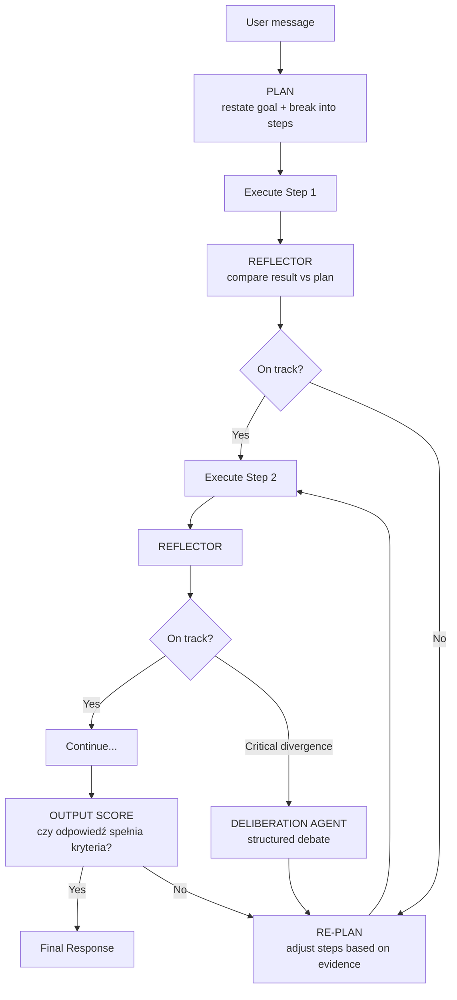

# 🧠 Cognitive Loop — Plan + Reflector + Re-plan

> **Cel:** Zbudować jawną pętlę samokorekty wzorowaną na najlepszych systemach AI.
> **Data:** 2026-06-05
> **Status:** Plan zatwierdzony, gotowy do implementacji

---

## 1. Obecny stan vs cel

### Obecny flow meta-agenta:

```
intent → tools → observation → tools → observation → ... → final response
         (model sam decyduje, bez systemowego checkpoint-u)
```

### Docelowy flow:

```
intent → PLAN → tools → observation → REFLECTOR → re-plan? → tools → ... → OUTPUT SCORE → response
         ^^^^                          ^^^^^^^^^   ^^^^^^^^                   ^^^^^^^^^^^^
         Nowy                          Nowy        Nowy                       Nowy
```

**Kluczowa zasada:** Plan + Reflector = para. Bez planu Reflector nie ma z czym porównywać. Bez Reflectora plan jest bezużyteczny.



---

## 2. Co już mamy (audit)

| Warstwa | Komponent | Stan | Ocena |
|---|---|---|---|
| Tool Loop | Mastra ReAct `maxSteps: 40` | ✅ Działa | ⭐⭐⭐⭐ |
| Orchestrator | Meta Agent + 8 sub-agentów | ✅ Działa | ⭐⭐⭐⭐ |
| Evaluator | Code Review Agent + deliberation | ✅ Działa (opt-in) | ⭐⭐⭐ |
| Retry + Escalation | subtask-executor: 3-tier | ✅ Działa | ⭐⭐⭐⭐⭐ |
| Quality Validation | 5 sygnałów jakości | ✅ Działa | ⭐⭐⭐⭐ |
| Failure Memory | failure-brain + autoheal recipes | ✅ Działa | ⭐⭐⭐⭐ |
| Self-Healing | ErrorCollector → repo-maintenance | ✅ Działa | ⭐⭐⭐⭐ |
| Context Persistence | context-checkpoint (7d TTL) | ✅ Działa | ⭐⭐⭐ |
| Circuit Breaker | Model-level circuit breaker | ✅ Działa | ⭐⭐⭐⭐ |
| **Explicit Planning** | — | ❌ BRAK | 🔴 |
| **Strategy Reflector** | — | ❌ BRAK | 🔴 |
| **Goal Tracking** | — | ❌ BRAK | 🔴 |
| **Output Scoring** | — | ❌ BRAK | 🟡 |
| **Adaptive Depth** | — | ❌ BRAK | 🟡 |

---

## 3. Porównanie z state-of-the-art

| Element | Nasze repo | Typowy framework | Claude/GPT |
|---|---|---|---|
| ReAct loop | ✅ 40 steps | ✅ ~20 steps | ✅ unlimited |
| Tool discovery | ✅ ToolSearchProcessor | ❌ hardcoded | ✅ dynamic |
| Retry + escalation | ✅ 3-tier | ❌ simple retry | ✅ retry + fallback |
| Multi-agent | ✅ 8 specjalistów | ⚠️ 2-3 | ✅ dynamic |
| Structured debate | ✅ deliberation agent | ❌ | ⚠️ internal CoT |
| Self-healing | ✅ ErrorCollector | ❌ | ⚠️ limited |
| Memory | ✅ working + observational + shared | ⚠️ session only | ✅ cross-session |
| **Explicit Planning** | **❌** | ❌ | **✅** |
| **Reflective loop** | **❌** | ❌ | **✅** |
| **Goal tracking** | **❌** | ❌ | **✅** |
| **Output scoring** | **❌** | ❌ | **✅** |
| **Adaptive depth** | **❌** | ❌ | **✅** |

---

## 4. Plan implementacji — 4 fazy

### Faza 1: Prompt-only Planning + Reflector ✅ COMPLETED (2026-06-05)

**Effort:** 🟢 niski (2-3 dni) | **Impact:** 🔴 wysoki (~60% drogi do celu)

**Status:** Zaimplementowane w 3 promptach:
- ✅ `src/mastra/prompts/meta/base.md` — Task Planning + Strategy Reflector + Output Self-Check
- ✅ `src/mastra/prompts/coding/base.md` — Task Planning + Strategy Reflector (adapted for coding)
- ✅ `src/mastra/prompts/automation/base.md` — Strategy Reflector (adapted for Golden Path)

**Co:** Dodaj dwie sekcje do promptów: `## Task Planning` + `## Strategy Reflector`

**Gdzie:**
- `src/mastra/prompts/meta/base.md` — priorytet
- `src/mastra/prompts/coding/base.md` — następny
- `src/mastra/prompts/automation/base.md` — ostatni

#### A) Task Planning (przed execution)

```markdown
## Task Planning (MANDATORY before execution)

Before calling ANY tool or delegating ANY task, create an explicit plan:

1. **Restate the goal** — what does the user actually want? (1 sentence)
2. **Break into steps** — concrete steps to achieve it (numbered, max 5)
3. **Identify risks** — what could go wrong? (1-2 bullets)
4. **Choose the path** — which agents/tools for each step?
5. **Define done** — measurable success criteria

Output this plan BEFORE executing:

> 📋 **Plan:** [goal]
> 1. [step] → [agent/tool]
> 2. [step] → [agent/tool]
> ✅ **Done when:** [criteria]

Then execute step by step.

**Exception:** Trivial tasks (single lookup, direct answer, one-tool call) — 
skip planning, execute directly.
```

#### B) Strategy Reflector (po każdym tool result)

```markdown
## Strategy Reflector (MANDATORY after every tool result)

After EACH tool call returns, before your next action, silently answer:

1. **Goal check:** Does the result move me closer to the goal?
2. **Hypothesis check:** Did this confirm or refute my assumption?
3. **Direction change:** Should I change approach based on this?
4. **Evidence gap:** Am I missing critical evidence?
5. **Agent routing:** Would a different agent handle next step better?
6. **Human gate:** Is this high-risk enough to ask for approval?

**Decision matrix:**
- All green → continue with plan
- 1-2 yellow → adjust plan, note the change
- Any red → STOP. Re-plan. Explain to user what changed and why.

**Auto-escalate to deliberationAgent when:**
- You've changed direction 2+ times in same task
- Tool results contradict each other
- Confidence drops below "medium"
- Task scope expanded significantly

Do NOT output this checklist to the user. It is internal reasoning only.
Compare progress against your PLAN from the planning step above.
```

#### C) Output Self-Check (przed wysłaniem odpowiedzi)

```markdown
## Output Self-Check (before sending final response)

Before delivering your final answer, verify:

1. Does my response actually answer what the user asked?
2. Did I complete ALL steps from my plan?
3. Are there unfinished steps I should mention?
4. Am I presenting verified facts (from tools) or assumptions?
5. Is the confidence level appropriate to communicate?

If any check fails → don't send. Go back to execution or re-plan.
```

**Zysk:**
- Model MUSI pomyśleć zanim zrobi kolejny krok
- Plan daje punkt odniesienia dla refleksji
- Zero zmian w kodzie
- Działa natychmiast po deploy

**Ryzyko:** Minimalne. ~50 tokenów dodatkowego reasoning per step.

---

### Faza 2: Programmatic Reflector Hook ✅ COMPLETED (2026-06-05)

**Effort:** 🟡 średni (5-7 dni) | **Impact:** 🔴 wysoki (~80% drogi do celu z Fazą 1)

**Status:** Zaimplementowane:
- ✅ `src/mastra/services/strategy-reflector.ts` — core reflector service (signals, decisions, run-scoped instances)
- ✅ `src/mastra/services/generate-with-harness.ts` — integrated into `onStepFinish` hook
- ✅ `src/mastra/services/harness-events.ts` — `reflector_triggered` + `reflector_snapshot` events
- ✅ `src/mastra/lib/agent-event-log.ts` — event types registered
- ✅ `tsc --noEmit` passes

**Co:** Nowy `ReflectorProcessor` jako hook na `onStepFinish` w harness

**Nowe pliki:**
- `src/mastra/services/strategy-reflector.ts`

**Modyfikacje:**
- `src/mastra/services/generate-with-harness.ts` — dodanie reflector hooka w `onStepFinish`

#### Sygnały do śledzenia:

| Sygnał | Źródło | Trigger |
|---|---|---|
| `error_rate` | Stosunek failed/total tool calls | > 50% |
| `direction_changes` | Ile razy zmieniono targetAgent | > 2 |
| `step_count` | Numer kroku w ReAct | > 20 bez wyniku |
| `tool_repetition` | To samo narzędzie > 3x | Pętla |
| `delegation_failures` | delegacje `success: false` | > 2 |
| `confidence_keywords` | "nie jestem pewien", "spróbuję" | W tekście |
| `scope_creep` | Porównanie tokenów cel vs plan | > 3x |

#### Pseudocode:

```typescript
// services/strategy-reflector.ts

interface ReflectorSignals {
  stepNumber: number;
  errorRate: number;
  directionChanges: number;
  toolRepetitions: Map<string, number>;
  delegationFailures: number;
  lowConfidenceDetected: boolean;
}

class StrategyReflector {
  private signals: ReflectorSignals;

  analyzeStep(stepResult: StepResult): ReflectorDecision {
    this.updateSignals(stepResult);

    if (this.signals.errorRate > 0.5) {
      return { action: 'inject_reflection', reason: 'high_error_rate',
        message: 'STOP. 50%+ tools returned errors. Re-evaluate your approach.' };
    }

    if (this.signals.directionChanges > 2) {
      return { action: 'inject_reflection', reason: 'direction_instability',
        message: 'You changed direction multiple times. Consider deliberationAgent.' };
    }

    if (this.signals.stepNumber > 20) {
      return { action: 'inject_reflection', reason: 'low_progress',
        message: 'Step 20+ with unclear progress. Stop and reassess.' };
    }

    for (const [tool, count] of this.signals.toolRepetitions) {
      if (count > 3) {
        return { action: 'inject_reflection', reason: 'tool_loop',
          message: `Tool ${tool} called ${count}x. You may be in a loop.` };
      }
    }

    return { action: 'continue' };
  }
}
```

#### Integracja z harness:

W `generate-with-harness.ts`, wewnątrz `onStepFinish`:

```typescript
// Po istniejącym logPostHocToolExecution...
const reflector = getReflector(ctx.runId);
const decision = reflector.analyzeStep(stepResult);

if (decision.action === 'inject_reflection') {
  // Wstrzyknij system message do następnego kroku
  logHarnessEvent({
    type: 'reflector_triggered',
    reason: decision.reason,
    stepNumber: reflector.signals.stepNumber,
  });
}
```

**Zysk:**
- SYSTEMOWY mechanizm, nie zależy od promptu
- Pełna telemetria
- Fundament pod ML-based tuning
- Chroni przed infinite loops i scope creep

**Ryzyko:** Średni. Wymaga starannej kalibracji progów (zbyt agresywne → spowalnia, zbyt luźne → bezużyteczne).

---

### Faza 3: Goal-Aware Execution (GoalContract z planem) ✅ COMPLETED (2026-06-05)

**Effort:** 🟡 średni (5-7 dni) | **Impact:** 🟡 średni-wysoki (~90% z Fazami 1+2)

**Status:** Zaimplementowane:
- ✅ `src/mastra/services/goal-tracker.ts` — GoalContract service (create, evidence, revision, progress, completion)
- ✅ `src/mastra/tools/system/delegate-task.ts` — fire-and-forget GoalContract creation on delegation
- ✅ `src/mastra/lib/agent-event-log.ts` — event types registered
- ✅ MongoDB `goal_contracts` collection (TTL 7d, indexed)
- ✅ `tsc --noEmit` passes

**Co:** Persystentny GoalContract ze śledzeniem planu i postępu

**Nowe pliki:**
- `src/mastra/services/goal-tracker.ts`

**Modyfikacje:**
- `src/mastra/tools/system/delegate-task.ts` — generacja GoalContract przed delegacją
- `src/mastra/services/context-checkpoint.ts` — rozszerzenie o plan steps

#### GoalContract schema:

```typescript
interface GoalContract {
  taskId: string;
  originalGoal: string;

  // ── PLAN ──
  plannedSteps: Array<{
    stepId: string;
    description: string;
    targetAgent: string;
    status: 'pending' | 'in_progress' | 'done' | 'failed' | 'skipped';
    evidence?: string;
    startedAt?: string;
    completedAt?: string;
  }>;

  // ── GOAL TRACKING ──
  successCriteria: string[];
  currentProgress: number;         // 0.0 - 1.0
  planRevisions: number;
  evidenceFor: string[];
  evidenceAgainst: string[];
  confidenceLevel: 'high' | 'medium' | 'low' | 'critical';

  // ── META ──
  createdAt: string;
  lastCheckpointAt: string;
  totalSteps: number;
  completedSteps: number;
}
```

#### Integracja:

1. **Na początku delegateTask** → model generuje `plannedSteps` + `successCriteria`
2. **Po każdym tool result** → `GoalTracker.recordEvidence(stepId, result)`
3. **Reflector porównuje** → `GoalTracker.getProgress()` vs plan
4. **Przed odpowiedzią** → `GoalTracker.evaluateCompletion()` → jeśli < 70% → trigger re-plan
5. **Persist** → do istniejącej kolekcji `context_checkpoints`

**Zysk:**
- Obiektywna metryka postępu
- Plan audytowalny i odtwarzalny
- Naturalna integracja z context-checkpoint.ts
- Re-plan ma dane z czym pracować

---

### Faza 4: Adaptive Depth Controller ✅ COMPLETED (2026-06-05)

**Effort:** 🔴 wysoki (8-10 dni) | **Impact:** 🔴 wysoki (~95% z Fazami 1-3)

**Status:** Zaimplementowane:
- ✅ `src/mastra/services/depth-controller.ts` — classifier + 4 profiles + run-scoped state + auto-escalation
- ✅ `src/mastra/services/generate-with-harness.ts` — depth classification, dynamic maxSteps, gated reflector
- ✅ `src/mastra/services/strategy-reflector.ts` — auto-escalation (fast→standard, standard→deep)
- ✅ `src/mastra/config/harness-flags.ts` — `FEATURE_ADAPTIVE_DEPTH` flag
- ✅ `src/mastra/services/harness-events.ts` — `depth_classified` + `depth_upgraded` events
- ✅ `src/mastra/lib/agent-event-log.ts` — event types registered
- ✅ `tsc --noEmit` passes

**Co:** System automatycznie dopasowuje głębokość przetwarzania do złożoności

**Nowe pliki:**
- `src/mastra/services/depth-controller.ts`

#### Mechanika:

```
Simple task → fast path: single model, no reflector, no plan
  ↓ (if fails or uncertainty)
Medium task → standard: plan + reflector enabled, retry allowed
  ↓ (if fails or high risk)
Complex task → full: deliberation + multi-agent + review loop
  ↓ (if still stuck)
Escalation → human approval required
```

#### Sygnały wejściowe do klasyfikacji:

| Sygnał | Źródło | Waga |
|---|---|---|
| Długość user message | Input | Krótsze = prostsze |
| Ilość domen | Intent analysis | Multi-domain = complex |
| Historyczne wyniki | system_knowledge | Podobne taski failowały = complex |
| Risk level | Deliberation routing rules | Z base.md |
| Tool count predicted | Model estimate | > 5 = complex |
| Explicit keywords | "zaprojektuj", "zbadaj", "porównaj" | Complex markers |

#### Mappowanie głębokości:

| Głębokość | Planning | Reflector | Deliberation | Review | Max steps |
|---|---|---|---|---|---|
| `fast` | ❌ skip | ❌ off | ❌ | ❌ | 10 |
| `standard` | ✅ inline | ✅ prompt-only | ❌ | ❌ | 25 |
| `deep` | ✅ persisted | ✅ programmatic | ✅ auto-trigger | ✅ | 40 |
| `critical` | ✅ persisted | ✅ programmatic | ✅ mandatory | ✅ + approval | 40 |

**Zysk:**
- Proste zadania nie tracą na szybkości
- Złożone dostają maksymalną moc
- Zgodne z badaniem ArXiv [3] — "nie odpalaj rady agentów na proste zadanie"

---

## 5. Kolejność i priorytety

| Faza | Czas | Wymagania | Kumulatywny % celu |
|---|---|---|---|
| **1: Prompt** | 2-3 dni | Tylko edycja .md | ~60% |
| **2: Runtime Hook** | 5-7 dni | Nowy service + harness mod | ~80% |
| **3: GoalContract** | 5-7 dni | Nowy service + delegate mod | ~90% |
| **4: Depth Controller** | 8-10 dni | Nowy service + integration | ~95% |

```
Tydzień 1:  [====== Faza 1 ======][= Testy =]
Tydzień 2:  [=========== Faza 2 ===========]
Tydzień 3:  [=========== Faza 3 ===========]
Tydzień 4:  [============= Faza 4 =============]
Tydzień 5:  [= Kalibracja =][= Observability =]
```

**Rekomendacja startowa:** Faza 1 → Meta Agent → test na 5-10 real tasks → iteruj.

---

## 6. Kolejność agentów

### 1️⃣ Meta Agent (PRIORYTET)
Orchestrator — każda poprawa kaskadowo poprawia WSZYSTKICH sub-agentów.
Quick win: Faza 1 promptowa, koszt 30 minut, efekt natychmiastowy.

### 2️⃣ Coding Agent (NASTĘPNY)
Już ma najlepszy retry/escalation. Brakuje:
- Goal Tracking (czy subtask realizuje cel główny)
- Cross-subtask reflection (czy subtask 3 nie psuje subtask 1)

### 3️⃣ Automation Architect (NA KONIEC)
Ma Golden Path — bardziej proceduralny. Reflector przydatny na:
- Validation failure → auto-repair → re-validate
- Test failure → diagnose → repair → re-test (częściowo istnieje)

---

## 7. Zasada nadrzędna

> **Nie potrzebujesz nowego "mózgu". Potrzebujesz "lustro" — mechanizm
> wymuszający na istniejącym mózgu patrzenie na swoje decyzje krytycznie
> zanim zrobi następny krok.**

Najlepsze systemy AI nie działają jak jeden genialny chatbot.
Działają jako **runtime decyzyjny:**

```
intent → PLAN → tools → observation → CRITIQUE → re-plan → execution → REVIEW → synthesis
```

To co budujemy to produkcyjny odpowiednik tej architektury.
