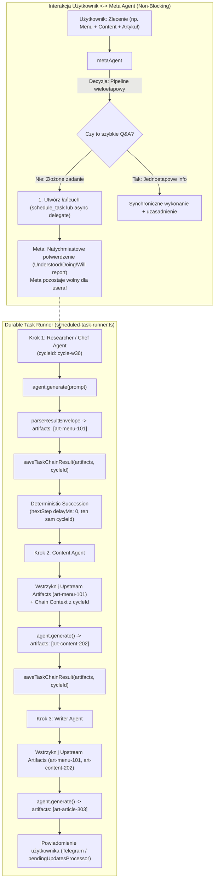

# Architektura i Plan Implementacji: Sekwencyjne i Cykliczne Zadania Wieloagentowe (Async-First Multi-Agent Pipelines & Recurring Task Chains)

**Data utworzenia:** 2026-09-01  
**Status:** W trakcie Wdrożenia (Branch: `feature/async-sequential-job-chains`)  
**Właściciel:** Patryk  
**Autor:** Principal Agentic Systems Engineer & Mastra Architect  

---

## 1. Diagnoza Stanu Faktycznego i Nowy Paradygmat: ASYNC-FIRST

### 1.1. Kluczowa Zasada Operacyjna (Paradygmat Patryka)
> **"Meta Agent głównie stara się robić wszystko ASYNCHRONICZNIE (`async: true` / durable `schedule_task` / background chains). Dzięki temu Meta Agent nie jest blokowany pomiędzy krokami, nie zużywa limitów tury na czekanie i jest ZAWSZE DOSTĘPNY dla użytkownika do zlecania kolejnych zadań. Tylko zadania, których nie jest w stanie zrobić asynchronicznie (np. natychmiastowa krótka odpowiedź konwersacyjna, odczyt z pamięci), wykonuje synchronicznie – informując najpierw użytkownika, dlaczego musi to zrobić synchronicznie."**

### 1.2. Wynik Audytu i Zidentyfikowane Luki

| Obszar | Stan obecny | Pożądany stan docelowy | Zadanie do wdrożenia |
|---|---|---|---|
| **Domyślny Tryb Pracy Meta** | Meta często delegował synchronicznie w ramach tury interaktywnej (`maxSteps: 40`), blokując UI na 1–3 minuty. | **Async-First:** Zlecenie pipeline'u -> natychmiastowy zwrot potwierdzenia użytkownikowi z ID tasków -> praca w tle -> wynik przez procesor powiadomień lub Telegram. | Rozbudowa `prompts/meta/base.md` §5.0 oraz `meta-agent.ts` + podniesienie `maxSteps: 60`. |
| **Przekazywanie Artefaktów w Harmonogramie** | `scheduled-task-runner.ts` przekazuje do promptu tylko surowy tekst z `task_chains` (do 20k znaków). Nie parsuje artefaktów i nie pobiera metadanych z `artifactStore`. | **Scheduled Artifact Bridge:** Runner parsuje `ResultEnvelope`, zapisuje `artifacts` do `task_chains` i wstrzykuje `## Upstream Input Artifacts` przed uruchomieniem agenta potomnego. | Rozszerzenie `scheduled-task-runner.ts`, `task-chain-store.ts` i `schedule-task.ts`. |
| **Izolacja Cykli Recurring (`cycleId`)** | `getTaskChainContext` pobiera 20 ostatnich wpisów dla `chainId`. Po 5 tygodniach kontekst miesza się z poprzednimi cyklami. | **Izolacja Cyklu:** Każde odpalenie z crona generuje unikalny `cycleId`. Krok 2 widzi tylko Krok 1 z bieżącego tygodnia. | Dodanie `cycleId` do `ScheduledTask`, `ScheduledTaskNextStepInput`, `task_chains`. |
| **Wzorzec Zagnieżdżonego `schedule_task`** | Meta Agent nie posiadał w prompcie dokładnego schematu JSON dla `schedule_task` z zagnieżdżonym `nextStep` i `delayMs: 0`. | **Precyzyjny SOP:** Meta Agent wie, jak jednym wywołaniem `schedule_task` zaplanować n-etapowy łańcuch cykliczny. | Nowa sekcja `5.3` w `prompts/meta/base.md`. |
| **Budżety i Limity** | `maxSteps: 40` w `metaAgent`. | **Podniesienie limitów:** `maxSteps: 60` w `metaAgent` dla bezpiecznej obsługi równoległych dispatchy, salvage i asynchronicznych sprawdzeń. | Aktualizacja `meta-agent.ts`. |

---

## 2. Architektura Przepływu Async-First i Wieloetapowych Łańcuchów

---

## 3. Plan Implementacji Krok po Kroku

### Krok 1: Rozszerzenie Typów i Store'ów (`task-chain-store.ts` & `scheduled-task-store.ts`)
1. **`src/mastra/services/task-chain-store.ts`**:
   - Dodać pola `cycleId?: string` oraz `artifacts?: Array<{ id: string; type: string; summary?: string }>` do `TaskChainEntry` i `SaveTaskChainResultInput`.
   - W `saveTaskChainResult`: utrwalać `cycleId` oraz tablicę `artifacts`.
   - W `getTaskChainContext`: dodać opcjonalne filtrowanie `{ chainId: string; cycleId?: string; limit?: number }`.
2. **`src/mastra/services/scheduled-task-store.ts`**:
   - Dodać `cycleId?: string` i `inputArtifactIds?: string[]` do `ScheduledTask` oraz `ScheduledTaskNextStepInput`.
   - W `buildScheduledTask`: przekazywać `cycleId` i `inputArtifactIds`.
   - W `buildNextScheduledTaskInput`: propagować `cycleId: parent.cycleId`.
   - W `normalizeNextStep`: zachowywać `cycleId` i `inputArtifactIds`.

### Krok 2: Rozbudowa Narzędzia `schedule_task` (`schedule-task.ts`)
- Dodać `inputArtifactIds: z.array(z.string()).optional()` oraz `cycleId: z.string().optional()` do `scheduledStepSchema` i `scheduleTaskInputSchema`.

### Krok 3: Mostkowanie Artefaktów i Izolacja Cykli w Runnerze (`scheduled-task-runner.ts`)
1. **Ekstrakcja Artefaktów z Wyniku**:
   - Po `dispatchScheduledTask`: wywołać `parseResultEnvelope(dispatch.text)`.
   - Wyciągnąć `envelope.artifacts` i przekazać do `saveTaskChainResult`.
2. **Generowanie i Izolacja `cycleId`**:
   - Gdy zadanie cykliczne (`schedule.cronExpression`) jest dzierżawione i nie posiada jeszcze `cycleId`, nadać: `cycleId = `${task.chainId ?? task.taskId}:${new Date().toISOString()}`.
   - Sukcesor `next_step` dziedziczy `cycleId`.
   - Sukcesor `recurrence` (kolejny tydzień) ma `cycleId: undefined` (wygeneruje nowy przy kolejnym odpaleniu).
3. **Wstrzykiwanie `Upstream Input Artifacts` w `runAgentTask`**:
   - Pobrać wpisy z `getTaskChainContext({ chainId, cycleId })`.
   - Wyciągnąć wszystkie identyfikatory artefaktów (z poprzednich kroków oraz jawnego `task.inputArtifactIds`).
   - Dla każdego artefaktu odpytać `getArtifact(id, { includeContent: false })`.
   - Wstrzyknąć sformatowany blok `## Upstream Input Artifacts (Handoff from previous steps)` do promptu agenta podrzędnego.

### Krok 4: Zwiększenie Budżetów i Nowy Paradygmat Async w Prompcie Meta Agenta
1. **`src/mastra/agents/meta-agent.ts`**:
   - Podnieść `maxSteps` z 40 do 60 w `defaultOptions`, `defaultGenerateOptionsLegacy`, `defaultStreamOptionsLegacy` i `defaultNetworkOptions`.
   - Zaktualizować instrukcję `buildInstructions()` o bezwzględną zasadę **Async-First by Default**.
2. **`src/mastra/prompts/meta/base.md`**:
   - Dodać sekcję `5.0 Async-First Orchestration Principle`:
     * Każde zadanie wieloetapowe, badawcze, tworzenie treści, generowanie menu, kodowanie, audyt ma być uruchamiane asynchronicznie (`async: true` w `delegateTaskTool` lub `schedule_task`).
     * Meta natychmiast kwituje przyjęcie zlecenia (`Understood / Doing / Will report`) i zwalnia turę, pozostając dostępnym.
     * Wykonanie synchroniczne jest dozwolone TYLKO dla natychmiastowych zapytań konwersacyjnych / factual lookups i wymaga wyjaśnienia przed startem.
   - Dodać sekcję `5.3 Multi-Step Recurring & Scheduled Pipelines Pattern`:
     * Dokładny schemat wywołania `schedule_task` z rekurencyjnym `nextStep`, `delayMs: 0`, `chainName`, `stepName`.

### Krok 5: Weryfikacja Automatyczna i Samokontrola
1. Utworzyć dedykowany skrypt testowy `src/mastra/scripts/check-scheduled-multi-step-artifacts.ts` testujący:
   - Zapis i odczyt artefaktów w łańcuchu.
   - Wstrzykiwanie `Upstream Input Artifacts` do kolejnych kroków.
   - Izolację cyklu `cycleId`.
   - Prawidłową sukcesję recurrence bez utraty danych.
2. Uruchomić weryfikację typów TypeScript: `npx tsc --noEmit`.
3. Uruchomić testy jednostkowe i sprawdzające w repozytorium.
4. Zrobić atomowy git commit na branchu `feature/async-sequential-job-chains`.
