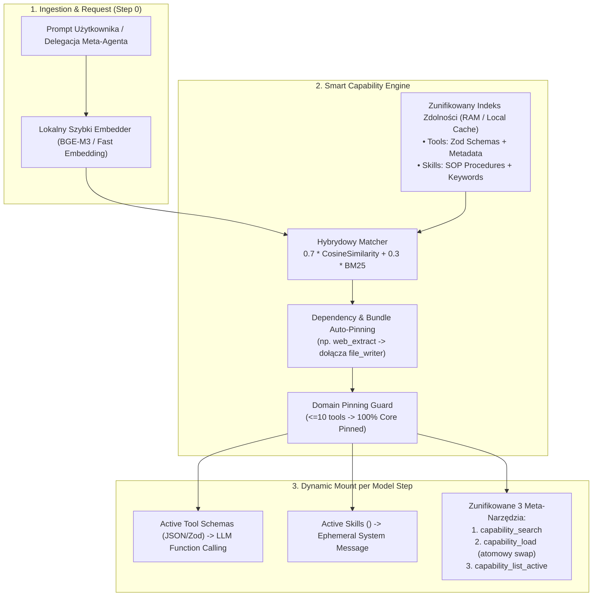

# Smart Capability Shelf (Zunifikowana Półka Narzędzi i Skilli)
## Kompleksowy Plan Architektoniczny i Wdrożeniowy

**Data utworzenia:** 2026-09-01  
**Status:** Zrealizowano i Zweryfikowano (Implemented & Verified on branch `feat/unified-capability-shelf`)  
**Autor:** Mastra Architect / Agentic Systems Engineer  
**Lokalizacja planu:** `ideas/tool-skill-shelf.md`  

---

## 1. Wstęp i Diagnoza Problemu

### 1.1. Stan obecny (Stanowisko wyjściowe)
W obecnym kodzie (`agentic-agents/src/mastra/`) funkcjonowały **dwa równoległe, odseparowane procesory**:
1. `TransientToolShelfProcessor` (`src/mastra/processors/transient-tool-shelf.ts`) – zarządzał narzędziami (Tools). Używał leksykalnego BM25 z twardą listą synonimów PL/EN.
2. `TransientSkillShelfProcessor` (`src/mastra/processors/transient-skill-shelf.ts`) – zarządzał skillami (Skills). Używał embeddingów z plików `.md`.

### 1.2. Zidentyfikowane wąskie gardła i dług techniczny
1. **Przeładowanie meta-narzędziami (9 narzędzi w kontekście):**
   * Agenci widzieli jednocześnie: `search_tools`, `load_tool`, `release_tools`, `list_active_tools`, `skill_search`, `skill_load`, `skill_list_active`, `skill_swap`, `skill_release`.
   * Sam aparat administracyjny zużywał 1200–1800 tokenów na krok i dezorientował modele (zwłaszcza lżejsze).
2. **Kary wielokrokowych tur (*Step Churn*):**
   * Doładowanie narzędzia w locie wymagało: `search_tools` (krok 1) $\rightarrow$ `load_tool` (krok 2) $\rightarrow$ właściwa akcja (krok 3). Zjadało to 25–40% całego budżetu kroków agenta (`maxSteps`).
3. **Nietrafiona pre-selekcja leksykalna w kroku 0:**
   * BM25 bazujący na słowach kluczowych pudłował przy zapytaniach nietypowych, wielojęzycznych lub przekazywanych w JSON briefach przez `metaAgent`.
   * Wymagało to ręcznego wpisywania dziesiątek synonimów w `toolTags` dla każdego nowego narzędzia.
4. **Incydenty starwacji wąskich agentów (*Starvation*):**
   * Ukrycie narzędzi za shellem w `n8n-mcp-engineer` czy `automation-architect` powodowało puste handoffy i halucynacje nieistniejących wersji węzłów.

---

## 2. Docelowa Architektura: Smart Capability Shelf

Zamiast gigantycznej, 150-dniowej machiny bazodanowej z Planu V2 (MongoDB CAS, generational replicas), wdrożono **pragmatyczny, wysoce wydajny broker zdolności w procesie Node.js**:



---

## 3. Kluczowe Zasady i Komponenty Architektury

### 3.1. Unifikacja pojęcia "Capability" (Narzędzia i Skille w jednym modelu)
Każdy zasób w systemie jest reprezentowany jako `ExecutionCapability`:
```typescript
export type CapabilityType = 'tool' | 'skill';

export interface ExecutionCapability {
  id: string;                      // np. 'tavilyExtractTool' lub 'menu-recon'
  name: string;                    // Czytelna nazwa unikalna
  type: CapabilityType;            // 'tool' | 'skill'
  description: string;             // Treść dla semantycznego indeksu
  category?: string;               // np. 'search', 'dev', 'n8n', 'marketing'
  keywords?: string[];             // Dodatkowe słowa kluczowe
  toolHandle?: any;                // Referencja do narzędzia Mastra (dla type === 'tool')
  procedure?: string;              // Treść procedury Markdown (dla type === 'skill')
  allowedTools?: string[];         // Narzędzia rekomendowane dla skilla
  bundle?: string;                 // Przynależność do wiązki fazowej
  embedding?: EmbeddingVector;     // Wektor BGE-M3 (cache'owany w pliku/RAM)
}
```

### 3.2. Zunifikowany Zestaw 3 Meta-Narzędzi (Zamiast 9)

Agenci otrzymują dokładnie 3 przejrzyste narzędzia zarządcze:

1. **`capability_search`**:
   * *Cel:* Semantyczne wyszukiwanie narzędzi i procedur skilli w jednym indeksie.
   * *Parametry:* `{ query: string, type?: 'all' | 'tool' | 'skill', topK?: number }`
   * *Wynik:* Lista dopasowanych narzędzi i skilli ze zwięzłym opisem i stopniem dopasowania (`score`).
2. **`capability_load` (Atomowe ładowanie i wymiana w 1 kroku):**
   * *Cel:* Aktywuje jedno lub więcej narzędzi/skilli, opcjonalnie zwalniając niepotrzebne w tej samej operacji.
   * *Parametry:*
     ```typescript
     {
       load: string[];       // Nazwy narzędzi lub skilli do włączenia
       release?: string[];    // Nazwy aktywnych zasobów do natychmiastowego zwolnienia
     }
     ```
   * *Zachowanie:* Narzędzia pojawiają się w `activeTools` od następnego kroku modelu. Skille wstrzykiwane są do system message w tagach `<active-skill id="..." name="...">`. Jeśli łączna liczba przekroczy `maxActive`, następuje automatyczna rotacja Auto-LRU (najstarsze narzędzia nienależące do `core` są zwalniane bez rzucania błędu).
3. **`capability_list_active`**:
   * *Cel:* Zwraca aktualny stan pulpitu agenta (aktywne narzędzia, aktywne skille, wykorzystanie limitu tokenów/slotów).

### 3.3. Inteligentna Pre-selekcja w Kroku 0 (Hybrid Retrieval)
* W momencie inicjalizacji żądania (krok 0), procesor generuje embedding promptu użytkownika (z 2 ostatnich wiadomości).
* Wylicza wynik hybrydowy:
  $$\text{Score} = 0.7 \times \text{CosineSimilarity}(\vec{e}_{\text{query}}, \vec{e}_{\text{cap}}) + 0.3 \times \text{BM25Score}(\text{tokens})$$
* Do zestawu `active` trafia `initialTopK` najlepszych zdolności (np. 3–4) + przypięte narzędzia `coreTools`.
* **Wynik:** Ponad 90% zapytań nie wymaga ani jednego wywołania meta-narzędzia podczas trwania zadania!

### 3.4. Domain Pinning Policy (Ochrona Wąskich Agentów i Agentów Kreatywnych)
Wprowadzamy sztywną regułę podziału agentów na kategorie:

* **Kategoria A: Agenci Kreatywni o Ścisłym Pipeline (`design-agent`, `writer-agent`, `film-agent`, `musician-agent`):**
  * **Zasada 100% Core Pinned (`preserveConfiguredToolsAsCore: true`):** Wszystkie ich narzędzia domenowe są na stałe włączone i nietykalne. Żadne narzędzie etapowe nie jest ukrywane za shellem.
  * **Zachowanie Dedykowanych Korpusów Skilli:** Narzędzia `film_load_reference` / `film_search_reference` (dla `_skills/film/`) oraz `music_load_reference` / `music_search_reference` (dla `_skills/music/`) pozostają w 100% aktywne i nienaruszone.
  * **Czysty Zysk:** Usunięcie 9 starych meta-narzędzi zwalnia ich kontekst, dając maksymalną przestrzeń na generowanie treści bez ryzyka utraty precyzji pipeline'u.

* **Kategoria B: Wąscy agenci i Złota Ścieżka ($\le 10$ narzędzi):**
  * `automation-architect`, `n8n-mcp-engineer`, `chef-agent`, `content-agent`, `hunt-agent`, `sales-agent`, `analytics-agent`, `deliberation-agent`, `knowledge-agent`.
  * **Zasada:** Posiadają `preserveConfiguredToolsAsCore: true`. 100% ich narzędzi jest na stałe włączone. Półka nie ukrywa przed nimi żadnego narzędzia, a zarządza jedynie procedurami skilli.

* **Kategoria C: Duże Huby Narzędziowe ($>15$ narzędzi):**
  * `researcher-agent` (15+ narzędzi), `coding-agent` (40+ narzędzi), `marketing-agent` (23 narzędzia), `meta-agent` (orkiestrator).
  * **Zasada:** Używają pełnego dynamicznego Capability Shelf z `maxActive: 10` i rotacją LRU.

### 3.5. Dependency Auto-Pinning (Automatyczne Wiązanie Narzędzi)
Definiujemy reguły asocjacyjne:
* Użycie narzędzia wyszukiwania/ekstrakcji (np. `tavilyExtractTool`, `firecrawl_scrape`) $\rightarrow$ automatycznie dołącza narzędzie zapisu (`writeExternalProjectFileTool` lub `artifactPutTool`).
* Użycie narzędzia inspekcji kodu (`lsp_inspect`, `search_content`) $\rightarrow$ automatycznie dołącza `coding_write_file_tracked`.
Zapobiega to sytuacji, w której model po zebraniu danych nie ma pod ręką narzędzia do utrwalenia wyników.

### 3.6. Skille jako Bounded Ephemeral System Message
* Załadowana procedura skilla trafia do `args.messageList.addSystem(...)` w ustrukturyzowanym formacie:
  ```xml
  <active-skill id="menu-recon" name="menu-recon">
  ## Procedura audytu karty dań lokalu...
  </active-skill>
  ```
* Nigdy nie zapisujemy treści skilla jako payloadu w historii narzędzi `tool_result` (co powodowało puchnięcie historii czatu).
* Po wywołaniu `capability_load({ release: ["menu-recon"] })`, procedura znika z system prompt w kolejnym kroku.

---

## 4. Plan Plików i Zmian w Kodzie

### Zaimplementowane komponenty:
1. `src/mastra/services/capability-catalog.ts` – Zunifikowany katalog narzędzi i skilli z lokalnym cachem embeddingów i hybrydowym matcherem.
2. `src/mastra/processors/unified-capability-shelf.ts` – Główny procesor zastępujący `TransientToolShelfProcessor` i `TransientSkillShelfProcessor`.
3. `src/mastra/config/capability-shelf-profiles.ts` – Profile agentów z przypiętymi `coreTools`, wiązkami (`bundles`) i regułami auto-dependency.
4. `src/mastra/scripts/check-unified-capability-shelf.ts` – Zestaw 7 testów jednostkowo-integracyjnych hybrydowego rankingu, auto-LRU, unifikacji narzędzi i skilli.

### Zrefaktoryzowane komponenty:
1. `src/mastra/processors/transient-shelf-controls.ts` – Redukcja listy z 9 kontrolek do 3 stałych nazw: `['capability_search', 'capability_load', 'capability_list_active']`.
2. `src/mastra/prompts/shared/skill-shelf.md` – Aktualizacja dokumentacji w promptach na zunifikowany interfejs 3 meta-narzędzi.
3. Wszystkich 17 agentów w `src/mastra/agents/*.ts` – Zastąpienie starych procesorów przez `createUnifiedCapabilityShelfProcessor({ agentId: '...' })` oraz oczyszczenie obiektów `tools:` z duplikatów meta-narzędzi.

---

## 5. Lista Zadań Krok po Kroku (Status Wdrożenia)

- [x] **Etap 1: Budowa Zunifikowanego Katalogu (`capability-catalog.ts`)**
  - [x] Implementacja skanera narzędzi i skilli (z obsługą frontmatter).
  - [x] Wdrożenie lokalnego cache wektorowego w pamięci (`Map<string, number[]>`) z możliwością zapisu do `.mastra/capability-cache.json`.
  - [x] Hybrydowy algorytm scoringu (0.7 Cosine Similarity + 0.3 BM25 z tokenizacją subtoknów i normalizacją PL/EN).
- [x] **Etap 2: Profile i Granice Bezpieczeństwa (`capability-shelf-profiles.ts`)**
  - [x] Ustawienie `preserveConfiguredToolsAsCore: true` dla agentów kreatywnych (`design`, `writer`, `film`, `musician`).
  - [x] Ustawienie `preserveConfiguredToolsAsCore: true` dla agentów wąskich (`automation-architect`, `n8n-mcp-engineer`, `chef`, `content`, `sales`, `analytics`, etc.).
  - [x] Zdefiniowanie wiązek fazowych i auto-dependencies dla `researcher`, `coding` i `marketing`.
- [x] **Etap 3: Implementacja Zunifikowanego Procesora (`unified-capability-shelf.ts`)**
  - [x] Utworzenie 3 meta-narzędzi (`capability_search`, `capability_load`, `capability_list_active`).
  - [x] Implementacja logiki atomowego ładowania i wymiany (Swap & Auto-LRU).
  - [x] Generowanie system message z aktywnymi skillami w blokach `<active-skill>`.
  - [x] Integracja pre-selekcji w kroku 0 z rozwijaniem wiązek (`toolBundles`) i auto-dependency.
  - [x] Dodanie 9 aliasów dla pełnej wstecznej kompatybilności (`search_tools`, `skill_load`, `skill_search`, itp.).
- [x] **Etap 4: Aktualizacja Promptów Systemowych i Kontrolek Jądra**
  - [x] Aktualizacja `transient-shelf-controls.ts`.
  - [x] Aktualizacja `prompts/shared/skill-shelf.md`.
  - [x] Aktualizacja odwołań w promptach specjalistycznych.
- [x] **Etap 5: Podpięcie Procesora do Agentów i Oczyszczenie Zbędnych Narzędzi**
  - [x] Podpięcie `createUnifiedCapabilityShelfProcessor` do hubów (`coding-agent`, `researcher-agent`, `marketing-agent`, `meta-agent`).
  - [x] Podpięcie procesora w trybie `preserveConfiguredToolsAsCore` do agentów kreatywnych (`design`, `writer`, `film`, `musician`).
  - [x] Podpięcie do pozostałych agentów domenowych (`chef`, `knowledge`, `automation-architect`, `n8n-mcp-engineer`, `sales`, `hunt`, itd.).
  - [x] Usunięcie zbędnych, zduplikowanych starych narzędzi (`skill_search`, `skill_load`, `skill_report_result`) z obiektów `tools:` w agentach na rzecz dynamicznego brokera.
- [x] **Etap 6: Testy Jednostkowe, E2E i Weryfikacja Całości**
  - [x] Napisanie i uruchomienie kompleksowego zestawu 7 testów `src/mastra/scripts/check-unified-capability-shelf.ts` (100% PASSED).
  - [x] Weryfikacja poprawności typowania TypeScript (`npx tsc --noEmit` — 0 błędów).
  - [x] Dodanie skryptu npm `check:capability-shelf` do `package.json`.

---

## 6. Bezpieczeństwo i Plan Wycofania (Rollback Strategy)

1. **Flaga Feature Flag:**
   * Całość sterowana przez zmienną środowiskową `FEATURE_CAPABILITY_SHELF=true`.
   * W przypadku ustawienia `FEATURE_CAPABILITY_SHELF=false`, system automatycznie wyłącza dynamiczny shelf i wystawia wszystkie skonfigurowane narzędzia w sposób statyczny.
2. **Zachowanie kompatybilności wstecznej:**
   * Istniejące aliasy `search_tools` / `skill_search` mogą być tymczasowo przekierowywane do `capability_search`, co zabezpiecza przed błędami starszych promptów bazowych.
3. **Zero modyfikacji narzędzi domenowych:**
   * Żadne narzędzie w `src/mastra/tools/*` nie jest modyfikowane – narzędzia pozostają czystymi funkcjami biznesowymi.
