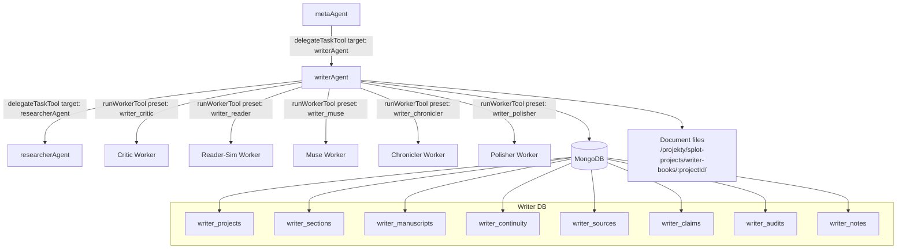

# Writer Agent — Szczegolowy Plan Implementacji MVP

> **Wzorzec runtime**: `chefAgent` pipeline: state-machine w promptach, domenowe tools, MongoDB, document tools, workspace API.
> **Delegacja**: `metaAgent` -> `writerAgent` -> `runWorkerTool` workers + `delegateTaskTool` do istniejacego `researcherAgent`.
> **Kod**: wszystkie identyfikatory, prompty techniczne, tool descriptions i komentarze kodu po angielsku.
> **Deliverables**: domyslnie po polsku, ale kazdy projekt ma jawny `deliverableLanguage`, ktory user moze nadpisac na `en` lub inny jezyk.

---

## Decyzje Projektowe

1. **Writer jest pelnoprawna domena agentowa**, nie tylko helper do contentu. Meta-agent ma miec bezposrednia delegacje do `writerAgent`.
2. **Rozszerzamy worker presets**, zamiast omijac problem generic presetami. Oprocz `model-manifest.ts` trzeba zmienic enum i role w `run-worker.ts`.
3. **Writer wchodzi do pipeline phase tooling**. Bez wpisu w `pipeline-phase-tools.ts` agent nie dostanie fazowego allowlistingu narzedzi w delegacji.
4. **ResearcherAgent jest zrodlem strukturalnym**. Wyniki researchu trafiaja do `sourceLedger`, a twierdzenia faktograficzne do `claimLedger`.
5. **Fiction ma canon/truth authority**, nie tylko luzny obiekt continuity. Priorytet prawdy: user brief -> story bible -> explicit outline -> runtime continuity -> notes/memory.
6. **Quality gate jest petla z snapshotem**, nie pojedyncza opinia krytyka: draft -> audit -> revision -> re-audit -> zachowaj najlepsza wersje, jesli faktycznie poprawiona.
7. **Licencje sa respektowane**. Repo MIT/Apache moga byc adaptowane ostroznie; `inkos` traktujemy tylko jako inspiracje koncepcyjna, bez kopiowania kodu AGPL.
8. **Finalne pliki trafiaja do** `/projekty/splot-projects/writer-books`, z mozliwoscia nadpisania przez `WRITER_DOCS_DIR`.
9. **Autonomia jest przelaczalna**. Projekt ma `autonomyMode: 'checkpointed' | 'full_auto'`; domyslnie checkpointy, na zadanie usera pelna autonomia.
10. **Pipeline jest elastyczny**. Projekt/zadanie ma `taskMode: 'quick_write' | 'edit' | 'outline_only' | 'continue_project' | 'full_project'`, zeby proste zadania nie wymuszaly pelnego procesu ksiazki.
11. **Wiedze z pobranych repo przenosimy do naszego repo jako dokumentacje i adaptowane wzorce**, a nie jako zaleznosc od `storage/downloads`. Po spisaniu w `docs/WRITER-AGENT-SOURCE-PATTERNS.md` katalog downloads moze zostac usuniety.

---

## Architektura Koncowa



---

## Faza 0 — Pliki do Utworzenia / Zmodyfikowania

| # | Plik | Typ | Opis |
|---|------|-----|------|
| 1 | `src/mastra/prompts/writer/domain.md` | nowy | Tozsamosc, language contract, voice calibration, anti-slop, research/citation guardrails |
| 2 | `src/mastra/prompts/writer/pipeline.md` | nowy | Maszyna stanow: fiction, article/report/blog, shared editorial loop |
| 3 | `src/mastra/prompts/writer/workers/critic.md` | nowy | Critic worker: konkretne findings bez przepisywania tekstu |
| 4 | `src/mastra/prompts/writer/workers/reader-sim.md` | nowy | Reader simulation: flow, engagement, confusion, emotional transport |
| 5 | `src/mastra/prompts/writer/workers/muse.md` | nowy | Brainstorming, alternatywy, twisty, struktura kreatywna |
| 6 | `src/mastra/prompts/writer/workers/chronicler.md` | nowy | Ekstrakcja canon/runtime continuity po sekcji/rozdziale |
| 7 | `src/mastra/prompts/writer/workers/polisher.md` | nowy | Final polish, style consistency, anti-slop rewrite hints |
| 8 | `src/mastra/tools/writer/db.ts` | nowy | DB helper i indeksy MongoDB |
| 9 | `src/mastra/tools/writer/writer-service.ts` | nowy | Service layer: projects, sections, manuscripts, ledgers, audits, notes |
| 10 | `src/mastra/tools/writer/writer-tools.ts` | nowy | Narzedzia domenowe agenta |
| 11 | `src/mastra/tools/writer/writer-document-tools.ts` | nowy | Przyrostowe budowanie dokumentow na dysku |
| 12 | `src/mastra/tools/writer/anti-slop.ts` | nowy | Deterministyczny filtr anty-slop i podstawowe metryki stylu |
| 13 | `src/mastra/tools/writer/continuity-validator.ts` | nowy | Deterministyczne sprawdzanie canon/timeline/promises |
| 14 | `src/mastra/agents/writer-agent.ts` | nowy | Rejestracja agenta Mastra |
| 15 | `src/mastra/config/model-manifest.ts` | edycja | `agentModels.writerAgent`, writer assignments, worker presets |
| 16 | `src/mastra/tools/system/run-worker.ts` | edycja | Rozszerzenie enum presetow i opisow roli workerow |
| 17 | `src/mastra/tools/system/delegate-task.ts` | edycja | `writerAgent` jako target delegacji meta-agenta |
| 18 | `src/mastra/config/pipeline-phase-tools.ts` | edycja | Mapa faz i allowlist narzedzi dla `writerAgent` |
| 19 | `src/mastra/prompts/meta/base.md` | edycja | Routing: long-form writing, books, fiction, reports -> `writerAgent` |
| 20 | `src/mastra/prompts/meta/intent-router.md` | edycja | Rozpoznanie intencji pisarskich jako domeny writer |
| 21 | `src/mastra/services/depth-controller.ts` | edycja | Wzorce complexity dla ksiazek, raportow, long-form writing |
| 22 | `src/mastra/index.ts` | edycja | Import, rejestracja agenta, topology, `/ws/writer/*` routes |
| 23 | `src/mastra/services/workspace-service.ts` | edycja | Read API dla writer projects/manuscripts/audits |
| 24 | `src/mastra/workspace/index.html` | edycja | Workspace karta Writer |
| 25 | `dashboard/index.html` | edycja | Dashboard karta Writer, jesli dashboard ma osobna kopie UI |
| 26 | `src/mastra/scripts/check-writer-domain.ts` | nowy | Smoke/contract checks dla domeny writer |
| 27 | `package.json` | edycja | `check:writer-domain` |

---

## Faza 1 — Prompty

### 1A. `prompts/writer/domain.md`

Zrodla do adaptacji:

| Zrodlo | Co adaptujemy | Uwagi |
|--------|---------------|-------|
| `better-writing` | voice dials, AI-tell patterns, preflight, anti-slop guardrails | MIT; nie kopiowac duzych blokow verbatim |
| `story-skills` | struktura story bible, continuity, promises/questions | MIT; logike przepisac na TS pod nasz model |
| `creative-writing-skills` | critic, reader-sim, muse, chronicler role | Apache 2.0; adaptacja promptow |
| `authorclaw` | style profile, plot promises, story structures, beta-reader ideas | MIT; dobre jako rozszerzenie stylu |
| `claude-scientific-writer` | source-first article/report workflow | MIT; wazne dla ledgerow |
| `inkos` | truth authority, review cycle, best-version rollback | AGPL; tylko inspiracja, bez kopiowania kodu |

Wymagane sekcje:

1. Identity: professional writer, editor, and long-form writing orchestrator.
2. Language contract:
   - internal tool names and code contracts stay English;
   - `deliverableLanguage` defaults to `pl`;
   - explicit user language request overrides default;
   - citations, titles and section headings follow `deliverableLanguage` unless user asks otherwise.
3. Project type detection: `fiction`, `article`, `blog`, `report`.
4. Voice calibration: directness, warmth, personality, density, evidence, polish, rhythm, formality.
5. Research and citation rules: no fabricated citations; uncertain claims must be marked or researched.
6. Fiction canon rules: never contradict accepted canon without deliberate revision.
7. Anti-slop rules: avoid stock phrases, throat-clearing, inflated claims, generic transitions.
8. Quality loop rules: audit before final, keep best version only when metrics improve.
9. Notes and memory rules: use writer notes for durable project facts, not chat-memory guesses.
10. Autonomous continuation contract: continue through non-checkpoint phases without waiting for "go ahead".

### 1B. `prompts/writer/pipeline.md`

Maszyna stanow ma trzy sciezki: fiction, factual writing, shared editorial loop.

```text
intake
  -> detect
  -> setup_project
  -> [fiction: world_build -> outline -> scene_drafts -> chronicler_pass]
  -> [factual: research -> source_verify -> claim_plan -> outline -> section_write -> claim_verify]
  -> critic_gate
  -> revision
  -> polish
  -> render
  -> done
```

Statusy `writer_set_project_status`:

| Status | Sciezka | Opis |
|--------|---------|------|
| `intake` | shared | Analiza briefu, jezyka, celu i typu deliverable |
| `detect` | shared | Ustalenie `projectType`, `deliverableLanguage`, ryzyka research/canon |
| `setup_project` | shared | Utworzenie projektu, dokumentu i bazowych ledgerow |
| `world_build` | fiction | Story bible: characters, locations, factions, rules, timeline |
| `research` | factual | Delegacja do `researcherAgent` i zapis source cards |
| `source_verify` | factual | Ocena zrodel: data, publisher, reliability, conflicts |
| `claim_plan` | factual | Lista kluczowych claims wymagajacych pokrycia zrodlami |
| `outline` | shared | Konspekt: beats/chapters albo sections/argument flow |
| `scene_drafts` | fiction | Pisanie scen/rozdzialow z anchorami dokumentu |
| `chronicler_pass` | fiction | Aktualizacja runtime continuity po napisanej czesci |
| `section_write` | factual | Pisanie sekcji z cytowaniami i claim ledger updates |
| `claim_verify` | factual | Sprawdzenie, czy factual claims maja source coverage |
| `critic_gate` | shared | Critic + reader-sim + deterministic checks |
| `revision` | shared | Bounded revision loop na podstawie audytu |
| `polish` | shared | Anti-slop, style consistency, final preflight |
| `render` | shared | Eksport markdown/HTML do katalogu projektu |
| `done` | shared | Zamkniecie projektu i zapis final audit summary |

Checkpointy, ktore moga zakonczyc ture:

- `outline`, gdy user musi zatwierdzic kierunek lub strukture.
- `critic_gate`, gdy sa istotne tradeoffy rewizji.
- `source_verify`, gdy research wykryl sprzeczne lub niewiarygodne zrodla.

Pozostale statusy powinny chainowac tool calls w jednej turze, zgodnie z wzorcem `chefAgent`.

### 1C. Worker Prompts

| Worker | Preset | Rola |
|--------|--------|------|
| `critic` | `writer_critic` | Deep critique: voice/prose, structure, continuity, factual integrity; wskazuje problemy, nie przepisuje calosci |
| `reader-sim` | `writer_reader` | Symuluje odbior czytelnika: engagement, flow, confusion, payoff, boredom points |
| `muse` | `writer_muse` | Kreatywne alternatywy: angles, twists, examples, metaphors, structures |
| `chronicler` | `writer_chronicler` | Ekstrahuje canon/runtime facts po kazdej scenie/sekcji |
| `polisher` | `writer_polisher` | Final language pass zgodny ze style profile i `deliverableLanguage` |

Worker prompts musza wymagac structured output JSON, zeby `writerAgent` mogl zapisac wyniki do audytow, ledgerow i notatek.

---

## Faza 2 — Warstwa Danych

### 2A. Kolekcje MongoDB

```typescript
writer_projects    -> { id: 1 } unique, { status: 1 }, { type: 1 }, { updatedAt: -1 }
writer_sections    -> { id: 1 } unique, { projectId: 1, order: 1 }, { projectId: 1, kind: 1 }
writer_manuscripts -> { id: 1 } unique, { projectId: 1, version: -1 }, { projectId: 1, isCurrent: 1 }
writer_continuity  -> { projectId: 1 } unique
writer_sources     -> { id: 1 } unique, { projectId: 1 }, { url: 1 }, { reliability: 1 }
writer_claims      -> { id: 1 } unique, { projectId: 1 }, { status: 1 }, { sourceIds: 1 }
writer_audits      -> { id: 1 } unique, { projectId: 1, createdAt: -1 }, { manuscriptId: 1 }
writer_notes       -> { type: 1, topic: 1 }, { projectId: 1 }, { expiresAt: 1 } TTL
```

### 2B. Core Types

```typescript
type WriterProjectType = 'fiction' | 'article' | 'blog' | 'report';
type WriterDeliverableLanguage = 'pl' | 'en' | string;
type WriterProjectStatus = typeof WRITER_PIPELINE_STATUSES[number];
type WriterAutonomyMode = 'checkpointed' | 'full_auto';
type WriterTaskMode = 'quick_write' | 'edit' | 'outline_only' | 'continue_project' | 'full_project';
type WriterDial = 1 | 2 | 3 | 4 | 5;

interface WriterStyleProfile {
  directness: WriterDial;
  warmth: WriterDial;
  personality: WriterDial;
  density: WriterDial;
  evidence: WriterDial;
  polish: WriterDial;
  rhythm?: WriterDial;
  formality?: WriterDial;
  sampleSource?: 'user_sample' | 'project_brief' | 'manual' | 'inferred';
  voiceSample?: string;
  signatureMarkers?: string[];
}

interface WriterProject {
  id: string;
  name: string;
  type: WriterProjectType;
  status: WriterProjectStatus;
  brief: string;
  deliverableLanguage: WriterDeliverableLanguage;
  workingLanguage: 'en';
  autonomyMode: WriterAutonomyMode;
  taskMode: WriterTaskMode;
  styleProfile: WriterStyleProfile;
  canonPolicy?: WriterCanonPolicy;
  outlineVersion: number;
  currentManuscriptId?: string;
  createdAt: Date;
  updatedAt: Date;
}

interface WriterSource {
  id: string;
  projectId: string;
  url?: string;
  title: string;
  publisher?: string;
  author?: string;
  publishedAt?: string;
  accessedAt: string;
  extractedFacts: string[];
  reliability: 'high' | 'medium' | 'low' | 'unknown';
  notes?: string;
}

interface WriterClaim {
  id: string;
  projectId: string;
  text: string;
  status: 'planned' | 'supported' | 'unsupported' | 'conflicting' | 'dropped';
  sourceIds: string[];
  sectionId?: string;
  risk: 'low' | 'medium' | 'high';
}
```

### 2C. Service Methods

`WriterService` powinien byc cienka warstwa nad MongoDB, analogiczna do `ChefService`, ale bez logiki promptowej.

```typescript
class WriterService {
  createProject(params): Promise<WriterProject>;
  getProject(id): Promise<WriterProject | null>;
  listProjects(filter?, limit?): Promise<WriterProject[]>;
  updateProject(id, updates): Promise<WriterProject>;
  updateProjectStatus(id, status): Promise<void>;

  upsertSection(params): Promise<WriterSection>;
  listSections(projectId): Promise<WriterSection[]>;

  saveManuscriptSnapshot(params): Promise<WriterManuscript>;
  getCurrentManuscript(projectId): Promise<WriterManuscript | null>;
  markCurrentManuscript(projectId, manuscriptId): Promise<void>;

  upsertContinuity(projectId, patch): Promise<WriterContinuityState>;
  getContinuity(projectId): Promise<WriterContinuityState | null>;

  addSources(projectId, sources): Promise<WriterSource[]>;
  listSources(projectId): Promise<WriterSource[]>;
  upsertClaims(projectId, claims): Promise<WriterClaim[]>;
  listClaims(projectId, filter?): Promise<WriterClaim[]>;

  saveAudit(params): Promise<WriterAudit>;
  listAudits(projectId, limit?): Promise<WriterAudit[]>;

  addNote(params): Promise<WriterNote>;
  searchNotes(query, projectId?, limit?): Promise<WriterNote[]>;
}
```

---

## Faza 3 — Deterministyczne Kontrole

### 3A. `anti-slop.ts`

`anti-slop.ts` nie uzywa LLM. Ma zwracac metryki, ktore worker `polisher` moze potem wykorzystac.

```typescript
interface SlopAuditResult {
  score: number;
  issues: SlopIssue[];
  passiveVoiceRatio: number;
  avgSentenceLength: number;
  sentenceLengthVariance: number;
  repeatedOpeners: string[];
  clichePhrases: string[];
  language: WriterDeliverableLanguage;
}

function auditSlop(text: string, language: WriterDeliverableLanguage): SlopAuditResult;
```

Zakres:

- lista angielskich AI-tells i stock phrases z `better-writing`;
- polskie odpowiedniki dla najczestszych struktur;
- wykrywanie nadmiaru recapow, generic transitions, list-itis, binary contrast;
- metryki rytmu zdan i powtorzen otwarc akapitow.

### 3B. `continuity-validator.ts`

Zakres MVP:

- martwe/nieobecne postacie pojawiajace sie bez wyjasnienia;
- payoff przed setupem;
- unresolved promises/questions;
- konflikty timeline;
- sprzeczne nazwy miejsc, frakcji, artefaktow;
- stale canon facts po rewizji rozdzialu.

### 3C. Quality Loop

Kazda wieksza wersja manuskryptu powinna miec:

1. snapshot draftu;
2. deterministic audit;
3. critic/reader-sim audit;
4. revision plan;
5. revised snapshot;
6. re-audit;
7. decyzje `accepted` albo `reverted_to_best`.

MVP ma limitowac petle do 1-2 rewizji, zeby uniknac nieskonczonego polishowania.

---

## Faza 4 — Narzedzia Writer

### 4A. `writer-tools.ts`

| Tool ID | Opis | Wzorzec |
|---------|------|---------|
| `writer_start_project` | Tworzy projekt, ustawia typ, jezyk, style profile, output dir | `chef_start_project` |
| `writer_get_project` | Pobiera projekt z aktualnym statusem i summary | `chef_get_project` |
| `writer_list_projects` | Lista projektow z filtrami | `chef_list_projects` |
| `writer_set_project_status` | Walidowane przejscie maszyny stanow | `chef_set_project_status` |
| `writer_update_style_profile` | Aktualizacja voice/style dials | nowe |
| `writer_analyze_style_sample` | Tworzy/uzupelnia style profile na podstawie probki | `authorclaw` concept |
| `writer_update_continuity` | Patch canon/runtime continuity | nowe |
| `writer_get_continuity` | Odczyt continuity state | nowe |
| `writer_validate_continuity` | Deterministyczny check canon/timeline/promises | `story-skills` concept |
| `writer_add_sources` | Zapis source cards z researchera | nowe |
| `writer_list_sources` | Odczyt source ledger | nowe |
| `writer_upsert_claims` | Zapis i aktualizacja claim ledger | nowe |
| `writer_verify_claims` | Sprawdzenie claim coverage | `claude-scientific-writer` concept |
| `writer_audit_slop` | Uruchomienie deterministic anti-slop | nowe |
| `writer_save_audit` | Zapis wynikow critic/reader/slop/continuity audit | nowe |
| `writer_add_note` | Notatka robocza: research/style/feedback/idea/canon | `chef_add_note` |
| `writer_search_notes` | Search po notatkach domeny | `chef_search_notes` |

### 4B. `writer-document-tools.ts`

Wzorzec: `chef-document-tools.ts`, ale output root to:

```text
WRITER_DOCS_DIR || /projekty/splot-projects/writer-books
```

Tool IDs:

| Tool ID | Opis |
|---------|------|
| `writer_document_init` | Tworzy katalog projektu i `manuscript.md` z anchor sections |
| `writer_document_write_section` | Nadpisuje sekcje po anchorze `<!-- section:<id> start -->` |
| `writer_document_read` | Czyta aktualny markdown |
| `writer_document_snapshot` | Zapisuje wersje do `snapshots/` i `writer_manuscripts` |
| `writer_document_export` | Eksportuje finalny markdown/HTML |

Wymagania bezpieczenstwa:

- path traversal guard;
- projektowy katalog oparty o `projectId`;
- brak zapisu poza `WRITER_DOCS_DIR`;
- HTML export sanitizowany albo generowany z kontrolowanego markdown.

---

## Faza 5 — Agent

`writer-agent.ts` powinien isc wzorcem `chef-agent.ts`, bo writer ma pipeline i dlugie zadania.

```typescript
export const writerAgent = new Agent({
  id: 'writer-agent',
  name: 'Writer Agent',
  instructions: await combinePrompts('writer/domain', 'writer/pipeline'),
  model: resolveModelId(agentModels.writerAgent),
  defaultOptions: { maxSteps: 150 },
  memory: new Memory({
    options: {
      lastMessages: 20,
      observationalMemory: {
        model: resolveModelId(infrastructure.observationalMemory),
        scope: 'thread',
        temporalMarkers: true,
      },
      generateTitle: true,
    },
  }),
  inputProcessors: [createTokenLimiter(120_000)],
  tools: {
    // writer domain tools
    // writer document tools
    // runWorkerTool, delegateTaskTool
    // requestApprovalTool, currentTimeTool
    // memoryRecallTool, memoryWriteTool, addContextTool
  },
});
```

Wazne: `writerAgent` ma korzystac z `delegateTaskTool` do `researcherAgent`, a nie implementowac wlasnego web research stacku.

---

## Faza 6 — Model Manifest i Worker Presets

### 6A. `model-manifest.ts`

Dodac:

```typescript
agentModels.writerAgent = 'deepseek-v4-pro' as ModelKey;

export const writerAssignments = {
  orchestrator: 'deepseek-v4-pro' as ModelKey,
  fictionDrafter: 'claude-opus-4.8' as ModelKey,
  articleDrafter: 'deepseek-v4-pro' as ModelKey,
  critic: 'claude-sonnet-4.6' as ModelKey,
  readerSim: 'deepseek-v4-flash' as ModelKey,
  muse: 'deepseek-v4-pro' as ModelKey,
  chronicler: 'deepseek-v4-flash' as ModelKey,
  polisher: 'claude-sonnet-4.6' as ModelKey,
} as const;

workerPresets.writer_critic = 'claude-sonnet-4.6' as ModelKey;
workerPresets.writer_reader = 'deepseek-v4-flash' as ModelKey;
workerPresets.writer_muse = 'deepseek-v4-pro' as ModelKey;
workerPresets.writer_chronicler = 'deepseek-v4-flash' as ModelKey;
workerPresets.writer_polisher = 'claude-sonnet-4.6' as ModelKey;
```

Model names musza byc zweryfikowane wzgledem aktualnego manifestu przed implementacja. Jesli ktorys klucz nie istnieje, wybieramy najblizszy juz zdefiniowany model.

### 6B. `run-worker.ts`

Planowana zmiana:

- rozszerzyc `z.enum([...])` presetow o:
  - `writer_critic`
  - `writer_reader`
  - `writer_muse`
  - `writer_chronicler`
  - `writer_polisher`
- rozszerzyc `PRESET_ROLES`;
- dopilnowac, by opisy presetow pochodziły z manifestu tam, gdzie to juz jest wspierane;
- dodac test/contract check, ktory wykryje preset w manifeście bez odpowiednika w schema.

---

## Faza 7 — Delegacja, Routing i Pipeline Integration

### 7A. `delegate-task.ts`

Dodac `writerAgent` do:

- listy agent IDs;
- schema enum `targetAgent`;
- opisu narzedzia;
- routing description: books, fiction, long-form articles, reports, essays, manuscript editing, style rewrite.

`writerAgent` musi byc dostepny dla `metaAgent`, ale tez moze uzywac `delegateTaskTool` do `researcherAgent`.

### 7B. Meta Prompts

W `prompts/meta/base.md` dodac twarda regule:

```text
Route long-form writing, fiction, books, manuscripts, narrative drafts, reports,
essays, and citation-backed articles to writerAgent.
Do not route these to contentAgent unless the request is specifically about
social posts, short marketing content, or content calendar assets.
```

W `prompts/meta/intent-router.md` dodac writer jako domena dla:

- napisania ksiazki/opowiadania/rozdzialu;
- artykulu eksperckiego lub raportu;
- redakcji manuskryptu;
- przerobienia stylu dlugiego tekstu;
- zadan wymagajacych research + final narrative/report.

### 7C. `pipeline-phase-tools.ts`

Dodac `writerAgent` z:

- `statusTool: 'writer_set_project_status'`;
- always tools: get/list/status/document read/search notes;
- fiction phase tools: continuity, document write, chronicler-related updates;
- factual phase tools: sources, claims, researcher delegation, document write;
- editorial phase tools: audit, save audit, snapshot, export.

To jest krytyczne dla delegacji pipeline. Bez tego writer moze ominac kontrolowana sekwencje faz.

### 7D. `depth-controller.ts`

Dodac patterny dla:

- "write a book", "novel", "chapter", "manuscript", "fiction";
- "long-form article", "research report", "whitepaper";
- polskie odpowiedniki: "napisz ksiazke", "rozdzial", "opowiadanie", "raport", "artykul ekspercki".

---

## Faza 8 — Rejestracja w Mastra i Workspace API

### 8A. `index.ts`

Zrobic:

1. import `writerAgent`;
2. dodac do `agents` w `new Mastra({ ... })`;
3. dodac do `/dashboard/active-topology` jako domain agent;
4. dodac API:

```text
GET /ws/writer/projects
GET /ws/writer/projects/:id
GET /ws/writer/projects/:id/sections
GET /ws/writer/projects/:id/sources
GET /ws/writer/projects/:id/claims
GET /ws/writer/projects/:id/audits
GET /ws/writer/manuscripts/:id
GET /ws/writer/projects/:id/document
```

### 8B. `workspace-service.ts`

Dodac read-only methods dla workspace:

- `listWriterProjects`;
- `getWriterProject`;
- `getWriterProjectBundle`;
- `getWriterManuscript`;
- `getWriterDocumentPreview`;
- `getWriterAuditSummary`.

Workspace nie powinien duplikowac logiki `WriterService`; ma tylko agregowac dane do UI.

Wzor implementacji bierzemy z chef/menu books:

- `workspace-service.ts` ma cienka warstwe read-only nad MongoDB + plikami na dysku;
- `index.ts` wystawia `/ws/chef/*` endpointy analogicznie do planowanych `/ws/writer/*`;
- dokumenty sa listowane jako deliverables, a podglad HTML/Markdown otwiera sie w viewerze UI.

---

## Faza 9 — Workspace / Dashboard UI

Primary UI: `src/mastra/workspace/index.html`.

Aktualny dashboard uzywany na co dzien jest pod `/dashboard-ui` i serwuje
`dashboard/index.html`, ktory zawiera wbudowana zakladke **Workspace**. Sprint 5
ma dodac tam nowa karte/tab dla projektow `writerAgent`, tak samo jak teraz sa
wpiete `Chef` i `Ksiega Menu`.

Rownolegle aktualizujemy `src/mastra/workspace/index.html`, bo `/workspace-ui`
serwuje samodzielna wersje tej samej przestrzeni roboczej. Jesli oba pliki nadal
beda osobnymi kopiami UI, trzeba utrzymac je synchronicznie w Sprint 5.

Karta **Writer / Manuscripts** w zakladce Workspace `/dashboard-ui`:

- lista projektow z typem, statusem, jezykiem deliverable i update time;
- preview aktualnego manuskryptu;
- fiction panel: characters, timeline, promises, continuity warnings;
- factual panel: sources, unsupported/conflicting claims;
- quality panel: slop score, latest critic result, revision status;
- actions: Export MD, Export HTML, open project directory;
- viewer dokumentu wzorowany na karcie `Ksiega Menu`: lista dokumentow po lewej,
  podglad HTML/Markdown po prawej, link do otwarcia pelnego dokumentu w nowej
  karcie.

UI ma byc robocze i informacyjne, nie marketingowe.

---

## Faza 10 — Verification

Dodac `src/mastra/scripts/check-writer-domain.ts` i `npm run check:writer-domain`.

Zakres checka:

1. `writerAgent` jest zarejestrowany w Mastra index.
2. `delegate-task.ts` akceptuje `writerAgent`.
3. `run-worker.ts` schema akceptuje wszystkie `writer_*` presets z manifestu.
4. `pipeline-phase-tools.ts` ma wpis dla `writerAgent`.
5. Prompt files istnieja i `combinePrompts('writer/domain', 'writer/pipeline')` dziala.
6. Writer document tools respektuja `WRITER_DOCS_DIR`.
7. Anti-slop audit dziala dla `pl` i `en`.
8. Continuity validator lapie co najmniej jeden konflikt fixture.
9. Claim verifier lapie unsupported factual claim.

Przed zamknieciem implementacji uruchomic:

```bash
npm run build
npm run check:writer-domain
```

Jesli po zmianach dotykamy istniejacych kontraktow delegacji, uruchomic tez odpowiednie istniejace checki pipeline/delegation.

---

## Kolejnosc Implementacji

### Sprint 1 — Plan i Fundament

Status: ✅ wykonany 2026-06-19.

1. [x] Zatwierdzony ten plan jako implementation source of truth.
2. [x] DB helper, indeksy i `WriterService`.
3. [x] Document tools z output root `/projekty/splot-projects/writer-books`.
4. [x] Anti-slop i continuity validator.
5. [x] Minimalne smoke fixtures dla deterministic checks.
6. [x] Dokumentacja `docs/WRITER-AGENT.md`.
7. [x] Skondensowane wzorce z repo zrodlowych w `docs/WRITER-AGENT-SOURCE-PATTERNS.md`, zeby `storage/downloads` nie bylo runtime source of truth.
8. [x] Verification: `npx tsc --noEmit --pretty false`, `npm run check:writer-domain`, `npm run build`.

### Sprint 2 — Agent i Narzedzia

Status: ✅ wykonany 2026-06-19.

1. [x] `writer-tools.ts` domain tool wrappers dla `WriterService`, checks i document helpers.
2. [x] Prompty domain/pipeline/workers.
3. [x] `writer-agent.ts`.
4. [x] `model-manifest.ts` + `run-worker.ts` worker preset expansion.
5. [x] Verification: `npx tsc --noEmit --pretty false`, `npm run check:writer-domain`.

### Sprint 3 — Integracja Orkiestracji

Status: ✅ wykonany 2026-06-19.

1. [x] `delegate-task.ts` target `writerAgent`.
2. [x] `pipeline-phase-tools.ts` dla writer.
3. [x] Meta routing prompts.
4. [x] `depth-controller.ts` writer patterns.
5. [x] `index.ts` registration/topology/routes.
6. [x] Verification: `npx tsc --noEmit --pretty false`, `npm run check:writer-domain`, `npm run check:pipeline-reflector`, `npm run build`.

### Sprint 4 — Research, Claims i Quality Loop

Status: ✅ wykonany 2026-06-19.

1. [x] Delegacja do `researcherAgent`.
2. [x] Source ledger i claim ledger w tool flow.
3. [x] Critic/reader/polisher worker structured outputs.
4. [x] Snapshot + audit + revision + re-audit.
5. [x] Verification: `npx tsc --noEmit --pretty false`, `npm run check:writer-domain`, `npm run check:pipeline-reflector`.

### Sprint 5 — Workspace

Status: ✅ wykonany 2026-06-19.

1. [x] `workspace-service.ts` writer bundle.
2. [x] `src/mastra/workspace/index.html` card.
3. [x] `dashboard/index.html` / `/dashboard-ui` Workspace card.
4. [x] Writer document HTML/Markdown preview routes.
5. [x] Final smoke checks i build.

---

## Zakres MVP vs Later

MVP:

- fiction short/medium form: outline -> scenes -> continuity -> polish -> markdown/html;
- article/report: researcher -> sources -> claims -> sections -> verification -> markdown/html;
- one project output directory;
- basic style profile;
- deterministic anti-slop and continuity checks;
- bounded quality loop.

Later:

- EPUB/DOCX/PDF;
- multi-book series bible;
- beta-reader panel z wieloma personami;
- advanced style clone;
- marketing copy pack dla ksiazki;
- audio/artifact generation;
- full manuscript diff UI.

---

## Zrodla z Repozytoriow

| Repo | Co bierzemy | Jak uzywamy |
|------|-------------|-------------|
| `better-writing` | voice dials, preflight, AI-tells, slop phrases | `domain.md`, `anti-slop.ts`, `polisher.md` |
| `story-skills` | story schema, continuity concepts | `writer-service.ts`, `continuity-validator.ts`, `chronicler.md` |
| `creative-writing-skills` | critic, reader-sim, muse, chronicler staffing | worker prompts i structured audit outputs |
| `autonovel` | immune system, reader panel, evaluate/keep-discard loop | quality loop design |
| `authorclaw` | style profile, plot promises, story structures | `writer_analyze_style_sample`, continuity/promises |
| `claude-scientific-writer` | source-first scientific/article workflow | `sourceLedger`, `claimLedger`, citation guardrails |
| `inkos` | truth authority, review cycle, best snapshot idea | tylko inspiracja; bez kopiowania kodu AGPL |

---

## Definition of Done

Plan jest gotowy do implementacji, gdy:

1. `writerAgent` da sie wywolac bezposrednio i przez `metaAgent`.
2. Meta routing wybiera writer dla ksiazek, fiction, raportow i long-form writing.
3. Writer moze delegowac research do `researcherAgent`.
4. Worker presets `writer_*` dzialaja przez `runWorkerTool`.
5. Pipeline phase allowlist nie blokuje poprawnego przebiegu writer.
6. Projekty i dokumenty zapisuja sie w `/projekty/splot-projects/writer-books`.
7. Deliverable domyslnie jest po polsku, ale explicit English request daje final po angielsku.
8. Article/report nie przechodzi finalizacji z unsupported high-risk claims.
9. Fiction nie przechodzi finalizacji z krytycznymi continuity conflicts.
10. `npm run build` i `npm run check:writer-domain` przechodza.
